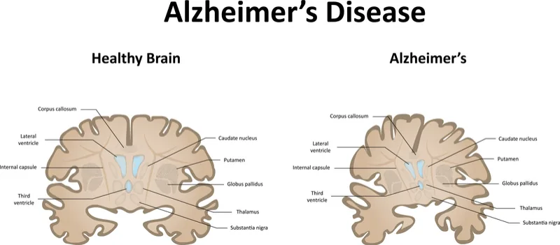
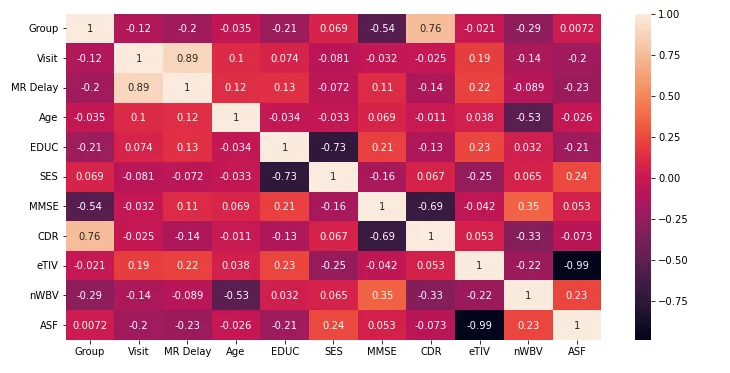
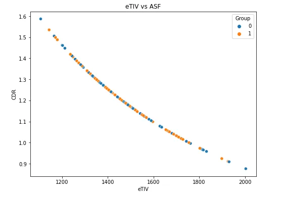
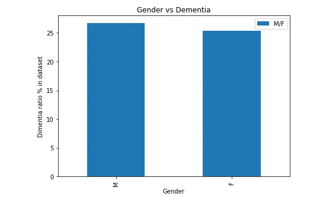
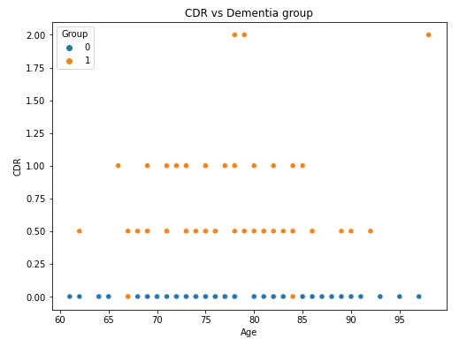

According to [Hopkinsmedicine.org](https://www.hopkinsmedicine.org/):

> Alzheimer's disease is **a progressive, neurodegenerative disease that occurs when nerve cells in the brain die**. The disease often results in the following behaviors: Impaired memory, thinking, and behavior. Confusion.



Figure 1: Healthy brain vs brain affected by Alzheimer's

In this post, we’ll be using a dataset that would allow us the task of the detection of Alzheimer's disease through post-MRI measures.

#### First, let’s explore our dataset a bit.

The [Open Access Series of Imaging Studies (OASIS)](http://www.oasis-brains.org/) is a project aimed at making MRI data sets of the brain freely available to the scientific community. Their aim is to facilitate future discoveries in neuroscience through the free distribution of MRI datasets.

The datasets are comprised of two files: Cross-sectional MRI Data for patients ranging from young to old and Longitudinal MRI Data for old adults. Our focus will be on the longitudinal MRI dataset. It hosts information of 150 subjects aged 60 to 96 each having 2-3 visits (and some having up to 4) with up to one year of the interval between each MRI scan.

Of the 150 subjects, 72 are characterized as non-demented (Healthy) throughout the visits, 64 are classified as demented throughout the visits and 14 started out as healthy and were later classifier as demented (converted label).

The dataset contains the following features:

**ID:**  Identification
**Group:**  Demented or Nondemented
**Visit:**  The visit number
**M/F:**  Gender
**Hand:** Dominant Hand
**Age:** Age in years
**Educ:**  Years of Education
**SES:**  Socioeconomic Status
**MMSE:**  Mini-Mental State Examination
**CDR:** Clinical Dementia Rating
**eTIV:**  Estimated Total Intracranial Volume
**nWBV:**  Normalize Whole Brain Volume
**ASF:**  Atlas Scaling Factor
**Delay:**  Delay

As we can see, from the feature names, we have two main groups of features, the subject's information (Age, social status, education, etc...) and medical measures (MMSE, ETIV, nWBVn etc...)

Let's study some of the features and answer some questions.

First, let's load our dataset and study the correlations of the features.

```python
long=pd.read_csv("oasis_longitudinal.csv").sort_values(by='Subject ID')
long.head(5)

### Preprocessing
long_drop = long.drop_duplicates('Subject ID',keep='last',ignore_index=True) #keep last visits

long_drop['Group'] = long_drop['Group'].apply(lambda x: 0 if x == 'Nondemented' else 1) #for statistics
### end of preprocessing

corr = long_drop.corr()
plt.figure(figsize=(12,6))
sns.heatmap(corr, annot=True)
plt.show()
```

Through the EDA/detection parts, we'll only take into account the last visit of each subject.

Resulting correlation map.

One of the first questions that we can get out of the way is: **What are the most correlating features with the group label?**



From this correlation map, we can already see that there are two dominant features which are the MMSE and CDR having a 0.5-0.7 positive correlation with the group label. With 4 more features ranging the 0.2 scores. The main question is: **How will these features matter later on in the detection part?**

Another thing we can take note of is the really high negative correlation between eTIV and ASF measures. This is basically the same as saying we have one feature. so we'll keep that in mind in the preprocessing part later. as we can see in the figure below, their correlation is almost linear.



While we're at it, we can already tell from the correlation table that the most important features will be the medical measures. But, let's see if the other information can be someone telling of the outcome.

**Are both genders more likely to be affected by the disease in the dataset?**

```python
dem_gen = long_drop[long_drop['Group']==1]['M/F'].value_counts() * 100/len(long_drop)
dem_gen = pd.DataFrame(dem_gen)
dem_gen.plot(kind='bar', figsize=(7,5))
plt.title('Gender vs Dementia')
plt.xlabel('Gender')
plt.ylabel('Dimentia ratio % in dataset')
plt.show()
```

**Resulting plot:**



Well, in this dataset, there is **almost no difference** in the distribution of males and females in the demented patients.

We already saw that the CDR feature is fairly correlated with the group label. **How easy is it to tell with the CDR rating if someone would end up demented or not?**

```python
plt.figure(figsize=(8,6))
sns.scatterplot(x='Age', y='CDR', data=long_drop, hue='Group')
plt.title('CDR vs Dementia group')
plt.xlabel('Age')
plt.ylabel('CDR')
plt.show()
```

Resulting plot:



As we can see, although, it does a really good job at separating the two groups at the 0.5 line. There are still outliers (most likely converted cases) that are at the 0 lines. But, if the CDR >= 0.5 then the patient is actually demented (at least, according to this dataset. We don't know for sure if at a higher sample count we wouldn't still see the same thing or not.

#### Let's get to classifying!!

**Preprocessing:**

```python
long_drop.isnull().sum()
columns = ['M/F','Age','EDUC','SES','MMSE','eTIV','nWBV','CDR']
X = long_drop[columns]
y = long_drop['Group']

X['M/F'] = X['M/F'].apply(lambda x: 0 if x == 'M' else 0)

avg_SES = X['SES'].mean() #get fill value
X['SES'] = X['SES'].fillna(avg_SES) #fill missing values

X_train,X_test,y_train,y_test = train_test_split(X,y,stratify=y,test_size=0.3)

ss = StandardScaler()
X_train_scaled = ss.fit_transform(X_train)
X_test_scaled = ss.transform(X_test)
```

In the first part, we make sure to preprocess our dataset and split it accordingly.

For that we do the following:

- Select the columns of interest (and omit the ASF feature due to its high correlation with eTIV).
- We fill the missing Social economic status values in the dataset.
- Finally, we standard scale the dataset.

**Model training and evaluation:**

```python
params_grid = {'n_estimators':[10,30,50],
         'max_features':['sqrt','all'],
          'criterion':['gini', 'entropy', 'log_loss'],
          'max_depth':[3,5,7]
         }
rf_c = RandomForestClassifier() #Initiate model

grid_search = GridSearchCV(estimator = rf_c,param_grid=params_grid, scoring='accuracy',cv=5,refit=True) #Set up the grid search.

grid_search.fit(X_train,y_train) # Grid search
```

For the training, we will set up a grid search with a few common parameters for the **Random Forest Classifier (**Hint: you can look up my old posts in regards to machine learning models ;) **).**

One thing to note is that we set the "refit" argument to true in our grid search object as we want to be able to extract the best model already trained.

**Evaluation:**

```python
print('Model accuracy is {:.2f}%'.format(grid_search.best_score_ * 100))
print(grid_search.best_params_)

### output ###
Model accuracy is 95.24%
{'criterion': 'gini', 'max_depth': 3, 'max_features': 'sqrt', 'n_estimators': 50}
```

The best model performed quite well as it achieved 95%+ accuracy. with more tuning, it's not far-fetched to be able to reach the 99%+.

Finally, we'll reconfirm the correlations that we observed in the table to the features deemed as important by the model.

```python
model = grid_search.best_estimator_

features = model.feature_importances_
feature_names = X_train.columns

for i in range(len(features)):
    print('{} importance score: \t {}'.format(feature_names[i],features[i]))

### OUTPUT ###
M/F importance score: 	 0.0
Age importance score: 	 0.05842139073804322
EDUC importance score: 	 0.030405372129654978
SES importance score: 	 0.027417611132198212
MMSE importance score: 	 0.15476005523805117
eTIV importance score: 	 0.07276997771154069
nWBV importance score: 	 0.14264975358396573
CDR importance score: 	 0.5135758394665461
```

Surprisingly, CDR contributed only 50% to the model's decision. While the MMSE score had a 0.5+ correlation score with the group label it only contributes to 15% of the decision. It is also worth noting that the rest of the feature importances are dominated by medical measures as well as age(which is a fairly important factor when it comes to neurodegenerative diseases)

I hope this post helps you learn more about Alzheimer's and as well as allowed you to discover a new thing no matter how minor it is. Feel free to check [the notebook](https://github.com/zqngetsu96/DataInsight_Assignments_and_projects/blob/main/neuro_detection/Neuro_degen_detection.ipynb) for more information and to play around with the dataset.
