The North American Industry Classification System (NAICS) was designed by the statistical agencies of Canada, Mexico, and the United States to classify industries.NAICS is intended to give common definitions of the three countries' industrial structures as well as a common statistics framework to aid in the analysis of the three economies. In this blog article, we'll look at NAICS data across time.

## I- Download the dataset
This article is written in part of Time Series Analysis of NAICS project given in part of data insight program which you can download the statement [here](https://raw.githubusercontent.com/tderick/Time-serie-analysis-of-NAICS/main/Project_Time%20Series%20Analysis%20of%20NAICS.pdf) and the dataset using [this link](https://raw.githubusercontent.com/tderick/Time-serie-analysis-of-NAICS/main/A_NEWLY_HIRED_DATA_ANALYST.zip). The final source code is available [here](https://github.com/tderick/Time-serie-analysis-of-NAICS/blob/main/Time%20Serie%20Ananlysis-NAICS.ipynb).

## II- Preparation of data set

NAICS is composed of multiple files. In that case, we must deal with multiple sources of data to create the data set for our analysis.

We have 15 CSV files beginning with RTRA(Real-Time Remote Access). These files contain employment data by industry at different levels of aggregation; 2-digit NAICS, 3-digit NAICS, and 4-digit NAICS. We will process these files based on their level of aggregation.

### 1. NAICS 2

**Load NAICS2 files**

NAICS2 is a set of 5 RTRA files at 2-digit of NAICS code. We will load all those files in one DataFrame with pandas.

```python
import pandas as pd

naics2_files_list = ['RTRA_Employ_2NAICS_97_99.csv','RTRA_Employ_2NAICS_00_05.csv','RTRA_Employ_2NAICS_06_10.csv','RTRA_Employ_2NAICS_11_15.csv','RTRA_Employ_2NAICS_16_20.csv']

naics2_df = pd.concat(map(pd.read_csv,naics2_files_list), ignore_index=True)

naics2_df.head()
```

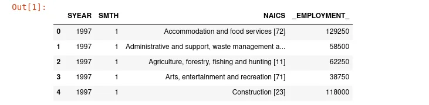

In this block of code, we list all naics2 files in a python list. We use the pandas concat method, map function, and pandas read_csv method to read all data at the same time in one data frame.

**Create naics_code column**

The column **NAICS** is a composition of the Industry name and associated NAICS code in the bracket. We will create a new column with only NAICS code extracted from the NAICS column

```python
naics2_df['naics_code'] = naics2_df.NAICS.str.split('[').map(lambda x: x[1].strip(']'))

naics2_df.head()
```

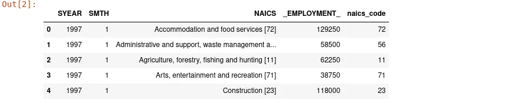

Our strategy to archive this task is to split the NAICS column with "**[**" as the separator. This operation will create a list of two elements. Index one will contain NAICS code end with "**]**" thus we will strip "**]**" to only have NAICS code.

**Creation of utility function**

We have three groups of files (NAICS2, NAICS3, NAICS4) which we will process in the same manner. To respect the DRY(Don't Repeat Yourself) principle which is a strong principle in programming, we will create a small function that we will use throughout our data preprocessing journey. This function looks like this:

```python
def process_RTRA(naics_code_list, naics_code_dict, naics_df):
    dataframe = [naics_df,]

    for key in naics_code_dict.keys():
        naics=naics_df[naics_df.naics_code.isin(naics_code_dict[key])].groupby(['SYEAR','SMTH'], as_index=False).agg('sum')
        naics['naics_code'] = key
        dataframe.append(naics)

    naics_final = pd.concat(dataframe, ignore_index=True)

    return naics_final[naics_final.naics_code.isin(naics_code_list)]
```

This function takes a list of NAICS code as indicated in **"LMO Detailed Industries"** dataset; a dictionary version of these codes and the data frame containing the RTRA data we have loaded. His main purpose is to merge rows according to NAICS code and filter the result to only have data we want to analyze. We will see how it works soon in action.

**Treatment of NAICS2 data**

When we make a tour on **"LMO Detailed Industries"** data and observe the unique values of NAICS code, we have this:

```python
lmo_df = pd.read_excel('LMO_Detailed_Industries_by_NAICS.xlsx')

lmo_df.NAICS.unique()
```

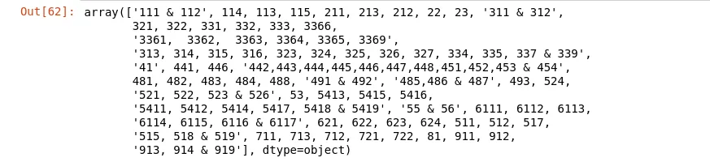

As a reminder, **"LMO Detailed Industries"** contains a list of 59 industries frequently used with the NAICS code associated. The above image showed a list of NAICS codes concerned by our analysis. As we are working now on NAICS2, we create a list that contains all strings composed by NAICS code in 2-digits format.

```python
naics_code_list = ['22','23','41','53','81','55 & 56']
naics_code_dict={'55 & 56':['55','56']}
```

'55 & 56' is a merge of all rows with NAICS code **55** and those with **56** for the same survey year(**SYEAR**) and survey month (**SMTH**). To process data composed like that, we created a dictionary to map this object to a list of values and we live our function do the rest of the job.

```python
naics2_df_final = process_RTRA(naics_code_list,naics_code_dict,naics2_df)
```

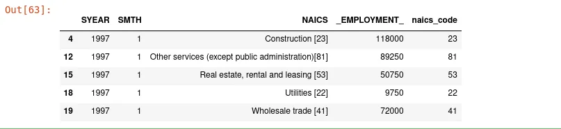

As the NAICS column does not still matter for use, we will delete it.

```python
naics2_df_final= naics2_df_final.drop(columns=["NAICS"])

naics2_df_final.head()
```

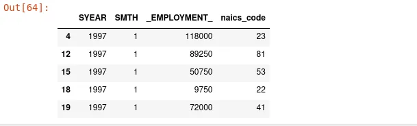

### 2. NAICS 3

**Load NAICS2 files and "naics_code" column**

```python
naics3_files = ['RTRA_Employ_3NAICS_97_99.csv','RTRA_Employ_3NAICS_00_05.csv','RTRA_Employ_3NAICS_06_10.csv','RTRA_Employ_3NAICS_11_15.csv','RTRA_Employ_3NAICS_16_20.csv']

naics3_df = pd.concat(map(pd.read_csv,naics3_files), ignore_index=True)

naics3_df['naics_code'] = naics3_df.NAICS.map(lambda x: x.split('[')[-1].strip(']'))
```

**Deal with anomalies in the naics_code column**

Our new **naics_code** column contains two anomalies. Indeed, **<<Securities, commodity contracts, and other financial investment and related acti>>** don't have NAICS code in front of it. When we check **the "NAICS-2017 - Statistics-Canada"** pdf file, we constate that the associate NAICS code is **523**. We will replace all cells containing this string with this number. Moreover, we have the value **"Other"** in the **naics_code** column and we will replace it by **81**  in all cells where he appears.

```python
naics3_df.naics_code.replace('Securities, commodity contracts, and other financial investment and related acti','523', inplace=True)

naics3_df.naics_code.replace('Other','81', inplace=True)
```

**Treatment of NAICS3 data**

```python
naics_code_list2 = ['111 & 112','114','113','115','211','213','212','311 & 312','321', '322', '331','332', '333','313, 314, 315, 316, 323, 324, 325, 326, 327, 334, 335, 337 & 339','441',           '446','442,443,444,445,446,447,448,451,452,453 & 454','481', '482', '483', '484', '488', '491 & 492', '485,486 & 487', '493', '524','521, 522, 523 & 526','621', '622', '623', '624','511', '512', '517','515, 518 & 519', '711', '713', '712', '721', '722', '911', '912','913, 914 & 919']

naics_code_dict2 = {
    '313, 314, 315, 316, 323, 324, 325, 326, 327, 334, 335, 337 & 339':['313', '314', '315', '316', '323', '324', '325', '326', '327', '334', '335', '337','339'],

    '111 & 112':['111','112'],

     '311 & 312':['311','312'],

    '442,443,444,445,446,447,448,451,452,453 & 454':['442','443','444','445','446','447','448','451','452','453','454'],

    '491 & 492':['491','492'],

    '485,486 & 487':['485','486','487'],

    '521, 522, 523 & 526':['521', '522','523','526'],

    '515, 518 & 519':['515', '518','519'],

    '913, 914 & 919':['913', '914', '919']
}

naics3_df_final = process_RTRA(naics_code_list2,naics_code_dict2,naics3_df)

naics3_df_final.drop(columns="NAICS", inplace=True)
```

Here, we do the same thing as we have done with the NAICS 2.

### 3. NAICS 4

```python
naics4_file = ['RTRA_Employ_4NAICS_97_99.csv','RTRA_Employ_4NAICS_00_05.csv','RTRA_Employ_4NAICS_06_10.csv','RTRA_Employ_4NAICS_11_15.csv','RTRA_Employ_4NAICS_16_20.csv']

naics4_df = pd.concat(map(pd.read_csv,naics4_file), ignore_index=True)

naics4_df.NAICS = naics4_df.NAICS.astype('str')

naics4_df.rename(columns={"NAICS":"naics_code"}, inplace=True)

naics_code_list3 = ['3366','3361,  3362,  3363, 3364, 3365, 3369', '5413', '5415', '5416','5411, 5412, 5414, 5417, 5418 & 5419','6111', '6112', '6113','6114, 6115, 6116 & 6117']

naics_code_dict3 = {
    '3361,  3362,  3363, 3364, 3365, 3369':['3361',  '3362',  '3363', '3364', '3365', '3369'],

    '5411, 5412, 5414, 5417, 5418 & 5419':['5411', '5412', '5414', '5417', '5418', '5419'],

    '6114, 6115, 6116 & 6117':['6114', '6115', '6116', '6117']
}

naics4_df_final = process_RTRA(naics_code_list3,naics_code_dict3,naics4_df)

naics4_df_final.head()
```

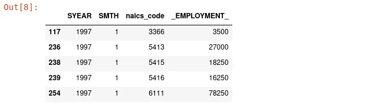

### 4. Concatenation of all three NAICS data frames.

After processing each group of NAICS data, it is time to combine them in one data frame.

```python
all_naics_df = pd.concat([naics2_df_final,naics3_df_final,naics4_df_final],ignore_index=True)

all_naics_df.rename(columns={"_EMPLOYMENT_":"Employment"}, inplace=True)
```

The result data frame contains data from 1997 to 2019, but we only need data from 1997 to 2018. We will filter it to only conserve the desired data.

```python
all_naics_df=all_naics_df[~(all_naics_df.SYEAR==2019)]
```

**Associate NAICS code to Data Output Template**

Data Output Template is an excel file with an empty column for employment. In order to fill the employment column, we need to associate each **"LMO_Detailed_Industry"** with the set of naics_code concerned.

```python
lmo_df = pd.read_excel('LMO_Detailed_Industries_by_NAICS.xlsx')

data_output_df = pd.read_excel('Data_Output_Template.xlsx')

data_output_with_naics_code = data_output_df.merge(lmo_df,how="left",sort=True,on="LMO_Detailed_Industry")

data_output_with_naics_code.drop(columns=['Employment'], inplace=True)

data_output_with_naics_code.NAICS = data_output_with_naics_code.NAICS.astype('str')
```

**Fill the Employment column**

```python
final_data_output = data_output_with_naics_code.merge(all_naics_df,how="left",left_on=['SYEAR','SMTH','NAICS'], right_on=['SYEAR','SMTH','naics_code'])

final_data_output
```

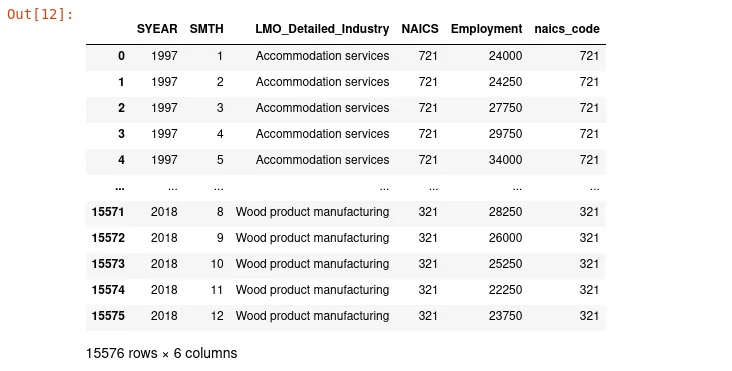

## III- Answering some questions

### 1. How employment in Construction evolved over time and how this compares to the total employment across all industries?

To answer this question, we will subset the global dataset to only have data related to construction.

```python
construction_df = final_data_output[final_data_output.LMO_Detailed_Industry=='Construction']
construction_df
```

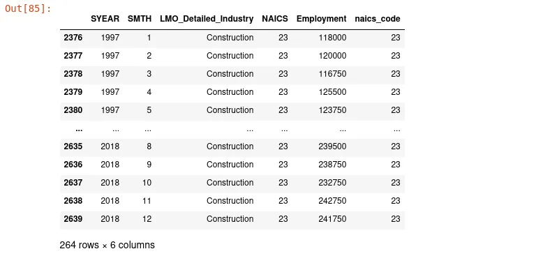

**Importation of library for visualization**

```python
import matplotlib.pyplot as plt
import seaborn as sns
```

**Line plot of evolution in construction over years**

```python
plt.figure(figsize=[15,5])
sns.set_style('darkgrid')

sns.lineplot(x='SYEAR', y="Employment", data=construction_df)

plt.xticks(construction_df['SYEAR'])

plt.title("Evolution of employment in construction area over year")

plt.show()
```

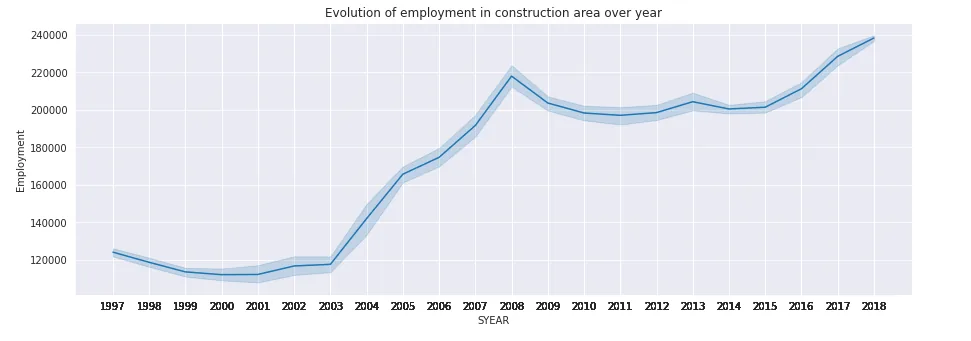

From this plot, we can conclude that the number of employment in construction increased over time from 1997 to 2018.

### 2. Which year have the highest employment and in which month

```python
final_data_output[['SYEAR','Employment']].groupby(['SYEAR']).agg(sum).nlargest(columns=["Employment"],n=5)
```

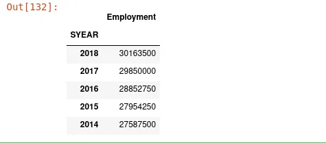

From this result, we can conclude that the year 2018 has the most important employment across all industries. This is another proof that employment increased over years. This result shows us the five years with the highest employment in descending order.

**The month of most employment**

```python
final_data_output[['SYEAR','SMTH','Employment']].groupby(['SYEAR','SMTH']).agg(sum).nlargest(columns=["Employment"],n=5)
```

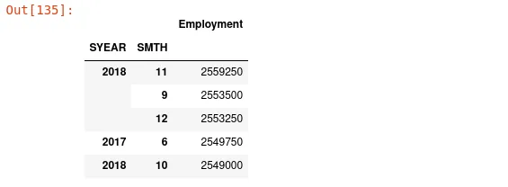

The year 2018 has the most employment in all industries but the month with the highest employment is **November 2018 followed by September 2019 and June 2017 respectively.**

### 3. Which year have the lowest employment and in which month[¶](http://localhost:8888/notebooks/Time%20Serie%20Ananlysis-NAICS.ipynb#III.3.-Which-year-have-the-lowest-employment-and-in-which-month)

```python
final_data_output[['SYEAR','Employment']].groupby(['SYEAR']).agg(sum).nsmallest(columns=["Employment"],n=5)
```

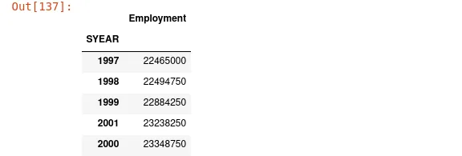

```python
final_data_output[['SYEAR','SMTH','Employment']].groupby(['SYEAR','SMTH']).agg(sum).nsmallest(columns=["Employment"],n=5)
```

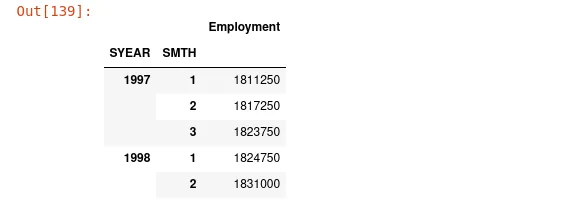

The year 1997 have the lowest employment, specifically in January 1997.

## Conclusion
In this blog post, we mainly focus on data preparation of NAICS and after we have answered some questions. Note that with the date we have prepared, you can answer any question you want. Have fun using the data we have prepared to answer any question we want about NAICS.
