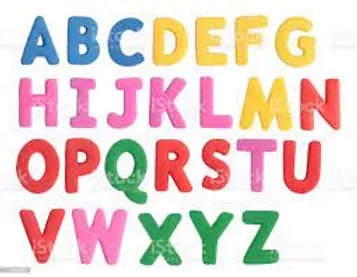

Python is a not any language programming. It is rather universal programming language that is appropriate for solving a wide range of tasks.These days, developers are highly likely to be working on a mobile or web application. Python doesn't have built-in mobile development capabilities.Python is often used as a support language for software developers, for build control and management, testing, and in many other ways

This code was created for counting the frequency of letters occurence in a written word, phrase or expression :

We are going the input function which allows the userto enter first the word or expression :

```python
star=input("enter the word , phrase sentence: ")
```

Then we generate the same function in order to ask from the user to enter the letter which he wants to know its occurence

```python
str=input("enter the letter you want to know its occurence :")
```

The print function allows to give the frequency of given letter :

```python
print("the letter", str, "appears", star.count(str), "times")
```

In case the user wants to reppeat the operation , we generate the same function asking to answerr either by yes or no :

```python
start=input("Do you want to enter new word, phrase or senstences again ?:")
```

Then we will use While statement in case the user wants to reuse the app :

```python
while start== "yes":
```

We start from the beginingthe same operation

```python
  star=input("enter the word , phrase sentence: ")
  str=input("enter the letter you want to know its occurence :")
  print("the letter", str, "appears", star.count(str), "times")
  if start != "yes"
```

At the end we print thank you :

```python
    print ("Thank you!")
```

Why don't you try it by yourself ? :)

```python
star=input("enter the word , phrase sentence: ")str=input("enter the letter you want to know its occurence :")print("the letter", str, "appears", star.count(str), "times")start=input("Do you want to enter new word, phrase or senstences again ?:")while start== "yes":star=input("enter the word , phrase sentence: ")str=input("enter the letter you want to know its occurence :")print("the letter", str, "appears", star.count(str), "times")if start != "yes":print ("Thank you!")
```
