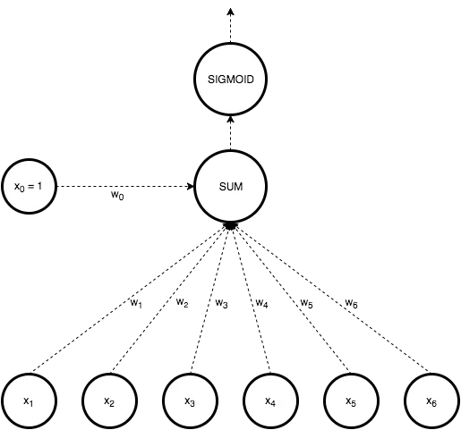
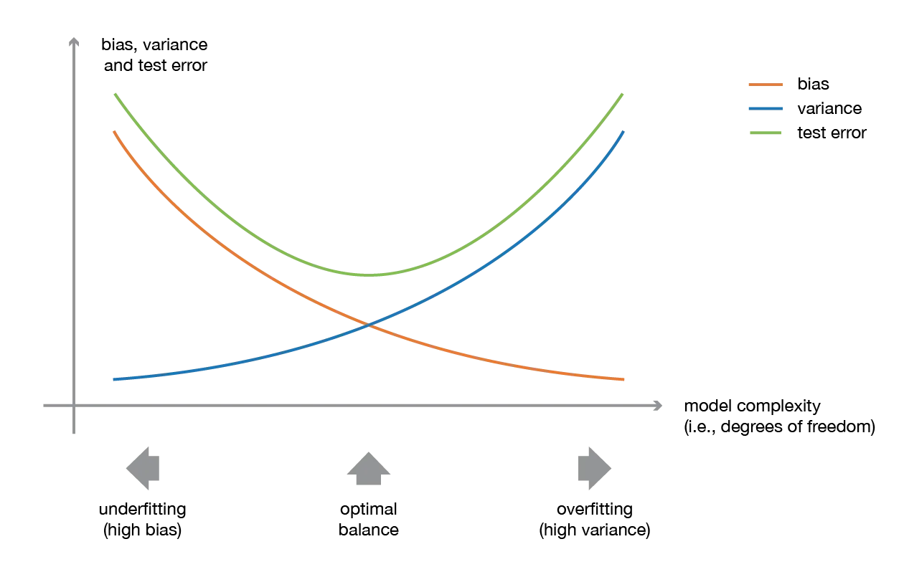

### What is Linear Classifier

Linear classifiers classify data into labels based on a linear combination of input features. Therefore, these classifiers separate data using a line or plane or a hyperplane (a plane in more than 2 dimensions). They can only be used to classify data that is linearly separable.

We will explore 3 major algorithms in linear binary classification.

##### 1. Perceptron
The Perceptron Classifier is a linear algorithm that can be applied to binary classification. It learns iteratively by adding new knowledge to an already existing line.

In Perceptron, we take a weighted linear combination of input features and pass it through a thresholding function that outputs 1 or 0. The sign of wTx tells us which side of the plane wTx=0, the point x lies on. Thus by taking threshold as 0, perceptron classifies data based on which side of the plane the new point lies on.

The rule can also be stated as follows.

**w_i = w_i + alpha(actual value – estimated value) X x_i**

Said in words, it adjusted the values according to the actual values. Every time a new value comes, it adjusts the weights to fit better accordingly.

Given the line, after it has been adjusted to all the training data – then it is ready to predict.

##### 2. Logistic Regression
In Logistic regression, we take a weighted linear combination of input features and pass it through a sigmoid function which outputs a number between 1 and 0. Unlike perceptron, which just tells us which side of the plane the point lies on, logistic regression gives a probability of a point lying on a particular side of the plane. The probability of classification will be very close to 1 or 0 as the point goes far away from the plane. The probability of classification of points very close to the plane is close to 0.5.

**3. SVM**
There can be multiple hyperplanes that separate linearly separable data. SVM calculates the optimal separating hyperplane using concepts of geometry.

### Machine learning with Tree-based models

##### Decision tree
A DecisionTree is a Supervised Machine Learning Algorithm that uses a set of rules to make decisions, similar to how humans make decisions. One way to think of a Machine Learning classification algorithm is that it is built to make decisions. A decision tree can be used for both classification and Regression problems, but mostly it is preferred for solving Classification problems. It is a tree-structured classifier, whereinternal nodes represent the features of a dataset, branches represent the decision rules and each leaf node represents the outcome. It is called a decision tree because it is similar to a tree, it starts with the root node, which expands on further branches and constructs a tree-like structure.

In order to build a tree, we use the **CART algorithm,** which stands for **Classification and Regression Tree algorithm.**

- In a Decision tree, there are two nodes, which are the **Decision Node** and **Leaf Node.** Decision nodes are used to make any decision and have multiple branches, whereas Leaf nodes are the output of those decisions and do not contain any further branches.
- The decisions or the test are performed on the basis of features of the given dataset.

There are two popular techniques for attribute selection measure, which are:

- **Information Gain:** Information gain is the measurement of changes in entropy after the segmentation of a dataset based on an attribute. It calculates how much information a feature provides us about a class. According to the value of information gain, we split the node and build the decision tree. A decision tree algorithm always tries to maximize the value of information gain, and a node/attribute having the highest information gain is split first.
- **Gini Index:** Gini index is a measure of impurity or purity used while creating a decision tree in the CART(Classification and Regression Tree) algorithm. An attribute with a low Gini index should be preferred as compared to the high Gini index. It only creates binary splits, and the CART algorithm uses the Gini index to create binary splits.

#### Ensemble methods
Ensemble learning is a machine learning paradigm where multiple models (often called “weak learners”) are trained to solve the same problem and combined to get better results. The main hypothesis is that when weak models are correctly combined we can obtain more accurate and/or robust models.

**Bagging** and **boosting** are two types of ensemble learning techniques. These two decrease the variance of a single estimate as they combine several estimates from different models. So the result may be a model with higher stability. The main causes of error in learning are due to **noise, bias, and variance**. Ensemble helps to minimize these factors. By using ensemble methods, we’re able to increase the stability of the final model and reduce the errors mentioned previously.

- **Bagging helps to decrease the model’s variance.**
- **Boosting helps to decrease the model’s bias.**

A low bias and a low variance, although they most often vary in opposite directions, are the two most fundamental features expected for a model. Indeed, to be able to “solve” a problem, we want our model to have enough degrees of freedom to resolve the underlying complexity of the data we are working with, but we also want it to have not too many degrees of freedom to avoid high variance and be more robust. This is the well-known **bias-variance tradeoff**.

##### Random Forest Algorithm
Random Forest is a popular machine learning algorithm that belongs to the supervised learning technique. It can be used for both Classification and Regression problems in ML. It is based on the concept of **ensemble learning,** which is a process of combining multiple classifiers to solve a complex problem and to improve the performance *of the model.*

As the name suggests, ***"Random Forest is a classifier that contains a number of decision trees on various subsets of the given dataset and takes the average to improve the predictive accuracy of that dataset."*** Instead of relying on one decision tree, the random forest takes the prediction from each tree and based on the majority votes of predictions, and predicts the final output. The greater number of trees in the forest leads to higher accuracy and prevents the problem of overfitting.

The **random forest** approach is a bagging method where **deep trees**, fitted on bootstrap samples, are combined to produce an output with lower variance. However, random forests also use another trick to make the multiple fitted trees a bit less correlated with each other: when growing each tree, instead of only sampling over the observations in the dataset to generate a bootstrap sample, we also **sample over features** and keep only a random subset of them to build the tree.
