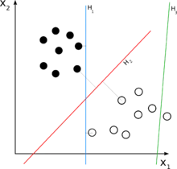
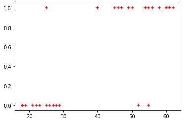
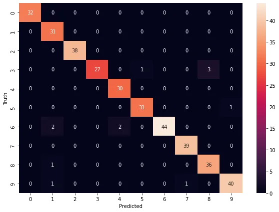

## LINEAR CLASSIFIERS
**Linear classifiers** are supervised machine learning algorithms that classify data into labels based on linear combination of the input features. They classify data using a line in the case of a two-dimensional dataset and with a plane in the case of more than two-dimensional dataset. In this article, we will talk extensively on **Logistic Regression** and **Support Vector Machine (SVM)** algorithms. These algorithms are implemented using the scikit-learn library of python. They are governed by a **loss function**. A **loss function** measures how well a given machine learning model fits the specific data set. It boils down all the different under- and overestimations of the model to a single number, known as the **prediction error**.

## Logistic Regression
A statistical technique called logistic regression is employed to forecast binary or multi-class outcomes, such as whether a person will develop diabetes or not, based on the observations of a data set.

Any adjustment to a learning algorithm that is meant to lower its generalization error but not its training error is known as regularization. In other words, by avoiding the algorithm from overfitting the training dataset, regularization can be used to train models that generalize better on unknown data.

Logistic Regression example for a binary class problem:

```python
#Loading the needed libraries
import pandas as pd
import matplotlib.pyplot as plt
from sklearn.model_selection import train_test_split
from sklearn.linear_model import LogisticRegression
%matplotlib inline

#Uploading files from local onto google colab
from google.colab import files
files.upload()

#Loading the csv file of our data and showing the first 5 rows
df = pd.read_csv("/content/insurance_data.csv")
df.head()

#Plotting a scatter graph of our data for visualization
plt.scatter(df.age, df.bought_insurance, marker="+", color="red")

#Splitting data into train and test set
X_train, X_test, y_train, y_test = train_test_split(df[['age']], df['bought_insurance'], test_size=0.1)

#Creating the Logistic Regression Model
model = LogisticRegression()

#Training the model
model.fit(X_train, y_train)

#Prediction of test data set
model.predict(X_test)

#Scoring the model
model.score(X_test, y_test)
```

Outputs:

Scatter plot



Prediction value: array([1, 1, 1])

Model score: 1.0

Logistic Regression for a multi-class problem:

```python
ss #Importing the needed libraries
import matplotlib.pyplot as plt
import pandas as pd
from sklearn.datasets import load_digits
from sklearn.model_selection import train_test_split
from sklearn.linear_model import LogisticRegression

#Loading the digits dataset
digits = load_digits()

#Checking out what the dataset contains
dir(digits)

#Checking the first element
digits.data[0]

#Printing the first input
plt.gray()
plt.matshow(digits.images[0])

#Dividing dataset into train and test samples
X_train, X_test, y_train, y_test = train_test_split(digits.data, digits.target, test_size =0.2)

#Creating and training the Logistic Regression Model
model = LogisticRegression()
model.fit(X_train, y_train)

#Scoring the model
model.score(X_test, y_test)

#Model prediction
model.predict([digits.data[67]])
```

Outputs:

Image of first input


Score: 0.9777777777777777

Prediction: array([6])

## Support Vector Machine
Support Vector Machines (SVMs) are supervised machine learning techniques used in both regression and classification. Using a technique known as the kernel trick, SVMs can effectively conduct non-linear classification in addition to linear classification by implicitly translating their inputs into high-dimensional feature spaces.

Support Vector Machine in code:

```python
#Import needed libraries
import pandas as pd
from sklearn.datasets import load_iris
import matplotlib.pyplot as plt
from sklearn.model_selection import train_test_split
from sklearn.svm import SVC
%matplotlib inline

#Loading the dataset
iris = load_iris()

#Check the dataset
dir(iris)

#Putting data into a dataframe
df = pd.DataFrame(iris.data, columns=iris.feature_names)
df.head()

#Appending the target column
df['target'] = iris.target
df.head()

#Creating the flower name column
df['flower_name'] = df.target.apply(lambda x: iris.target_names[x])
df.head()

#Separating targets into different dataframes
df0 = df[df['target'] == 0]
df1 = df[df['target'] == 1]
df2 = df[df['target'] == 2]

#Making X and y
X = df.drop(['target', 'flower_name'], axis='columns')
y = df.target

#Making train and test samples of the datasets
X_train, X_test, y_train, y_test = train_test_split(X, y, test_size = 0.2)

#Creating the model
model = SVC(kernel='linear')

#Training the model with the train dataset
model.fit(X_train, y_train)

#Scoring the model
model.score(X_test, y_test)
```

Outputs:

0.9666666666666667

## TREE BASED MODELS
A **decision tree** is used in tree-based models to illustrate how various input variables can be utilized to forecast a target value. For classification and regression issues, such as figuring out the kind of animal or the worth of a home, machine learning uses tree-based models.

Decision tree for classification problem:

```python
#Importing the necessary libraries
import pandas as pd
from sklearn.preprocessing import LabelEncoder
from sklearn import tree

#Loading dataset from local
from google.colab import files
files.upload()

#Reading the dataset
df = pd.read_csv('/content/salaries.csv')
df.head()

#Setting the inputs and target variables
inputs = df.drop('salary_more_then_100k', axis='columns')
target = df['salary_more_then_100k']

#Creating encoder objects
le_company = LabelEncoder()
le_job = LabelEncoder()
le_degree = LabelEncoder()

#Creating new columns with the encoder objects
inputs['company_n'] = le_company.fit_transform(inputs['company'])
inputs['job_n'] = le_job.fit_transform(inputs['job'])
inputs['degree_n'] = le_degree.fit_transform(inputs['degree'])

#Dropping the old columns and leaving the new ones
inputs_n = inputs.drop(['company', 'job', 'degree'], axis='columns')

#Creating the model
model = tree.DecisionTreeClassifier()

#Training the model on the train dataset
model.fit(inputs_n, target)

#Scoring the model
model.score(inputs_n, target)

#Using the model for prediction
model.predict([[2, 2, 1]])
```

Outputs:

Score: 1.0

Prediction value: 0

A large number of decision trees are built during the training phase of the random forests, also known as **random decision forests**, an ensemble learning technique for classification, regression, and other problems.

Random forest can be implemented in code as follows:

```python
#Importing the needed libraries
import pandas as pd
from sklearn.datasets import load_digits
from sklearn.model_selection import train_test_split
from sklearn.ensemble import RandomForestClassifier
from sklearn.metrics import confusion_matrix
import matplotlib.pyplot as plt
import seaborn as sns
%matplotlib inline

#Loading the dataset
digits = load_digits()

#Checking the dataset
dir(digits)

#Putting data into a dataframe
df = pd.DataFrame(digits.data)
df['target'] = pd.DataFrame(digits.target)

#Splitting data into test data and train data
X_train, X_test, y_train, y_test = train_test_split(df.drop('target', axis='columns'), digits.target, test_size = 0.2)

#Creating the model
model = RandomForestClassifier(n_estimators=20)

#Training the model
model.fit(X_train, y_train)

#Scoring the model
model.score(X_test, y_test)

#Predictions with the model
y_predicted = model.predict(X_test)

#Creating the confusion matrix
cm = confusion_matrix(y_test, y_predicted)

#Plotting the confusion matrix
plt.figure(figsize=(10,7))
sns.heatmap(cm, annot=True)
plt.xlabel('Predicted')
plt.ylabel('Truth')
```

Outputs:

Score: 0.9666666666666667

Confusion Matrix plot:



Link to repository:

<https://github.com/Jegge2003/linear_classifiers-tree_models>
