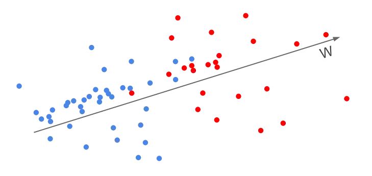
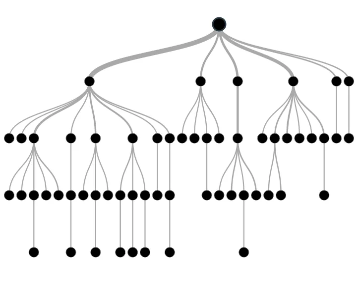

Linear Classifiers



This article examines common linear classification models, including descriptions of the methods as well as Python implementations. We'll go over the following strategies:

Linear Discriminant Analysis
Quadratic Discriminant Analysis
Regularized Discriminant Analysis
Logistic Regression

Let’s start by importing all the packages used throughout this tutorial and loading the data.

```python
# Import necessary modulesimport numpy as np
import pandas as pd
from sklearn.model_selection import train_test_split
from sklearn.metrics import accuracy_score
from sklearn.discriminant_analysis import LinearDiscriminantAnalysis
from sklearn.discriminant_analysis import QuadraticDiscriminantAnalysis
from sklearn.linear_model import LogisticRegression

# Load data and split in train and test sets
spam_data = pd.read_csv('spam.txt', header=None)
X_train, X_test, y_train, y_test = train_test_split(spam_data.iloc[:,:-1],spam_data.iloc[:, -1],test_size=0.2,random_state=42)
```

Linear Discriminant Analysis

The Linear Discriminant Analysis is the first method to be discussed (LDA). It is assumed that the joint density of all features is a multivariate Gaussian, conditional on the target's class.

The hyperplane on which the chance of belonging to either class is the same is the decision boundary between two classes, say k and l. This indicates that the difference between the two densities (and thus the log-odds ratio between them) should be zero on this hyperplane.
The fact that the Gaussians for various classes share the same covariance matrix is an essential assumption in LDA, therefore the subscript k from _k in the formula above can be removed. This assumption is useful for calculating the log-odds ratio since it cancels out the normalization factors and the quadratic components of the exponent. This results in a linear decision boundary between k and l in X:

Note that LDA has no hyperparameters to tune. It takes just a few lines of code to apply it to the spam data.

Quadratic Discriminant Analysis

The assumption made by LDA that the Gaussians for different classes have the same covariance matrix is handy, but it may be inaccurate for specific data. The left column in the image below compares how LDA works with data from multivariate Gaussians with a shared covariance matrix (upper panel) vs data from distinct classes with different covariances (bottom panel) (lower panel).

As a result, the common covariance assumption may need to be relaxed. There are k covariance matrices to be computed in this scenario, not one. When there are a lot of characteristics, the number of parameters in the model might quickly grow out of control. The quadratic terms in the exponents of the Guassians, on the other hand, no longer cancel out, and the decision boundaries are quadratic in X, providing the model more flexibility: see the diagram above. Quadratic Discriminant Analysis is the name given to this method (QDA)

```python
qda_model = QuadraticDiscriminantAnalysis()
qda_preds = qda_model.fit(X_train, y_train).predict(X_test)
qda_acc = accuracy_score(y_test,qda_preds)
print('QDA Accuracy: {}'.format(qda_acc))
```

Regularized Discriminant Analysis

Linear classifiers, like linear regression models, can be regularized to increase accuracy. A shrinkage parameter can be used to combine the individual QDA covariance matrices into a single LDA matrix:

Any value in between is a compromise between the two methodologies. The shrinkage parameter can take values ranging from 0 (LDA) to 1 (QDA). Cross-validation can be used to determine the optimum value of. In Python, we must supply the shrinkage option to the LDA function, as well as specify least squares as the computing technique, as other computation methods do not support shrinkage.

```python
rda_model = LinearDiscriminantAnalysis(solver='lsqr', shrinkage='auto')
rda_preds = rda_model.fit(X_train, y_train).predict(X_test)
rda_acc = accuracy_score(y_test, rda_preds)
print('RDA Accuracy: {}'.format(rda_acc))
```

Logistic Regression

The logistic regression model, which, despite its name, is a classification rather than a regression method, is another approach to linear classification. Logistic regression uses linear functions to describe the odds of an observation belonging to each of the K classes, ensuring that the probabilities add to one and remain in the (0, 1) range. The model is defined in terms of K-1 log-odds ratios, with an arbitrary reference class chosen (in this example it is the last class, K).

Maximum likelihood is used to estimate logistic regression models, which is handled by scikit-learn. Logistic regression, like linear regression models, can be regularized to increase accuracy. In fact, scikit-default learn's value is L2 penalty. It also supports L1 and Elastic Net penalties (for more information, see the link above), albeit not all solvers support all of them. The documentation for logistic regression in Scikit-learn goes into great detail about it.

Although logistic regression is most commonly used as an inference tool in tasks where the goal is to understand the role of input variables in explaining the outcome (it produces easily interpretable coefficients, just like linear regression), it can also be a powerful predictor, as the example below shows.

```python
logreg_model = LogisticRegression()
logreg_preds = logreg_model.fit(X_train, y_train).predict(X_test)
logreg_acc = accuracy_score(y_test, logreg_preds)
print('Logistic Regression Accuracy: {}'.format(logreg_acc))
```

## Machine Learning with Tree-Based Models



One of the greatest and most widely used supervised learning approaches is tree-based algorithms. Tree-based algorithms provide great accuracy, stability, and interpretability to prediction models. They map non-linear interactions pretty well, unlike linear models. They can adjust to any situation and solve any challenge (classification or regression).
In many kinds of data science challenges, methods including decision trees, random forests, and gradient boosting are often used. As a result, every analyst (including newcomers) should master these algorithms and apply them to modeling.

Regression Trees and Classification Trees CART stands for Classification and Regression Trees and is a set of supervised learning models for classification and regression issues.

Classification Tree

A series of if-else questions regarding specific features is used to learn patterns from the data, resulting in the purest leafs possible. At the end of the day, one class-label dominates each leaf.

Decision Regions
Decision region: region in the feature space where all instances are assigned to one class label. Decision Boundary: surface separating different decision regions. Linear boundary Non-linear boundary

```python
# Import DecisionTreeClassifier from sklearn.tree
from sklearn.tree import DecisionTreeClassifier

# Import accuracy_score
from sklearn.metrics import accuracy_score

# Instantiate a DecisionTreeClassifier 'dt' with a maximum depth of 6
dt = DecisionTreeClassifier(max_depth = 6, random_state = 1)

# Fit dt to the training set
dt.fit(X_train, y_train)

# Predict test set labels
y_pred = dt.predict(X_test)
print(y_pred[0:5])

# Compute test set accuracy
acc = accuracy_score(y_test, y_pred)
print("Test set accuracy: {:.2f}".format(acc))
```

Information Gain

The nodes of a classification tree are grown recursively: the obtention of an internal node or a leaf depends on the state of its predecessors.
To produce the purest leaves possible, at each node, a tree asks a question involving one feature f and a split-point sp.
But how does it know which feature and which split-point to pick? It does so by maximizing information gain, i.e. maxmize IG(node)
If it is a unconstrained tree and the IG(node) = 0, declare the node a leaf.
If it is a constrained tree, like the max_depth was set to 2, then it will stop at the set depth no matter the value of the IG(node).
The tree considers that every node contains information and aims at maximizing the information gain obtained after each split.

```python
# Import DecisionTreeClassifier from sklearn.tree
from sklearn.tree import DecisionTreeClassifier

# Instantiate dt_entropy, set 'entropy' as the information criterion
dt_entropy = DecisionTreeClassifier(max_depth = 8, criterion = 'entropy', random_state = 1)

# Fit dt_entropy to the training set
dt_entropy.fit(X_train, y_train)

# Import accuracy_score from sklearn.metrics
from sklearn.metrics import accuracy_score

# Use dt_entropy to predict test set labels
y_pred= dt_entropy.predict(X_test)

# Evaluate accuracy_entropy
accuracy_entropy = accuracy_score(y_pred, y_test)

# Print accuracy_entropy
print('Accuracy achieved by using entropy: ', accuracy_entropy)

# Print accuracy_gini
print('Accuracy achieved by using the gini index: ', accuracy_gini)
```

Regression Tree

Tree-based models help to make nonlinear predictions.
When a regression tree is trained on a dataset, the impurity of a node is measured using the mean-squared error of the targets in that node.

The regression tree aims to discover splits that result in leaves with target values that are, on average, as near to the mean-value of the labels in that leaf as feasible.
When making predictions, a new instance travels the tree until it reaches a specific leaf, at which point its target variable 'y' is computed as the average of the target variables in that leaf.
