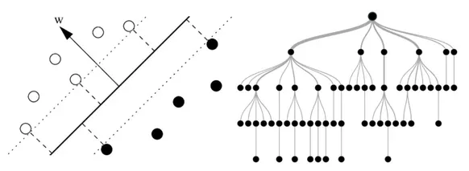
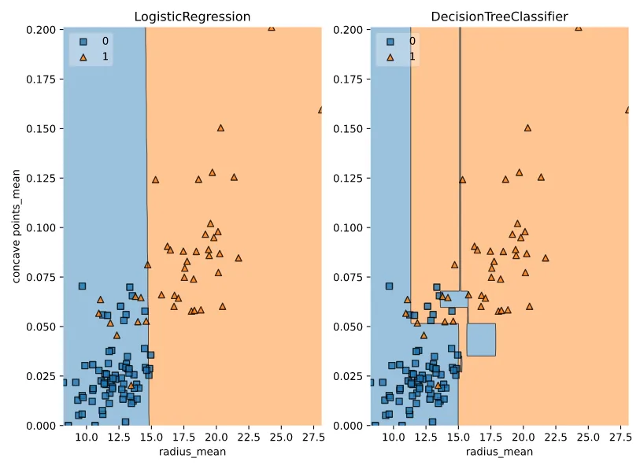

Linear Classifiers are one of the most commonly used classifiers and it is a supervised machine learning technique

A linear classifier takes some quantity x as input and is going to make a prediction ŷ. Let's take an example of a spam classifier system where input x would be emails or reviews and prediction ŷ is a positive statement which means if this a no spam or a positive review in which case ŷ = +1 or is this a negative statement which implies it is a spam or a negative review in which case ŷ = -1.

Logistic Regression is one of the most commonly used linear classifiers.

In this article, we will explore a subset of the [**Large Movie Review Dataset**](http://ai.stanford.edu/~amaas/data/sentiment/). In this exercise, we'll apply logistic regression and a support vector machine to classify images of handwritten digits.

- Applying logistic regression and SVM (using SVC()) to the handwritten digits data set using the provided train/validation split.

```python
from sklearn import datasets
digits = datasets.load_digits()
X_train, X_test, y_train, y_test = train_test_split(digits.data, digits.target)

# Apply logistic regression and print scores
lr = LogisticRegression()
lr.fit(X_train, y_train)
print(lr.score(X_train, y_train))
print(lr.score(X_test, y_test))

# Apply SVM and print scores
svm = SVC()
svm.fit(X_train, y_train)
print(svm.score(X_train, y_train))
print(svm.score(X_test, y_test))
```

Now we'll explore the probabilities outputted by logistic regression. The variable X contains features based on the number of times words appear in the movie reviews, and y contains labels for whether the review sentiment is positive (+1) or negative (-1).

```python
# Instantiate logistic regression and train
lr = LogisticRegression()
lr.fit(X, y)
# Predict sentiment for a glowing review
review1 = "LOVED IT! This movie was amazing. Top 10 this year."
review1_features = get_features(review1)
print("Review:", review1)
print("Probability of positive review:", lr.predict_proba(review1_features)[0,1])
# Predict sentiment for a poor review
review2 = "Total junk! I'll never watch a film by that director again, no matter how good the reviews."
review2_features = get_features(review2)
print("Review:", review2)
print("Probability of positive review:",lr.predict_proba(review2_features)[0,1])
```

**Tree-Based Models in Python**

Decision trees are supervised learning models used for problems involving classification and regression. Tree models present high flexibility that comes at a price: on one hand, trees are able to capture complex non-linear relationships; on the other hand, they are prone to memorizing the noise present in a dataset. By aggregating the predictions of trees that are trained differently, ensemble methods take advantage of the flexibility of trees while reducing their tendency to memorize noise. Ensemble methods are used across a variety of fields and have a proven track record of winning many machine learning competitions.

## Training the first classification tree
In this article for the Tree based model, we'll work with the [Wisconsin Breast Cancer Dataset](https://www.kaggle.com/uciml/breast-cancer-wisconsin-data) from the UCI machine learning repository. We'll predict whether a tumor is malignant or benign based on two features: the mean radius of the tumor (radius_mean) and its mean number of concave points (concave points_mean).

The dataset is split into 80% train and 20% test. The feature matrices are assigned to X_train and X_test, while the arrays of labels are assigned to y_train and y_test where class 1 corresponds to a malignant tumor and class 0 corresponds to a benign tumor. To obtain reproducible results, we also defined a variable called SEED which is set to 1.

- First, we import DecisionTreeClassifier from sklearn.tree.
- Then instantiate a DecisionTreeClassifier dt of maximum depth equal to 6.

```python
# Import DecisionTreeClassifier from sklearn.tree
from sklearn.tree import DecisionTreeClassifier

# Instantiate a DecisionTreeClassifier 'dt' with a maximum depth of 6
dt = DecisionTreeClassifier(max_depth=6, random_state=SEED)

# Fit dt to the training set
dt.fit(X_train, y_train)

# Predict test set labels
y_pred = dt.predict(X_test)
print(y_pred[0:5])
```

Now that we have fit the first classification tree, it's time to evaluate its performance on the test set. We will do so using the accuracy metric which corresponds to the fraction of correct predictions made on the test set.

```python
# Import accuracy_score
from sklearn.metrics import accuracy_score

# Predict test set labels
y_pred = dt.predict(X_test)

# Compute test set accuracy
acc = accuracy_score(y_test, y_pred)
print("Test set accuracy: {:.2f}".format(acc))
```

## Logistic regression vs classification tree
A classification tree divides the feature space into rectangular regions. In contrast, a linear model such as logistic regression produces only a single linear decision boundary dividing the feature space into two decision regions.

We have written a custom function called plot_labeled_decision_regions() that you can use to plot the decision regions of a list containing two trained classifiers.

```python
# Import LogisticRegression from sklearn.linear_model
from sklearn.linear_model import  LogisticRegression

# Instatiate logreg
logreg = LogisticRegression(random_state=1)

# Fit logreg to the training set
logreg.fit(X_train, y_train)

# Define a list called clfs containing the two classifiers logreg and dt
clfs = [logreg, dt]

# Review the decision regions of the two classifiers
plot_labeled_decision_regions(X_test,y_test,clfs
```


