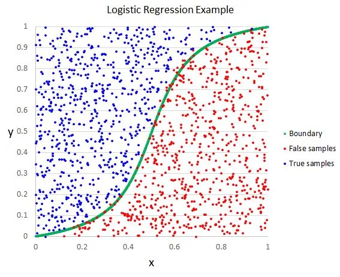
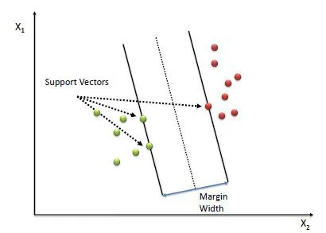
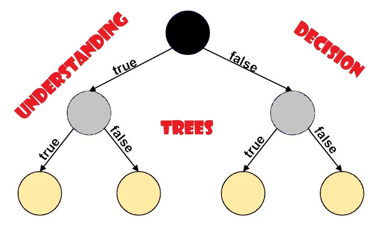

**introduction**

*This article introduces the basic concepts underlying the principles of Linear classifiers and Tree-based models and how they can be implemented*

**Linear Classifiers**

Before we look at linear classifiers, let's understand first, what classification is.

Machine learning has really excelled in the area of classification.

Being image classification or classifying emails as being spam or not has thrown more light on this field and its application in the real world.

But what is classification?

This is where we would want to know what linear classifiers are,

A linear classifier in machine learning is a technique used to predict the probability of an object belonging to a certain class of objects based on certain characteristics.

The classification decision here is based on the value of a linear combination of characteristics of an object.

In this article, we will focus on two of the main but literally simple classifiers, being;

1. Logistic Regression
2. Support Vector Machine

**Logistic Regression**



The most common logistic regression models a binary outcome, one that takes in a few or several input values and output two outcomes, either 1 or 0, True or False, Yes or No, this is called a binary classification problem.

In this article, we will implement a simple logistic regression model using the scikit learn library.

```python
from sklearn import datasets
from sklearn.model_selection import train_test_split
from sklearn.linear_model import LogisticRegression

digits = datasets.load_digits()

X_train, X_test, y_train, y_test = train_test_split(digits.data, digits.target)

Lr = LogisticRegression()
Lr.fit(X_train, y_train)
Lr.score(X_test,y_test)

#output
0.9577777777777777
```

The code above show's a basic implementation of the logistic regression algorithm

Logistic regression can also be used for multi-class classification problems, but that's outside the scope of this post.

**Support Vector Machine**



support vector machines(SVM) are a class of supervised

learning algorithms which can be used for both classification

and regression problems as support vector classification(SVC)

and support vector regression(SVR)

the idea behind the working of SVM is to find a hyperplane

that will best separate the features into different

domains.

From the figure above, the point shown is known as support vector points and the distance of these vectors from the hyperplane are known as margins.

The intuition behind this is that, the more the SV points are far away from the hyperplane, the higher the probability of classifying the points in their respective class.

This shows that these points are very critical in determining the position of the hyperplane because if the points are changed, the hyperplane's position is altered.

**Tree-Based Models**



Let's now shift our focus to tree-based machine learning algorithms.

Tree-based models also fall under supervised machine learning algorithms which can be used for both regression and classification problems.

The idea behind this tree-based model is to make use of conditional statements to partition training data into subsets.

Each partition adds complexity to the model and in turn, helps in making a prediction.

Let's look at some terminologies :

**Root node:** this is essentially where the splitting begins based on a certain condition whether it happens to be true or not.

**terminal node:** a node where there is no branching, in other words, the node has no other child nodes.

**Parent node:** a node that is divided into sub-node is called the parent node.

In tree-based models, the most common algorithm is

1. Decision tree classifier and regressor
2. RandomForest classifier and regressor

**Random Forest**

A random forest is literally a stack of several decision trees.

The algorithm uses randomness to build each individual tree to promote uncorrelated forests, which then uses the forest's predictive powers to make accurate decisions.

The main limitation of random forest is that a large number of trees can make the algorithm too slow and ineffective for real-time predictions. In general, these algorithms are fast to train but quite slow to create predictions once they are trained.

A more accurate prediction requires more trees, which results in a slower model. In most real-world applications, the random forest algorithm is fast enough but there can certainly be situations where run-time performance is important and other approaches would be preferred.

**. . .**

**Conclusion**

This being an introduction, there's not much information to be a pro after reading this article, I will encourage you to dive deeper and learn more about these algorithms as they are essential for any aspiring data scientist or machine learning engineer.

**HAPPY LEARNING!!!**


