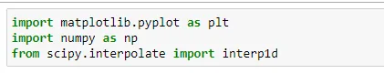
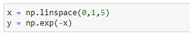
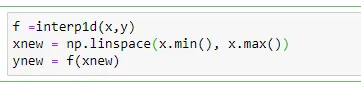
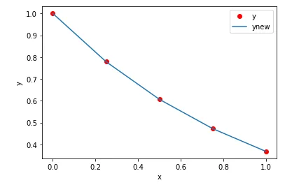

Do you have a series of correlated point data (x,y) and need to fit a linear polynomial with these data and plot the generated result?
No worries, a few codes in python can do that for you.

We will first generate few data points (x,y) having exponential relationship. Then we will fit a linear polynomial between set of x and y using *interpld* function of *scipy.interpolate* library and finally plot the interpolated linear polynomial among the original correlated point data.

This job can be easily done with following steps of code:

Import Required libraries.

Generate, (x,y) data which are exponentially related to each other.

Interpolate values between (x,y) and return interpolated values (xnew, ynew) using *interp1d*.

Now, Plot the original values (x,y) with interpolated linear polynomial created by (xnew, ynew).

Yay! The codes are completed. Now, run the project and you'll see this beautiful plot which shows original values of (x,y) represented by red dot and interpolated linear polynomial line between them.

PS: Above lines of code are performed in Jupyter notebook. The appearance might differ depending on your IDE.
