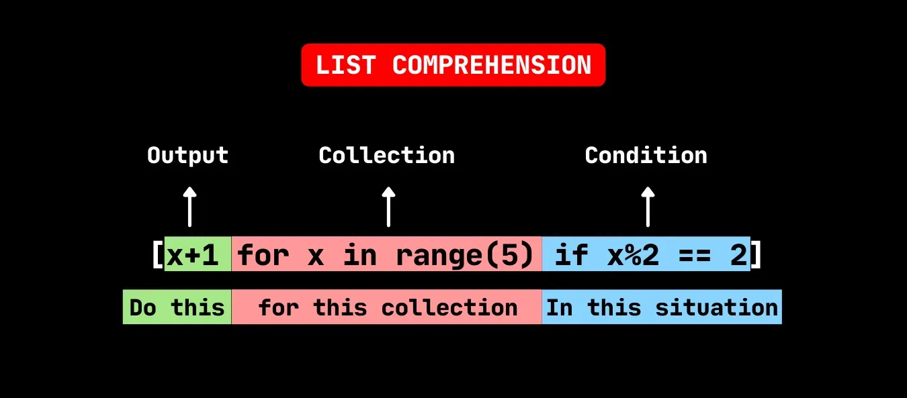

## Introduction
Python is well-known for allowing you to write code that is beautiful, simple, and nearly as easy to understand as plain English. The list comprehension is one of the language's most distinguishing features, allowing you to construct complex functionality in a single line of code. However, many Python writers struggle to fully utilize the more complex aspects of a list comprehension. Some programmers even overuse them, resulting in less efficient and more difficult-to-read code.

By the conclusion of this session, you'll know how to use Python list comprehensions to their maximum potential. You’ll also gain an understanding of the trade-offs that come with using them so that you can determine when other approaches are more preferable.

**In this tutorial, you’ll learn how to:**

- Rewrite loops and map() calls as a list comprehension in Python
- Choose between comprehensions, loops, and map() calls
- Supercharge your comprehensions with conditional logic
- Use comprehensions to replace filter()
- Profile your code to solve performance questions

## How to Create Lists in Python

**Using for Loops**

The most common type of loop is the [for](https://realpython.com/courses/python-for-loop/) loop. You can use a for loop to create a list of elements in three steps:

1. Instantiate an empty list.
2. Loop over an iterable or range of elements.
3. Append each element to the end of the list.

If you want to create a list containing the first ten perfect squares, then you can complete these steps in three lines of code:

```python
squares = []
for i in range(10):
    squares.append(i * i)
squares
```

### Using List Comprehensions

List comprehensions are a third way of making lists. With this elegant approach, you could rewrite the for loop from the first example in just a single line of code:

```python
squares = [i * i for i in range(10)]
squares
```

Every list comprehension in Python includes three elements:

1. expression is the member itself, a call to a method, or any other valid expression that returns a value. In the example above, the expression i \* i is the square of the member value.
2. member is the object or value in the list or iterable. In the example above, the member value is i.
3. iterable is a list, set, sequence, generator, or any other object that can return its elements one at a time. In the example above, the iterable is range(10).

here is the another simple example of list comprehension,

```python
txns = [1.09, 23.56, 57.84, 4.56, 6.78]
TAX_RATE = .08
def get_price_with_tax(txn):
    return txn * (1 + TAX_RATE)
final_prices = map(get_price_with_tax, txns)
list(final_prices)
```

## Benefits of Using List Comprehensions
List comprehensions are frequently referred to as more Pythonic than loops or maps (). However, rather just taking that evaluation at face value, it is worthwhile to consider the advantages of utilizing a list comprehension in Python when compared to the alternatives. Later on, you'll learn about a few instances in which the alternatives are superior.

One major advantage of utilizing a list comprehension in Python is that it is a single tool that can be used in a variety of circumstances. List comprehensions may be used for mapping and filtering in addition to regular list construction. You are not required to use a different technique for each circumstance.

List comprehensions are regarded Pythonic for this reason, as Python embraces simple, powerful tools that can be used in a number of contexts. As an extra bonus, when you use a list comprehension in Python, you won't have to remember the correct sequence of parameters, as you would when calling map ().

List comprehensions are also more declarative than loops, making them simpler to read and comprehend. Loops necessitate paying attention to how the list is constructed. You must manually construct an empty list, loop over the components, and add each one to the list's end.

## When Not to Use a List Comprehension in Python

List comprehensions are useful and can help you write elegant code that’s easy to read and debug, but they’re not the right choice for all circumstances. They might make your code run more slowly or use more memory. If your code is less performant or harder to understand, then it’s probably better to choose an alternative.
