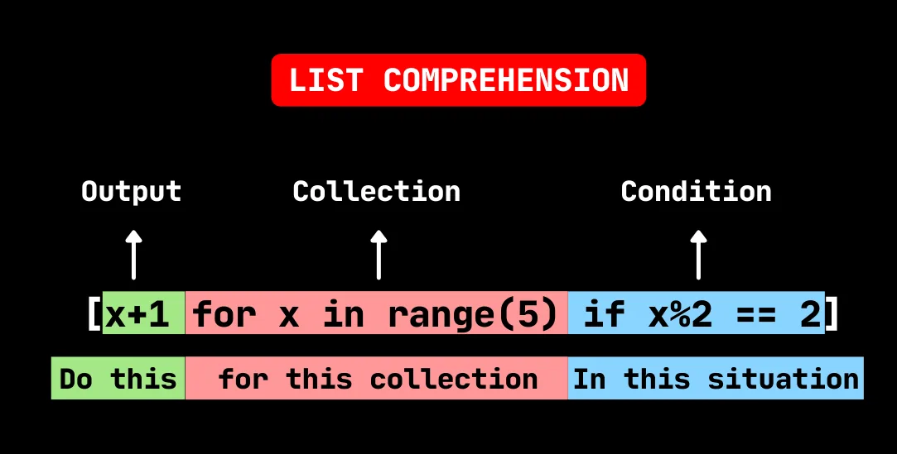

Credit : [Buggy Programmer](http://buggyprogrammer.com)

Lists are one of the most used data structures in Python as they allow us to store data in an easy to handle way. The elements of a list can be explicitly written out one after another by the programmer but if the number of elements increases, this task can become quite tedious. One might need an automated list generation technique, hence the concept of list comprehension. List comprehension, which is a simple and powerful way of creating a list from any existing inerrable object.

In this post, I will first describe the different ways to create list comprehensions, with examples, then I will state when to avoid using it as every single concept, how powerful it might be, has its own limitations. I will also include the equivalent code using **for loops** to compare with list comprehension, the factor of comparison being the execution time.

## 1. Simple list comprehension
### General syntax of list comprehension

A list comprehension is composed of the following items enclosed by square brackets:

- **An output**
- **A collection**
- **A condition and expression**

A simple list comprehension doesn't contain a condition. Let's create a simple list comprehension and its equivalent using a **for loop** and evaluate the runtime of each. For the execution time to be consistent, we will be dealing with long lists and only the first 10 elements of each list will be printed.

```python
import time

# number of iterations
n_iter = 100000

# list comprehension
start = time.time()
x = [i for i in range(n_iter)]
end = time.time()
print(f'x = {x[:10]}')
print(f'Execution time of list comprehension : {(end - start):.2f} seconds\n')

# For loop
start = time.time()
x = []
for i in range(n_iter):
    x.append(i)
end = time.time()
print(f'x = {x[:10]}')
print(f'Execution time of for loop : {(end - start):.2f} seconds')
```

```python
# Output
x = [0, 1, 2, 3, 4, 5, 6, 7, 8, 9]
Execution time of list comprehension : 0.01 seconds

x = [0, 1, 2, 3, 4, 5, 6, 7, 8, 9]
Execution time of for loop : 0.05 seconds
```

We observe that the list comprehension is simpler to read than its equivalent using the **append()** method with a **for loop** on one hand, on the other hand it is faster to execute as it took only **0.01 seconds** whereas its conventional equivalent took **0.05 seconds**.

We can also use any expression to modify the elements of the list provided that all the elements support that operation. In the example below we create a list of elements from **0** to **n_iter**, squared.

```python
# list comprehension
start = time.time()
x = [i**2 for i in range(n_iter)]
end = time.time()
print(f'x = {x[:10]}')
print(f'Execution time of list comprehension : {(end - start):.2f} seconds\n')

# For loop
start = time.time()
x = []
for i in range(n_iter):
    x.append(i**2)
end = time.time()
print(f'x = {x[:10]}')
print(f'Execution time of for loop : {(end - start):.2f} seconds')
```

```python
x = [0, 1, 4, 9, 16, 25, 36, 49, 64, 81]
Execution time of list comprehension : 0.08 seconds

x = [0, 1, 4, 9, 16, 25, 36, 49, 64, 81]
Execution time of for loop : 0.11 seconds
```

As expected, the list comprehension is faster to run than its equivalent for loop, **0.08 seconds vs. 0.11 seconds**

## 2. List Comprehension with** ***If statement*

### a. Single** ***If statement*

When we want to draw the elements of a certain iterator that fulfill a given condition, it is easier, clearer and faster to use a list comprehension with a **if statement**. For the sake of comparison, the equivalent for loop of list comprehension will be written and the execution runtimes of both methods will be printed.

In the example below, we create a list of all the integers less than **n_iters** that are divisible by **3**.

```python
# list comprehension with if statement
start = time.time()
x = [i for i in range(n_iter) if i%3 == 0]
end = time.time()
print(f'x = {x[:10]}')
print(f'Execution time of list comprehension : {(end - start):.2f} seconds\n')

# Equivalent for loop
start = time.time()
x = []
for i in range(n_iter):
    if i%3 == 0:
        x.append(i)
end = time.time()
print(f'x = {x[:10]}')
print(f'Execution time of for loop : {(end - start):.2f} seconds')
```

```python
# Output
x = [0, 3, 6, 9, 12, 15, 18, 21, 24, 27]
Execution time of list comprehension : 0.03 seconds

x = [0, 3, 6, 9, 12, 15, 18, 21, 24, 27]
Execution time of for loop : 0.05 seconds
```

### b. Nested if statement

Here the elements of the list must meet two different conditions at the same time. The elements of our list must not only be divisible by 3, but also by 7.

```python
# list comprehension with if statement
start = time.time()
x = [i for i in range(n_iter) if i%3 == 0 if i%7 == 0]
end = time.time()
print(f'x = {x[:10]}')
print(f'Execution time of list comprehension : {(end - start):.2f} seconds\n')

# Equivalent for loop
start = time.time()
x = []
for i in range(n_iter):
    if i%3 == 0:
        if i%7 == 0:
            x.append(i)
end = time.time()
print(f'x = {x[:10]}')
print(f'Execution time of for loop : {(end - start):.2f} seconds')
```

```python
# Output
x = [0, 21, 42, 63, 84, 105, 126, 147, 168, 189]
Execution time of list comprehension : 0.03 seconds

x = [0, 21, 42, 63, 84, 105, 126, 147, 168, 189]
Execution time of for loop : 0.05 seconds
```

Up to this point, the trend isn't broken so we can confirm that list comprehension is faster than its equivalent with for loop in creating lists.

## 3. List comprehension with** ***if...else*** **statement

### a. Single** ***if...else*** **statement

Now that we are confident that list comprehension is faster to create lists than its equivalent using for loops, we will no more compute the execution time of each method.
Now, a list can be created by drawing elements from an iterator, in our case range and raise them to the power 2 if they're less than 5.

```python
c = [x if x > 5 else x**2 for x in range(n_iter)]

# Equivalent to
c = []
for x in range(n_iter):
    if x > 5:
        c.append(x)
    else:
        c.append(x**2)
c[:10]
```

```python
# Output
[0, 1, 4, 9, 16, 25, 6, 7, 8, 9]
```

Apart from the execution time, we notice that the code snippet with for loop becomes longer when the conditions augment, reinforcing the simplicity of list comprehension compared to its equivalent code using for loop(s).

### b. Multiple** ***if...else*** **statement

Along with list comprehension using multiple if statement, we can also create a list comprehension with multiple **if...else** statement.
In the example below we create a list comprehension **divisors** with 3 if...else statements that works as follows:

for each elements in **multiples** append

- **'two'** if this elements divisible by 2
- **'three'** if this elements divisible by 3
- **'neither'** if this elements neither divisible by 2 nor by 3
- **'both'** if the element is divisible by both.

```python
multiples = [0, 54, 86, 1, 5, 9, 2, 45, 6, 75, 23, 14, 5, 65, 81, 60]
divisors = ['two' if (x%2==0 and x%3!=0) else "three" if (x%3==0 and x%2!=0) else 'both' if (x%3==0 and x%2==0)  else 'neither' for x in multiples]

# Equivalent
divisors = []
for x in multiples:
    if x%2 == 0 and x%3 != 0:
        divisors.append('two')
    elif x%3 == 0 and x%2 != 0:
        divisors.append("three")
    elif x%3 == 0 and x%2 == 0:
        divisors.append("both")
    else:
        divisors.append('neither')
print(divisors)
```

```python
# Output
['both', 'both', 'two', 'neither', 'neither', 'three', 'two', 'three', 'both', 'three', 'neither', 'two', 'neither', 'neither', 'three', 'both']
```

As we can see, the equivalent code with a for loop and append method is quite long but is more legible than the list comprehension. This might suggest to python programmers to take list comprehension with grain of salt.

## 4. List comprehension with nested** ***for loops*

Using two nested for loops, we can create a list comprehension from two different iterables. The relationship between the two source iterables depends on the type of operation used in the resulting list comprehension. Below is an example of operation that can be used to create a list comprehension from two lists and the condition to be fulfilled by these lists.

If the list comprehension is the element-wise sum of the source lists, then each elements pair from both lists must support the addition operation.

In fact, whatever is the operation to perform between two list in order to create a list comprehension, the type of elements of these list must support that operation.

In the example below, we create a list **target** of tuples of elements from two source lists **src1** and **src2**.

src1 = [i for i in range(3)]

src2 = [j for j in range(2)]

target = [(x,y) for x in src1 for y in src2]

```python
# Equivalent
target = []
for x in src1:
    for y in src2:
        target.append((x,y))

# Equivalent
target = []
for x in src1:
    for y in src2:
        target.append((x,y))
print(target)
```

```python
# Output
[(0, 0), (0, 1), (1, 0), (1, 1), (2, 0), (2, 1)]
```

## 5. When to avoid using list comprehension

As we can see in section **3.b**, a list comprehension can rapidly become unreadable and difficult to interpret when the number of related conditions increases. In this case, although the traditional for loop is slower to run, it become the better choice for creating the list.
Therefore, below are few cases when using for loop(s) is preferable than list comprehension.

- There are to many if...else statement;
- The condition or logic in a if statement is too long.

## Conclusion

When used genuinely, list comprehension is a powerful, clear and most pythonic way of creating lists. Its clarity becomes somewhat problematic when its complexity increases, thus making the code difficult to read and misleads its interpretation. The power of this concept ought to be used with moderation.

You can find the notebook for this post [here](https://www.github.com/tem-ctrl/list_comprehension)
