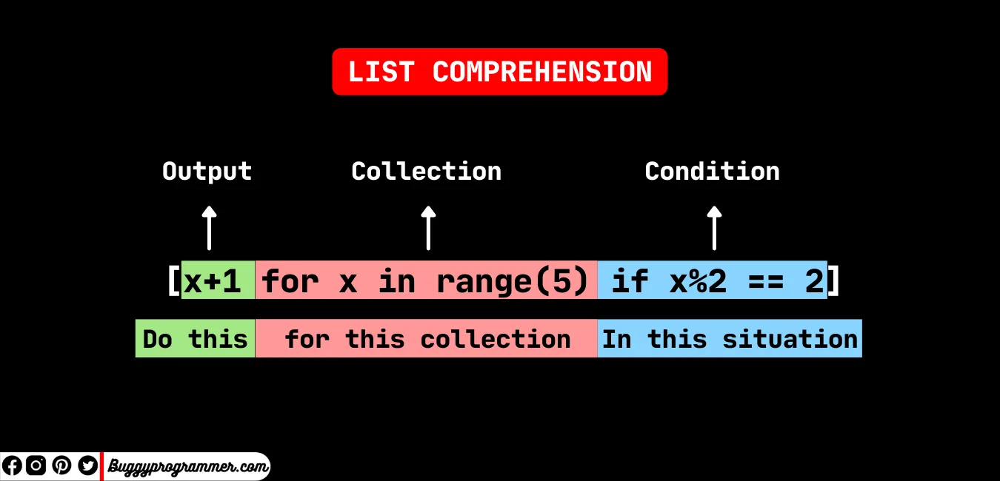

list comprehensions are very useful tool of making quickly lists with certain condtions in just one line. and it is a fundamental tool for data scientist because we often need to do it. for exemple:

cubes = [i\*\*3 for i in range(5)]

print(cubes)

```python
output : [0,1,8,27,64]
```

a list comprehension can also contain an if statement to enforce a condition on values in the list

```python
evens = [i**2 for i in range(10) if i**2 % 2 == 0 ]
output : [0,4,16,36,64]
```

comprehensions by the way are not used only with lists, but also with sets and dictionnary, for example:

```python
new_dict = {}
for i in range(10):
   if n%2 == 0:
      new_dict[n] = n**2
print(new_dict)

output : {0: 0, 8: 64, 2: 4, 4: 16, 6: 36}
```

this lines of code could be replaced with just one line of code if we used the dictionary comprehension.

```python
new_dict = {n:n**2 for n in range(10) if n%2 ==2}

 print(new_dict)

 output : {0: 0, 8: 64, 2: 4, 4: 16, 6: 36}
```

as we saw we could prevent lots of lines of code with this powerful tool , we could also add multiple conditionnals and also nested dictionary comprehension.

An exemple of nested list comprehension:

```python
matrix = []
for i in range(5):
   matrix.append([])
   for j in range(5):
      matrix[i].append(j)
 print(matrix)
 output: [[0, 1, 2, 3, 4], [0, 1, 2, 3, 4], [0, 1, 2, 3, 4], [0, 1, 2, 3, 4], [0, 1, 2, 3, 4]]
```

the code above will be replaced with fewer lines of code after using list comprehension.

```python
matrix = [[j for j in range(5)] for i in range(5)]
print(matrix)
output : [[0, 1, 2, 3, 4], [0, 1, 2, 3, 4], [0, 1, 2, 3, 4], [0, 1, 2, 3, 4], [0, 1, 2, 3, 4]]
```

another axemple :

*Suppose I want to flatten a given 2-D list and only include those strings whose lengths are less than 6:*

*planets = [[‘Mercury’, ‘Venus’, ‘Earth’], [‘Mars’, ‘Jupiter’, ‘Saturn’], [‘Uranus’, ‘Neptune’, ‘Pluto’]]*

*Expected Output: flatten_planets = [‘Venus’, ‘Earth’, ‘Mars’, ‘Pluto’]*

```python
#2-d list of planets
```

```python
planets=[['mercury','venus','earth],['mars','jupyter,'saturn'],['uranus','neptune','pluto']]
```

```python
flatten_planets =[]
```

```python
for sublist in planets:
```

```python
    for planet in sublist:
```

```python
        if len(planet) <6:
```

```python
            flatten_planets.append(planet)
```

```python
print(flatten_planets)
```

```python
output : ['Venus', 'Earth', 'Mars', 'Pluto']
```

This can also be done using nested list comprehensions which has been shown below:

```python
 planets=[['mercury','venus','earth],['mars','jupyter,'saturn'],['uranus','neptune','pluto']]
```

```python
flatten_planets=[planet for sublist in planets for planet in sublist if len(planet)<6]
print(flatten_planets)
output : ['Venus', 'Earth', 'Mars', 'Pluto']
```
