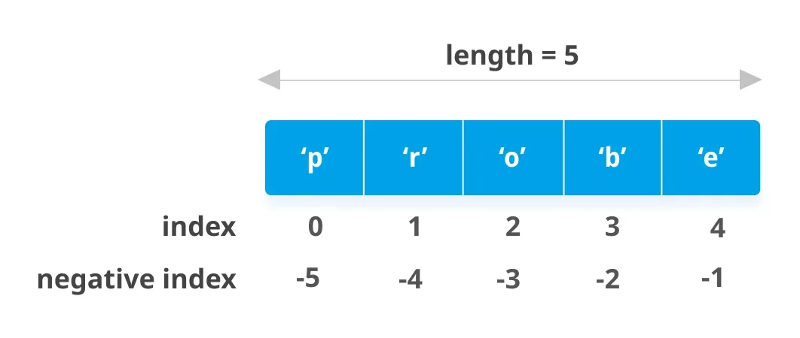
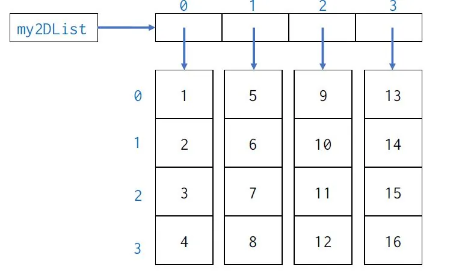

A list is **an ordered and mutable Python container;** ordered means that it takes order in consideration and first element is indexed as 0 though second element is indexed as 1 and so on, mutable as it has the ability to write/change on its elements, is being one of the most common data structures in Python. To create a list, the elements are placed inside square brackets ([]), separated by commas like shown in Figure above. Lists can contain elements of different types as well as duplicated elements.List is a general sequence object that allows

the individual items to be of different types. A list is a main Python data structure that can be used in several application, it's used for creating Stacks, Queues, and can be used as Linked-Lists.

A List data can be manipulated / changed in Python using some List methods that made it easy to be edited. In the following article we will try to go through most of the methods and how to take advantage of each one; let's start, shall we !

Again you can gain a lot of information about the data in a list, to edit and change on it, delete or remove elements, you can even clear the whole list.

[Python Github Code for List Methods](https://github.com/omarmohamed2011/Lists-Methods/blob/main/Python_Lists%26Methods.ipynb)

### List Methods:
Let's first create a list:

```python
    ## Create a list called : A
    A = [0,2,5,'Data']
```

We have now a list called A, this list contain four elements 0,2,5, and 'Data', knowing that the first element 0 is indexed as 0 as we know Python language starts indexing from 0.

First method to know is the append() method, it adds the added element as the last element in the list, for example A was like that:

A = [0,2,5,'Data']

A is after appending string 'Science':

```python
    ## Add an element to the list
    A.append('Science')
    print(A)
>>> [0, 2, 5, 'Data', 'Science']
```

Note that : This command has a time complexity of O(1)

Second method is the copy(), as it seems like it's method to copy list elements into another list see the example;

```python
    ## Copy a list
    B = A.copy()

    print(B)
>>> [0, 2, 5, 'Data', 'Science']
```

Note that:

B = A.copy() is equivalent to B = A[:], but not equivalent B = A, because the later is a call by reference however the first is a call by value ..

In the B= A command, any changes occurring in A will happen in B at the same time and vice versa, however the first two commands refer to creating and independent copy from A to B.

Third method is called count(), takes one argument the value it needs to count the appearance, let's say count the existence of 2 in both lists A and B:

```python
    ## Count of an element in the list
    count_of2 = A.count(2)

    print(count_of2)
>>> 1
```

```python
    ## Add another 2 in list B and find count(2)
    B.append(2)
    count_of2 = B.count(2)

    print(count_of2)
>>> 2
```

Note that : count() takes time O(n) as it requires a linear checking

Fourth method is a tricky one, it's extend(), it iterates over the given extension append it element by element to the end of the list:

```python
    ## Extend A with a string of 123, adding three strings to
    ## A as 1,2,3; three independent elements
    A.extend('123')

    print(A)
>>> [0, 2, 5, 'Data', 'Science', '1', '2', '3']
```

If we extend A with list of three elements [ 1,2,3 ], it will result the same.

If we extend by a string 'ABC' it will add the three strings ['A','B','C']

T[n] = O(k) where k is the length of the given extension

Fifth method is index(), index takes on argument and is used to find first index that match the argument:

Remember that A now equals to: [0, 2, 5, 'Data', 'Science', '1', '2', '3']

```python
    ## Find index of 5 in A
    A.index(5)
>>> 2
```

Sixth method is pop(), it returns the last element from the list and delete it, known that it can take on argument pop(i), as i is the index of the element to be returned and deleted, if i is not given it deletes the last element

```python
    ## pop command to delete last element of list A
    A.pop()
    print(A)
>>> [0, 2, 5, 'Data', 'Science', '1', '2']
```

Notice that it has deleted '3' here

Seventh method is insert(), it is able to insert an element in a certain index in a list, it takes two arguments; the first one is index where the element is put, the second one is the value of the element.

```python
    ## Add 777 integer to the position 1 in A,
    ## which results a shift to all other elements
    A.insert(1,777)

    print(A)
>>> [0, 777, 2, 5, 'Data', 'Science', '1', '2']
```

Eighth method is remove(),it takes on argument, removes the first item from the list whose value is equal to the given argument and raises a [ValueError](https://docs.python.org/3/library/exceptions.html#ValueError) if there is no such item.

```python
    ## Remove the element equal to 0,
    ## which results a shift to all other elements
    A.remove(0)

    print(A)
>>> [777, 2, 5, 'Data', 'Science', '1', '2']
```

Ninth method is reverse(), it takes no arguments, reverses the elements of the list in place.

```python
    ## Reverse order of list elements
    A.reverse()
    print(A)
>>> ['2', '1', 'Science', 'Data', 5, 2, 777]
```

Tenth method is sort(), it takes no arguments, its role to sort the items of the list in place (the arguments can be used for sort customization).

in case

```python
    ## Sort elements
    C = [1,2,10,5,3,7,5]
    C.sort()

    print(C)
>>> [1, 2, 3, 5, 5, 7, 10]
```

Last method is clear(), it takes no arguments, clears the list from all items:

```python
    ## Clear the list C
    C.clear()
    print(C)
>>> []
```

There are other methods that can be used for lists manipulation; to recap and as a reference here are most of the well-known and used methods:

- sort(): Sorts the list in ascending order.
- type(list): It returns the class type of an object.
- append(): Adds one element to a list.
- extend(): Adds multiple elements to a list.
- index(): Returns the first appearance of a particular value.
- max(list): It returns an item from the list with a max value.
- min(list): It returns an item from the list with a min value.
- len(list): It gives the overall length of the list.
- clear(): Removes all the elements from the list.
- insert(): Adds a component at the required position.
- count(): Returns the number of elements with the required value.
- pop(): Removes the element at the required position.
- remove(): Removes the primary item with the desired value.
- reverse(): Reverses the order of the list.
- copy(): Returns a duplicate of the list.

### MultiDimensional Lists
Lists support multi-dimensionality,they are of arbitrary length and and easily be nested. Simply nested lists as 2 –dimensional matrices for example:

my2DList = [[1,2,3,4],[5,6,7,8],[9,10,11,12],[13,14,15,16]]



This can be easily transformed into a numpy array, however as a nested list it can contain more than a datatype, for example the 6 which is in the second row and second column can be replaced with a string, character or even a list of values, remember that we can't do that in arrays.

### List iteration:
List iterating through elements:

Common applications are to make new lists where each element is the result of some operations applied to each member of another sequence or on for iteration, or to create a sub-sequence of those elements that satisfy a certain condition.

For example, assume we want to create a list of squares, like:

```python
    squares = []
    for x in range(10):
        squares.append(x**2)

>>> squares[0, 1, 4, 9, 16, 25, 36, 49, 64, 81]
```

We can also write it in a more functional way:

```python
squares = [x**2 for x in range(10)]
```

Throughout this article you have learned how to create a list, deal with it, add or remove elements, read from it and put into multi-dimensions form, hopeful that this knowledge is useful for you and will help you in your future work.

##### References:

[Python Documentation](https://docs.python.org/3/tutorial/datastructures.html)

[GeekForGeeks](https://www.geeksforgeeks.org/append-extend-python/)

[AnalyticsVidhya](https://www.analyticsvidhya.com/blog/2021/06/15-functions-you-should-know-to-master-lists-in-python/)
