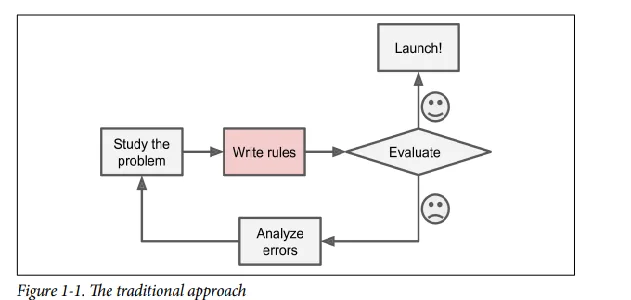
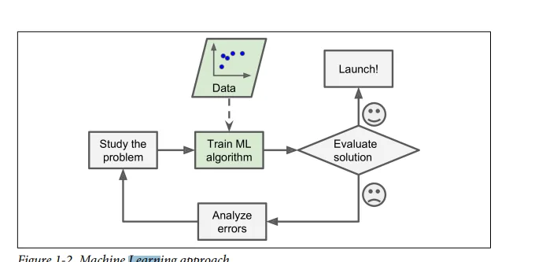
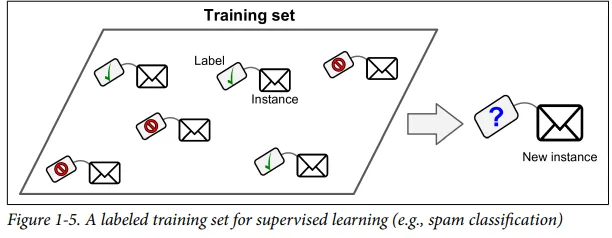
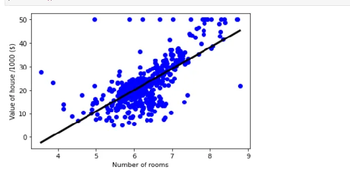
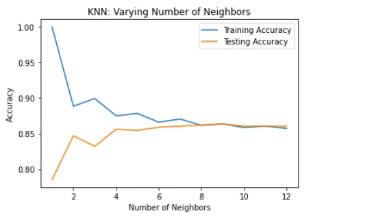
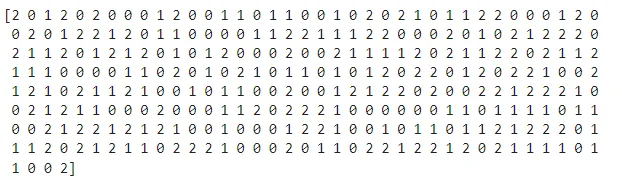
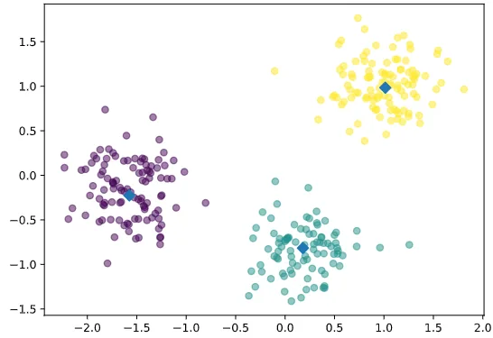

###### Machine Learning is the science (and art) of programming computers so they can learn from data.

Here is a slightly more general definition: [Machine Learning is the] field of study that gives computers the ability to learn without being explicitly programmed. —Arthur Samuel, 1959

And a more engineering-oriented one: A computer program is said to learn from experience E with respect to some task T and some performance measure P, if its performance on T, as measured by P, improves with experience E. —Tom Mitchell, 1997

## Why we use Machine Learning
## consider your email you need to differentiate between spam and ham emails first you need to look how spam looks you see that words as 'free,4U credit' are used a lot

## after that you should make a detection algorithm to detect how much times this words comes in the email and define which is spam or ham email



Your program will be so complex due to number or rules In contrast ML define some words which compere it with ham filter and determine that it belong to spam or ham



### Types of Machine Learning Systems

There exist so many type of machine learning and supervised and unsupervised are the most spread .

#### supervised Learning:

#### In supervised learning your data have the output which is called (labeled data )
#### for example you have emails and you determine that this kind of email is spam and the other is ham differentiate them according to some words exist in one and not in the second .



#### Types of supervised:

#### There exist two types of supervised learning

##### 1: Regression :

#### we use regression to predict numeric values such as price of the car
#### You have all your data and you make sections of your data train set and test set , fit your data, predict new values and in the end step you check the accuracy of your data
#### *Linear regression :* **define relationship between one or more independent variable and response, dependent, or target and your regressor (X)**

```python
import numpy as np
from sklearn.linear_model import LinearRegression
reg = LinearRegression()
reg.fit(X_rooms, y)
prediction_space = np.linspace(min(X_rooms),max(X_rooms)).reshape(-1, 1)

plt.scatter(X_rooms, y, color='blue')
plt.plot(prediction_space, reg.predict(prediction_space),color='black', linewidth=3)
plt.ylabel('Value of house /1000 ($)')
plt.xlabel('Number of rooms')
plt.show()
```



#### 2:Classification

#### k-Nearest Neighboralgorithms: we use it to determine is this point belong to this data or not you define by using low distance between point and another group of data

```python
# Import KNeighborsClassifier
from sklearn.neighbors import KNeighborsClassifier

# Create arrays for the features and the target variable
y = churn_df["churn"].values
X = churn_df[["account_length", "customer_service_calls"]].values

# Create a KNN classifier with 6 neighbors
knn = KNeighborsClassifier(n_neighbors=6)

# Fit the classifier to the data
knn.fit(X, y)
```

n_neighbors=5: by using this parameter you define that there exist 5 point around your point and you need to measure distance and specify that to which group it belongs

```python
plt.title("KNN: Varying Number of Neighbors")

# Plot training accuracies
plt.plot(neighbors, train_accuracies.values(), label="Training Accuracy")

# Plot test accuracies
plt.plot(neighbors,test_accuracies.values(), label="Testing Accuracy")

plt.legend()
plt.xlabel("Number of Neighbors")
plt.ylabel("Accuracy")

# Display the plot0
plt.show()
```



## Unsupervised Learning:
## you have group of animals and according to similarity you define that this group is dogs ,this group is cats and so on

## there exist

## such as divide videos to categories in Youtube

## KMEANS : used to cluster your data to clusters

## you define any center to your data and measure distance from each point to the center and make offset of the center to be in the center of its data to make data clusters

> You define your number of clusters

```python
# Create a KMeans instance with 3 clusters: model
model = KMeans(n_clusters=3)

# Fit model to points
model.fit(points)
# Determine the cluster labels of new_points: labels
labels = model.predict(new_points)

# Print cluster labels of new_points
print(labels)
```



This array is your cluster which mean 1 is cluster 2 is another cluster and 0 for example (0 :dogs ,1:cats ,2: lions)

```python
# Import pyplot
import matplotlib.pyplot as plt

# Assign the columns of new_points: xs and ys
xs = new_points[:0]
ys = new_points[:1]

# Make a scatter plot of xs and ys, using labels to define the colors
plt.scatter(xs,ys,c=labels,alpha=0.5)

# Assign the cluster centers: centroids
centroids = model.cluster_centers_

# Assign the columns of centroids: centroids_x, centroids_y
centroids_x = centroids[:,0]
centroids_y = centroids[:,1]

# Make a scatter plot of centroids_x and centroids_y
plt.scatter(centroids_x,centroids_y,marker="D",s=50)
plt.show()
```



## Reference: Hands-On-Machine-Learning-with-Scikit-Learn-Keras-and-Tensorflow_-Concepts-Tools-and-Techniques-to-Build-Intelligent-Systems-

## Code:https://github.com/AyaMohammedAli/Machine-Learning-Concepts
