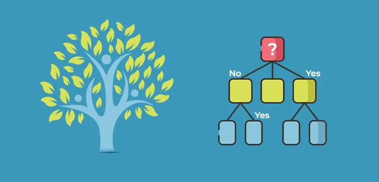
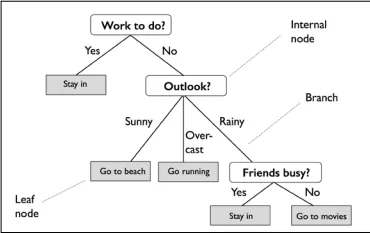
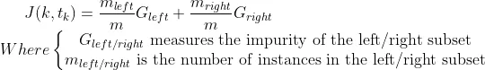
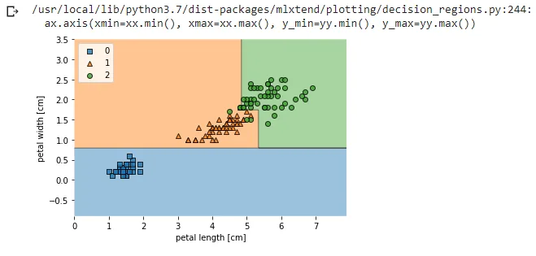
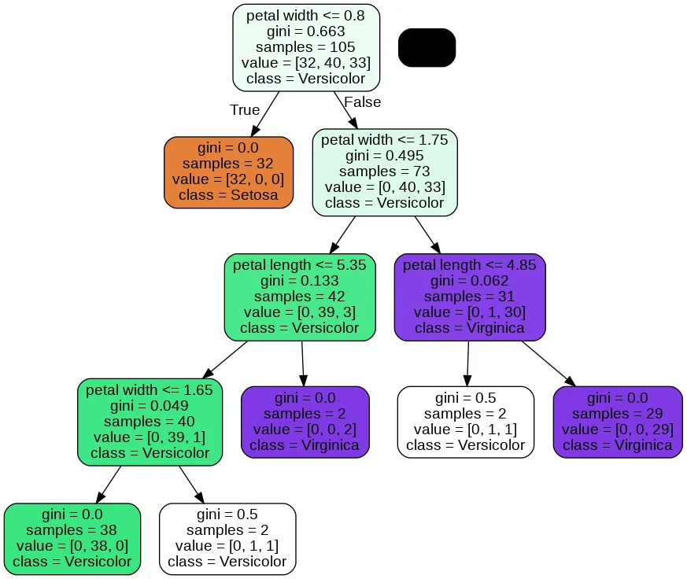
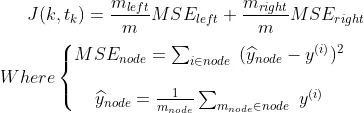
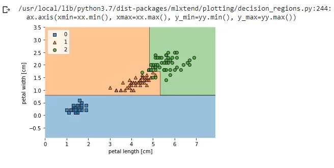
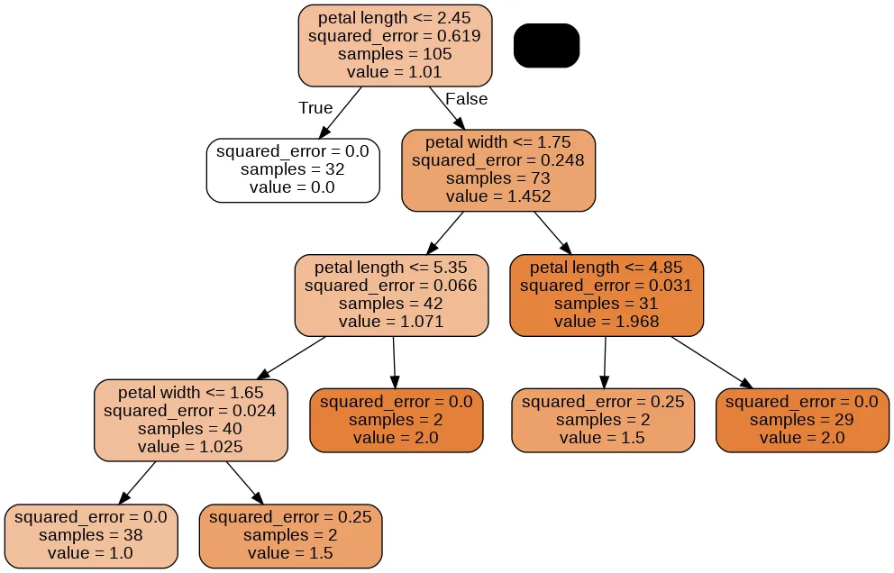
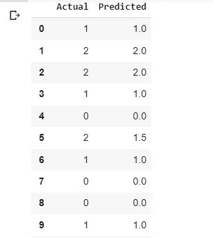

***“Data is a precious thing and will last longer than the systems themselves.” – Tim Berners-Lee***

For banks to figure out if they should offer a person a loan or not, they will often work through a list of questions to see if the person would be safe to give the loan to. These types of questions are simply like, “What kind of income do you have?” If the answer is between $30 and $70,000, they will continue onto the following question. “How long have you worked at your current job?” If they say one to five years, it will continue onto their next question. “Do you make regular credit card payments?” If they yes, then they will offer them a loan, and if they don’t they won’t get the loan. Basically, this is how Decision Trees works.

**-** **Definition****:**

A decision tree is a non-parametric machine learning modeling technique that is used for classification and regression problems. We can think of this model as breaking down our data by making decisions based on asking a series of questions.

Decision Trees are able to capture a non linear relationships between features and labels. They don’t require features to be in the same scale though.

Decision Trees are also the fundamental components of Random Forests, which are among the most powerful Machine Learning algorithms available today.

Let's consider the following example in which we use a decision tree to decide upon an activity on a particular day:



The decision tree is a data structure consisting of hierarchy of nodes, where the node is wether a question or a prediction. There are 3 kinds of nodes:

**Root:** The node at which the decision tree start growing. It’s a no parent node and involves a question that gives rise to 2 children nodes through 2 branches. In the example the root node contains: (*Work to do?)*

**Internal Node:** It is the node that has a parent and involves a question that gives rise to 2 children node. In the example we have 2 internal nodes : *(Outlook?) and (Friends busy?)*

**Leaf:** It’s the node that has no children, has one parent node and involves no questions. It’s where predictions are made. In the example we have 5 leaf nodes: *(stay in?)* which has the root as a node , (*Go to beach? , Go running)* which have an internal node as a parent and *(Stay in? , Go for movies?)* which has an internal node too as a parent.

**-** **Decision Trees for classification****:** The classification decision tree is trained on a labeled dataset, the tree learns patterns from the features in such a way to produce the purest leafs by maximizing the Information Gain.

***What is the Information Gain (IG)?***

The nodes of the classification tree are grown recursively which means that the obtention of an internal node or leaf depends on the state of its predecessor.

To produce the purest leafs possible, at each node a tree asks a question involving one feature point k and a split point tk.

*How does it know which feature and which split point to choose?***...** the tree considers that every node contains information and aims at maximizing the information gain obtained after each split.



***What criterion is used to measure the impurity of a node? Gini Impurity or Entropy?***

At a non leaf node, the data is split based on feature f and split point sp, in such a way to maximize information gain: If the IG obtained by splitting a node is null, the node is declared a leaf.

By default, the Gini impurity measure is used, but you can select the entropy impurity measure instead by setting the criterion hyperparameter to "entropy". The concept of entropy originated in thermodynamics as a measure of molecular disorder: entropy approaches zero when molecules are still and well ordered. It later spread to a wide variety of domains. In Machine Learning, it is frequently used as an impurity measure.

The gini and entropy criterion usually achieve the same results, the gini impurity is slightly faster to compute,so it is a good default. However, when they differ, Gini impurity tends to isolate the most frequent class in its own branch of the tree, while entropy tends to produce slightly more balanced trees.

Decision trees can build complex decision boundaries by dividing the feature space into rectangles. However, we have to be careful since the deeper the decision tree, the more complex the decision boundary becomes, which can easily result in overfitting. Using scikit-learn, we will now train a decision tree with a maximum depth of 3, using entropy as a criterion for impurity.

We start by importing the libraries we'll be using:

```python
import numpy as np
from mlxtend.plotting import plot_decision_regions
import matplotlib.pyplot as plt
from sklearn.datasets import load_iris
from sklearn.tree import DecisionTreeClassifier,DecisionTreeRegressor
from sklearn.tree import export_graphviz
from pydotplus import graph_from_dot_data
from sklearn.model_selection import train_test_split,GridSearchCV
from sklearn.metrics import accuracy_score
from sklearn.metrics import mean_squared_error as MSE
```

We load our dataset, we use the iris dataset from scikit-learn:

We talked in my previous article about scikit-learn datasets check it [here](https://www.datainsightonline.com/post/case-study-dimension-reduction-and-classification-with-t-sne-k-nearest-neighbors-and-the-digits).

```python
SEED = 123
iris = load_iris()
X = iris.data[:, 2:] # petal length and width
y = iris.target
X_train, X_test, y_train, y_test = train_test_split(X,y,test_size=0.3,random_state=SEED)
```

We Used a seed to put it as a value to our random_state parameter when we split our data so we can get the same split.

Then, we istanciate our tree classifier using DecisionTreeClassifier and fit it to our data then plot our decision regions using [plot_decision_regions](https://rasbt.github.io/mlxtend/user_guide/plotting/plot_decision_regions/).

```python
tree = DecisionTreeClassifier(criterion='gini',max_depth=4,random_state=1)
tree.fit(X_train, y_train)
X_combined = np.vstack((X_train, X_test))
y_combined = np.hstack((y_train, y_test))
plot_decision_regions(X_combined,y_combined,clf=tree,legend=2)
plt.xlabel('petal length [cm]')
plt.ylabel('petal width [cm]')
plt.legend(loc='upper left')
plt.show()
```



A nice feature in scikit-learn is that it allows us to export the decision tree as a .dot file after training, which we can visualize using the GraphViz program. then, we will use a Python library called pydotplus, which has capabilities similar to GraphViz and allows us to convert .dot data files into a decision tree image file.

```python
dot_data = export_graphviz(tree,filled=True,rounded=True,class_names=['Setosa','Versicolor','Virginica'],feature_names=['petal length','petal width'],out_file=None)
graph = graph_from_dot_data(dot_data)
graph.write_png('tree.png')
```



Looking at the decision tree figure, we can now nicely trace back the splits that the decision tree determined from our training dataset. We started with 105 samples at the root and split them into two child nodes with 32 and 73 samples, using the petal width cut-off ≤ 0.8 cm. After the first split, we can see that the left child node is already pure and only contains samples from the Iris-setosa class (Gini Impurity = 0). The further splits on the right are then used to separate the samples from the Iris-versicolor and Iris-virginica class. Looking at this tree, and the decision region plot of the tree, we see that the decision tree does a very good job of separating the flower classes.

After predicting into our test set we can calculate the accuracy score of our model:

```python
accuracy= accuracy_score(y_test,y_pred)
print(accuracy)
```

```python
0.977777777777777
```

Let's predict the class for a pair of length and width:

```python
prediction = tree.predict([[1.6,2]])
print(prediction)
```

```python
[2]
```

It belongs to class 2 which means : Versicolor.

**-** **Decision Trees for regression****:** It’s very similar to the classification tree. The main difference is that instead of predicting a class in each node, it predicts a value.

When a regression tree is trained on a dataset the impurity of a node is measured using the mean squared error of the targets in that node: this means that the regression tree tries to find the splits that produce leafs where in each leaf the target values are on average, the closest possible to the mean value of the labels in that particular leaf.



We go through the same steps like we did for the classification tree: we use the same max_depth we used for the classification.

```python
tree_reg = DecisionTreeRegressor(max_depth=4)
tree_reg.fit(X_train, y_train)
```

```python
X_combined = np.vstack((X_train, X_test))
y_combined = np.hstack((y_train, y_test))
plot_decision_regions(X_combined,y_combined,clf=tree_reg,legend=2)
plt.xlabel('petal length [cm]')
plt.ylabel('petal width [cm]')
plt.legend(loc='upper left')
plt.show()
```



```python
dot_data = export_graphviz(tree_reg,filled=True,rounded=True,class_names=['Setosa','Versicolor','Virginica'],
                           feature_names=['petal length','petal width'],out_file=None)
graph = graph_from_dot_data(dot_data)
graph.write_png('tree_reg.png')
```



This tree looks very similar to the classification tree we built earlier. The main difference is that instead of predicting a class in each node, it predicts a value.

And when we have a mean squared error of :0.05

```python
mse= MSE(y_test,y_pred)
print(mse)
```

```python
0.05
```

Another way to compare predictions to test set is to creat a dataframe out of :y_pred,y_test.

```python
import pandas as pd
df=pd.DataFrame({'Actual':y_test, 'Predicted':y_pred})
df.head(10)
```



We can see in row 5 that the prediction was wrong.

### -** **Adantages of Decision Trees****:
There are several advantages of using decision treess for predictive analysis:

1. Decision trees can be used to predict both continuous and discrete values i.e. they work well for both regression and classification tasks.
2. They require relatively less effort for training the algorithm.
3. They can be used to classify non-linearly separable data.
4. They're very fast and efficient compared to KNN and other classification algorithms.

**Wrapping up:**

Decision trees are one of the simplest machine learning algorithms to not only understand but also implement. We have learned how decision trees split their nodes and how they determine the quality of their splits.

We have also mentioned the basic steps to build a decision tree.

I hope this article has given a simple primer on decision trees with both classification and regression, the impurity of nodes and information gain. Happy reading and happy learning!

You can find the code [Here.](https://github.com/asmakrl/datacampstd/blob/main/Classification%20and%20Regression%20Trees/CART.ipynb)

**References:**

Hands-On Machine Learning with Scikit-Learn and TensorFlow.

Python Machine Learning - Second Edition.

[Scikit Learn - Decision Trees](https://www.tutorialspoint.com/scikit_learn/scikit_learn_decision_trees.htm)

[Decision Trees](https://towardsdatascience.com/decision-trees-d07e0f420175)
