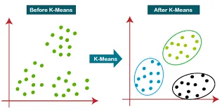
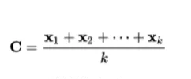
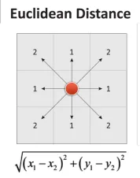
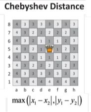
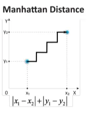
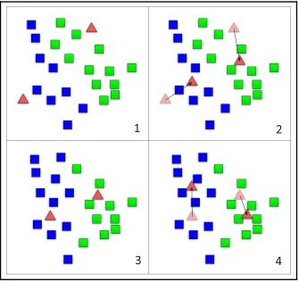
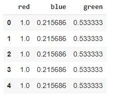
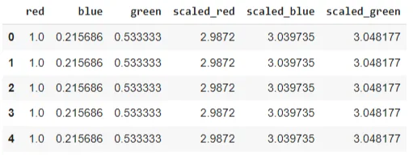
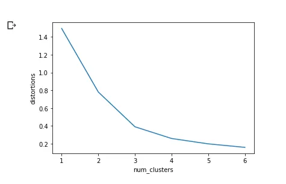
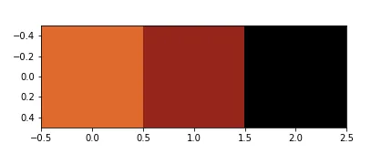

***“Everything that civilisation has to offer is a product of human intelligence; we cannot predict what we might achieve when this intelligence is magnified by the tools that AI may provide, but the eradication of war, disease, and poverty would be high on anyone’s list. Success in creating AI would be the biggest event in human history. Unfortunately, it might also be the last.”***

***~Stephen Hawking***

Humans typically tend to agglomerate everyday elements into groups of similar features. This feature of the human mind can also be replicated by an algorithm. Conversely, one of the simplest operations that can be initially applied to any unlabeled dataset is to group elements around common features.

**What is Clustering?**

Let’s say you are enjoying a hike in the mountains, you stumble upon a plant you have never seen before. You look around and you notice a few more. They are not perfectly identical, yet they are sufficiently similar for you to know that they most likely belong to the same species. You may need a botanist to tell you what species that is, but you certainly don’t need an expert to identify groups of similar looking objects. This is called ***clustering***: it is the task of identifying similar instances and assigning them to clusters, i.e., groups of similar instances. Just like in classification, each instance gets assigned to a group. However, this is an unsupervised task.

**Where can we use Clustering?**

Clustering is used in a wide variety of applications, including:

- **For customer segmentation:** you can cluster your customers based on their purchases, their activity on your website, and so on. This is useful to understand who your customers are and what they need, so you can adapt your products and marketing campaigns to each segment. For example, this can be useful in recommender systems to suggest content that other users in the same cluster enjoyed.

- **For data analysis:** when analyzing a new dataset, it is often useful to first discover clusters of similar instances, as it is often easier to analyze clusters separately.

- **As a dimensionality reduction technique:** once a dataset has been clustered, it is usually possible to measure each instance’s affinity with each cluster (affinity is any measure of how well an instance fits into a cluster). Each instance’s feature vector x can then be replaced with the vector of its cluster affinities. If there are k clusters,then this vector is k dimensional. This is typically much lower dimensional than the original feature vector, but it can preserve enough information for further processing.

- **For anomaly detection (also called outlier detection):** any instance that has a low affinity to all the clusters is likely to be an anomaly. For example, if you have clustered the users of your website based on their behavior, you can detect users with unusual behavior, such as an unusual number of requests per second, and so on. Anomaly detection is particularly useful in detecting defects in manufacturing, or for fraud detection.

- **For search engines:** for example, some search engines let you search for images that are similar to a reference image. To build such a system, you would first apply a clustering algorithm to all the images in your database: similar images would end up in the same cluster. Then when a user provides a reference image, all you need to do is to find this image’s cluster using the trained clustering model, and you can then simply return all the images from this cluster.

- **To segment an image:** by clustering pixels according to their color, then replacing each pixel’s color with the mean color of its cluster, it is possible to reduce the number of different colors in the image considerably. This technique is used in many object detection and tracking systems, as it makes it easier to detect the contour of each object. .

Clustering really depends on the context, and different algorithms will capture different kinds of clusters. For example, some algorithms look for instances centered around a particular point, called a centroid. Others look for continuous regions of densely packed instances: these clusters can take on any shape. Some algorithms are hierarchical, looking for clusters of clusters.. In this blog, we will focus on a popular clustering algorithm called: K-Means.

**-Clustering with kmeans:** The K-Means algorithm is a simple algorithm capable of clustering datasets very quickly and efficiently, often in just a few iterations.

***Finding a common center:*** The main objective of this method is to split the dataset into an arbitrary number of clusters, each of which can be represented by the mentioned centroids.

The centroid of a finite set of k points, x1 ,x2 , ..., xk in Rn , is as follows:



Now that we have defined the central metric, a question pops up: *What does it have to do with clustering? To answer this, we must first understand the concept of distance to a centroid. Distance has many definitions:*

- **Euclidean distance:** This distance metric calculates the distance in the form of a straight line between two points, or has the following formula:



- **Chebyshev distance:** This distance is equivalent to the maximum distance, along any of the axes. It's also called the chess distance, because it gives the minimum quantity of moves a king needs to get from the initial point to the final point. Its defined by the following formula:



- **Manhattan distance:** This distance is the equivalent to going from one point to another in a city, with unit squares. This L1-type distance sums the number of horizontal units advanced, and the number of vertical ones. Its formula is as follows:



***-Which distance is best for K-means?*** The distance metric chosen is the Euclidean distance, which is easy to compute and scales well to many dimensions.

We have this learning rule with the following statement: ***"A sample will be assigned to the group represented by the closest centroid."*** The goal of this method is to minimize the sum of squared distances from the cluster’s members to the actual centroid of all clusters that contain samples. This is also known as minimization of inertia.

**-Why K-means is mostly used for clustering?**

- It scales very well (most of the calculations can be run in parallel)
- It has been used in a very large range of applications

Despite that, this algorithm has also some weaknesses:

- It requires a priori knowledge (the number of possible clusters should be known beforehand)
- The outlier values can skew the values of the centroids, as they have the same weight as any other sample
- As we assume that the figure is convex and isotropic, it doesn’t work very well with non blob alike clusters.

**-So how does the algorithm work?**

Kmeans Algorithm is an Iterative algorithm that divides a group of n datasets into k subgroups /clusters based on the similarity and their mean distance from the centroid of that particular subgroup/ formed.

K, here is the pre-defined number of clusters to be formed by the Algorithm. If K=3, It means the number of clusters to be formed from the dataset is 3

**-Algorithm steps Of K Means:**

Step-1: Select the value of K, to decide the number of clusters to be formed.

Step-2: Select random K points which will act as centroids.*(subfigure1)*

Step-3: Assign each data point, based on their distance from the randomly selected points (Centroid), to the nearest/closest centroid which will form the predefined clusters.

Step-4: place a new centroid of each cluster.*(subfigure2)*

Step-5: Repeat step no.3, which reassign each datapoint to the new closest centroid of each cluster*.(subfigure3)*

Step-6: If any reassignment occurs, then go to step-4 else go to Step 7.

Step-7: FINISH



**-K-means clustering theoretical implementation:** 2 steps:

1. Generate cluster’s centers: performed using the kmean() method from scipy library: There are 5 arguments for this method.

**obs: list of scaled of observations**

**k_or_guess: number of clusters.**

**iter:number of iterations (default=20)**

**thres: threshold (default=1e-05): the algprithm is terminated if**
 **the change in distortion since the k-mean interation is less**
 **than or equal to**
 **the threshold.**

**check_finite: a boolean value indicating if a check needs to**
 **be performed ondata for the presence of infinite NaN values**
 **(default=True).**

K-means() returns 2 argument:

**cluster_center: as known as he codebook**

**distortion: the sum of square of distances between data**
 **points and cluster centers.**

1. Generate cluster labels using the vq() method from scipy library: It takes 3 arguments:

**obs: standardized list of observations.**

**code_book: the first output of the kmean() method.**

**check_finit: (optional).**

It returns 2 objects:

**cluster_labels: codebook index.**

**distortion.**

***Note that kmean() returns a single valie of distortion based on the overall data while vq() returns a list of distortion; one fpr each data point.***

***If the same list of observations is passed to both methods: the mean of the list of distortions from vq() should be approximately equal to the distortion value of kmean().***

**-How do we choose the right numbers of clusters?** In fact, there’s no absolute method to find the right number of clusters(k) in k-means clustering, but, what we can do is construct an ***elbow plot*** to decide which value of k suits the most for our clustering. The elbow plot is a line-plot between cluster’s centers and distortion:

1. Execute the K-means clustering on a given dataset for different K values (ranging from 1-10).
2. For each value of K, calculate the distortion value.
3. Plots a graph/curve between distortion values and the respective number of clusters K.
4. The sharp point of bend or a point( looking like an elbow joint ) of the plot like an arm, will be considered as the best/optimal value of K.

Note that distortion has an inverse relationship with the number of clusters: distortion decreases with the increasing number of clusters.

**-K-means clustering implementation with Python:** What if now we treat a real world case, where we have to find the dominant colors in some random images using k-means clustering?

All real world images consist of pixels, each pixel represents a dot in the image. A pixel consists of 3 values: each value is a number between 0 and 255, representing its amount of red,green and blue components. To find dominant colors, we’ll perform k-means clustering with its RGB components.

We’ll perform k-means clustering on the following image:


We can see that there is 3 dominant colors: orange, brown and black.

We start by importing the libraries we need:

```python
# Import the kmeans and vq functions
from scipy.cluster.vq import kmeans, vq, whiten
import matplotlib.image as img
import matplotlib.pyplot as plt
import seaborn as sns
import pandas as pd
```

We continue by converting the image into a matrix which contains the RGB values for each pixel:

```python
image = img.imread('/content/drive/MyDrive/Data science project/red.png')
print(image.shape)
```

```python
(1365, 2400, 4)
```

The output is M\*N\*3 matrix where M and N are the dimensions of the image

Then, we extract all the RGB values and store them in their corresponding lists:

```python
r = []
g = []
b = []
for row in image:
    for temp_r, temp_g, temp_b, temp in row:
        r.append(temp_r)
        g.append(temp_g)
        b.append(temp_b)
```

Once the list are created, they are stored into a pandas dataframe and scale the dataframe to get standardized values:

```python
pixels = pd.DataFrame({'red':r,
                       'blue': b,
                       'green':g})
pixels.head()
```



```python
# Scale wage and value
pixels['scaled_red'] = whiten(pixels['red'])
pixels['scaled_blue'] = whiten(pixels['blue'])
pixels['scaled_green'] = whiten(pixels['green'])
pixels.head()
```



Now, we need to find the number of clusters in k-means using the elbow plot method:

```python
# Create a list of distortions from the kmeans function
for i in num_clusters:
    cluster_centers, distortion = kmeans(pixels[['scaled_red','scaled_blue','scaled_green']],i)
    distortions.append(distortion)

# Create a DataFrame with two lists - num_clusters, distortions
elbow_plot = pd.DataFrame({'num_clusters': num_clusters, 'distortions': distortions})

# Creat a line plot of num_clusters and distortions
sns.lineplot(x='num_clusters', y='distortions', data = elbow_plot)
plt.xticks(num_clusters)
plt.show()
```



According the the elbow plot, we can see that the proper number of clusters is equal to 3.

The cluster centers obtained are standardized RGB values:

Standardized value = Actual value / standard deviation

The imshow() method would display the colors of cluster centers once k-means clustering is performed on the RGB values. To display the dominant colors, convert the colors of the cluster centers to their raw values and then convert them to the range of 0-1, using the following formula: converted_pixel = standardized_pixel \* pixel_std / 255

```python
colors = []

# Get standard deviations of each color
r_std,g_std,b_std = pixels[['red', 'green', 'blue']].std()

for cluster_center in cluster_centers:
    red_scaled, green_scaled, blue_scaled = cluster_center

    # Convert each standardized value to scaled value
    colors.append((
    red_scaled * r_std,
    green_scaled * g_std,
    blue_scaled * b_std
    ))

# Display colors of cluster centers
plt.imshow([colors])
plt.show()
```



Notice that the three colors resemble the three we indicated from the visual inspection.

Here, we reach the end of this blog, you can try the code with any image of your choice and see the results you get.

Have fun learning

You can find the code [Here](https://github.com/asmakrl/datacampstd/blob/main/K-means%20clustering/Dominant_Colors_in_Images.ipynb).

**References:**

Hands-On Machine Learning with Scikit-Learn and TensorFlow.

Machine Learning For Developers.

[K-means clustering simplified in python.](https://www.analyticsvidhya.com/blog/2021/04/k-means-clustering-simplified-in-python/#:~:text=Step%2D1%3A%20Select%20the%20value,will%20form%20the%20predefined%20clusters.)
