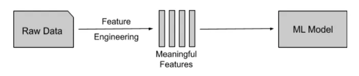

## **What is feature engineering?** Feature engineering is the process that takes raw data and transforms it into features that can be used to create a predictive model using machine learning or statistical modeling, such as deep learning.

**Different types of data?**

- Continuous
- Categorical
- Ordinal
- Boolean
- Datetime

**Get to know your data**

```python
# Import pandas
import pandas as pd
# Import Combined_DS_v10.csv into so_survey_df
so_survey_df = pd.read_csv("/content/Combined_DS_v10.csv")
# Print the first five rows of the DataFrame
print(so_survey_df.head())
# Print the data type of each column
print(so_survey_df.dtypes)
```

**Selecting specific data types**
Often a dataset will contain columns with several different data types (like the one you are working with). The majority of machine learning models require you to have a consistent data type across features. Similarly, most feature engineering techniques are applicable to only one type of data at a time. For these reasons among others, you will often want to be able to access just the columns of certain types when working with a DataFrame.

```python
# Create subset of only the numeric columns
so_numeric_df = so_survey_df.select_dtypes(include=['int',
                                'float'])
# Print the column names contained in so_survey_df_num
print(so_numeric_df.columns)
```

## **Dealing with Categorical variable** One-hot encoding and dummy variables To use categorical variables in a machine learning model, you first need to represent them in a quantitative way. The two most common approaches are to one-hot encode the variables using or to use dummy variables.

```python
# Convert the Country column to a one hot encoded Data Frame
one_hot_encoded = pd.get_dummies(so_survey_df, columns=
                                ['Country'], prefix='OH')
# Print the columns names
print(one_hot_encoded.columns)
```

```python
# Create dummy variables for the Country column
dummy = pd.get_dummies(so_survey_df, columns=['Country'],
                drop_first=True, prefix='DM')
# Print the columns names
print(dummy.columns)
```

## Dealing with uncommon categories
```python
# Create a series out of the Country column
countries = so_survey_df['Country']
# Get the counts of each category
country_counts = countries.value_counts()
# Create a mask for only categories that occur less than 10 times
mask = countries.isin(country_counts[country_counts <
                                10].index)
# Label all other categories as Other
countries[mask] = 'Other'
# Print the updated category counts
print(pd.value_counts(countries))
```

## **Numeric:Binarizing Columns** While numeric values can often be used without any feature engineering, there will be cases when some form of manipulation can be useful

```python
so_survey_df["ConvertedSalary"].fillna(0, inplace=True)
# Create the Paid_Job column filled with zeros
so_survey_df['Paid_Job'] = 0
# Replace all the Paid_Job values where ConvertedSalary is > 0
so_survey_df.loc[so_survey_df['ConvertedSalary'] > 0,
  'Paid_Job'] = 1
# Print the first five rows of the columns
print(so_survey_df[['Paid_Job', 'ConvertedSalary']].head())
```

**Binning values**
For many continuous values you will care less about the exact value of a numeric column, but instead care about the bucket it falls into.

```python
# Bin the continuous variable ConvertedSalary into 5 bins
so_survey_df['equal_binned'] =
                pd.cut(so_survey_df['ConvertedSalary'], 5)
# Print the first 5 rows of the equal_binned column
print(so_survey_df[['equal_binned',
                                 'ConvertedSalary']].head())
```

```python
# Bin the ConvertedSalary column using the boundaries in the list bins and label the bins using labels
# Import numpy
import numpy as np
# Specify the boundaries of the bins
bins = [-np.inf, 10000, 50000, 100000, 150000, np.inf]
# Bin labelslabels = ['Very low', 'Low', 'Medium', 'High', 'Very high']
# Bin the continuous variable ConvertedSalary using these boundaries
so_survey_df['boundary_binned'] =
   pd.cut(so_survey_df['ConvertedSalary'], bins=bins,
    labels=labels)
# Print the first 5 rows of the boundary_binned column
print(so_survey_df[['boundary_binned',
                                'ConvertedSalary']].head())
```

[GitHub Link](https://github.com/abubinfahd/Data-Insight/blob/main/Assignments/Machine_Learning_Feature_Creation_%26_Extraction_in_Python.ipynb)
