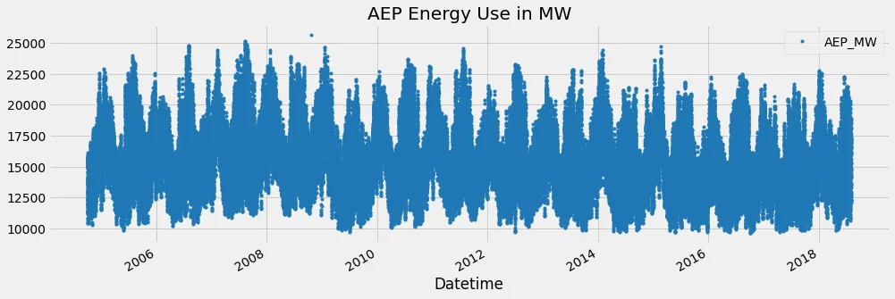
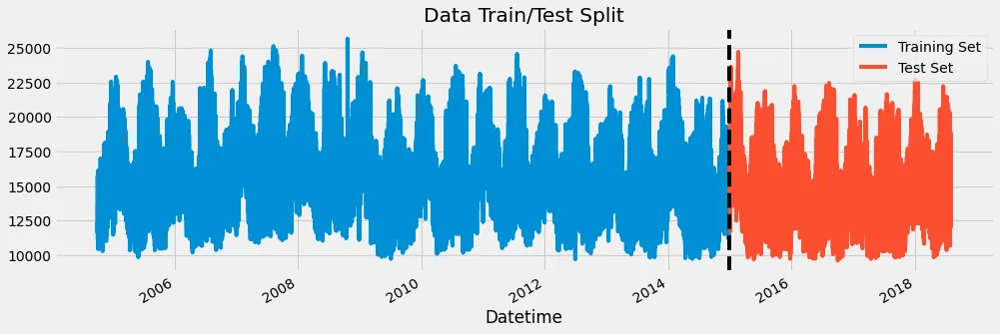
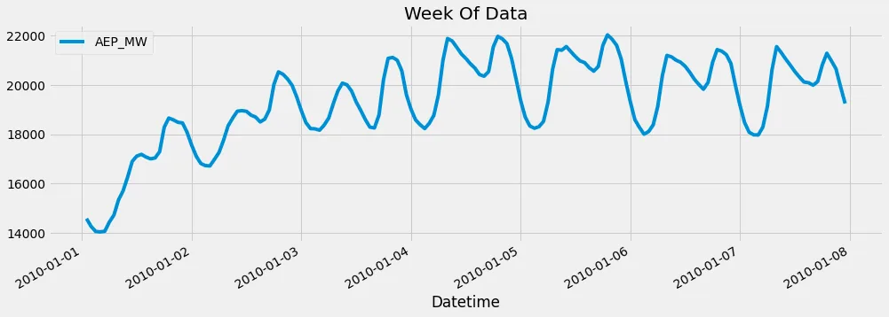
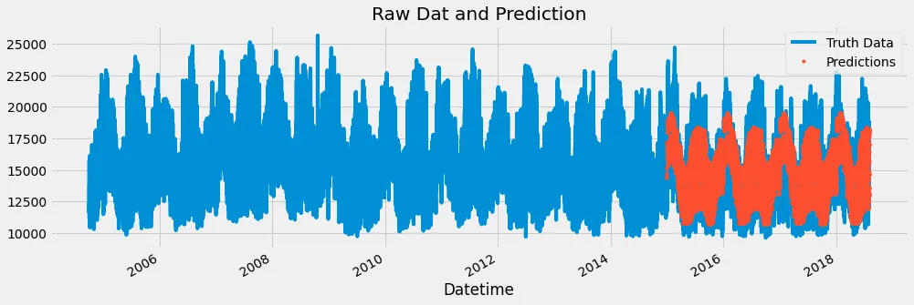

Time series data refers to data that changes over time. They are usually indexed in time order. It can take forms like the atmospheric concentration of carbon dioxide over time, the waveform of the human voice, the fluctuation of the stock value over the year, or demographic information about a city. Time series data consist of 2 things:

1. An array of numbers that represent the data itself.
2. Another array that contains a timestamp for each data point.

The machine learning pipeline to be utilized in this blog for machine learning for time series data includes:

1. Feature extraction/engineering: It is the process of selecting, manipulating, and transforming raw data into features that can be used in supervised learning.
2. Model fitting
3. Prediction and validation

In this blog, we will be using machine learning to forecast Energy Consumption which involves the use of time series data. The dataset is the American Electric Power.

```python
#Importing libraries with their right aliases.
import pandas as pd
import numpy as np
import matplotlib.pyplot as plt
import seaborn as sns

import xgboost as xgb
from sklearn.metrics import mean_squared_error

#Uploading file from local to google colab
from google.colab import files
files.upload()

#Setting color pattern and color style
color_pal = sns.color_palette()
plt.style.use('fivethirtyeight')

#Reading file as pandas dataframe and setting Datetime column as index
df = pd.read_csv('/content/AEP_hourly.csv')
df = df.set_index('Datetime')
df.index = pd.to_datetime(df.index)

#Plotting the dataset
df.plot(style='.',
        figsize=(15, 5),
        color=color_pal[0],
        title='AEP Energy Use in MW')
plt.show()

#splitting data into train set and test set
train = df.loc[df.index < '01-01-2015']
test = df.loc[df.index >= '01-01-2015']

fig, ax = plt.subplots(figsize=(15, 5))
train.plot(ax=ax, label='Training Set', title='Data Train/Test Split')
test.plot(ax=ax, label='Test Set')
ax.axvline('01-01-2015', color='black', ls='--')
ax.legend(['Training Set', 'Test Set'])
plt.show()

#Visualizing one week data from 1st January 2010 to 8th January, 2010
df.loc[(df.index > '01-01-2010') & (df.index < '01-08-2010')] \
    .plot(figsize=(15, 5), title='Week Of Data')
plt.show()

#Feature Engineering
def create_features(df):
    """
    Create time series features based on time series index.
    """
    df = df.copy()
    df['hour'] = df.index.hour
    df['dayofweek'] = df.index.dayofweek
    df['quarter'] = df.index.quarter
    df['month'] = df.index.month
    df['year'] = df.index.year
    df['dayofyear'] = df.index.dayofyear
    df['dayofmonth'] = df.index.day
    df['weekofyear'] = df.index.isocalendar().week
    return df

df = create_features(df)

#Splitting datasets in X and y
train = create_features(train)
test = create_features(test)

FEATURES = ['dayofyear', 'hour', 'dayofweek', 'quarter', 'month', 'year']
TARGET = 'AEP_MW'

X_train = train[FEATURES]
y_train = train[TARGET]

X_test = test[FEATURES]
y_test = test[TARGET]

#Creating the model
reg = xgb.XGBRegressor(base_score=0.5, booster='gbtree',
                       n_estimators=1000,
                       early_stopping_rounds=50,
                       objective='reg:linear',
                       max_depth=3,
                       learning_rate=0.01)
reg.fit(X_train, y_train,
        eval_set=[(X_train, y_train), (X_test, y_test)],
        verbose=100)

#Plot showing predicted values and raw values
test['prediction'] = reg.predict(X_test)
df = df.merge(test[['prediction']], how='left', left_index=True, right_index=True)
ax = df[['AEP_MW']].plot(figsize=(15, 5))
df['prediction'].plot(ax=ax, style='.')
plt.legend(['Truth Data', 'Predictions'])
ax.set_title('Raw Dat and Prediction')
plt.show()

#Scoring the model
score = np.sqrt(mean_squared_error(test['AEP_MW'], test['prediction']))
print(f'RMSE Score on Test set: {score:0.2f}')
```

**Outputs:**

Plot of the dataset.



Plot of train and test dataset



Plot of week data from 1st January, 2010 to 8th January, 2010



Plot of raw data and predicted data using test dataset



RMSE Score on Test set: 1656.83

Github Link to Notebook: <https://github.com/Jegge2003/TimeSeries>
