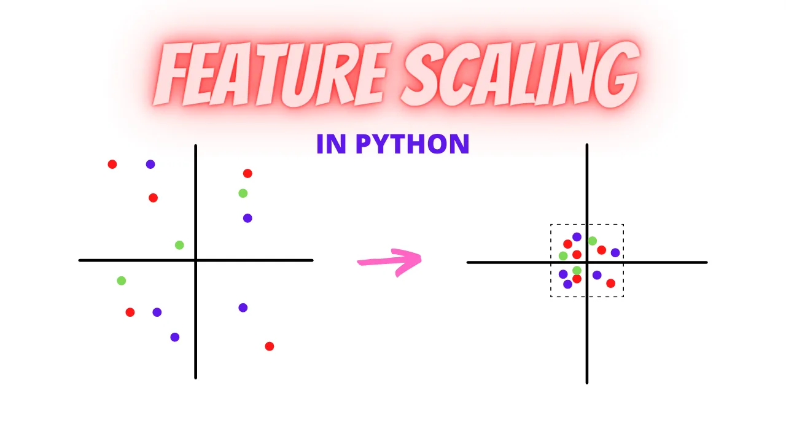
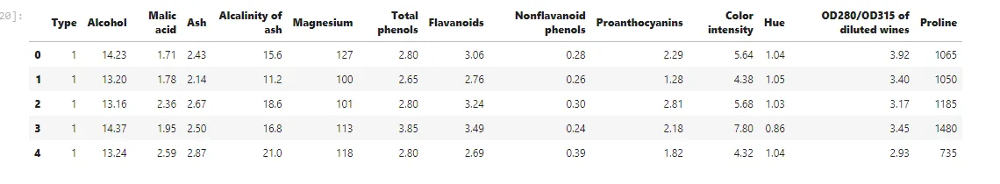
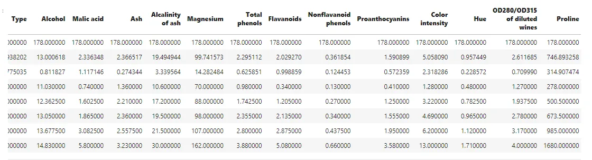

**Standardization is a preprocessing method used to transform continuous data to make it look normally distributed. It's a necessary step because many models assume that the data you are training on is normally distributed and if it isn't, the risk of bias model.**
Example:

- Log Normalization
- Scaling

**When to use Standardize?**

- Standardization is useful when your data has varying scales and the algorithm you are using does make assumptions about your data having a Gaussian distribution, such as linear regression, logistic regression, and linear discriminant analysis.
- Dataset feature are continous and different scale
- Suppose a dataset contains height and weight features.In order to compare these features, they must be in the same

```python
# import necessary library
import pandas as pd
import numpy as np
import matplotlib.pyplot as plt
%matplotlib inline
```

```python
# Load dataset
df = pd.read_csv("/content/wine_types.csv")df.head()
```



```python
df.info()
```

```python
df.describe()
```



**Proline** has an extremely high variance compared to the other columns. This is an example of where a technique like a log normalization would come in handy.

```python
# create feature and target
X = df.drop("Type", axis = 1)
y = df['Type']
```

## Unscaled KNeighborsClassifier
```python
from sklearn.model_selection import cross_val_score,
                                train_test_split
from sklearn.neighbors import KNeighborsClassifier

# Split the dataset and labels into training and test sets
X_train, X_test, y_train, y_test = train_test_split(X, y)

# Model
knn = KNeighborsClassifier()

# Fit the k-nearest neighbors model to the training data
knn.fit(X_train, y_train)

# Score the model on the test data
print(knn.score(X_test, y_test))

0.71
```

## Log Normalization
Log normalization is a method for standardizing your data that can be useful when you have a particular column with high variance. As you saw in the previous section's exercise, training a k-nearest neighbors classifier on that subset of the wine dataset didn't get a very high accuracy score.

```python
# Print out the variance of the Proline column
print(df['Proline'].var())

# Apply the log normalization function to the Proline column
df['Proline_log'] = np.log(df['Proline'])

# Check the variance of the normalized Proline column
print(df['Proline_log'].var())

99166.71735542436         0.17231366191842012
```

See the change of variance!!!

## Scaling
**What is Feature Scaling?**

Scaling is a method of Standardization that's most useful when you're working with a dataset that contains continuous features that are on different scales.

Feature Scaling transforms a dataset with mean 0 variances 1. Transform approximately normal distribution.
Now we are only showing **StandardScaling**

## Scaled KNeighborsClassifier
```python
# Import StandardScaler from scikit-learnfrom sklearn.preprocessing import StandardScaler

# Create the scaling method.
ss = StandardScaler()

# Apply the scaling method to the dataset used for modeling.
# In scikit-learn, running fit_transform during preprocessing will both fit the method to the data as well as transform the data in a single step.
X_scaled = ss.fit_transform(X)
X_train, X_test, y_train, y_test = train_test_split(X_scaled, y)

# Fit the k-nearest neighbors model to the training data.
knn.fit(X_train, y_train)

# Score the model on the test data.
print(knn.score(X_test, y_test))
```

```python
0.9555555555555556
```

**Unscaled accuracy is 0.71**

**Scaled accuracy is 0.95**

**A huge difference!!!**

[**GitHub Link**](https://github.com/abubinfahd/Data-Insight/blob/main/Assignments/Preprocessing_for_Machine_Learning_Scaling.ipynb)

Dataset: Wine Types
