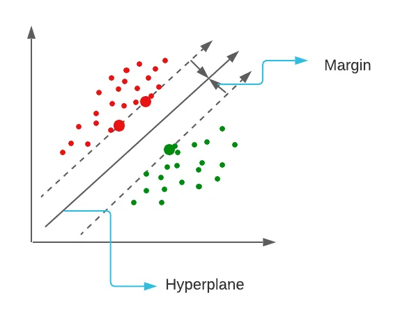
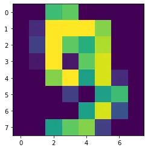
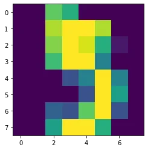

## 01. What is SVM(Support Vector Machine)?
In machine learning, support-vector machines are supervised learning models with associated learning algorithms that analyze data for classification and regression analysis.
SVM is a discriminative classifier that is formally designed by a separative hyperplane. It is a representation of examples as points in space that are mapped so that the points of different categories are separated by a gap as wide as possible.

**The distance between the nearest point is called a Margin. Support vectors are data points that are closer to the hyperplane and influence the position and orientation of the hyperplane. Here the bigger red and green dots are support vectors.**

## How does SVM work?
SVM works by mapping data to a high-dimensional feature space so that data points can be categorized, even when the data are not otherwise linearly separable. A separator between the categories is found, then the data are transformed in such a way that the separator could be drawn as a hyperplane.
The goal of SVM is to divide the datasets into classes to find a maximum marginal hyperplane (MMH). Support Vectors − Datapoints that are closest to the hyperplane are called support vectors. A separating line will be defined with the help of these data points.

## **02. SVM Kernel** The function of kernel is to take data as input and transform it into the required form. Different SVM algorithms use different types of kernel functions. These functions can be different types. For example linear, nonlinear, polynomial, radial basis function (RBF), and sigmoid.

**What is the purpose of kernel in SVM?**
A kernel is a function used in SVM for helping to solve problems. They provide shortcuts to avoid complex calculations. **The amazing thing about kernel is that we can go to higher dimensions and perform smooth calculations with the help of it**. We can go up to an infinite number of dimensions using kernels.

## 03. SVM use cases
- Face detection
- Text categorize
- Classification of image
- Bioinformatics
- Remote homology detection

## 04. How to implement SVM?
- Loading the data
- Exploring the data
- Splitting data
- Generating the model
- Model evaluation

## Character Recognition using SVM
```python
import matplotlib.pyplot as plt
from sklearn import datasets
from sklearn import svm
from sklearn import metrics

# Load datadigits = datasets.load_digits()

# explore dataprint(digits.data)print("\n")print(digits.target)
```

```python
X = digits.data
y = digits.target

# spliting dataset
from sklearn.model_selection import train_test_split
X_train, X_test, y_train, y_test = train_test_split(X, y,
                                random_state=42)

# modelclf = svm.SVC(gamma=0.001, C=100)
clf.fit(X_train, y_train)
y_pred = clf.predict(X_test)
clf.score(X_test, y_test)

# result
0.991111111111111
```

The accuracy is very high!

**Show the number 9**

```python
print(clf.predict(X))
plt.imshow(digits.images[9], interpolation="nearest")
plt.show()
```



**Show the number 5**

```python
plt.imshow(digits.images[5], interpolation="nearest")
plt.show()
```



[GitHub Link](https://github.com/abubinfahd/Data-Insight/blob/main/Assignments/Machine_Learning_Support_Vector_Machine(SVM).ipynb)

[Support Vector Machine](http://scikit-learn.org/stable/modules/svm.html)
