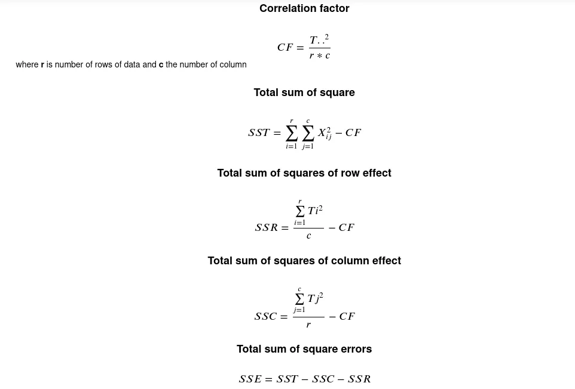
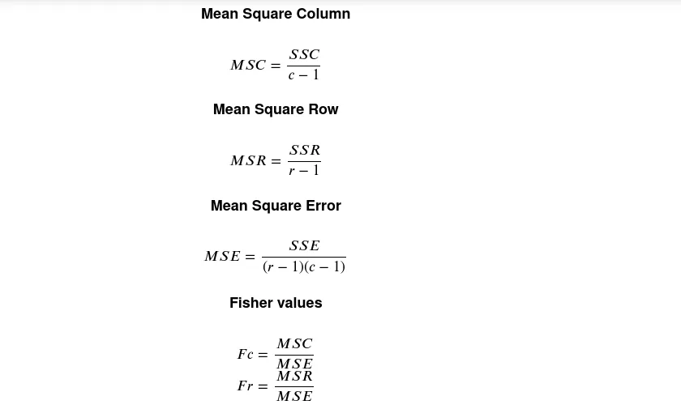
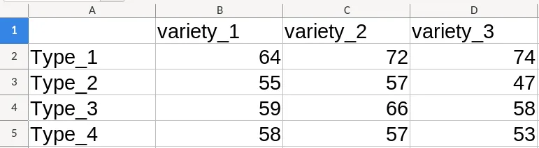

In the area of hypothesis testing, we have one parametric test called **ANOVA (Analysis Of Variance)**  which have three variants depends on data:

- **One Way ANOVA**
- **Two Way ANOVA**
- **Two Way ANOVA with replication**

Each of these tests is used in dedicated condition. His assumption are:

- Normally distributed data
- Equality of variance between data

To perform it well, we generally have five step to follow:

- **Step 1:** Hypothesis formulation
- **Step 2:** Choice of probability law
- **Step 3:** Compute observation values or reference values
- **Step 4:** Determine the critical values
- **Step 5:** Make conclusion

In this post, we'll use [Pandas](https://fr.wikipedia.org/wiki/Pandas) to compute **ANOVA Two Way** parameter in **step 3**. We will make a demonstration on the following data representing the yields of three varieties of maize using four different kinds of fertilizers. We want to test whether the variation in yields is caused by the different varieties of maize, different kinds of fertilizers or differences in both.

|  |  |  |  |
| --- | --- | --- | --- |
| ​ | **Variety_1** | **Variety_2** | **Variety_3** |
| **Type_1** | 64 | 72 | 74 |
| **Type_2** | 55 | 57 | 47 |
| **Type_3** | 59 | 66 | 58 |
| **Type_4** | 58 | 57 | 53 |

Before going further, let's remember the formula:





Now, we can start write our python code to solve our problem.

## 1. Correlation factor
Before calculating the correlation factor, let's compute first the sum of the column and the sum of the row, and finally the total of all our data.

**NB: The following manipulation supposes we already load our data and put it in a variable called "data".**

|  |  |  |  |  |
| --- | --- | --- | --- | --- |
| ​ | **​Variety_1** | **​Variety_2** | **​Variety_3** | **Ti.** |
| **Type_1** | 64 | 72 | 74 | **210** |
| **Type_2** | 55 | 57 | 47 | **159** |
| **Type_3** | 59 | 66 | 58 | **183** |
| **Type_4** | 58 | 57 | 53 | **168** |
| **T.j** | **236** | **252** | **232** | 720 |

#### 1.1.Sum of column

```python
  variety_sum = data.sum()
```

Output:

```python
variety_1    236
variety_2    252
variety_3    232
dtype: int64
```

The method ***sum***  is used to return the sum of pandas Series/DataFrame over the y-axis.

#### 1.2.Sum of row
```python
type_sum = data.sum(axis=True)
```

Output:

```python
Type_1    210
Type_2    159
Type_3    183
Type_4    168
dtype: int64
```

The method ***sum(axis=True)*** in this case return the sum of pandas series/dataframe over the x-axis

With the ***type_sum*** *and* ***variety_sum,*** we can now compute the correlation factor:

#### 1.3. Sum of all data
As we have the sum of rows and sum of the column, it's now easy for us to calculate the total of data.

```python
type_sum.sum() or variety_sum.sum()
```

**Output:**

```python
720
```

As **type_sum and variety_sum**  are vectors, call pandas **sum** function on their return a single value represents the summation of the element.

#### 1.4. Number of column and rows of data

we need to store the number of rows and columns of our data to use them on our following computation. These values will be extract from pandas **shape** function.

```python
 #Number of rows of data
 nbre_row = data.shape[0]
 #Number of column of data
 nbre_column = data.shape[1]
```

#### 1.5.Correlation factor

To calculate it, we just need to apply the formula.

```python
correlation_factor = type_sum.sum()**2/(nbre_column*nbre_row)
```

## 2.Total sum of square
```python
  sst = (data**2).sum().sum() - correlation_factor
```

The expression ***data\*\*2***  is used to put each value in data at square, ***(data\*\*2).sum()***  calculate the sum of all values over y-axis (the column) and ***(data\*\*2).sum().sum()*** return the total of summation of all data.

## 3. Complete code
```python
def compute_anova_parameter(data):
    # Compute the sum of all data in column
    variety_sum = data.sum()
    #compute the sum of all data in row
    type_sum = data.sum(axis=True)

    #NUmber of ligne of data
    nbre_row = data.shape[0]
    #Number of column of data
    nbre_column = data.shape[1]

    #Correlation Factor
    correlation_factor = type_sum.sum()**2/(nbre_column*nbre_row)

    # Total sum of square
    sst = (data**2).sum().sum() - correlation_factor

    # Total sum of square of row effect
    ssr = (type_sum**2).sum()/nbre_column - correlation_factor

    # Total sum of squares of column effect
    ssc = (variety_sum**2).sum()/nbre_row - correlation_factor

    # Sum square Error
    sse = sst-ssc-ssr

    # Mean Square Column
    msc = ssc/(nbre_column-1)

    # Mean square Row
    msr = ssr/(nbre_row-1)

    #Mean Square Error
    mse = sse/((nbre_column-1)*(nbre_row-1))

    # Calculation of Fisher parameter
    Fc = round(msc/mse,3)
    Fr = round(msr/mse,3)
    return {"Fc":Fc, "Fr":Fr}
```

## 4. Testing
We have our in excel format as follow:



we can load and use it.

```python
import pandas as pd
data = pd.read_excel('fertlizer.xlsx', index_col=0)
print(compute_anova_parameter(data))

output : {'Fc': 1.556, 'Fr': 9.222}
```

You can add more data in the excel file as you want and the program will compute it. The final values will be used in **step 5** to make a conclusion of hypothesis testing

[Source code](https://github.com/tderick/email-spliter/blob/main/ANOVA%20TWO%20WAY.ipynb)

[Download dataset](https://github.com/tderick/email-spliter/blob/main/fertlizer.xlsx)
