View this article as a [Jupyter Notebook.](https://github.com/HebaElwazzan/pandas-techniques/blob/main/Pandas%20Techniques%20for%20Data%20Manipulation.ipynb)

Pandas, which stands for Python Data Analysis Library, is a python library used primarily by data scientists to, well, analyse data and manipulate it. In this tutorial we will be examining some techniques you can apply with pandas for effective data exploratory analysis. For this demonstration we will be using data imported from [kaggle](https://www.kaggle.com/darinhawley/imdb-films-by-actor-for-10k-actors) which shows IMDB data on 10,000 actors.

## 1. Examining the dataset structure

When I first start exploring a dataset, I like to first determine its shape, and by shape I mean how big it is, the columns it contains, the type of data it has, and peek a look at a sample of the data, just to know what I'm working with. For this, I present to you a variety of handy Pandas methods you can use to carry out this preparatory step.

First things first, let's import pandas and our dataset.

```python
import pandas as pd
```

We will import our dataset, which is saved as a comma-separated values (csv) file. For this, python has a function called read_csv() that can do this for us. We will pass the file's name, as well as the encoding. The encoding is by default utf8 so we didn't need to add it in this case. However, it is good practice to check your data's encoding, using a text editor such as Notepad++ for example, to ensure your data is read correctly. You can check out different file encodings that python supports in their [documentation](https://docs.python.org/3/library/codecs.html#standard-encodings).

```python
df = pd.read_csv("actorfilms.csv", encoding="utf8")
```

The first method I always like to start with is head(). It is a very useful method that displays the first 5 records by default, and you can pass in a parameter if you would like to see more rows.

```python
df.head()
```

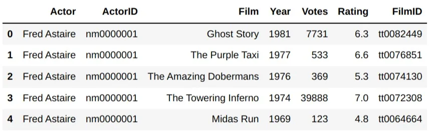

Its counterpart, tail() is used to display the last 5 records, and works in the same way but isn't used as often.

```python
df.tail(10)
```

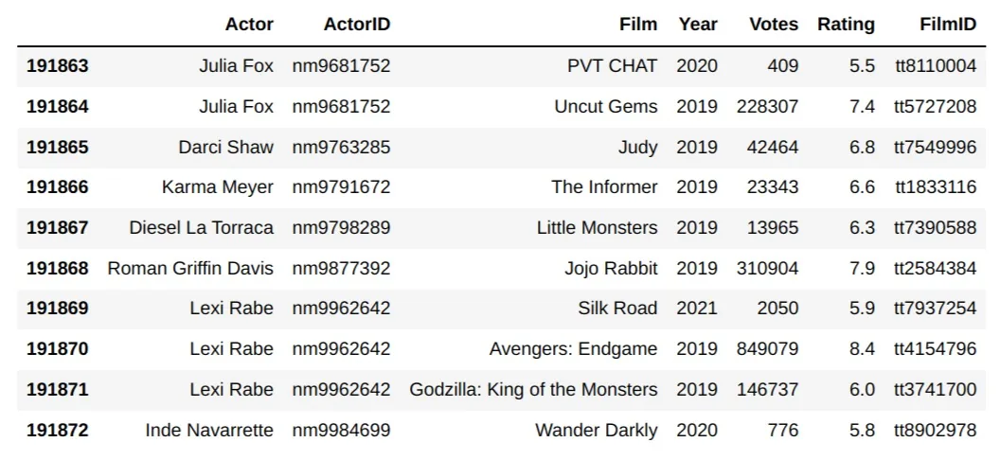

For the next step I would like to examine the columns I have. How many columns are there? What are their data types? Are they all full or are there some null values?

To simply take a look at the column names, use the attribute columns of your imported data set.

```python
df.columns
```

Output:

Index(['Actor', 'ActorID', 'Film', 'Year', 'Votes', 'Rating', 'FilmID'], dtype='object')

For more detailed information use the info() method.

```python
df.info()
```

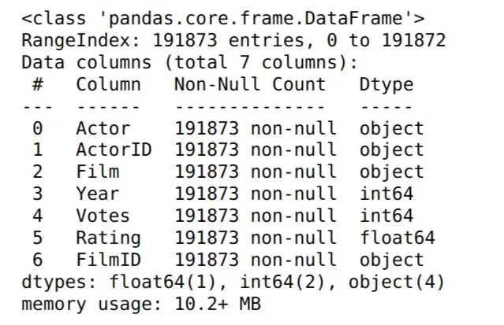

As you can see, this method tells you how many entries you have in total, the names of each column and its datatype, as well as the number of entries for each column. This is extremely useful if you are still determining how to clean your data, if there are any significant missing values, and if there are columns that are in the wrong data type. Note that the object datatype usually means that the data is string.

Lastly, you may want to take a quick look over the numerical data before carrying out any in-depth analysis. The describe() method can help. It displays data aggregations for any numerical columns such as the mean and standard deviation as well as the quartiles and minimum and maximum values. The count is the sum of all the values in the given column.

```python
df.describe()
```

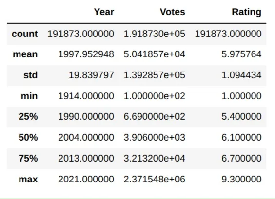

## 2. Data Indexing

When manipulating your data, you will definitely need a way to specify which rows and columns you wish to interact with. Pandas provide multiple ways to do this. For example, to select a particular column, you'll simply call your dataframe followed by the [] operator containing the name of the column you want, much like retrieving values from a list or a dictionary.

```python
df['Actor']
```

Output:

0 Fred Astaire
1 Fred Astaire
2 Fred Astaire
3 Fred Astaire
4 Fred Astaire
 ...
191868 Roman Griffin Davis
191869 Lexi Rabe
191870 Lexi Rabe
191871 Lexi Rabe
191872 Inde Navarrette
Name: Actor, Length: 191873, dtype: object

This retrieved all the values in a particular column. If the column name has no spaces, you can consider it an attribute and call it like one. This is why it is always good practice to use camel case or hyphens when naming your dataframe columns.

```python
df.ActorID
```

Output:

0 nm0000001
1 nm0000001
2 nm0000001
3 nm0000001
4 nm0000001
 ...
191868 nm9877392
191869 nm9962642
191870 nm9962642
191871 nm9962642
191872 nm9984699
Name: ActorID, Length: 191873, dtype: object

If you want to select multiple columns at once, pass in a list inside the [] operator. This means that you will use two of them.

```python
df[['Actor', 'Film']]
```

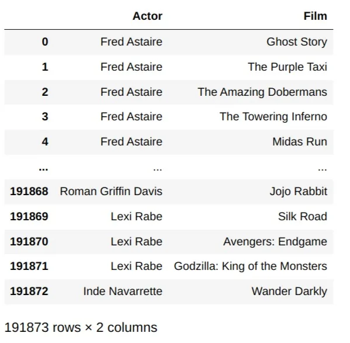

Choosing a column is usually a small step when doing a more complicated query, such as specifying values whose particular column have a particular value. For example, suppose we want to choose all actors who were in the film "Avengers: Endgame". We can do the following:

```python
df[df['Film'] == 'Avengers: Endgame'].Actor
```

Output:

5695 Michael Douglas
7108 Samuel L. Jackson
8634 Michelle Pfeiffer
8731 Natalie Portman
12143 Angela Bassett
 ...
187846 Tom Holland
189237 Carrie Coon
191063 Winston Duke
191722 Jacob Batalon
191870 Lexi Rabe
Name: Actor, Length: 68, dtype: object

Neat! Now this is for choosing columns; how about choosing rows? Pandas has two methods for this: loc[] and iloc[]. Unlike normal functions or methods, these use the [] operator to indicate they are used for indexing. The difference between them is that loc is used to find a row with its string index if it exists, while iloc is used to find it with a regular numeric index. In our dataframe, we didn't specify any columns as the index, so we should use iloc.

```python
df.iloc[4:20]
```

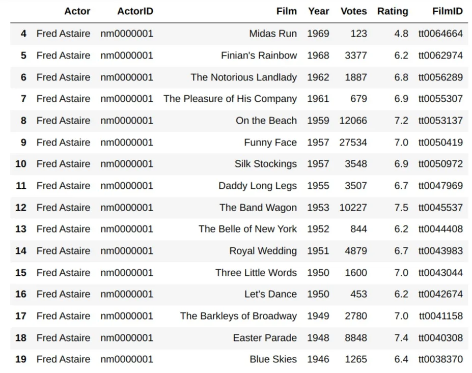

When we use the num1:num2 syntax, we mean from num1 inclusive, to num2 non-inclusive.

Now suppose we set the index to the columns Actor and Film.

```python
df_indexed = df.set_index(['Actor', 'Film'])
df_indexed.head()
```

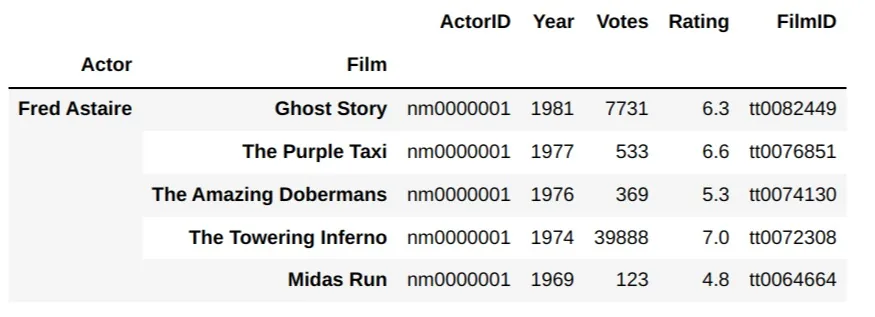

Note that Actor and Film are no longer treated as columns.

```python
df_indexed.columns
```

Output:
Index(['ActorID', 'Year', 'Votes', 'Rating', 'FilmID'], dtype='object')

Now we can also use loc[] to find rows with a particular index value. We can still use iloc as usual as well.

```python
df_indexed.loc[('Tom Holland', 'Avengers: Endgame')]
```

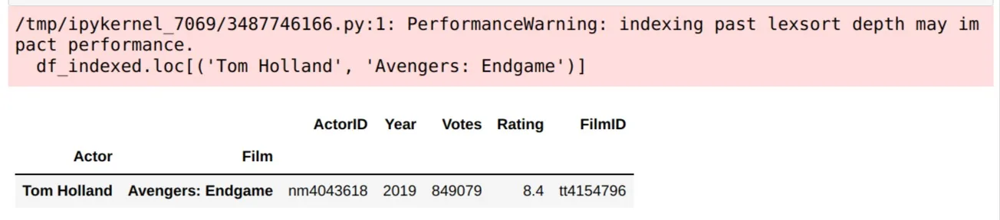

Note that for multi-indexing, you need to pass the index as a tuple. You may also notice that you were given a PerformanceWarning. The reason for this is that the index is unsorted. A quick fix would be to use the sort_index() method.

```python
df_indexed.sort_index(inplace=True)
df_indexed.loc[('Benedict Cumberbatch', 'Doctor Strange')]
```

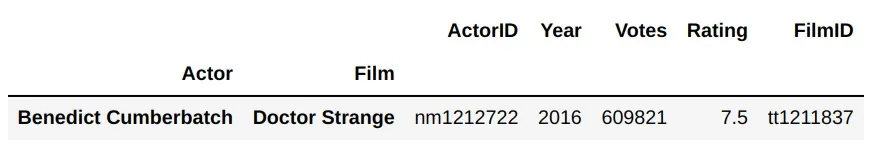

This brings us to our next topic, sorting in Pandas.

## 3. Sorting DataFrames
Similar to sort_index(), sort_values() sorts the dataframe according to a particular column that isn't necessarily an index.

```python
df.sort_values(by='Year')
```

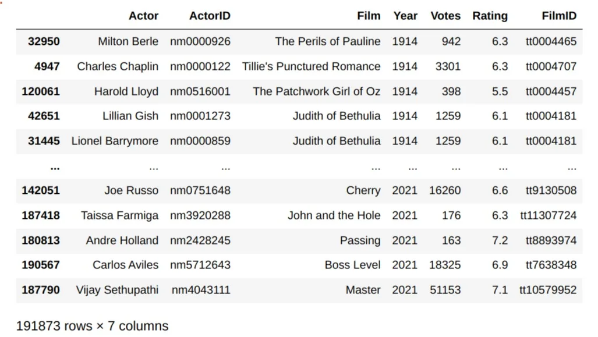

If you want to specify multiple criteria for the sorting, simply pass a list to the by parameter. You can also sort in descending order.

```python
df.sort_values(by=['Year', 'Votes', 'Rating'], ascending=False)
```

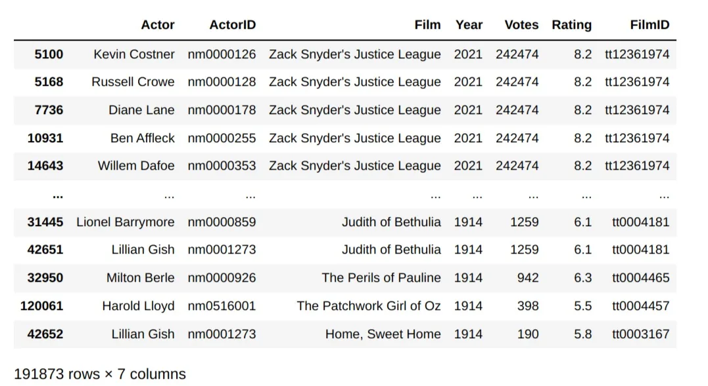

## 4. Grouping in Pandas

Often, we will need to aggregate our data based off some criteria. For example, we may need to find the average ratings of movies by a particular actor. For this, Pandas provides a useful method, groupby().

```python
df.groupby('Actor')[['Actor', 'Rating']].mean().sort_values('Rating', ascending=False)
```

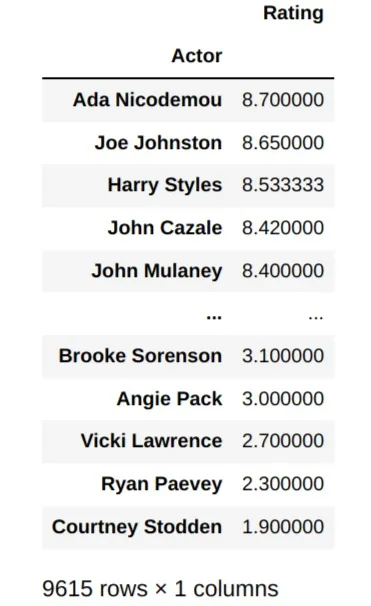

There are multiple things happening in that last line. First we called the groupby method to group our dataframe by actors. Then we selected two columns: Actor and Rating. Then we applied an aggreagate method, mean() and then we sorted our values according to the highest average ratings.

## 5. DataFrame.apply()
We talked a lot about applying aggregation functions such as sum and mean to our data, but what if we want to apply some sort of custom method to our dataset row by row? In that case, we can use the apply() method, which we can pass our custom function to. We can predefine our function, or more commonly, pass in an anonymous function written using a lambda expression.

```python
import numpy as np
df[:10000].apply(np.sum)['Votes']
```

Output:

624132174

This applies a numpy method, sum, to add the first 10,000 rows of votes.

```python
df[:5].apply(lambda row: row * 2)
```

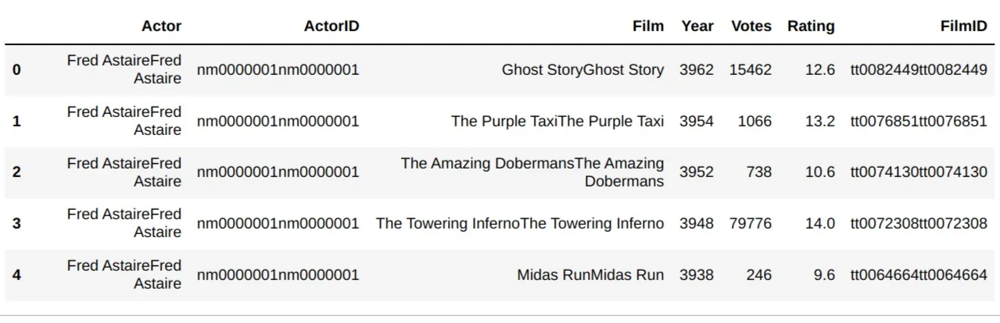

This line went over every value for the rows from 0 to 4 and multiplied the value inside by 2. For string values this meant repeating the string and concatenating it to itself. For numerical values, each value was multiplied by 2. It's not a very useful function in this case but it can be in other situations.

In this tutorial, we examined mutliple useful Pandas techniques that can aid you manipulate your data effectively with just a couple of lines of code.
