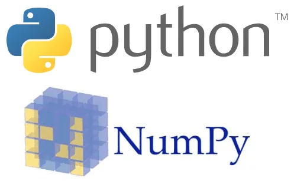

NumPy supports the creation and manipulation of multidimensional arrays. NumPy arrays are fast, easy to understand, they occupy little memory and its indexing of arrays is very fast. NumPy also facilitates calculations on its arrays and many other things... it is an essential library to master for a data scientist.

we will walk through some array manipulation features through the following methods:

- Concatenate

-hstack

- vstack

- Reshape

- Squeeze

-Ravel

First, let's start by importing our library:

```python
 import numpy as np
```

then let's create tables, it is done this way

```python
B = np.ones((4,3))
```

**np.ones**((4,3)) means that we want to create an array containing 1s of dimension passed as parameters(4,3)

display:

```python
print(B)
```

```python
[[1. 1. 1.]
 [1. 1. 1.]
 [1. 1. 1.]
 [1. 1. 1.]]
```

let's use **shape** to display the dimension of each die.

```python
print(B.shape)
```

```python
(4, 3)
```

```python
A = np.zeros((4,3))
```

**np.zeros**((4,3)) means that we want to create an array containing 0s of dimension passed as parameters(4,3)

display:

```python
print(A)
```

```python
[[0. 0. 0.]
 [0. 0. 0.]
 [0. 0. 0.]
 [0. 0. 0.]]
```

let's use **shape** to display the dimension of each die.

```python
print(A.shape)
```

```python
(4, 3)
```

it's already done, we start with the **Concatenate()** function

concatenate takes input two arrays and returns you an array

```python
e = np.concatenate((A,B) , axis = 0)
```

display:

```python
print(e)
```

```python
[[0. 0. 0.]
 [0. 0. 0.]
 [0. 0. 0.]
 [0. 0. 0.]
 [1. 1. 1.]
 [1. 1. 1.]
 [1. 1. 1.]
 [1. 1. 1.]]
```

```python
e.shape
```

```python
(8, 3)
```

so if you want to assemble two arrays it is ideal, it also lets you choose the assembly in the axis you want example **axis = 0** to assemble along the vertical and **axis = 1** to assemble along the horizontal donations if you have an array of dimension 3 or 4 you can make a concatenation according to your chosen axis.

```python
e = np.concatenate((A,B) , axis = 1)
```

display:

```python
print(e)
```

```python
[[0. 0. 0. 1. 1. 1.]
 [0. 0. 0. 1. 1. 1.]
 [0. 0. 0. 1. 1. 1.]
 [0. 0. 0. 1. 1. 1.]]
```

```python
print(e.shape)
```

```python
(4, 6)
```

you have seen how concatenate works now let's move on to the

**hstack() and vstack()** functions they are very useful for data analysis

hstack (): allows the assembly of two tables along the horizontal axis, yes h for horizontal

example:

```python
 c = np.hstack((A,B))
```

display:

```python
print(c)
```

```python
[[0. 0. 0. 1. 1. 1.]
 [0. 0. 0. 1. 1. 1.]
 [0. 0. 0. 1. 1. 1.]
 [0. 0. 0. 1. 1. 1.]]
```

vtack (): allows assembly along the vertical axis, v for vertical

example:

```python
d = np.vstack((A,B))
```

display:

```python
print(d)
```

```python
[[0. 0. 0.]
 [0. 0. 0.]
 [0. 0. 0.]
 [0. 0. 0.]
 [1. 1. 1.]
 [1. 1. 1.]
 [1. 1. 1.]
 [1. 1. 1.]]
```

**reshape**

it allows to remanipulate the form of an array to give it a new form, extremely important, be careful however this method only works if the number of elements present in the initial form is equal to the number of elements in the final form

example:

```python
print(e.shape)
```

```python
(4, 6)
```

let's check the number of elements present:

```python
print(f.size)
```

```python
24
```

apply :

resize f of dimension (4, 6)to a new one of dimension (6,4)

```python
ff = f.reshape( 6,4)
```

```python
print(ff.shape)
```

```python
(6, 4)
```

**Squeeze**

it has the effect of making disappear the dimensions in which we have only 1

example :

```python
     d = np.ones((3,1))
```

take a matrix of dimension (3,1) apply this function on it we obtain as result

```python
d.squeeze()
```

we have :

```python
array([1., 1., 1.])
```

```python
d.squeeze().shape
```

```python
(3,)
```

**Ravel**

it flattens an array into a single dimension

example:

```python
print(f)
```

display:

```python
[[0. 0. 0. 1. 1. 1.]
 [0. 0. 0. 1. 1. 1.]
 [0. 0. 0. 1. 1. 1.]
 [0. 0. 0. 1. 1. 1.]]
```

```python
f.ravel()
```

we obtain:

```python
array([0., 0., 0., 1., 1., 1., 0., 0., 0., 1., 1., 1., 0., 0., 0., 1., 1.,
       1., 0., 0., 0., 1., 1., 1.])
```

here you have the [notebook](https://github.com/Tchoutcha/Data-insight-sandjong/blob/main/conceptsPython.ipynb)
