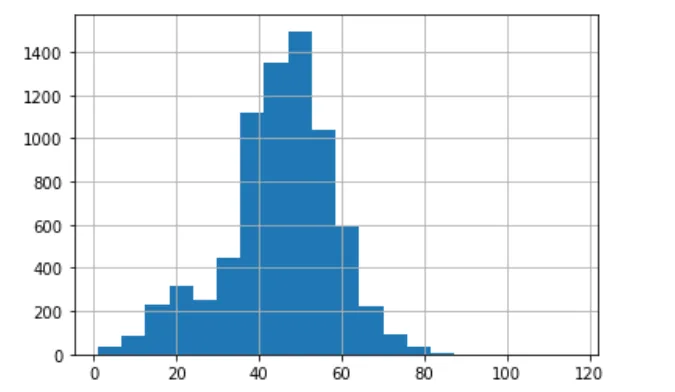

## Introduction

We may have different data sources and data types to work on and python has a functionality to process and read these types of data for further analysis and use. Two of the key things considered when trying to import data in pandas will be file format and file path where the data is stored.

A file format is a typical way in which data is encoded for storage in a file. To identify a file format, you can usually look at the extension of the file to get an idea. For example, a file saved with name “Data” in “CSV” format will appear as “Data.csv”. Python has a functionality to read 14 different types of file formats namely, Comma-separated values (CSV), XLSX, ZIP, Plain Text (txt), JSON, XML, HTML, Images, Hierarchical Data Format, PDF, DOCX, MP3, and MP4. Let us see how we can import some of the mentioned file formats.

## 1. Importing CSV files

A Comma Separated Values (CSV) file is a plain text file that contains a list of data. These files are often used for exchanging data between different applications.

The procedure to read or import into python will looks like the following.

A. Import Pandas

B. Use df.read_csv(“Filepath) as seen in the code snippet below.

```python
#Import Pandas
import pandas as pd
df_Athletes = pd.read_csv(r"C:\Users\Yosef\OneDrive - cumc.columbia.edu\Desktop\DATA\Athletes.csv")
df_Athletes.head(10)
```

Output

```python
Name    NOC     Discipline
0       AALERUD Katrine Norway  Cycling Road
1       ABAD Nestor     Spain   Artistic Gymnastics
2       ABAGNALE Giovanni       Italy   Rowing
3       ABALDE Alberto  Spain   Basketball
4       ABALDE Tamara   Spain   Basketball
5       ABALO Luc       France  Handball
6       ABAROA Cesar    Chile   Rowing
7       ABASS Abobakr   Sudan   Swimming
8       ABBASALI Hamideh        Islamic Republic of Iran        Karate
9       ABBASOV Islam   Azerbaijan      Wrestling
```

Based on the above mentioned output we successfully imported athletes data set which was originally saved in the form of csv.

After importing of the data we are expected to see and manage if there is any null value. let us us isna() function to check null values.

```python
# to See whether there is any null value in the data set use ISNA
df_Athletes.isna().sum()
```

Output

```python
Name          0
NOC           0
Discipline    0
dtype: int64
```

The output indicates that there is no any missing value in the athletes dataset which is comprised of three columns.

Another option of importing data is by importing CSV rather than that of pandas as follows. Python has a built-in open () function to open a file. This function returns a file object, also called a handle, as it is used to read or modify the file accordingly.

```python
import csv
with open (r"C:\Users\Yosef\OneDrive - cumc.columbia.edu\Desktop\DATA\Athletes.csv", newline = '') as csvfile:
    CSV_DATA = csv.reader(csvfile, delimiter=' ', quotechar='|')
    for row in CSV_DATA:
         print(''.join(row))
```

Output

```python
Name,NOC,Discipline
AALERUDKatrine,Norway,CyclingRoad
ABADNestor,Spain,ArtisticGymnastics
ABAGNALEGiovanni,Italy,Rowing
ABALDEAlberto,Spain,Basketball
ABALDETamara,Spain,Basketball
ABALOLuc,France,Handball
ABAROACesar,Chile,Rowing
ABASSAbobakr,Sudan,Swimming
ABBASALIHamideh,IslamicRepublicofIran,Karate
ABBASOVIslam,Azerbaijan,Wrestling
```

We can also use simple open statement as follows in python.

```python
df_ss = open (r"C:\Users\Yosef\OneDrive - cumc.columbia.edu\Desktop\DATA\Athletes.csv")
print(list(df_ss))
```

Output

```python
['Name,NOC,Discipline\n', 'AALERUD Katrine,Norway,Cycling Road\n', 'ABAD Nestor,Spain,Artistic Gymnastics\n', 'ABAGNALE Giovanni,Italy,Rowing\n', 'ABALDE Alberto,Spain,Basketball\n', 'ABALDE Tamara,Spain,Basketball\n', 'ABALO Luc,France,Handball\n', 'ABAROA Cesar,Chile,Rowing\n', 'ABASS Abobakr,Sudan,Swimming\n', 'ABBASALI Hamideh,Islamic Republic of Iran,Karate\n', 'ABBASOV Islam,Azerbaijan,Wrestling\n', 'ABBINGH Lois,Netherlands,Handball\n', 'ABBOT Emily,Australia,Rhythmic Gymnastics\n', 'ABBOTT Monica,United States of America,Baseball/Softball\n', 'ABDALLA Abubaker Haydar,Qatar,Athletics\n', 'ABDALLA Maryam,Egypt,Artistic Swimming\n', 'ABDALLAH Shahd,Egypt,Artistic Swimming\n', 'ABDALRASOOL Mohamed,Sudan,Judo\n', 'ABDEL LATIF Radwa,Egypt,Shooting\n', 'ABDEL RAZEK Samy,Egypt,Shooting\n', 'ABDELAZIZ Abdalla,Egypt,Karate\n', 'ABDELAZIZ Farah,Egypt,Table Tennis\n', 'ABDELAZIZ Feryal,Egypt,Karate\n', 'ABDELMAWGOUD Mohamed,Egypt,Judo\n', 'ABDELMOTTALEB Diaaeldin Kamal Gouda,Egypt,Wrestling\n', 'ABDELRAHMAN Ihab,Egypt,Athletics\n', 'ABDELSALAM Mohamed,Egypt,Football\n', 'ABDELSALAM Nour,Egypt,Taekwondo\n', 'ABDELWAHED Ahmed,Italy,Athletics\n', 'ABDI Bashir,Belgium,Athletics\n', 'ABDIRAHMAN Abdi,United States of America,Athletics\n', 'ABDUL HADI Farah Ann,Malaysia,Artistic Gymnastics\n', 'ABDUL RAHMAN Kiria Tikanah,Singapore,Fencing\n', 'ABDUL RAZZAQ Fathimath Nabaaha,Maldives,Badminton\n', 'ABDULHAMID Saud,Saudi Arabia,Football\n', 'ABDULJABBAR Ammar Riad,Germany,Boxing\n', 'ABDULLAEV Gulomjon,Uzbekistan,Wrestling\n', 'ABDULLAEV Muminjon,Uzbekistan,Wrestling\n', 'ABDULLAH Rahmat Erwin,Indonesia,Weightlifting\n', 'ABDULLIN Ilfat,Kazakhstan,Archery\n',
```

2. Importing Excel files

According to [microsoft.com](http://microsoft.com) Microsoft *Excel* is the industry leading spreadsheet software program, a powerful data visualization and analysis tool used by millions of people world wide. To work on a data which is stored in excel spreadsheet python has features which helps us to import the data in to pandas dataframe for further analysis and use.

The syntax for importing excel files looks the following.

```python
#Import Excel files in to python using pandas
import pandas as pd
excel_imported = pd.read_excel(r"C:\Users\Yosef\OneDrive - cumc.columbia.edu\Desktop\COP21\Yosef.xlsx")
excel_imported.head(10)
```

Output

```python
age     sex     productid       FollowUpDate    followupdate_et
0       43      F       227839  2021-06-29      22/10/2013
1       45      F       54759   2021-09-25      15/01/2014
2       51      F       1173639 2021-07-12      2013-05-11 00:00:00
3       52      F       4556    2021-06-24      17/10/2013
4       52      M       6537    2021-08-02      26/11/2013
5       21      M       11939   2021-10-07      27/01/2014
6       63      M       1439    2021-10-16      2014-06-02 00:00:00
7       48      M       5306    2021-08-05      29/11/2013
8       67      M       1085    2021-05-15      2013-07-09 00:00:00
9       40      F       8591    2021-06-18      2013-11-10 00:00:00
```

After we get the dataframe we can work on different visuals to see whether the data is complete or not.

let us plot histogram for age of the respondents.

```python
import matplotlib.pyplot as plt
import numpy as np
excel_imported["age"].hist(bins=20)
plt.show()
```

Output



3. Importing Text Files

Text file is a file with extension of TXT or doc containing non formatted text. To import such files the following general syntax can be used.

```python
#Import Text Files in to dataframe
import numpy as np
f = open("C:/Users/Yosef/OneDrive - cumc.columbia.edu/Desktop/beatles.txt", "r")
data = f.read(100)
print(data)
```

Output:

```python
Yesterday, all my troubles seemed so far away
Now it looks as though they're here to stay
Oh, I believe in yesterday Suddenly, I'm not half the man I used to be
There's a shadow hanging over me.
Oh, y
```
