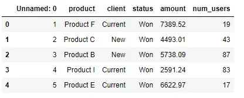
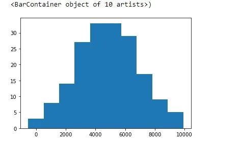
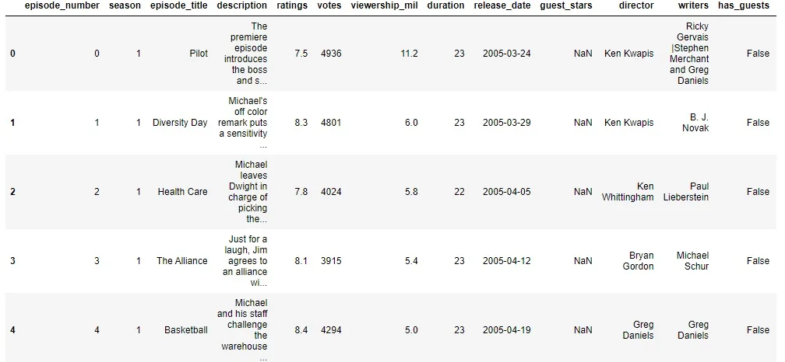
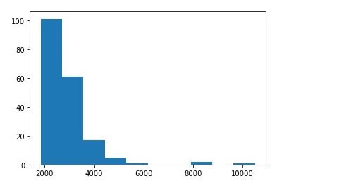

Measures of central tendency are representing the general behavior of the data. These are considered as the summary statistic that represents the center point of data or where most values in a distribution fall.

The common central tendency measures are the mean, median, and mode. Each of these measures calculates the center point from different perspectives. And we will discuss each of these in this article.

Firstly we need to mention a very important note, that based on the data we are dealing with, that determines which measure of central tendency we will use.

**Mean**

The first measure we will talk about is the mean, Which is simply the average that most of us deal with in our real life which we can calculate by adding the numbers that we have and then diving them by their count.

The mean is unique so a set of data has only one mean. The mean can be computed for quantitative data only.

```python
df.head()
```





This is a normal distribution and we can know the mean of it as it is symmetric so the mean will be at the middle.

Also we can see that from code using numpy:

```python
mean=np.mean(df.amount)
print(mean)
```

```python
4812.000337078652
```

```python
df2.head()
```



Let’s look at the following plot:



We see that this distribution is very skewed so the mean will not be exactly in the middle let’s see that:

```python
mean2=np.mean(df2.votes)
print(mean2)
```

```python
2838.228723404255
```

So we can conclude from the previous, That the mean will not always exist In the central area. This problem is due to the existence of outliers and that affects the mean as the mean is sensitive to the outliers as all the values are included in computing the mean. So we can say that is preferable to use the mean whenever there is symmetric distribution. But if the data is skewed, we can use another measure for central tendency but which?...

**Median**

Simply it is the value that splits the dataset in half (number of smaller observations = number of larger observations), So the median is the middle value. Also, we can use numpy to calculate the median but simply to calculate the median firstly we order the data from the smallest value to the greatest value and then pick the value in the middle in case the number of data elements is odd.

But if the data elements are even we extract the 2 middle values and then get the average of them like that:

3,4,6,5,4 => the median here is 6

5,2,6,3,6,44,2,14 => the median here is 4.5

And that is the process in code:

```python
np.median(df)
```

From that, we conclude that the median is not affected by outliers as it is considered the middle value, unlike the mean, the median does not depend on all the values in a dataset. So for example, if the distribution is skewed to the right the mean will be greater than the median, but the median will still be in the middle.

**Mode**

It is the most occurring value in a dataset, Also we can use the mode with categorical, ordinal, and discrete data.

2,3,2,4,22,53,2,111,4,2 => the mode is 2

It is possible that our data may not contain mode.

We need to differentiate between two concepts:

Parameter: which is any measure calculated from a population is called
 parameter (e.g. the mean of a population “µ” is a parameter)

Statistic: which is any measure calculated from a sample is called
 statistic (e.g. the mean of a sample “x̄” is a statistic)

GitHub repo: [here](https://github.com/Abdelrahman7000/statistical_concepts_for_data_science/tree/main/Measures%20of%20central%20tendency)

Resources used in this article: [here](https://statisticsbyjim.com/basics/measures-central-tendency-mean-median-mode/)

*That was part of Data Insight's Data Scientist program*
