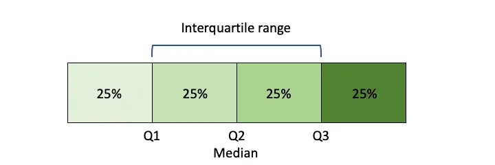
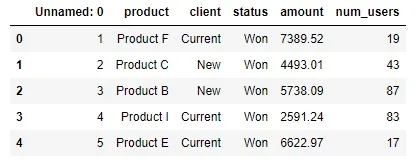
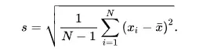

Whenever analyzing the data, usually we will find some variation of the observations from their central value such as mean. so it is important to measure that variation while analyzing any data.in this article, we will go through some measures for variation with examples in code.

We can differentiate between two types of measures of dispersion:

- **Absolute Measure of Dispersion**
- **Relative Measure of Dispersion**

## Absolute measure of dispersion:
It contains the same unit as the original data set. It is considered useful for understanding the dispersion within the context of your experiment. So we can use it to measure the dispersion for just one group. e.g. Range, IQR, and standard deviation.

Let’s see how to compute some of them:

**Range:**

It is the difference between the maximum value and the minimum value in a data set. Like that:

1,31,42,5,12,55,22,10 => range= 55-1= 54

As we see the range is simple to compute. But on the other hand, we have a disadvantage as it is *sensitive to outliers*. as its calculation is based only on two values which are the largest and the smallest and these values may be outliers so the value of the range will be affected by that.

**Inter quartile range (IQR):**

Here we use the quartiles which are the values that divide a list of numbers into quarters. Like that:



So as we see, IQR= Q3-Q1

We can consider that IQR measures the range of only 50% of the observations. It eliminates any information about the first and last quarters of the data.

From that, we can see that it depends only on 50% data. So it is considered *insensitive to outliers*.

let's see this in code:

```python
df.head()
```



we want to calculate the IQR for the amount column:

```python
q75, q25 = np.percentile(df['amount'], [75 ,25])
iqr = q75 - q25
print(iqr)
```

```python
2801.3299999999995
```

**Standard deviation:**

is a measure of the amount of variation of a set of values. A low standard deviation indicates that the values tend to be close to the mean, while a high standard deviation indicates that the values are spread out over a wider range.

Its formula:



N: the number of observations

x: A single observation

X̄: The mean of the observations

As we see, the standard deviation formula is calculated using the mean, so the standard deviation is affected by outliers as the mean is also affected by outliers.

Also we can apply that on the amount column as before using numpy:

```python
stan_dev=np.std(df['amount'])
print(stan_dev)
```

```python
2052.383697078496
```

As we saw, those were examples of Absolute dispersion.

## relative measure of dispersion:
The relative measures of dispersion are used to compare the distribution of two or more groups or data sets.

Let’s see one example for that which is the **coefficient of variation “CV”**. It is used to compare the dispersion, so we take the ratio of a measure of dispersion to the corresponding measure of central tendency like that:

**CV=S/****X̄**

or

**CV=IQR/Q2**

we can use either of these formulas, and that depends on the data. if the data contains outliers so we will use the second one as its calculation depends on the quartiles. but if the data does not contain outliers or influential outliers so we can use the first formula which depends on the standard deviation and the mean.

Also, it is important to mention that the coefficient of variation is unitless.

This time we can use scipy to compute the coefficient of variation like that:

```python
from scipy.stats import variation
import numpy as np

arr = np.random.randn(3, 3)

print ("array : \n", arr)

# rows: axis = 0, cols: axis = 1

print ("\nVariation at axis = 0: \n", variation(arr, axis = 0))

print ("\nVariation at axis = 1: \n", variation(arr, axis = 1))
```

```python
array :
 [[-1.42729921 -1.41519881  0.97698032]
 [-0.47743531  0.23175347  0.12440909]
 [-0.28919657  0.48875336  0.02874638]]

Variation at axis = 0:
 [-0.68110928 -3.64265126  1.13149258]

Variation at axis = 1:
 [-1.8180695  -7.72074768  4.19648611]
```

Hope that was helpful.

Resources used: [here](https://byjus.com/maths/dispersion/)

GitHub repo: [here](https://github.com/Abdelrahman7000/statistical_concepts_for_data_science/tree/main/Measures%20of%20dispersion)

*That was part of the Data Insight's Data Scientist Program.*
