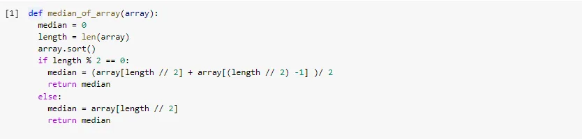
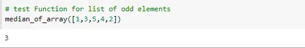
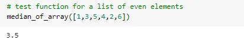

in this application we pass to our function unsorted list and it will return the median of the list

steps:

1 - First we save the length of the list in a variable called length.

2 - use build in function in python called sort() to return the same list but sorted.

3 - check if we have odd number of elements or even number.

4 - if we have odd numbers the median will be in the middle of the list.

5 - if we have even numbers we take the two numbers in the middle and take the average value this value will be our middle for this list.

Here is the function that do that.

test our function for odd number of elements

test our function for even number of elements

conclusion

before we calculate the median we need first to sort our elements and then check if there is odd or even number of elements.
