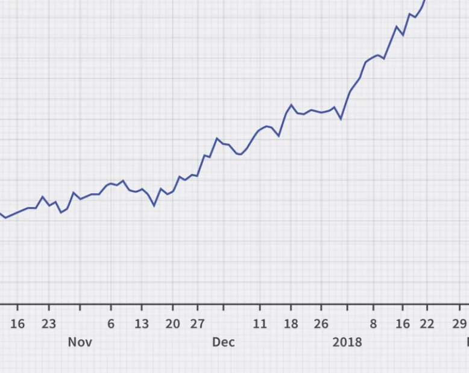
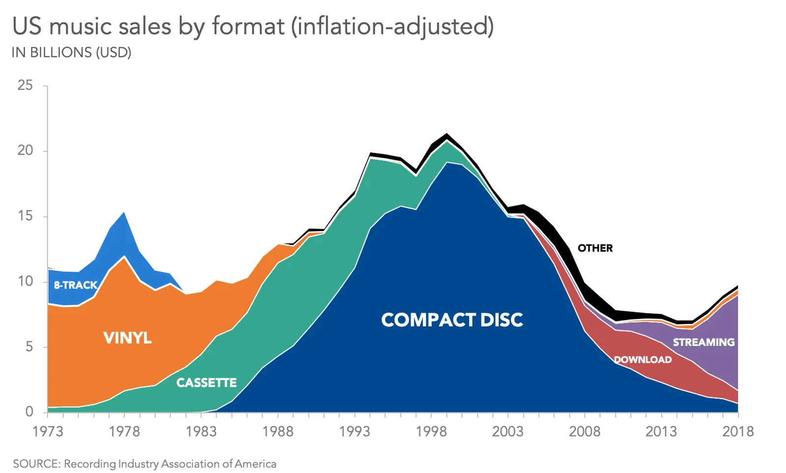
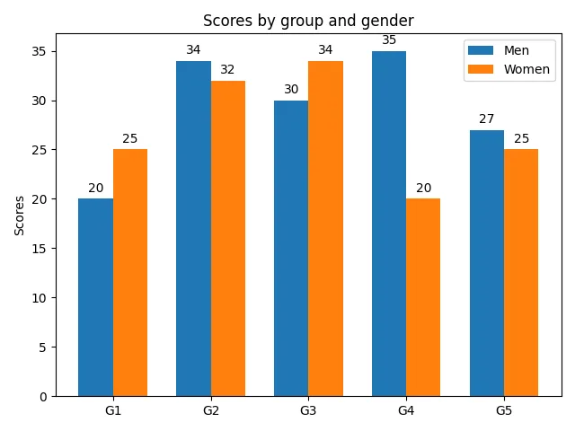
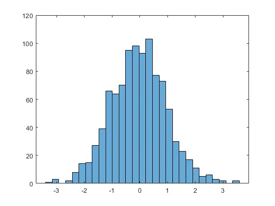
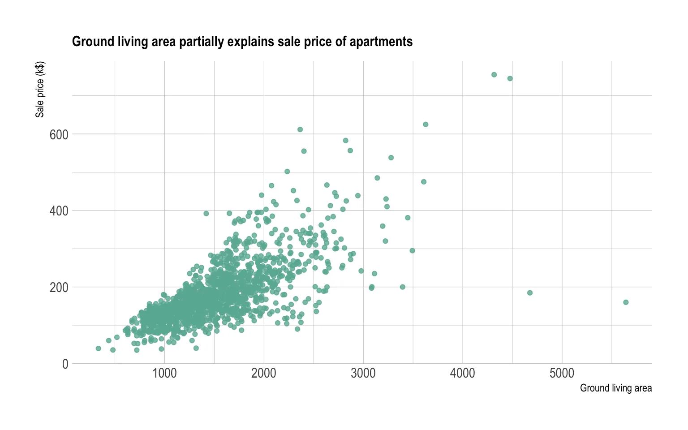

Pandas is a tool which is powerful , flexible and is easy to use built on top of python programming to help in data analysis.We will 5 major methods how this tools is used for data manipulation i.e Applying Function , Pivot Table,Imputing Missing Values, Multi Indexing and Plotting.

To start with panda we need a very basic code to import the pandas library into our notebook which is

```python
import numpy as np
import pandas as pd
```

### Applying Function

**Insert**

Whenever we need a new column in data frame according to the user requirement we use this . We put value of the position at which the column needs to inserted.Here, name_col represents name of column and new_col which act as and array for the field.

For eg:

```python
new_col=np.random.randn(10)
df.insert(2,’name_col’,new_col)
```

**Sample**
This method is utilise to select the sample values as random to check the data over a distribution.

For eg:

```python
sam1=df.sample(n=3)
print(sam1)
```

**Where**

"WHERE” is used as a condition to get the specific value which is totally dependent . Here, new_val where values are greater than 1 will replaced the value with 0.

For eg:

```python
df[‘new_val'].where(df[‘new_val’])>1,0)
```

### Pivot Table
Pivot table is a table which very flexible and used as summarisation of the data analysis.It works as an excel hence do not contain any missing values. The basic things in order to create a pivot table is data and indexing . Indexing is like feature on which the whole data representation will revolve around.

Syntax

```python
table=pd.pivot_table(data=df,index=[‘City’])
print(table)
```

You can always select more than one index in the for multi index pivot table.

```python
table = pd.pivot_table(df,index=[’Gen,’’City’])
print(table)
```

### Imputing Missing Values

The most interesting and challenging part of data analysis is to deal with missing values .There are three major methods to deal with it .

**Null**
 Keep values Null means do nothing to the data and use as it is this will maintain the integrity of the data and also keep the analysis raw but real.

**Mean-Median Values**

Put mean or median values of the column in all the null areas of the missing value columns .This will make the data analysis more challenging and useful as the algorithms will give more accurate results.But the data integrity is lost hence should only be used with small numerical datasets.

**Using 0 or 1**

Use the values zero and 1 in pivot table and make a categorical features which helps you to analyse the data in more than one way and makes manipulation easy.It also works with algorithms and numerical data sets, ye or no datasets and trees.

### Multi Indexing

It is one of the advanced ways to use the data analysis. We use multi- indexing as it helps us to analyse things by reshaping ,selecting and grouping of the hirerarichal index data in more than one dimension.

***Syntax:***

```python
 pandas.MultiIndex(levels=None, codes=None, sortorder=None, names=None, dtype=None, copy=False, name=None, verify_integrity=True)

 # importing pandas as pd
```

```python
import pandas as pd
# Create the MultiIndex
midx = pd.MultiIndex.from_tuples([(10, 'Ten'), (10, 'Twenty'),(20, 'Ten'), (20, 'Twenty')],                            names =['Num', 'Char'])

# Print the MultiIndex
print(midx)
```

### Plotting

One of my favourite things about pandas is plotting helps to summarise the data and represent in visual format .There are many plotting library such matplotlib , seaborn and many more.Types of plot are

**Line Plot**

The basic plot which is representation of the line is called line plot.This connect all the points represented by the data over a graph with the help of line chart.



Syntax:

```python
df = pd.DataFrame(np.random.randn(500), columns=["B"]).cumsum()
df["A"] = pd.Series(list(range(len(df))))
df.plot(x="A", y="B"); # df.plot.line(x="A", y="B")
```

**Area Plot**

As the name suggest this is representation of the area underneath the line plot this can contain multi-values such as A,B,C,D used as different variables of representation.



Syntax:

```python
df = pd.DataFrame(np.random.rand(20, 4),
       columns =['A', 'B', 'C', 'D'])
df.plot.area();
```

**Bar Plot**

The bar plot allows to represent the values represented by categorical value which co- related one given category with another.This doesn't have to be co related directly but more of the comparison sense.



Syntax:

```python
 df = pd.DataFrame(np.random.rand(10, 4), columns=["a", "b", "c", "d"])
df.sum().plot.bar();
```

**Histogram**

Histogram is similar to bar only difference this contains multiple sub versions in a small buckets call bins which actually tells the width of these bars over a single axis.



Syntax:

```python
 df = pd.DataFrame(
        {
            "a": np.sqrt(np.random.randn(1000) + 1),
            "b": np.random.randn(1000),
        },
        columns=["a", "b", "c"],
    )
df.plot.hist(alpha=0.5);
```

**Scatter Plot**

This plot is used to check the anomalies in the data through scatter plot with the co relation between two variables.We also use it check types of models which is under fitting model or overfitting model of machine learning.



Syntax:

```python
df = pd.DataFrame(np.random.rand(100, 2),
           columns =['a', 'b'])
df.plot.scatter(x ='a', y ='b');
```


Click on the pic to get the code to understand better.
