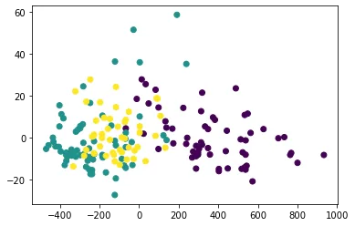

AI Models sure are interesting and fairly fascinating. We're talking about machines "learning" new things! But, whether we like it or not, an AI model is as good as the data you feed it.

Let's take one simple limitation. Let's consider a coin flip dataset. Naturally, we'll find that the outcome is at 50% heads and tails each. From a dataset point of view, that's a perfectly balanced dataset. Not to mention how simple the data would be. Now the question is, can a model predict with an accuracy above 50% the outcome of a coin flip?

The simple answer is **no**. There is no **pattern** to extract from the samples. That's the main model-killer! The patternis otherwise known as **the relationship!** Now, you'd say that this doesn't hold true for real-world data as usually data presents relationships between features.

True, you are totally right, chances are ML/DL models can pick on relationships from real-world problems most of the time. But in the majority of cases, the model's performance will be hindered by many factors, and this could lead to either overfitting or simply getting stuck with a **"random walk in the park" accuracy** (This means that your model is picking randomly the outcome and didn't really learn anything)**.**

I've mentioned this in earlier blogs but still will do it again, **a machine learning model is as good as the data you feed it**. At the very least, this will hold true for now. who knows what the future has in store for us.

In this blog, we'll look into some interesting techniques that can allow us to feed better-processed data to our ML models.

### I- Dimensionality reduction:

Datasets can contain a lot of features; maybe tens, or even hundreds of features. This leads to higher dimensionality of data. The larger a dataset is samples-wise, adding **features (dimensions)** means an exponential growth in the size of this data. Not only this is a problem when it comes to computational power. We must remember one important thing, not ALL information is useful. We can find redundancies such as the simple example of having a feature in both miles and kilometers. These redundant **(highly correlated)** features are one of the main causes of model overfitting. In this part, we'll work on keeping only the important features.

This can be done via 2 methods:

**Feature selection: Only selecting** the **important** features needed for the training

**Feature extraction:** Creating new features that **are calculated** from the original features (a simple example is: **Feature3 = Feature1 + Feature2**).

##### 1- Feature selection

- One of the most straightforward methods of feature selection is the elimination of features with **a lot of missing** values (this usually means imputing the values with an average value or a selected one will skew the dataset). A simple line of code can help you identify the features with a lot of missing data that should be better dismissed.

```python
df.isnull().sum() #df is the dataset(Pandas dataframe).
```

- A pointless feature would be a feature that has little to no variance. Identifying and eliminating these features is fairly easy. But the main question is the following: **what would be considered too low variance?** That would be up to you to identify and experiment with as you get any new dataset.

```python
df.var() #indentifying column variances.
```

- Another way of selecting features is to identify the correlation between features. In previous blogs, we discussed the **R Pearson pair correlation.** Again, thankfully this is done easily with one line of code. But, for visibility, we'll display the correlation matrix. From that point, it's up to you to work on the dataset to eliminate the features you see fit. And remember, always **testing** is key. Check [this notebook](https://github.com/zqngetsu96/DataInsight_Assignments_and_projects/blob/main/Bi-weekly-blog-codes/Dimensionality%20reduction%20and%20preprocessing.ipynb) for results on the code sample below.

```python
corr = X.corr() #calculating pairwise correlation
sns.heatmap(corr, center=0, linewidths=1, annot=True, fmt=".2f")
plt.show()
```

- Using **RandomForests** classifier or **decision trees**, in general, is another way of identifying important features. Given that decision, trees split the datasets with features and conditions that maximize information gain. So the most impactful features end up being the most prominent ones in the inference process. With the **feature_importances_** property of a random forests classifier, you can identify the most important features. They can be extracted as shown in the code sample below.

```python
rf = RandomForestClassifier(n_estimators = 30)
rf.fit(X.values,y.values)
f_i = rf.feature_importances_
columns = X.columns
for i in range(len(f_i)):
    print(columns[i] + ' : {:.2f}'.format(f_i[i]))
```

- Finally, we can use a **recursive feature elimination process** that trains a classifier that will choose the number of desired features while minimizing the loss in accuracy/residuals. For this, scikit-learn offers the RFE (Recursive Feature Elimination) function that trains a model recursively while dropping features to keep only the important ones.

```python
rfe = RFE(estimator=RandomForestClassifier(n_estimators=30), n_features_to_select=5, verbose=1)
#For full training and output check the notebook attached to this post
```

##### 2- Feature extraction and PCA

- The most intuitive form of feature extraction is the use of feature extraction is the **creation of a new feature** that results from an **operation taking other features as input**. This renders the input features obsolete and creates a new single feature that can still hold a lot of information.

```python
df['Feature_3'] = 5 * df['Feature_1'] + df['Feature_2'] ** 2)
```

- **Principal Component Analysis:** A statistical procedure that outputs a "compressed"or"summarized" version of the input data which can be visualized in 2D or 3D space even if the dataset had many more features. The end result is the dataset described through main **"vectors"/"components".** If you are intrigued about the statistical process that it goes through. [This post](https://builtin.com/data-science/step-step-explanation-principal-component-analysis) knocks it out of the park when it comes to explaining how PCA works.

```python
pca = PCA(n_components = 2) #instanciate a PCA model while indicating the output number of dimensions of the dataset.
X_pca = pca.fit_transform(X)

plt.scatter(x=X_pca[:,0],y=X_pca[:,1],c=y)
plt.show()
pca.explained_variance_ratio_ *100 #Explains the dataset variance held by every component
```

In this case, our wine dataset that started with 13 features is visible in 2D space and even managed to show that the 1st component is most influential towards the class of the sample.



### II- Dataset preprocessing

Just like feature selection is important, processing these features is also of utmost importance.

##### 1- Standard Scaling of the data.

Standard scaling of the data achieves a Normal distribution representation of the data. That means that the resulting dataset will be of a **mean = 0** and **standard deviation = 1.**

This operation can be done to a feature by subtracting **the average** value of that feature and **dividing** it **by the variance ratio**.

```python
sc = StandardScaler()
X_scaled = sc.fit_transform(X) #transform the data to a Normal distribution
```

##### 2- Binary/One Hot encoding

One hot encoding aims to fix the interpretability of categorical features. So far, AI models (**at the very core**) will always only take numerical features.

Categorical features are ones like (yes-no, type1-type2-type3, etc.).

In the case of only two categories, you can always assign 1 and 0 as the new labels of the feature. This is known as a **binary** encoding.

```python
new_label = 1 if category=='yes' else 0 #simple condition for changing the vlaues in binary encoding.
```

In the case of many categories, going with the 0,1, 2,3 approaches may introduce biases to classes with more important numbers (higher value = higher importance). The best to avoid this is to introduce what's known as **one-hot encoding**.

**The one agreed-upon way to categorize data indiscriminately is to encode them as binary lists where class N will have the index N-1 in the last set as 1 and the rest as zeros**. So instead of saying this is category 3 we describe it as [0,0,1], category 1 is [1,0,0] and category 2 is [0,1,0]. Okay, this might be confusing. Let's see an example! To extract the one-hot encoding we simply use the "get_dummies" function in pandas.

```python
one_hot_enc = pd.get_dummies(y)
one_hot_enc
```

The function **get_dummies** will extract the **unique categories** and create columns based on the present categories. as usual, the result for this is in [the notebook](https://github.com/zqngetsu96/DataInsight_Assignments_and_projects/blob/main/Bi-weekly-blog-codes/Dimensionality%20reduction%20and%20preprocessing.ipynb).

##### 3- New features from dates (+bonus function mapping)

Dates can hold important information depending on the dataset. But the DateTime objects created by pandas data frames or saved in CSV files as strings are not recognizable by machine learning models.

To extract the information from dates, we create new features which contain separate parts of the date that interest us such as the year or month, etc.

```python
df['month'] = df['date'].apply(lambda row: row.month) #extract month from datetime object
```

**4- Feature aggregation (example: averaging)**

This is already mentioned in the dimensionality reduction part of the post. But we'll show a simple example of how we can eliminate many features by averaging them.

```python
average_columns = ['f1','f2','f3']
df["mean"] = df.apply(lambda row: row[average_columns].mean(),axis=1)
```

That's it for now, I hope this article was worth reading and helped you acquire new knowledge no matter how small.

As always, feel free to check up on the [notebook](https://github.com/zqngetsu96/DataInsight_Assignments_and_projects/blob/main/Bi-weekly-blog-codes/Dimensionality%20reduction%20and%20preprocessing.ipynb). You can find the results of code samples in this post.
