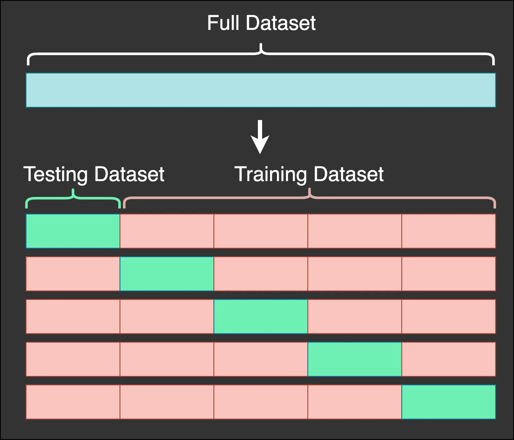
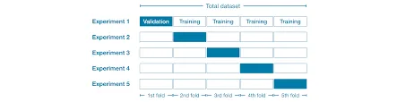

Cross-validation is a technique for evaluating ML models by training several ML models on subsets of the available input data and evaluating them on the complementary subset of the data.

Here are the steps involved in Cros Validation:

- You reserve a sample dataset
- Train the model using the remaining part of dataset
- Use the reserve sample of dataset test(Validation) set. This will help you to know the effectiveness in model performance. If your model delivers a positive result on validation data, go ahead with the current model. It rocks!

**Why cross-validation is better?**

Cross-validation is usually the preferred method because it gives your model the opportunity to train on multiple train-test splits. This gives you a better indication of how well your model will perform on unseen data.
**Holdout sets are a great start to model validation. However, using a single train and test set if often not enough. Cross-validation is considered the gold standard when it comes to validating model performance and is almost always used when tuning model hyper-parameters.**



```python
# Load dataset
import numpy as np
import pandas as pd
df = pd.read_csv('/content/Purchased_Dataset.csv')
df.head()
```

```python
# Extract target and features
X = df[['Age','EstimatedSalary']]
y = df['Purchased']
```

```python
from sklearn.model_selection import train_test_split
from sklearn.neighbors import KNeighborsClassifier
from sklearn import metrics
X_train, X_test, y_train, y_test =
        train_test_split(X,y,random_state =5)
knn = KNeighborsClassifier(n_neighbors=5)
knn.fit(X_train,y_train)
y_pred = knn.predict(X_test)
metrics.accuracy_score(y_test,y_pred)
```

```python
0.77
```

```python
X_train.head()
```

```python
from sklearn.model_selection import train_test_split
from sklearn.neighbors import KNeighborsClassifier
from sklearn import metrics
X_train, X_test, y_train, y_test =
        train_test_split(X,y,random_state =12)
knn = KNeighborsClassifier(n_neighbors=5)
knn.fit(X_train,y_train)
y_pred = knn.predict(X_test)
metrics.accuracy_score(y_test,y_pred)
```

```python
0.73
```

```python
X_train.head()
```

So we see that if we change the random state we find different scores and also different training sets. If you change the random state continuously the score also changed for the data.

## Cross_val_score
This method requires four parameters:

- estimator: The model to use
- X: the predictor dataset
- y: the response array
- cv: the number of cross-validation splits

If you want to use a different scoring function, you can create a scorer by using **make_scorer()** method.

```python
# # Example#
# Load the Methods
# from sklearn.metrics import mean_absolute_error,
     make_scorer
# # Create a scorer
# mae_scorer = make_scorer(mean_absolute_error)
# # Use the scorer
# cross_val_score(<estimator>, <X>, <y>, cv=5,
    scoring=mae_scorer)
```

```python
# import library
from sklearn.model_selection import cross_val_score
# define modelknn = KNeighborsClassifier(n_neighbors=4)
# cross val core
print(cross_val_score(knn, X, y, cv=10, scoring ='accuracy'))
```

```python
[0.725 0.9   0.9   0.9   0.8   0.7   0.775 0.775 0.75  0.7  ]
```

Here we find 10 different scores for the cv=10. For the first experiment, we found a score 0.725. Now we calculate the mean of these 10 experiments.

```python
print(cross_val_score(knn, X, y, cv=10, scoring         ='accuracy').mean())
```

```python
0.7925
```

Finally, we found 0.792. That is quite good!

```python
# Try logistic regression
from sklearn.linear_model import LogisticRegression
logreg = LogisticRegression()
print (cross_val_score(logreg, X, y, cv=10, scoring =
     'accuracy').mean())
```

```python
0.6425000000000001
```

Here KNeighborsClassifier is better than Logistic Regression!

[GitHub Link](https://github.com/abubinfahd/Data-Insight/blob/main/Assignments/Model_Validation_Cross_val_score.ipynb)
