Climate change can affect both crop yield and the land area suitable for agriculture. It also shifts the distributions of a set of climatic variables, including temperature, precipitation, humidity, wind speed, sunshine duration, and evaporation. The African continent is most vulnerable to climate change due to a multitude of environmental stressors and low adaptive capacity [1]. Climate change stresses agriculture via rising temperatures and changing precipitation patterns, as well as increased soil vulnerability, climate variability, pests and crop disease, and increased atmospheric carbon dioxide [1]. This study seeks to explore the impact of humidity on farming. Using the agricultural data from Sunyani, Ghana as a case study, it is observed that most farmers ignore the importance of humidity in farming.

## 1. INTRODUCTION
## 1.1 Background

Over the past decade, a growing body of economics research has projected the impacts of climate change on important economic facets of well-being, such as agriculture, industry, human health, energy demand, and economic growth. Given the natural relationship between climatic factors and plant growth, the agricultural sector has had a particularly high level of research [2]. These studies have predominantly focused on temperature and precipitation only, while ignoring other climatic variables such as humidity, wind speed, sunshine duration, and evaporation [3]. In general, humidity usually tends to be high in raining season and low in drying season. Plants exposed to high humidity levels may lead to loss of crop quality due to occurrence and severity of fungal diseases, calcium and water deficiencies [4]. Plant growth may decrease for shoot elongation, increased leaf size and extensive and its development can be disturbed or delayed for photosynthesis slowing. High humidity conditions can further hamper plant flowering and pollination in fruit vegetables and vase life in ornamental plants may be shortened. On the other hand, too low relative humidity can lead to plant water stress [5]. However, the humidity seldom causes any direct, quick and obvious negative impacts on plant growth, this climate factor is often neglected, so long as the diseases do not appear. Actually, the growth and production of all major farm crops are affected by ambient humidity for avoiding adverse effects and achieving high quality plant yield, humidity properly controlling become very important.

In order to develop an optimal control strategy, a model is needed which will predict the air humidity simply and accurately.

In this paper, we explore the importance of additional climatic variables, including relative humidity,3 wind speed, sunshine duration, and evaporation. Using EORIC weather data from 2017 to 2019 in Sunyani, we estimate and built two models to predict accurately. The first model is a regression model to predict air humidity and the second model is a time series forecasting to forecast humidity in three days into the future.

## 1.2 Problem Statement

The changing climate is having far reaching impacts on agricultural production, which are likely to challenge food security in the future. Climate change is likely to contribute substantially to food insecurity in the future, by increasing food prices, and reducing food production. Food may become more expensive as climate change mitigation efforts increase energy prices [6]. One of the factors often neglected by farmers is relative air humidity. Plants exposed to high humidity levels may lead to loss of crop quality due to occurrence and severity of fungal diseases, calcium and water deficiencies.

## 1.3 Objective of the project

The general objective of this project is to train a regression model to accurately predict relative humidity and a time series forecasting model using LSM to forecast humidity three days into the future.

## 2. **METHODOLOGY**

This section describes the entire processes used to design and train the model to accurately predict relative humidity.

## 2.1 Experimental data set and preprocessing

The weather data of EORIC for a period of three years (2017-2019) was used to build the models and the data between January and June of the year 2019 is used to test the models. The database includes readings of several weather parameters recorded at every half hour interval. The daily maximum temperature is extracted from this database and used for this work. The real-world databases are highly susceptible to noisy and missing data. The data can be preprocessed to improve the quality of data and thereby improve the prediction results. In this work data cleaning and transformation have been applied to the data. Data cleaning fills in the missing values, while data transformation improves the accuracy, speed and efficiency of the algorithms used. The missing value for various parameters was replaced with the median value while building the LIGHTGBM model.

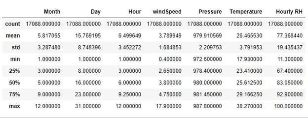

*Figure 1 sample statistics of the data*

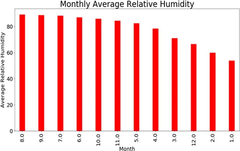

*Figure 2 monthly average relative humidity*

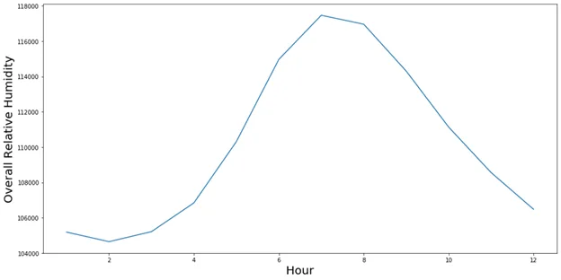

*Figure 3 overall relative humidity in an Hour*

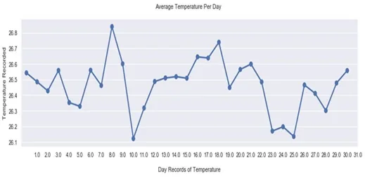

*Figure 4 daily records of temperature*

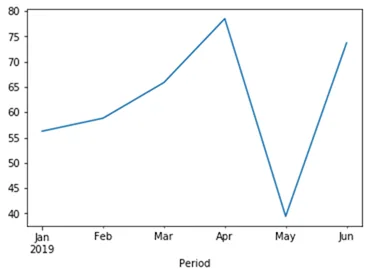

*Figure 5 2019 resample mean of RH*

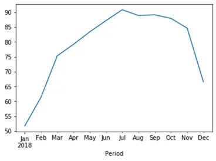

*Figure 6 2018 resample mean of RH*

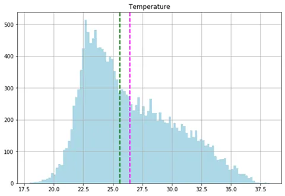

*Figure 7 histogram plot of temperature showing mean and median*

In this work the relative Humidity was predicted based on historical climate conditions. The available data was divided into training, validation and test set. Training set is used to build the model, validation set is used for parameter optimization and test set is used to evaluate the model. Separate models are developed using LIGHTGBM and LSTM RNN trained with back propagation.

The regression model used to train the model is LIGHT GBM which is a gradient boosting framework that uses tree-based learning algorithm. Hyperparameters tuning was adopted in this study to ensure better performance of the model. The maximum depth was set 10, number of estimators to 1000 and learning rate to 0.01.

For the timeseries forecasting LSTM was employed, which is a recurrent neural network that trained using backpropagation through time. The date columns and the relative humidity was used in training the model.

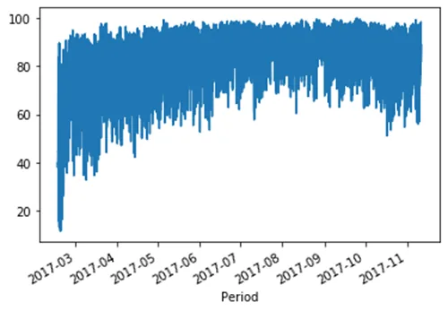

*Figure 8 Line plot of the 2017 RH recorded*

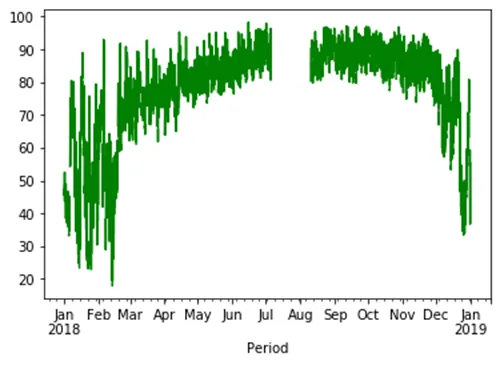

*Figure 9 resample mean plot of recorded RH in 2018*

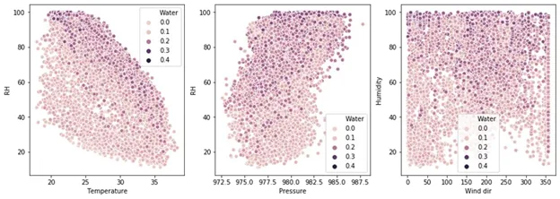

*Figure 10 scatter plot to check the correlation between other parameters and the RH*

## 3. RESULTS AND DISCUSSIONS
The performance of the developed models is assessed after de normalizing the output generated by the models. Mean Square Error (MSE), Root Mean Squared and R2 score are the metrics used to evaluate the performance of the models. LIGHTGBM score on the train set was 98.88% and the 93.36% on the test set. The MSE, RMSE and R2_score is 24.39, 4.93 and 0.936 respectively.

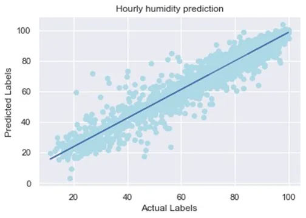

The network structure for the LSTM has 1 input layer, a hidden layer of 4 LSTM neurons, and output layer that makes a single value prediction. The default sigmoid activation function is used for the LSTM blocks. The network is trained for 50 epochs and a batch size of 32 is used. After fitting the model, the performance of the model was estimated on the train and test datasets. We generated predictions using the model for both training and testing dataset to get visual indication of the skill label. The data is plotted showing the original dataset in blue, the prediction of the unseen test dataset in red.

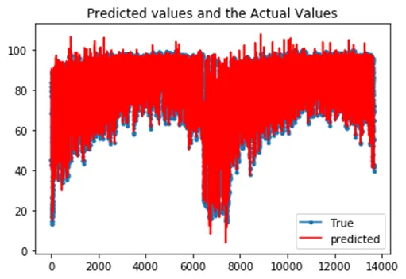

*Figure 11 LSTM on Regression Predicted and actual values The RMSE for the timeseries forecasting is 3.11*

## 4. CONCLUSION.
The project employed regression LIGHTGBM model to predict relative humidity and time series forecasting model using LSM to forecast humidity three days into the future in Sunyani in the northern part of Ghana. Data between January and June of the year 2019 was used test the model. When the regression model was evaluated, the R2_score was found to be 0.936, indicating the model to be a good fit. This was backed up by the low values of the MSE and RMSE metrics, 24.39 and 4.93 respectively.

## References
[1] W. C. K. M. Megan A. Biek, "Affordable Greenhouse," Pennsylvania, 2015.

[2] J. Z. C. Peng Zhang, "Economic Impacts of Climate Change on Chinese," pp. 1-77, 5 April 2015.

[3] G. J. a. J. A. J. e. Hoffman, "Growth and Water Relations of Cereal Crops as," *Agronomy Journal,* vol. 70, no. 5, p. 765–769, 1978.

[4] M. T. G. Ford, "Effects of atmospheric humidity on plant growth," *Annals of Botany,* vol. 38, p. 441–552, 1974.

[5] L. F. T. Mortensen, "High air humidity reduces the keeping quality of," *Acta Horticulturae,* vol. 407, p. 148–152, 1995.

[6] "future learn," [Online]. Available: https://www.futurelearn.com/courses/climate-smartagriculture/0/steps/26565. [Accessed 9 September 2020].
