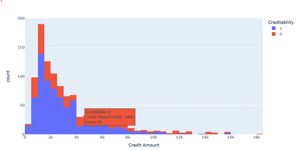
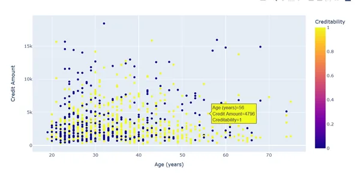
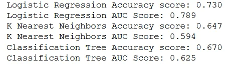
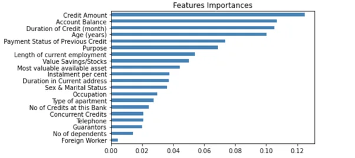
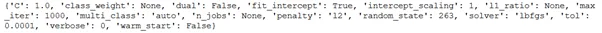
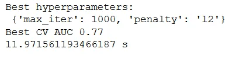
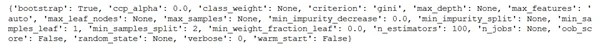
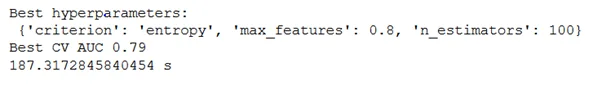

This blog will detail how machine learning algorithms can be used to predict the credit worthiness of a loan applicant given a set of features, that is, independent variables. Traditional methods such as linear regression and logistic regression may suffer in tackling complex relationships in data. Machine learning methods can model such as they are robust, and most are not tied to linear relationships as they can model non-linear associations.

The German loan dataset is a mostly used data set in article writing as well as machine learning competitions and exercises. We will use the base classifiers and ensemble learning methods and later tune these models.

We load the data from a github account by using a pandas function as:

```python
loan_data = pd.read_csv('https://raw.githubusercontent.com/rajasekarsr/Credit_Risk_Prediction_DataAnalysis/master/DATA/index.csv')
```

Let us do some minor explanatory data analysis. To do this we use the plotly function using this code:

```python
import plotly.express as px
fig = px.histogram(loan_data,  x = "Credit Amount",  color = "Creditability")
fig.show()
```



Should this code not work you can install the plotly package by

```python
!pip.install plotly.express
```

We can see that the credit amount distribution is skewed regardless of the credit worthiness of the individual.

We can also evaluate a bivariate analysis of variables by using the scatter plot:

```python
fig = px.scatter(loan_data, x = "Age (years)", y = "Credit Amount",  color = "Creditability")
fig.show()
```



We can see that those who are credit worthy (marked yellow) are mainly below the 10 000 amount by the spread is fairly similar to that of those who are not credit worthy.

We examine if we will need data imputation if suppose the data has missing points. As can be seen using this code,

```python
# Check missing values
loan_data.isnull().sum(axis = 0)
```


The data has no missing values

We therefore start our training of the models:

# Machine Learning libraries

```python
from sklearn.tree import DecisionTreeClassifier
from sklearn.linear_model import LogisticRegression
from sklearn.model_selection import train_test_split
from sklearn.neighbors import KNeighborsClassifier as KNN
from sklearn.metrics import accuracy_score
from sklearn.metrics import roc_auc_score
```

```python
# Data
X = loan_data.drop('Creditability', axis=1)
y = loan_data['Creditability']

# Splitting the data
X_train, X_test, y_train, y_test = train_test_split(X, y, test_size= 0.3, random_state=263)
```

We will begin with 3 base classifiers and see how they perform. We will use the logistic regression, K-Nearest Neighbour and a Decision Tree classifier. We will train these models and get the accuracy and the AUC scores from the models. To quickly do this, we can use a for loop over the models and assess these models by:

```python
# The models

lr = LogisticRegression(solver= 'lbfgs',
                        max_iter = 1000,
                       random_state= 263)
knn = KNN()
dt = DecisionTreeClassifier(random_state = 263)

classifiers = [('Logistic Regression', lr),
              ('K Nearest Neighbors', knn),
             ('Classification Tree', dt)]

for clf_name, clf in classifiers:
    clf.fit(X_train, y_train)
    y_pred = clf.predict(X_test)
    y_pred_ba = clf.predict_proba(X_test)[:,1]
    print('{:s} Accuracy score: {:.3f}'.format(clf_name, accuracy_score(y_test, y_pred)))
    print('{:s} AUC Score: {:.3f}'.format(clf_name, roc_auc_score(y_test, y_pred_proba)))
```



We can see that by just training once the best model using the accuracy score is the logistic regression, however if we use the AUC metric all the models have generally a huge disparity. The logistic regression is better

Let us cast our eyes on the ensemble learning models. These make models perform better. Consider for instance the voting classifier. Here the models are all considered, then voting is done to consider which model among the evaluated models is the best model.

```python
from sklearn.ensemble import VotingClassifier

vc = VotingClassifier(estimators = classifiers)
vc.fit(X_train, y_train)
y_pred = vc.predict(X_test)

print('Voting Classifier: {:.3f}'.format(accuracy_score(y_test, y_pred)))
```

The voting classifier achieved an accuracy of 72% which was achieved by the Logistic Regression. We can think of bagging, in other words grouping the data, then training the models in each group and get the average. So to do this we use the following code:

```python
from sklearn.ensemble import BaggingClassifier
bc = BaggingClassifier(base_estimator = lr,
                   random_state =1)

bc.fit(X_train, y_train)
y_pred_bc = bc.predict(X_test)
y_pred_proba = bc.predict_proba(X_test)[:,1]

print('Bagging Classifier Accuracy Score: {:.3f}'.format(accuracy_score(y_test, y_pred_bc)))
print('Bagging Classifier AUC Score: {:.3f}'.format(roc_auc_score(y_test, y_pred_proba)))
```

Since the logistic regression model performed well amongst the base classifiers, we will use it in the bagging procedure. Hence the base_estimator = lr in the above code. Our bagging model achieved an accuracy of 73.7% and an AUC of 78.3%.

Another sophisticated model is the Random Forest, which is trained like:

```python
from sklearn.ensemble import RandomForestClassifier
from sklearn.metrics import roc_auc_score
rf = RandomForestClassifier()
rf.fit(X_train, y_train)

y_pred_rf = rf.predict(X_test)
y_pred_proba = rf.predict_proba(X_test)[:,1]

print('RF Classifier Accuracy Score: {:.3f}'.format(accuracy_score(y_test, y_pred_rf)))
print('RF Classifier AUC Score: {:.3f}'.format(roc_auc_score(y_test, y_pred_proba)))
```

The model achieves an Area Under the Curve of 80.2%. What’s pretty cool about this model is that we can view the importance of each variable in modelling the target variable. We can do this by:

```python
import matplotlib.pyplot as plt

importances = pd.Series(rf.feature_importances_, index = X_train.columns)

importances_sorted = importances.sort_values()
importances_sorted.plot(kind ='barh',
                      color = 'steelblue')
plt.title("Features Importances")
plt.show()
```

We get



The top five variables in order of importance are

1. Credit amount

2. Account balance

3. Duration of credit

4. Age

5. Payment status of previous credit

To fine tune our models so that they can perform better we need to use a Grid Search or a Random Search. For this tutorial we will use a grid search and measure the time this will take.

Before we do this let us examine how we can do this. For instance the logistic regression can be tuned by:

```python
print(lr.get_params())
```



These are the different ways one can alter the logistic regression model. So let us tune the model like:

```python
# Logistic Regression Tuning
start_time = time.time()
params_lr = {
    'max_iter' : [1000, 2000, 3000, 4000],
    'penalty' : ['l2', 'none']
}

grid_lr = GridSearchCV(
    estimator = lr,
    param_grid = params_lr,
    scoring = 'roc_auc',
    cv = 10
)

grid_lr.fit(X_train, y_train)
best_hyperparams = grid_lr.best_params_

print('Best hyperparameters: \n' ,
     best_hyperparams)

best_auc_score = grid_lr.best_score_
print('Best CV AUC {:.2f}'.format(best_auc_score))
print(time.time() - start_time, 's')
```



About 12 seconds pass for the model to run a 10 cross fold validation experiment and output 77% AUC. 1000 iterations were needed as well as an ‘l2’ penalty.

We similarly do this for the random forest model. By

```python
print(rf.get_params())
```



We can alter many things in this model. The more we alter, the more time will be needed to run the 10 fold experiment. We will consider the criterion, features as well as the estimators

```python
# Random Forest Tuning
start_time = time.time()

params_rf = {
    'criterion' : ['gini', 'entropy'],
    'max_features': [ 0.4, 0.6, 0.8],
    'n_estimators': [100, 200, 300]
}

grid_rf = GridSearchCV(
    estimator = rf,
    param_grid = params_rf,
    scoring = 'roc_auc',
    cv = 10
)

grid_rf.fit(X_train, y_train)
best_hyperparams = grid_rf.best_params_

print('Best hyperparameters: \n' ,
     best_hyperparams)

best_auc_score = grid_rf.best_score_
print('Best CV AUC {:.2f}'.format(best_auc_score))

print(time.time() - start_time, 's')
```



After 200 seconds the we see the entropy criterion, 200 estimators and 0.4 maximum features per node are the optimal tuning parameters. We achieve an AUC of about 79%

The article has showed you how base classifiers are incorporated in the ensemble models and how these are fine tuned to meet the task at hand. To look at the code further you can access it [here](https://github.com/Matshisela/Modelling-the-German-Loan-dataset-using-ensemble-learning).
