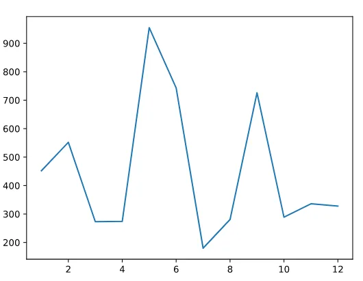

### Modules Python Introduction
In the world of programming, we care a lot about making code reusable. In most cases, we write code so that it can be reusable for ourselves. But sometimes we share code that’s helpful across a broad range of situations. In this lesson, we’ll explore how to use tools other people have built in Python that are not included automatically for you when you install Python. Python allows us to package code into files or sets of files called *modules*. A module is a collection of Python declarations intended broadly to be used as a tool. Modules are also often referred to as “libraries” or “packages” — a package is really a directory that holds a collection of modules. Usually, to use a module in a file, the basic syntax you need at the top of that file is:

```python
from module_name import object_name
```

Often, a library will include a lot of code that you don’t need that may slow down your program or conflict with existing code. Because of this, it makes sense to only import what you need. One common library that comes as part of the Python Standard Library is datetime. datetime helps you work with dates and times in Python. Let’s get started by importing and using the datetime module. In this case, you’ll notice that datetime is both the name of the library *and* the name of the object that you are importing.

```python
from datetime import datetime
current_time = datetime.now()
print(current_time)
```

### Modules Python Random
**datetime** is just the beginning. There are hundreds of Python modules that you can use. Another one of the most commonly used is random which allows you to generate numbers or select items at random. With random, we’ll be using more than one piece of the module’s functionality, so the import syntax will look like:

```python
import random
```

We’ll work with two common random functions:

- random.choice() which takes a list as an argument and returns a number from the list
- random.randint() which takes two numbers as arguments and generates a random number between the two numbers you passed in

Let’s take randomness to a whole new level by picking a random number from a list of randomly generated numbers between 1 and 100.

```python
# Import random below:
import random
# Create random_list below:
random_list = []
random_list = [random.randint(1, 100) for i in range(101)]
#Create randomer_number below:
randomer_number = random.choice(random_list)
# Print randomer_number below:
print(randomer_number)

# Output
19
```

### Modules Python Namespaces
Notice that when we want to invoke the randint() function we call random.randint(). This is default behavior where Python offers a *namespace* for the module. A namespace isolates the functions, classes, and variables defined in the module from the code in the file doing the importing. Your *local namespace*, meanwhile, is where your code is run. Python defaults to naming the namespace after the module being imported, but sometimes this name could be ambiguous or lengthy. Sometimes, the module’s name could also conflict with an object you have defined within your local namespace. Fortunately, this name can be altered by *aliasing* using the as keyword:

```python
import module_name as name_you_pick_for_the_module
```

Aliasing is most often done if the name of the library is long and typing the full name every time you want to use one of its functions is laborious. You might also occasionally encounter import \*. The \* is known as a “wildcard” and matches anything and everything. This syntax is considered dangerous because it could *pollute* our local namespace. Pollution occurs when the same name could apply to two possible things. For example, if you happen to have a function floor() focused on floor tiles, using from math import \* would also import a function floor() that rounds down floats. Let’s combine your knowledge of the random library with another fun library called matplotlib, which allows you to plot your Python code in 2D. You’ll use a new random function random.sample() that takes a range and a number as its arguments. It will return the specified number of random numbers from that range.

```python
from matplotlib import pyplot as plt
import randomnumbers_a = range(1,13)
numbers_b = random.sample(range(1000), 12)
plt.plot(numbers_a, numbers_b)
plt.show()
```

The Output graph should be:



### Modules Python Decimals
Let’s say you are writing software that handles monetary transactions. If you used Python’s built-in [floating-point arithmetic](https://en.wikipedia.org/wiki/Floating-point_arithmetic) to calculate a sum, it would result in a weirdly formatted number.

```python
cost_of_gum = 0.10
cost_of_gumdrop = 0.35

cost_of_transaction = cost_of_gum + cost_of_gumdrop
# Returns 0.44999999999999996
```

Being familiar with rounding errors in floating-point arithmetic you want to use a data type that performs decimal arithmetic more accurately. You could do the following: from decimal import Decimal

```python
from decimal import Decimal

cost_of_gum = Decimal('0.10')
cost_of_gumdrop = Decimal('0.35')

cost_of_transaction = cost_of_gum + cost_of_gumdrop
# Returns 0.45 instead of 0.44999999999999996
```

Above, we use the decimal module’s Decimal data type to add 0.10 with 0.35. Since we used the Decimal type the arithmetic acts much more as expected. Usually, modules will provide functions or data types that we can then use to solve a general problem, allowing us more time to focus on the software that we are building to solve a more specific problem.

### Modules Python Files and Scope
You may remember the concept of *scope* from when you were learning about functions in Python. If a variable is defined *inside* of a function, it will not be accessible *outside* of the function. Scope also applies to *classes* and to the *files* you are working within. *Files* have scope? You may be wondering. Yes. Even files inside the *same directory* do not have access to each other’s variables, functions, classes, or any other code. So if I have a file **sandwiches.py** and another file **hungry_people.py**, how do I give my hungry people access to all the sandwiches I defined? Well, *files are actually modules*, so you can give a file access to another file’s content using that glorious import statement. With a single line of from sandwiches import sandwiches at the top of **hungry_people.py**, the hungry people will have all the sandwiches they could ever want.

### Modules Python Review
You’ve learned:

- what modules are and how they can be useful
- how to use a few of the most commonly used Python libraries
- what namespaces are and how to avoid polluting your local namespace
- how scope works for files in Python

Programmers can do great things if they are not forced to constantly reinvent tools that have already been built. With the power of modules, we can import any code that someone else has shared publicly. In this lesson, we covered some of the Python Standard Library, but you can explore all the modules that come packaged with every installation of Python at the Python Standard Library documentation. This is just the beginning. Using a package manager (like conda or pip3), you can install any modules available on the Python Package Index. The sky’s the limit!
