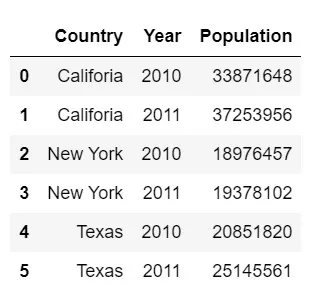
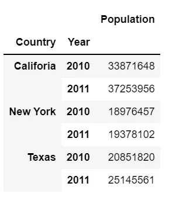
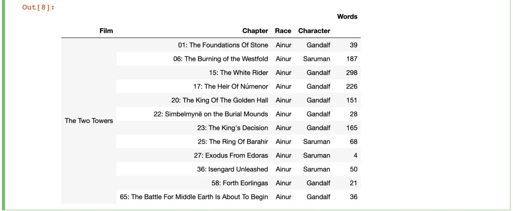
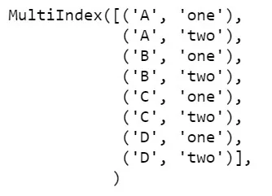
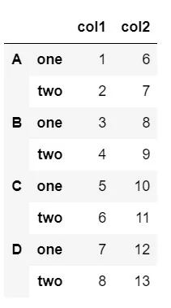

Pandas is a package built on top of NumPy, and provides an efficient implementation of a DataFrame. DataFrames are essentially multidimensional arrays with attached row and column labels, and often with heterogeneous types and/or missing data. As well as offering a convenient storage interface for labeled data, Pandas implements a number of powerful data operations familiar to users of both database frameworks and spreadsheet programs. As a data scientist, one needs to perform various operations from data collection and cleaning to interpretation and plotting. Here, we'll be talking about some common techniques used for handling data using pandas.

### Multi-indexing

Let's consider an example where we want to store a population of a country for year 2010 and 2011 in a dataframe and later retrieve it individually. We can easily do this by storing the country name as an index and the year as a column and group the data by the country using the groupby() function. However, for this purpose, multi-indexing (or hierarchical indexing) also comes in use. Consider a table with the above information provided.



For the above table (or in a provided DataFrame), we can easily set multiple index by passing a list of column names to set_index() function.

```python
# considering the above table is saved in variable df
df = df.set_index(['Country','Year'])
```

This yields the table as



In the above table, notice how the each year has been grouped under an individual country. Here, both the Country and Year has been set a index and set as bold text *(highlighting they are the index of the DataFrame object*).

The advantage of multi-indexing can be seen when we want to extract a particular information, in example above, we can now easily obtain the population of a state at a year.

```python
df.loc['New York', 2011]
```

```python
Population    20851820
Name: (Texas, 2010), dtype: int64
```

Multi-indexing is not only limited to two index columns i.e. one can create as many index columns as required. The following table shows index with four column



Above we specified creating multi-index within a provided table by passing a list to set_index() function. However, there are other explicit ways to create a multi-index table.

```python
# To create multi-index from an array
pd.MultiIndex.from_arrays()

# To create multi-index from tuples
pd.MultiIndex.from_tuples()

# To create multi-index from a pair of iterables
pd.MultiIndex.from_product()

# To create a multi-index from a DataFrame itself
pd.MultiIndex.from_frame()
```

Let's look at an example of from_product()

We first create two list (iterables) containg items to create a multi-index

```python
list1 = ['A','B','C','D']
list2 = ['one', 'two']
```

We then pass the two list in the MultiIndex.from_product() function to create a MultiIndex object.

```python
index = pd.MultiIndex([list1,list2])
```

which gives us the output of



When we look carefully at the output above, we see that every element is matched with every element of list2. Now in order to create a multi-index table, we pass the above output as the index to the DataFrame as follows:

```python
table = pd.DataFrame({'col1': [1,2,3,4,5,6,7,8],
                     'col2': [6,7,8,9,10,11,12,13]},
                      index=index)
```



Similarly, we pass tuples in the function MultiIndex.from_tuples(), pass a

arrays to MultiIndex.from_array() and pass a DataFrame object in MultiIndex.from_frame().

Examples on other functions can be found [here](https://pandas.pydata.org/pandas-docs/stable/user_guide/advanced.html).

You can find the a few more examples in my [GitHub](https://github.com/Clown-Face/DataInsight/blob/fcd18aa1d97c4a66e3208694fd63c917e252ef79/Multi%20Indexing%20with%20Pandas.ipynb).
