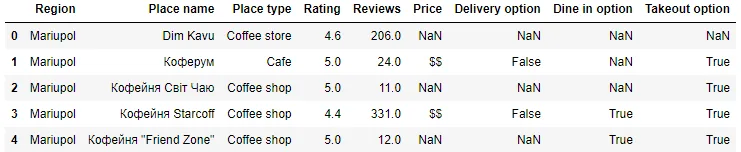
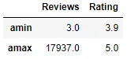
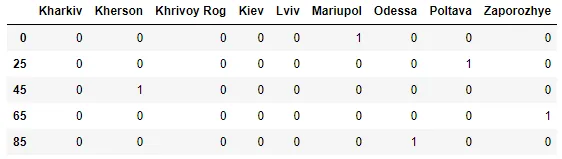

G. Temgoua [Github](https://github.com/tem-ctrl)


## Introduction

Without **data**, there won't be neither **data science** nor **data scientists**, that is why efficient data manipulation skills come in very handy. However, real-world data is always dirty, besides some tasks require us to use only part of data or to combine two or more datasets into one and so on. All these tasks have been made quite easy in Python by the **Pandas library**. In this post, we will present five powerful techniques offered by Pandas for manipulating data in order to draw useful insights from it. These techniques, in order of appearance in the text are: **Importing data, Apply functions, Imputing missing values, working with categorical data** and **Manipulating text data**. The **Ukrainian coffee market dataset** downloaded from [Kaggle](https://www.kaggle.com/dimitryzub/10-coffee-places-from-ukrainian-cities) will be used for illustration.

## 1. Importing data with Pandas

Regarding the size, type, user's preferences, the data is stored in many different file formats including but not limited to:

- CSV (Comma Separated Values);
- HDF5 (Hierarchical Data Format, version 5);
- SQL databases;
- JSON;
- Excel spreadsheets;

With pandas reading functions, the data stored in each of these file formats is loaded into a pandas Dataframe

. For the file formats listed above, the corresponding reading functions are listed below, in the same order posterior to loading pandas under its common alias **pd**.

```python
import pandas as pd
import numpy as np

data_path = 'coffee_shops.csv'
df = pd.read_csv(data_path)
df = pd.read_csv('path/to/data.csv') # Load a CSV file
df = pd.read_hdf('path/to/data.hdf5') # Load a hdf5 file
df = pd.read_sql('SQL query')
df = pd.read_json('path/to/data.json')
df = pd.read_excel('path/to/data.xlsx')
```

**Note:** For online data scraping, in most cases we just need to replace **path/to/data.ext** by its corresponding URL.

Once the data is loaded, good practices expect us to learn to know our data, number of columns, rows, their data types, the summary statistics, check for missing values and so on.

```python
df.head()
```



```python
df.info()
```

```python
#output
<class 'pandas.core.frame.DataFrame'>
RangeIndex: 200 entries, 0 to 199
Data columns (total 9 columns):
 #   Column           Non-Null Count  Dtype
---  ------           --------------  -----
 0   Region           200 non-null    object
 1   Place name       200 non-null    object
 2   Place type       200 non-null    object
 3   Rating           198 non-null    float64
 4   Reviews          198 non-null    float64
 5   Price            122 non-null    object
 6   Delivery option  129 non-null    object
 7   Dine in option   140 non-null    object
 8   Takeout option   144 non-null    object
dtypes: float64(2), object(7)
memory usage: 14.2+ KB
```

## 2. Apply functions

Pandas offers the possibility to apply one or many functions at once to certain parts of the dataframe. These functions can either be python built-ins or user defined. There are several ways to apply functions to dataframes but in this tutorial we will talk about two functions.

- **apply()** which allows to manipulate the data as a whole;
- **applymap()** which is used to apply functions to the data elementwise.

### 2.1 Apply a single function

These functions include **min(), mean(), max(), std()** and many others that permit to draw useful insights from the data they are applied on.
For illustration, let's evaluate the mean of the numerical columns(Rating and Reviews) of our dataset on one hand, on the other hand we will create a new column **len_place_type** to store the number of characters of each Place type.

```python
df[['Reviews', 'Rating']].apply(np.mean)
```

```python
#output
Reviews    622.494949
Rating       4.663636
dtype: float64
```

```python
f = lambda x: len(x)
df['len_place_type'] = df[['Place type']].applymap(f)
df.len_place_type.head()
```

```python
# output
0    12
1     4
2    11
3    11
4    11
Name: len_place_type, dtype: int64
```

### 2.2 Apply multiple functions

To aggregate data with more than one function using the apply() method, we simply pass the functions as a list. Let's compute the min and max values of both Reviews and rating columns.

```python
df[['Reviews', 'Rating']].apply([np.min, np.max])
```



As can be seen, pandas gives the result as a new dataframe.

***Important note****: when applying functions to data, missing values are ignored*.

## 3. Imputing missing values

Unless specially specified, missing values are represented by **NaN** or **NA** (More recent). The info() method used to retrieve general information of the dataset shows that there are some missing values but the specialized methods for detecting missing values are **isna()** and **isnull()**, both somewhat equivalent. We use **isna()** here, combined with the method **any()**, it yields a pandas series of type Boolean with the value True for each column with missing values and False otherwise.

```python
df.isna().any()
```

```python
#output
Region             False
Place name         False
Place type         False
Rating              True
Reviews             True
Price               True
Delivery option     True
Dine in option      True
Takeout option      True
dtype: bool
```

Combined with **sum()**, it gives a series with all the dataframe column names and their corresponding number of missing values.

```python
df.isna().sum()
```

```python
#output
Region               0
Place name           0
Place type           0
Rating               2
Reviews              2
Price               78
Delivery option     71
Dine in option      60
Takeout option      56
mean_diff_rating     2
len_place_type       0
dtype: int64
```

There are numerous ways of dealing with missing data, the most drastical one being dropping every row with missing values. this is achieved by the pandas function **dropna()**. For datasets with many missing values, this approached should definitely be avoided, as can be confirmed by the example below.

```python
df_drop = df.dropna()
len(df_drop)
```

```python
#output
79
```

Another common way of treating missing values is to replace them by a certain value, the aim being to reproduce the data original data distribution as finely as possible. To do so, we use the pandas method **fillna()**, the first parameter being the value with which we want to replace missing values. The most common technique is to replace missing values in a dataset column with the most frequent value of the column in question, however the imputation strategy completely depends on the data scientist, their data distribution and their expectations.

In our dataframe, the missing values in **Dine in option** and **Takeout option** columns correspond to the Boolean value False, so let's fix that. The parameter **inplace** set to **True** allows the modification to be done inplace, no need to create a copy of the dataframe.

```python
df['Dine in option'].fillna(False, axis=0, inplace=True)
df['Takeout option'].fillna(False, axis=0, inplace=True)
```

Let's check the result

```python
df[['Dine in option', 'Takeout option']].isna().any()
```

```python
#output
Dine in option    False
Takeout option    False
dtype: bool
```

## 4. Working with categorical data

As indicated by its name, categorical data type is the pandas equivalent of categorical data in statistics. This data type is used to describe data that usually takes a limited, fixed amount of possible values. e.g. the days of a the week, the months of the year...

The categorical data type is best suited in the following situations:

- A string variable taking few values, eg: the Place type and Region column of our dataset.
- The logical order (1, 2, 3) order of a variable is different from the lexical order ('one', 'three', 'two').
- The other python libraries (**Matplotlib, seaborn...**) must interpret the variable as categorical, for plotting for example.

### 4.1. Set column data type to categorical

To change the data type of a variable in pandas, we use the method **astype()** which takes the new data type as parameter. Let's convert the data type of Region and Place type columns of our dataframe from object to category, which best describe the data in these columns. We will then have 10 categories for Region and 14 for Place type corresponding to the number of distinct values of each column.

```python
df[['Region', 'Place type']] = df[['Region', 'Place type']].astype('category')
df[['Region', 'Place type']].dtypes
```

```python
#output
Region        category
Place type    category
dtype: object
```

### 4.2. Label encoding

Once the column data defined as categorical, Pandas offers the possibility throught the function get_dummies(), to encode the different values of that column as binary data, allowing it to be used in model training, evaluation and prediction. This function exploites the method known as **one-hot encoding**, that is every value of the column variable is reprensented by a binary word with length, the number of distinct values and all the bits but the one corresponding to the true value of the row, are set to 0.

Let's encode the values of the Region column as binary.

```python
pd.get_dummies(df['Region'], drop_first=True).iloc[[0, 25, 45, 65, 85]]
```



## 5. Manipulating text data

Pandas offers many method for an efficient text data management. Most importantly these methods automatically ignore missing values, avoiding annoying errors. The access to these useful method is made possible to dataframes through the attribute **str**.

### 5.1. some string methods

Below are some common methods to used to deal with text.

- **df.str.upper()** to convert text data to uppercase.
- **df.str.lower()** to convert to lowercase.
- **df.str.lstrip(), df.str.rstrip(), df.str.strip()** to trim white space at the beginning, the end and both respectively.
- **df.str.len()** to evaluate the length of text data.
- **df.str.match('text')** to check whether or not the text data matches the text passed as parameter.

Following are few example of usage of these methods on the **Place name** column of our dataset.

```python
places = df['Place name'].astype('string')
places_low = places.str.lower()
places_up = places.str.upper()
places_len = places.str.len()

# print the first value of each variant of dataframe
display(places_low.iloc[0])
display(places_up.iloc[0])
places_len.iloc[0]
```

```python
#output
'dim kavu'

'DIM KAVU'

8
```

### 5.2. Split and replace text

Using **str.split(delimiter)** on text data yields a list of different pieces of the text that can be accessed using **get()** method or **[ ]** notation. For example, if we split the first value of **places** series with the delimiter being the whitespace, we get a list of two words: **Dim** and **Kavu**.

```python
places.iloc[0].split(' ')
```

```python
#output
['Dim', 'Kavu']
```

The **replace()** method takes two mandatory parameters, the original text/character and the replacement text respectively. for illustration let's replace the white spaces by underscores in the places series.

```python
places_und = places.str.replace(' ', '_')
places_und[0]
```

```python
#output
'Dim_Kavu'
```

Pandas offers many other methods such as **cat()** (For text concatenation) for manipulating text data.

## Conclusion

In this post we covered few pandas techniques for data manipulation in python. However, this is just a glance compared to the number of methods offered by pandas for drawing useful insights from data. For a complete guide, refer to the [Pandas reference webpage](https://pandas.pydata.org/docs/user_guide/index.html).

Find the related notebook [here](https://github.com/tem-ctrl/data_manipulation_pandas)
