## INTRODUCTION
**Data manipulation** is the process of reorganizing data to make it easier to read and presentable. Real-world data is messy. That’s why libraries like pandas are so valuable. *Pandas* is an open-source library providing high-performance, easy-to-use data structures and data analysis tools for the **Python programming language.**

Using pandas you can take the pain out of data manipulation by **extracting**, **filtering**, and **transforming** data in *DataFrames*, clearing a path for quick and reliable data analysis.

In this blog, we will discover some of the most important data manipulation techniques using *pandas*. Techniques will be discussed are:

1. Query and Filtering
2. Grouping and Aggregation
3. Pivot Table
4. Apply Method
5. Counting
6. Dropping Duplicates

## LET'S Begin!

### 1. Query and Filtering
We can query the *DataFrame* object as we send queries to an SQL database table. Thee *query* method takes a string parameter which is similar to the condition that we pass to the WHERE clause in SQL.

For example:

Considering the common **iris dataset**, and we want to select the data points where the **sepal length** is more than 7 cm. Calling the *head* method on the *DataFrame* will show the first 5 rows in a tabular format.

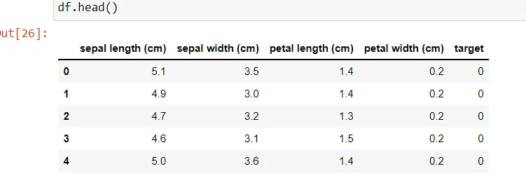

And now we call the query method passing our condition:

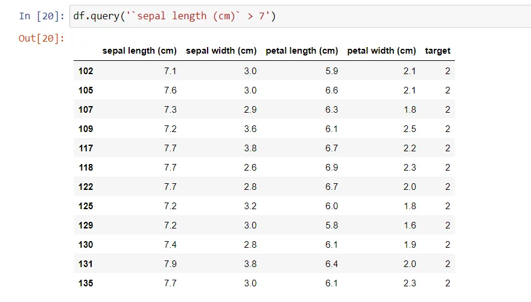

We can get the same result by manually **filtering** the *DataFrame* object:

```python
myfilter = df['sepal length (cm)'] > 7
df[myfilter]
```

This will result in the same results:

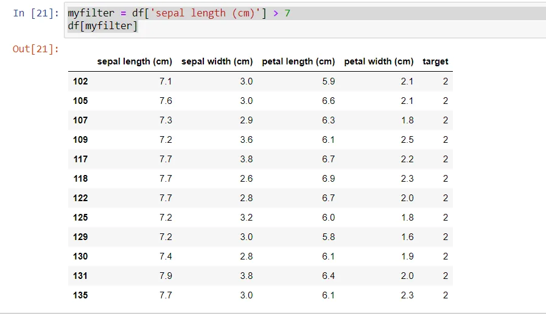

### 2. Grouping and Aggregation
#### 2.1 Aggregation

Aggregation in pandas provides various functions that perform a mathematical or logical operation on our dataset and returns a summary of that function.

- Aggregation can be used to get a summary of columns in our dataset like getting sum, minimum, maximum, etc. from a particular column of our dataset.
- The function used for aggregation is agg(), the parameter is the function we want to perform.
- Some functions used in the aggregation are:

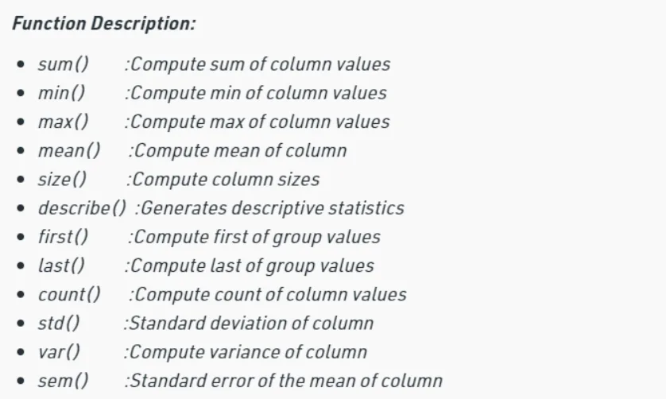

For example:

Let's first create a sample dataset:

```python
df = pd.DataFrame([[9, 4, 8, 9],
                   [8, 10, 7, 6],
                   [7, 6, 8, 5]],
                  columns=['Maths',  'English',
                           'Science', 'History'])

print(df)
```

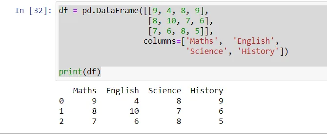

By applying the *sum()* function we calculate the sum of every value.

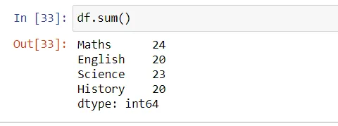

We can also aggregate by multiple functions:

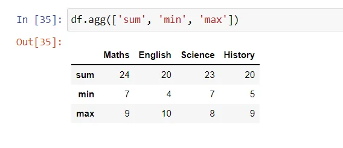

#### 2.2 Grouping

Grouping is used to group data using some criteria from our dataset. It is used as **split-apply-combine** strategy in the following manner:

1. Splitting the data into groups based on some criteria.
2. Applying a function to each group independently.
3. Combining the results into a data structure.

Considering the previous dataset which contains students marks in various subjects:

|  |  |  |  |  |
| --- | --- | --- | --- | --- |
| ​ | Maths | English | Science | History |
| 0 | 9 | 4 | 8 | 9 |
| 1 | 8 | 10 | 7 | 6 |
| 2 | 7 | 6 | 8 | 5 |

Let's use *groupby()* function to group the data on “Maths” value. This will return a *DataFrameGroupBy* object as a result.

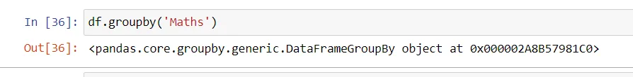

We can inspect the content of the *DataFrameGroupBy* object by calling first on it:

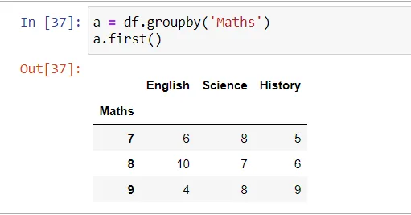

As we can see, the function created **three groups** because there are three **unique** values in the *Maths* column; 7, 8, 9. Each group contains the corresponding values for the rest of the columns; English, Science, and History.

**Let's see a real life example, using grouping and aggregation.**

Consider the following dataset that contains records about daily observations (4 days) of temperatures, windspeeds, events in various cities.

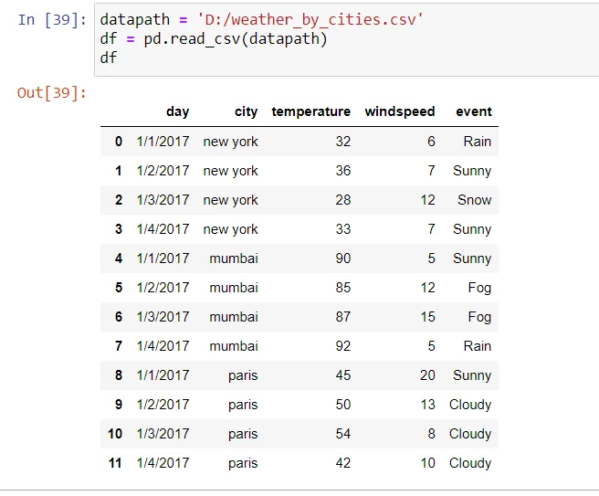

and we want to know What is the maximum temperature in each city during the first 4 days in Jan 2017.

To do so, we will perform the following steps:

1. **Grouping** the *DataFrame* by *city*
2. Selecting only the temperature column of each group
3. **Aggregate** each group using the *max* function

```python
max_temps = df.groupby('city')['temperature'].agg('max')
max_temps
```

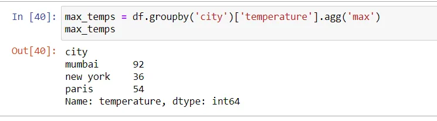

### 3. Pivot Table
Using the function *pivot* we can quickly create a different view of the data and summarize large amount of data by automatically grouping aggregating data.

Considering the same weather dataset. Instead of raw view that shows duplicating days and cities. We want a table that shows values of corresponding to each day and city without the duplicates shown in the original view.

We can do this by calling the *pivot* function on the *DataFrame* object, passing the column *day* as the **table's index**, the column *city* as the table' **columns** and selecting only the *temperature* column of the resulting pivot table.

```python
df.pivot(index='day', columns='city')['temperature']
```

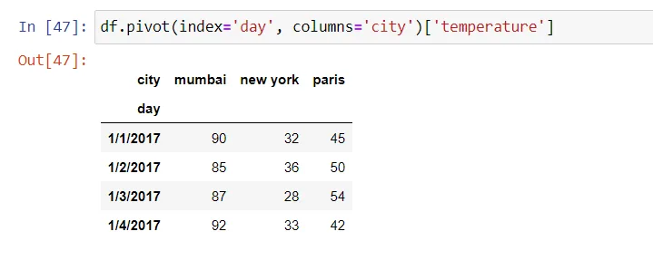

### 4. Apply Method
The *apply* method is used for automatically applying a specific function on a *DataFrame* column(s).

For example:

Let's first create a sample dataset contains student's first name, last name, and average.

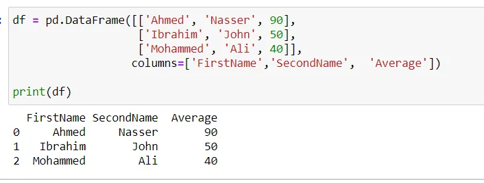

And suppose that we don't want to show averages that below or equal 50, and replace the average with the text "Fail".

First, we implement a function that takes a number and return "Fail" when the number is less than or equal 50.

```python
def grading(num):
    if num <= 50:
        return "Fail"
    else:
        return num
```

And finally we pass that function to the *apply* method:

```python
df['Average'] = df['Average'].apply(grading)
```

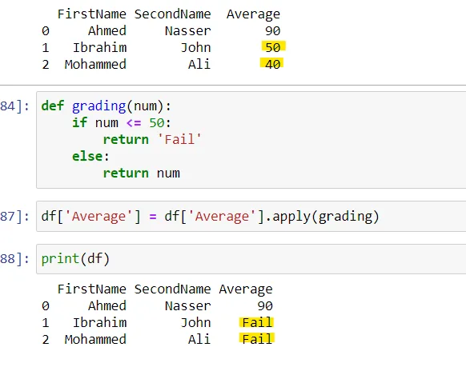

### 5. Counting
Using the *value_counts()* method on a specific DataFrame column will result in counting how many times a unique value has been showed up in the data. For example, counting on the column *event* in the weather dataset:

```python
df['event'].value_counts()
```

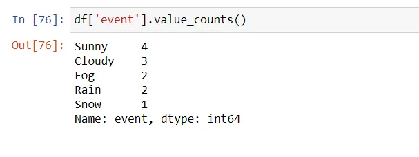

### 6. Dropping Duplicates
Considering the following sample dataset:

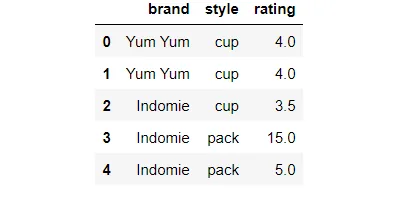

As we can see the rows: 0, and 1 are duplicates. Calling *drop_duplicates()* function will keep only one of the observations.

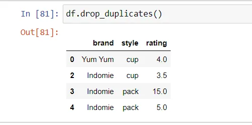

Moreover, we can pass a *subset* parameter to look for duplicates in specific columns instead of all of them.

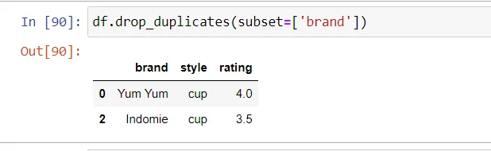

## That's it!
**Thanks for reading!**

**Note:** You can find code included in the blog in my [Github.](https://github.com/96ibman/datainsight_datascience_program/blob/main/PandasTechniques.ipynb)

Best Regards.

## Acknowledgment
This blog is part of the [Data Scientist Program by Data Insight.](https://www.datainsightonline.com/data-scientist-program)

## References
1. [pandas documentation](https://pandas.pydata.org/docs/index.html)
2. [weather.csv](https://raw.githubusercontent.com/codebasics/py/master/pandas/7_group_by/weather_by_cities.csv)
