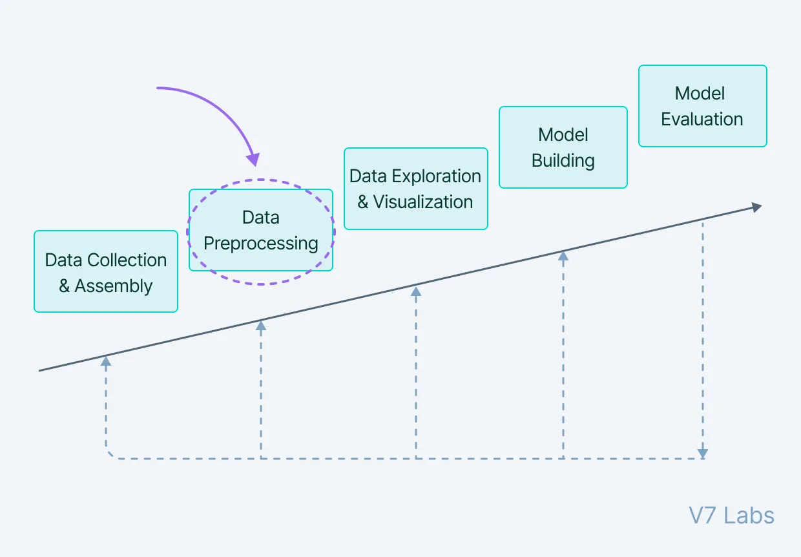
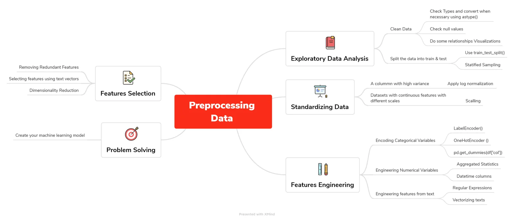
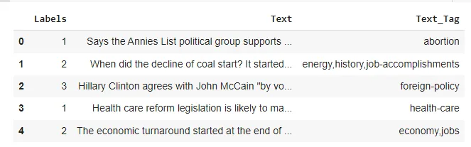
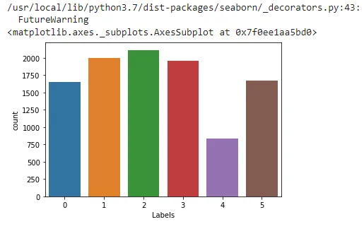
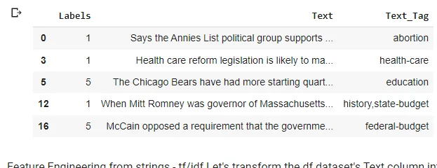

***“ Without big data, you are blind and deaf and in the middle of a freeway”***

***- Geoffrey Moore.***

When we say big data, we mean a huge amount of information gathered. And dealing with it is not very straightforward because data in the real world is quite dirty and corrupted with inconsistencies, noise, incomplete information, and missing values. It is aggregated from diversified sources using data mining and warehousing techniques. When it comes to creating machine learning models, we need precision, so we can create an estimator with good accuracy and a high learning skill. In order to achieve that, we need to preprocess the data we’re working with before feeding it to the model.

**-What do we mean by preprocessing data?** Data Preprocessing includes the steps we need to follow to transform or encode data so that it may be easily parsed by the machine.

The main agenda for a model to be accurate and precise in predictions is that the algorithm should be able to easily interpret the data's features.

Preprocessing data requires different step, i tried to summarize them in a brainmap file using Xmind, so you’ll get a general view of the entire process:



Referring to the map we can see that there are 5 major steps in the process:

**- Exploratory Data Analysis:** From importing your data, to cleaning it and all the way to do some relationships visualizations in order to get some useful insight out from your data. I did a whole article about it, you can find it [here](https://www.datainsightonline.com/post/data-preparation-cleaning-data-in-python-part-2). After this, what we need to do is split your data into train and test, so you avoid overfitting. A better use is to do a stratified sampling in order to avoid imbalanced distributions.

**- Standardizing Data:** The datasets we usually work with have a lot of noise (a lot of variance), the key here is standardization. Standardization is a preprocessing method used to transform continuous data to make it look normally distributed and when working with scikit learn, it becomes a necessary step, because many models assume that the data is normally distributed. To realize it, there’s 2 methods:

- Log Normalization: Useful when you have a specific column with high variance. *How do we know a column’s variance?* df[‘col’].var(). Then, apply a log transformation of the values, which will transform them into a normal scale: np.log(df[‘col’]).
- Scaling Data: Useful with datasets that contain continuous features on different scales and you’re using a model that operates in a linear space. This process will center features so they have a mean equal to 0 and a variance of 1.

**- Feature Engineering:** Is the process of creating new features based on existing ones:

- Encoding Categorical Variables: you can use LabelEncoder() if you have 2 categorical variables (yes or no) and OneHotEncoder() if you have more than 2. Or simply, use the pandas function, get_dummies() and apply it into the column you want to transform.
- Engineering Numerical Features: include the aggregated statistics like for example : creating a new column with the mean values of an existing one or when dealing with datetime columns.
- Engineering features from text: useful when we want to extract data from text fields, we can do it by using the regular expression. Vectorizing texts using tf/idf, which is a way of vectorization that reflects how important a word is in a document beyond how frequently it occurs.

**- Features Selection:** Rather than creating new features, select the existing ones to be used for modeling. When to select features?:

- To get rid of the noise in your model: when you have redundant features
- If features that are strongly statistically correlated.
- If working with text vectors.
- If your features set is large: it’s beneficial to use Dimensionality Reduction.

**- Problem solving:** Finally, after being sure that your data is ready, you can start creating your model. To illustrate everything, I chose a fake news dataset I found on kaggle: "train.csv" that contains 10240 rows x 3 columns (Inlcudes Labels Columns as Target):

- Text - Raw content from social media/ new platforms
- Text_Tag - Different types of content tags (9 unique products)
- Labels - Represents various classes of Labels: Half True :2,
  False :1, Mostly True : 3, True:5, Barely True: 0, Not Known: 4

What we’ll do is feature extraction from raw text using TF-IDF.

**-What is TF-IDF?** TF-IDF stands for *“Term Frequency — Inverse Document Frequency”*. This is a technique to quantify words in a set of documents. We generally compute a score for each word to signify its importance in the document and corpus. This method is a widely used technique in Information Retrieval and Text Mining. Suppose we have this sentence: “This building is so tall”. It's easy for us, humans, to understand it as we know the semantics of the words and the sentence. But how can any program (eg: python) interpret it? It is easier for any programming language to understand textual data in the form of numerical value. So, for this reason, we need to vectorize all of the text so that it is better represented. By vectorizing the documents we can further perform multiple tasks such as finding the relevant documents, ranking, clustering, etc.

Now that we know what we’re dealing with, let’s jump right into it;

We start by importing our libraries and the csv file:

```python
import pandas as pd
import matplotlib.pyplot as plt
import seaborn as sns
from sklearn.feature_extraction.text import TfidfVectorizer
from sklearn.model_selection import train_test_split
from sklearn.metrics import accuracy_score
from sklearn.naive_bayes import GaussianNB
```

```python
df = pd.read_csv('/content/drive/MyDrive/Data science project/assignments/Preprocessing Data/train.csv')
df.head()
```



**-Exploratory Data Analysis:**

Check the shape of our dataframe: we see that indeed there’s 10240 rows and 3 columns

```python
df.shape
```

```python
(10240, 3)
```

Then, we check the types of our columns:

```python
#Checking column types
df.dtypes
```

See if there’s missing data:

```python
df.isnull().sum()
```

```python
Labels      0
Text        0
Text_Tag    2
dtype: int64
```

```python
#Dropping missing data Let's remove some of the rows where certain columns have missing values
df_no_missing = df[df['Labels'].notnull() &
                   df['Text'].notnull() &
                   df['Text_Tag'].notnull()]
df_no_missing.shape
(10238, 3)
```

Do some visualizations to see how many news there’s for each kind:

```python
sns.countplot(df['Labels'])
```



Check if there’s any duplicated rows:

```python
#checking for duplicates
df_no_missing.duplicated().sum()
8
```

```python
df_no_missing = df_no_missing.drop_duplicates()
df_no_missing.shape
(10230, 3)
```

To simplify our example, we'll filter our dataset in order to only keep the true and fals news, this way our prediction will be based on labels: 1 for False and 5 for True.

```python
df_split = df_no_missing[(df_no_missing.Labels == 5) | (df_no_missing.Labels == 1)]
df_split.head()
```



**-Feature Engineering from strings**: - tf/idf Let's transform the df dataset's Text column into a text vector using sklearn TfidfVectorizer() so we can use it in our prediction tasks.

```python
# Take the column text
title_text = df_split['Text']

# Create the vectorizer method
tfidf_vec = TfidfVectorizer()

# Transform the text into tf-idf vectors
text_tfidf = tfidf_vec.fit_transform(title_text)
text_tfidf.shape
(3662, 7442)
```

**- Selecting Feature using Text Vectors:** When we create a tfidf vector of text we don't necessarily need the entire vector to trainour model. We could take something like the top 20% of weighted words across the vector. Rather than just blindly taking some percentage of a tfidf vector, we need to pull out the words and their weights on a per document basis.

After vectorizing our text data, the vocabulary and weights will be stored in the vectorizer.

We need the vocabulary list to look at words weights:

```python
tfidf_vec.vocabulary_
```

```python
{'says': 5917,  'the': 6719,  'annies': 640,  'list': 4026,  'political': 5082,  'group': 3086,  'supports': 6547,  'third': 6749,  'trimester': 6915,  'abortions': 364,...
```

It's a dictionnary wheres the key is the word the value is its weight we need to reverse that for easiest handling:

```python
#reverse the key value pair in the dict
vocab = {v:k for k,v in tfidf_vec.vocabulary_.items()}
```

```python
{5917: 'says',  6719: 'the',  640: 'annies',  4026: 'list',  5082: 'political',  3086: 'group',  6547: 'supports',  6749: 'third',...
```

Now, Let's create a function that returns the weights of words: it takes the reversed vocab list, the original vocab list, the vector we created, the row we want to retrieve data for and top_n words as arguments we want to take from the vector:

First, we zip together the row indices and weights, pass it into a dict function and turn that into a dict, transform it into a series then pull out the n weighted words from the sorted series.

```python
def return_weights(vocab, original_vocab, vector, vector_index, top_n):
    zipped = dict(zip(vector[vector_index].indices, vector[vector_index].data))

    # Let's transform that zipped dict into a series
    zipped_series = pd.Series({vocab[i]:zipped[i] for i in vector[vector_index].indices})

    # Let's sort the series to pull out the top n weighted words
    zipped_index = zipped_series.sort_values(ascending=False)
    [:top_n].index
    return [original_vocab[i] for i in zipped_index]
```

Display the 3 top weighted words forwhere vetor index =8 :

```python
# Print out the weighted words
print(return_weights(vocab, tfidf_vec.vocabulary_, text_tfidf, 8, 3))
```

```python
[2403, 5865, 4910]
```

Using this function , we're going to extract the top words from each document in the text vector, return a list of the word indices, and use that list to filter the text vector down to those top words.
Call return_weights to return the top weighted words for that document. Call set on the returned filter_list so we don't get duplicated numbers.

Call words_to_filter, passing in the following parameters: vocab for the vocab parameter, tfidf_vec.vocabulary_ for the original_vocab parameter, text_tfidf for the vector parameter, and 3 to grab the top_n 3 weighted words from each document.

Finally, pass that filtered_words set into a list to use as a filter for the text vector.

```python
def words_to_filter(vocab, original_vocab, vector, top_n):
    filter_list = []
    for i in range(0, vector.shape[0]):

    # Here we'll call the function and extend the list we're creating
        filtered = return_weights(vocab, original_vocab,
        vector, i, top_n)
        filter_list.extend(filtered)
    # Return the list in a set, so we don't get duplicate
    word indices
    return set(filter_list)

# Call the function to get the list of word indices
filtered_words = words_to_filter(vocab,tfidf_vec.vocabulary_, text_tfidf, 3)

# By converting filtered_words back to a list, we can use it to filter the columns in the text vector
filtered_text = text_tfidf[:, list(filtered_words)]
```

```python
 (0, 1736)	0.32962865285959914   (0, 4085)	0.1380371157612332   (0, 314)	0.2944867151084029   (0, 6055)	0.3812970422355391   (0, 5910)	0.2797352135561342   (0, 5729)	0.29702952868320326   (0, 4433)	0.2875918665193756   (0, 3511)	0.3486979180591432   (0, 552)	0.4003663074350831   (0, 5883)	0.07064595227058747   (1, 5738)	0.4124639460857492   (1, 1195)	0.30459588517350983   (1, 5305)	0.33409405636598233   (1, 2507)	0.32730066858781376   (1, 3622)	0.3463631365960118   (1, 5954)	0.10701717269760518   (1, 3494)	0.3463631365960118   (1, 3169)	0.14149150509359296   (1, 3441)	0.28747791512145626   (1, 4864)	0.28604472635944   (1, 1109)	0.20797856790947114   (1, 2795)	0.19804718083385434   (2, 1680)	0.2391402987735071   (2, 6094)	0.16187467714900788   (2, 1982)	0.17633004294563862....
```

Now, we fit our model into our data:

```python
# Split the dataset according to the class distribution of category_desc, using the filtered_text vector
train_X, test_X, train_y, test_y = train_test_split(filtered_text.toarray(), df_split['Labels'], stratify=df_split['Labels'])

#create your model
nb = GaussianNB()

# Fit the model to the training data
nb.fit(train_X,train_y)

#predict
y_pred = nb.predict(test_X)

print(accuracy_score(test_y,y_pred))
```

```python
0.5131004366812227
```

Here we reach the end of this blog, we'll try to dig further into this classification once we'll go deeper with Natural Language Processing, and we'll try to make a classification based on all the labels.

Happy Learning!

You can find the code [here](https://github.com/asmakrl/datacampstd/blob/main/Preprocessing%20Data/Preprocessing_Data.ipynb).

My roadmap file:
