by [Gilbert T.](https://linktrest.io/temgoua)

## I. Introduction

[NAICS](https://www.census.gov/naics/) (North American Industry Classification System) is an industry classification system developed by the statistical agencies of Canada ([Statistics Canada](https://www.statcan.gc.ca/eng/concepts/index)), Mexico ([Instituto Nacional de Estadistica y Geografia](http://www.inegi.org.mx/)), and the United States ([U.S. Economic Classification Policy Committee (ECPC)](https://www.census.gov/naics/?18967). NAICS is designed to provide common definitions of the industrial structure of the three countries and a common statistical framework to facilitate the analysis of the three economies. The three statistical agencies collect, tabulate, present, and analyze data about their economies. NAICS is a 2- through 6-digit hierarchical classification system (Table 1), offering five levels of detail. Each digit in the code is part of a series of progressively narrower categories, and the more digits in the code signify greater classification detail, however for this project we will limits our analysis to 2- through 4-digit codes.

```python
            Table 1: Structure of NAICS code
```

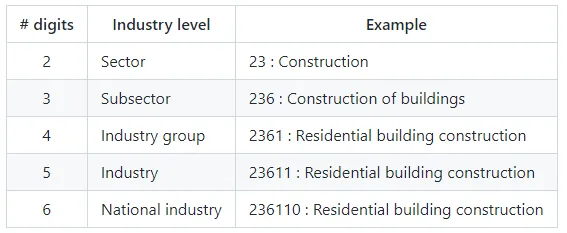

**I.1. Project goals**

This project aims to fill out the **Employment** column of an excel file of 15577 lines containing all the NAICS industry up to 4− digit from 𝐽𝑎𝑛 1997 to 𝐷𝑒𝑐 2018.
Additionally, we will try to provide data-derived answers to the following five questions:

- How employment in Construction evolved over time and how this compares to the total employment across all industries?
- When (Year) was the employment rate the highest between the dedicated time frame?
- Which industry sector, subsector or industry group has had the highest number of employees?
- As a rapidly developing field, if Data Science industry level (Number of digits) in NAICS, is less or equal to 4 then how has Data Science employment evolved over time? Otherwise, What is the lowest industry level above Data Science and how did it evolve from 1997 to 2019?
- Are there industry sectors, subsectors or industry groups for which the employment rate decreased over time?

### I.2. The data

To outstandingly address the above questions, we are provided with 1515 *csv* files (55 files per level of aggregation) beginning with RTRA([Real Time Remote Access](https://www.statcan.gc.ca/en/microdata/rtra)) containing employment data by industry at different levels of aggregation; **2-digit NAICS, 3-digit NAICS**, and **4-digit** on one side.
Each of these files has the following columns in the same order from left to right:

- SYEAR: Survey Year
- SMTH: Survey Month
- NAICS: Industry name and associated NAICS code in the bracket
- _EMPLOYMENT_: Employment

On the other side there is an excel file **LMO_Detailed_Industries_by_NAICS.xlsx** that maps all the NAICS codes with the name of the corresponding industry.

We start by importing the libraries we will need for this task

```python
import os
import pandas as pd
import numpy as np
import datetime as dt
import warnings
import matplotlib.pyplot as plt
import seaborn as sns
from openpyxl import load_workbook
from tqdm import tqdm
warnings.filterwarnings('ignore')
```

## II. Data loading and cleaning

We start our analysis by loading the data into Pandas dataframes. For this sake we define a function that takes the data path and the number of digits of NAICS code as parameters and returns a dataframe that combines all the data contained in the 55 files corresponding to that number of digits.

```python
def create_n_digits_df(data_path, n):

    try:
        isinstance (n, int)
        assert n in [2,3,4]
    except:
        print(f'Wrong value of the parameter n!!!\nExpected an integer 2, 3 or 4 but got {n}.')
        return

    list_n = [x for x in os.listdir(data_path) if re.search(f'_{n}NAICS', x)]
    df = pd.read_csv(data_path + list_n[-1])
    for i in range(len(list_n)-1):
        df2 = pd.read_csv(data_path+list_n[i])
        df = df.append(df2)
    return df

data_path = 'data/'
df2 = create_n_digits_df(data_path, 2)
df3 = create_n_digits_df(data_path, 3)
df4 = create_n_digits_df(data_path, 4)
```

We take a glance at the 10 first rows of the **industry sectors** dataframe.

```python
df2.head(10)
```

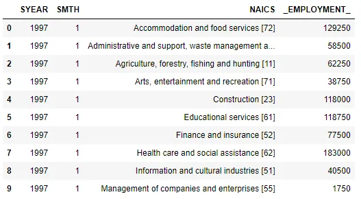

We notice two important facts:

- The NAICS codes are merged with NAICS industry sectors.
- For the times series analysis we need dates but here we have pieces of it that is **survey year** and **survey month**.

To fix these issues, we will create a function **clean_df** that takes a single parameter, the **dataframe** and return its transformed (more suitable for analysis) version.

```python
def clean_df(df):

    def extract_code(x):
        if type(x) == int:
            return [x]
        if '[' not in x:
            y = None
        elif '-' in x:
            code_len = len(x.split('[')[1].replace(']', '').split('-')[0])
            x = x.split('[')[1].replace(']', '').split('-')
            if code_len == 2:
                y = [*range(int(x[0]), int(x[1])+1)]
            else:
                y = [int(i) for i in x]
        else:
            x = x.split('[')[1].replace(']', '')
            y = [int(x)]
        return y

    df['NAICS_CODE'] = df['NAICS'].apply(extract_code)
    df['NAICS'] = df['NAICS'].astype('str').str.split('[').str.get(0).str.strip()
    df['DATE'] = pd.to_datetime(df['SYEAR'].astype('str') + df['SMTH'].astype('str'), format='%Y%m').dt.strftime('%Y-%m')
    df.drop(columns=['SYEAR', 'SMTH'], inplace=True)

    return df

df2 = clean_df(df2)
df3 = clean_df(df3)
df4 = clean_df(df4)
```

```python
df2.head(10)
```

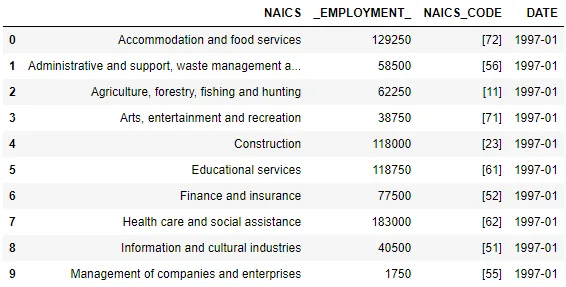

We chose to display NAICS codes as lists of integer because there are some industry sectors represented by more than a single code (*e.g.: Manufacturing [31-33], Transportation and warehousing [48-49]*). Now we check if there are such industries in n-digit datasets. In order to achieve this, we define a function that loops over the values of *NAICS_CODE* of the given dataframe and until it finds a line with 2 or more codes and returns *True*, returns *False* otherwise.

```python
def find_2(df):
    fi = False
    for code in df.NAICS_CODE:
        if code == None:
            pass
        else:
            if len(code) >= 2:
                fi = True
                break
    return fi
print(f'Lines with two or more codes in df2?\t{find_2(df2)}\n\
Lines with two or more codes in df3?\t{find_2(df3)}\n\
Lines with two or more codes in df4?\t{find_2(df4)}')
```

Since only 2-digit codes dataset contains lines with more than one code, it becomes conceivable to drop those lines but further information from *LMO detailed industries by NAICS* is needed.

We now load the detailed industries by NAICS data, which serve as bridge between the n-digit dataframes and the output file. The detailed industries by NAICS will guide us further.

```python
lmo = 'LMO_Detailed_Industries_by_NAICS.xlsx'
df_lmo = pd.read_excel(data_path+lmo, usecols=[0,1])
df_lmo.head()
```

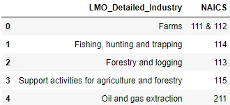

We can see that there are many industries having more than one NAICS code. Along with the 'NAICS_CODE' column of the other datasets, let's shape this column values as lists. To achieve this goal, we create a function *format_lmo_naics* and aggregate the entire column with it.

```python
def format_lmo_naics(x):
    if type(x) == int:
        y = [x]
    else:
        x = x.replace('&', ',').split(',')
        y = [int(i.strip()) for i in x]
    return y

df_lmo.NAICS = df_lmo.NAICS.apply(format_lmo_naics)
df_lmo.head()
```

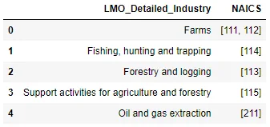

For the sake of a better matching of NAICS industries based on their level of aggregation, we add a new column to *lmo_df***code_len** that will tell us in which n-digit dataset to look for matching NAICS industry.

```python
df_lmo['code_len'] = df_lmo.NAICS.apply(lambda x : len(str(x[0])))
```

In order to definitely consider removing lines with more than one code in *df2*, we check for lines in *df_lmo* where code_len = 2 and len(NAICS code) >= 2 and we retrieve the number of such lines. There is a single line with 2 or more 2-digit naics codes. If there is not a line in *df2* with the same naics codes we can drop all lines from *df2* with two or more naics codes, thus making it possible and safe to use integer naics codes in n-digit datasets.

```python
for i in range(len(df_lmo)):
    if len(df_lmo.NAICS.iloc[i]) >= 2 and df_lmo.code_len.iloc[i] == 2:
        code_check_df2 = df_lmo.iloc[i].NAICS
        print(f'Code to check in df2 : {code_check_df2}')
        break
safety = 'Safe to drop lines with multiple codes!!!'
for naic in df2.NAICS_CODE:
    if naic == code_check_df2:
        safety = 'Unsafe to drop lines with multiple codes!!!'
        break
print(safety)
```

```python
Code to check in df2 : [55, 56]
Safe to drop lines with multiple codes!!!
```

We can safely drop lines with more than one NAICS code from 2-digit dataset and convert *NAICS_CODE* column to ***int.***

```python
df2['to_drop'] = df2.NAICS_CODE.apply(lambda x : len(x)>=2)
df2 = df2[df2.to_drop == False]
df2.drop('to_drop', axis=1, inplace=True)
for df in [df2, df3, df4]:
    df.dropna(inplace = True)
    df.NAICS_CODE = df.NAICS_CODE.apply(lambda x: int(x[0]))
```

**III. Filling out the output file**

Now that we have load and cleaned all the data, let's fill in the empty *_EMPLOYMENT_* column of the output file. We will take a look into that file prior to gathering the necessary data from n-digit datasets.

```python
out_file = 'Data_Output_Template.xlsx'
df_out = pd.read_excel(data_path+out_file, usecols = [0,1,2,3])
df_out['DATE'] = pd.to_datetime(df_out['SYEAR'].astype('str') + df_out['SMTH'].astype('str'), format='%Y%m').dt.strftime('%Y-%m')
df_out.drop(columns=['SYEAR', 'SMTH'], inplace=True)
df_out.head()
```

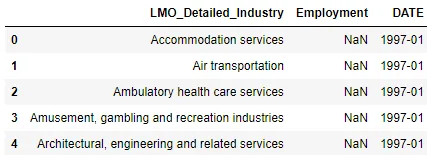

We notice that there are no codes so we will use *lmo_df* as a bridge in that the NAICS code in n-digit datasets will first be matched with codes in *lmo_df* then the industries' names from *lmo_df* will be matched with names from the output file. On the other hand -as clearly specified in the project's instructions- we will aggregate the industries in descending order of importance, that is we first look at matches in 2−𝑑𝑖𝑔𝑖𝑡 dataset, then 3−𝑑𝑖𝑔𝑖𝑡 and finally 4−𝑑𝑖𝑔𝑖𝑡 dataset.

Let's define the function *employment_rate* to address this main concern.

```python
def employment_rate(i):
    global df_lmo, df2, df3, df4, df_out

    employment_out = 0
    naics_name = df_out['LMO_Detailed_Industry'].iloc[i]
    sdate = df_out.DATE.iloc[i]
    naics_codes = df_lmo[df_lmo['LMO_Detailed_Industry']==naics_name].NAICS.item()
    # Choose which n-digit dataset to look in
    code_length = df_lmo[df_lmo['LMO_Detailed_Industry']==naics_name].code_len.item()
    if code_length == 2:
        df = df2
    elif code_length == 3:
        df = df3
    else:
        df = df4

    dfg = df.groupby(['NAICS_CODE', 'DATE'], sort=False).agg({'_EMPLOYMENT_': sum})
    for code in naics_codes:
        try:
            employment = dfg.loc[(code, sdate)].item()
        except:
            employment = 0
        employment_out += employment

    return int(employment_out)
```

```python
for i in tqdm(range(len(df_out))):
    df_out.Employment.iloc[i] = employment_rate(i)
```

```python
df_out.Employment = df_out.Employment.apply(lambda x : int(x))
df_out.head()
```

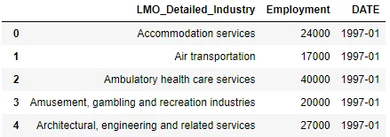

We can now copy the values of employment per NAICS per date in the excel file.

```python
wb = load_workbook(data_path+'Data_Output_Template.xlsx')
ws = wb.active

for i in tqdm(range(len(df_out))):
    cell = f'D{i+2}'
    ws[cell] = df_out.Employment.iloc[i]

wb.save(data_path+'Data_Output.xlsx')
wb.close()
```

## IV. Times Series Analysis: Answer to the questions

### IV.1. How employment in Construction evolved over time and how this compares to the total employment across all industries?

#### a. Evolution of employment in construction

```python
construction = df_out[df_out.LMO_Detailed_Industry == 'Construction']
```

```python
plt.figure(figsize=(10,5))
g = sns.lineplot(x='DATE', y='Employment', data = construction)
g.set_xticks([*range(0,264,12)])
g.set_xticklabels([dat for dat in construction.DATE if '-01' in dat], rotation = 90)
g.set_title('Employment in construction from Jan 1997 to Dec 2018')
plt.scatter(x=['2004-02', '2008-08', '2016-01'], y=[120000, 232750, 197250], c='r', s=100)
plt.axvline(x='2004-02', ymax=0.18, linestyle='--', color='r')
plt.axvline(x='2008-08', ymax=0.88, linestyle='--', color='r')
plt.axvline(x='2016-01', ymax=0.68, linestyle='--', color='r')
plt.annotate('2004-02', xy=('2004-02', 120000), xytext=('2006-01', 140000), arrowprops={'arrowstyle':'->'})
plt.annotate('2016-01', xy=('2016-01', 197250), xytext=('2013-01', 160000), arrowprops={'arrowstyle':'->'})
plt.annotate('2008-08', xy=('2008-08', 232750), xytext=('2008-01', 240000))
plt.grid()
plt.show()
```

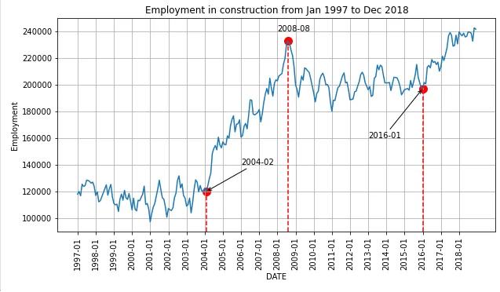

There are four different sections in the evolution of employment rate in construction from 1997 to 2018. Two sections of global steadiness (**Jan 1997−Feb 2004** and **Aug 2008−Jan 2016**) during which the employment rate oscillates around a certain constant, and two section of steep increase (**Feb 2004−Aug 2008** and **Jan 2016−Dec 2018**).

#### b. Comparison of employment in construction with overall employment

```python
df_total_per_date = df_out.groupby('DATE').agg({'Employment':np.sum})
df_total_per_date['Construction_emp(%)'] = (construction.Employment).values * 100 /df_total_per_date.Employment.values
df_total_per_date['Construction_emp(%)'] = df_total_per_date['Construction_emp(%)'].apply(lambda x : round(x,2))
```

```python
plt.figure(figsize = (10,5))
g = sns.lineplot(y='Construction_emp(%)', x='DATE', data=df_total_per_date)
g.set_xticks([*range(0,264,12)])
g.set_xticklabels([dat for dat in construction.DATE if '-01' in dat], rotation = 90)
g.set_title('Percentage of Employment in Construction from 1997 to Dec 2018')
plt.grid()
plt.show()
```

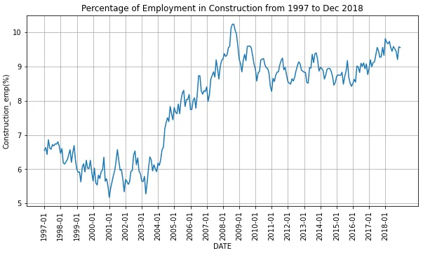

We notice that the portion of employment in construction follows the same fashion like the evolution of employment in construction with a maximum value of 10.23% in **Aug 2008**, just at the end of the first steep increase region of the employment in construction. In contrast, the lowest value was registered in **Jan 2001**, with only 5.18%.

### IV.2. When (Year) was the employment rate the highest between the dedicated time frame?

```python
df_out['DATE'] = pd.to_datetime(df_out['DATE'])
emp_year = df_out.groupby(df_out.DATE.dt.year).agg({'Employment':sum})
emp_year.reset_index()
```

```python
plt.figure(figsize=(10,5))
sns.lineplot(x=emp_year.index, y='Employment', data =emp_year)
plt.title('Total employment per Year')
plt.grid()
plt.show()
```

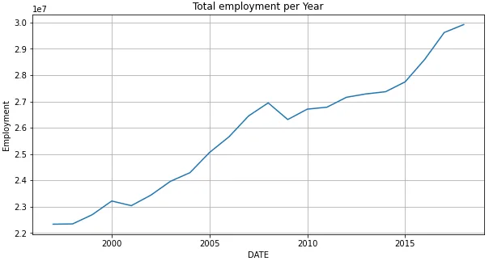

As we would have expected, 2018 is the year with the largest employment rate with a total of 29922000 employees.

### IV.3. Which industry sector, subsector or industry group has had the highest number of employees?

```python
total_counts = df_out.groupby('LMO_Detailed_Industry')['Employment'].sum().sort_values(ascending=False)
total_df = pd.DataFrame({'Industry':total_counts.index, 'Employments':total_counts.values})
fig, ax = plt.subplots(figsize=(10,10))
ax = sns.barplot(x='Employments', y='Industry', data = total_df)
ax.tick_params(axis='y', labelsize=8)
plt.grid()
plt.show()
```

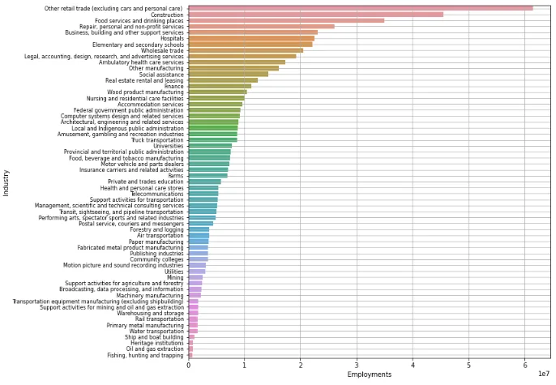

Let's find the number of digits in the NAICS code of **Other retail trade (excluding cars and personal care)** and the number of industry subsectors involved.

```python
df_lmo[df_lmo['LMO_Detailed_Industry']==total_df.head(1).Industry.item()].code_len.item()
3
```

```python
df_lmo[df_lmo['LMO_Detailed_Industry']==total_df.head(1).Industry.item()].NAICS.item()
[442, 443, 444, 445, 446, 447, 448, 451, 452, 453, 454]
```

As shown by the above figure, **Other retail trade (excluding cars and personal care)** is the industry subsector (three digits NAICS) with the largest number of employees. However, this category includes 11 different industry subsectors, so **construction** is definitely the industry sector that employs most people.

### IV.4. As a rapidly developing field, if Data Science industry level (Number of digits) in NAICS, is less or equal to 4 then how has Data Science employment evolved over time? Otherwise, What is the lowest industry level above Data Science and how did it evolve from 1997 to 2019?

Data Science NAICS code is 518210 and its lowest industry sector included in our data (four digit NAICS) is 5182, the name being **Data processing, hosting, and related services**. [[1]](http://localhost:8888/notebooks/Jupiter%20Notebooks/Data%20Insight/Projects/Time%20series%20analysis%20of%20NAICS/time_series_analysis_of_naics_blog.ipynb#naics1), [[2]](http://localhost:8888/notebooks/Jupiter%20Notebooks/Data%20Insight/Projects/Time%20series%20analysis%20of%20NAICS/time_series_analysis_of_naics_blog.ipynb#naics2)

```python
data_science = df4[df4.NAICS_CODE == 5182][['_EMPLOYMENT_', 'DATE']].reset_index()
data_science.drop('index', axis=1, inplace=True)
```

```python
plt.figure(figsize = (10,5))
g = sns.lineplot(y='_EMPLOYMENT_', x='DATE', data=data_science)
g.set_xticks([*range(0,264,12)])
g.set_xticklabels([dat for dat in construction.DATE if '-01' in dat], rotation = 90)
g.set_title('Evolution of data related employment from 1997 to Dec 2018')
plt.grid()
plt.show()
```

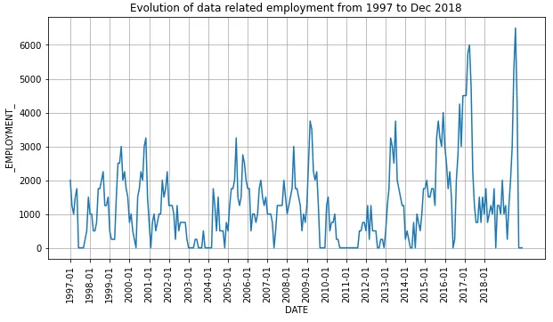

We observe that the data-related employment remain quite globally constant until 2013 then has increased until mid 2017 when it became steady at a relatively low value, before reaching the peak of 6500 employees in **Aug 2018**.

### IV.5. Are there industry sectors, subsectors or industry groups for which the employment rate decreased over time?

To answer this question, we will plot the time series evolution of all the 59 industries included in our data.

```python
data_out = pd.DataFrame(df_out.reset_index().groupby(['LMO_Detailed_Industry', 'DATE'], as_index=False)['Employment'].sum())
data_out = data_out.pivot('DATE', 'LMO_Detailed_Industry', 'Employment')
data_out.index.freq = 'MS'
data_out.fillna(0, inplace=True)
data_out.plot(subplots=True, figsize=(10, 120))
plt.show()
```

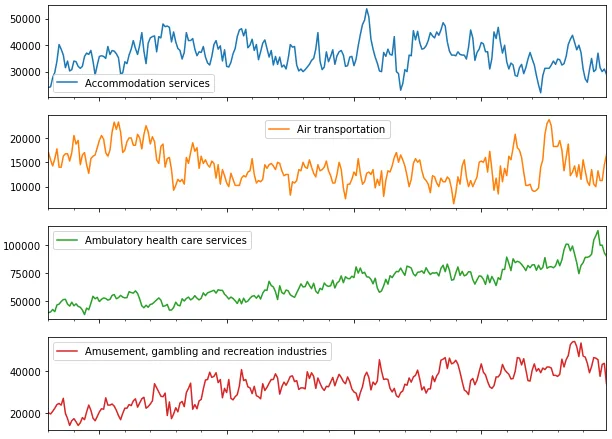

At first sight, the employment rate in the following industries decreased over time:

- Wood product manufacturing
- Telecommunications
- Support activities for agriculture and forestry
- Rail transportation
- Primary metal manufacturing
- Paper manufacturing
- Fishing, hunting and trapping

What would be the potential factors that caused the employment to decrease in those industries from 1997 to 2018?
Additionally, these visualizations are very cumbersome, a dashboard for optimizing their look and presentation is under building.

Find the complete notebook of this project [here](https://github.com/tem-ctrl/time_series_analysis_of_naics).

## References
[1] [North American Industry Classification System (NAICS) Canada](http://localhost:8888/notebooks/Jupiter%20Notebooks/Data%20Insight/Projects/Time%20series%20analysis%20of%20NAICS/www.statcan.gc.ca), 2017 Version 1.0, P. 4848

[2] [NAICS code description](https://www.naics.com/naics-code-description/?code=518210)
