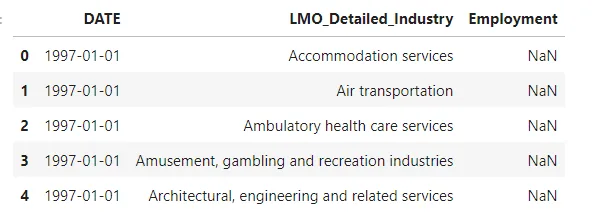
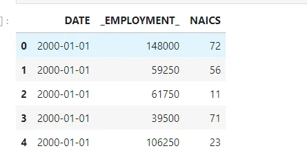
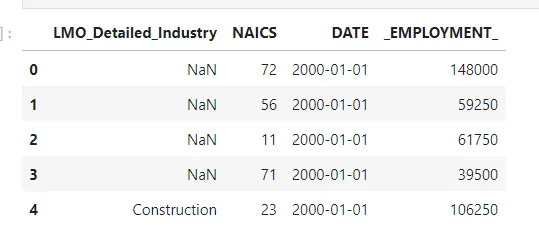
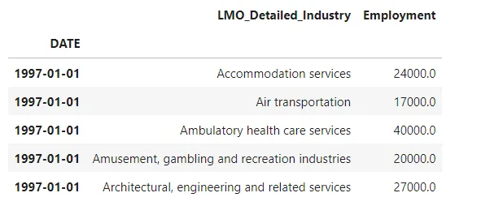
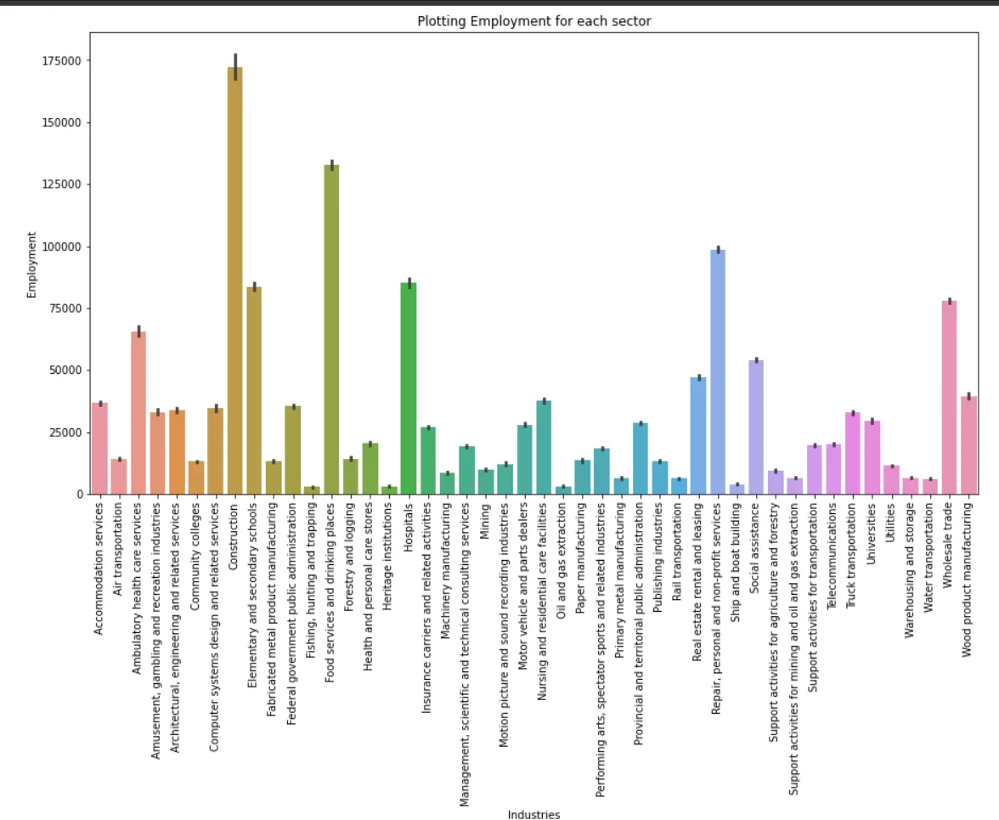
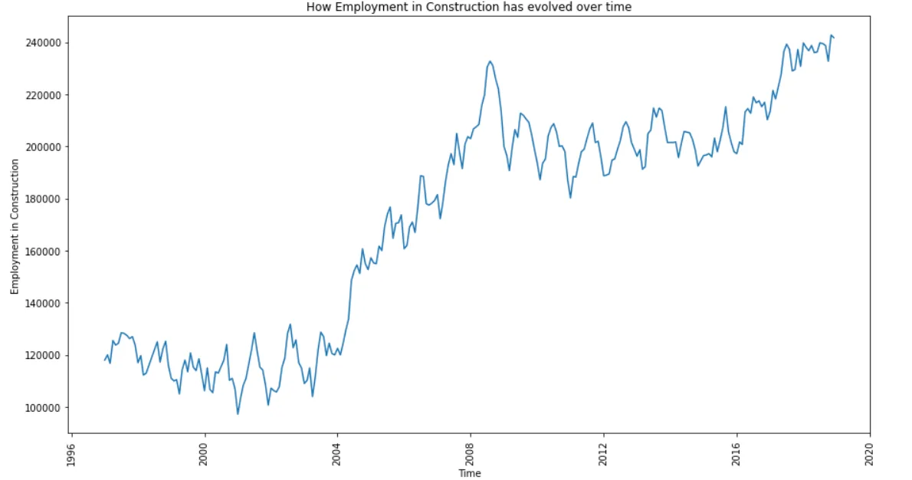
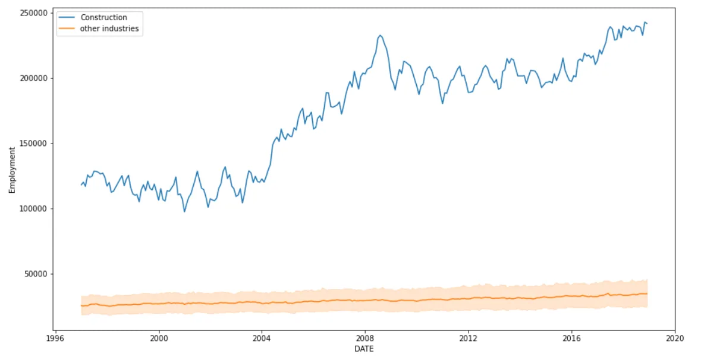
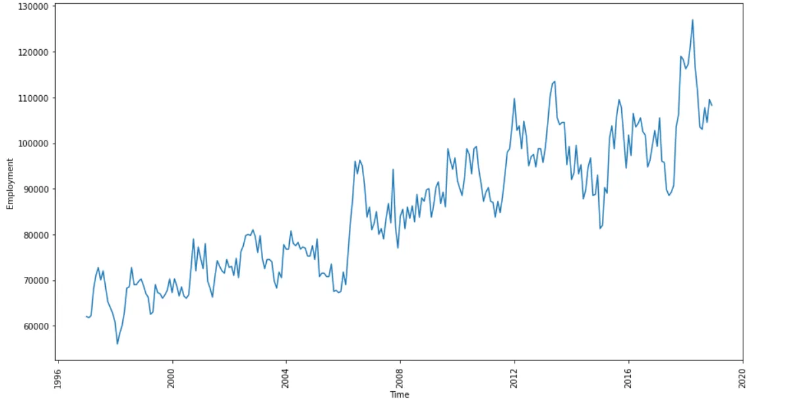
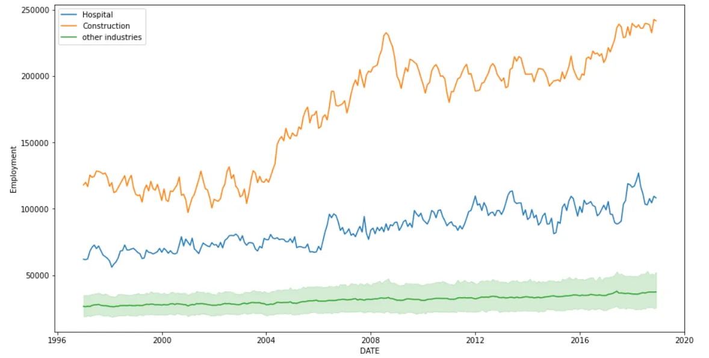
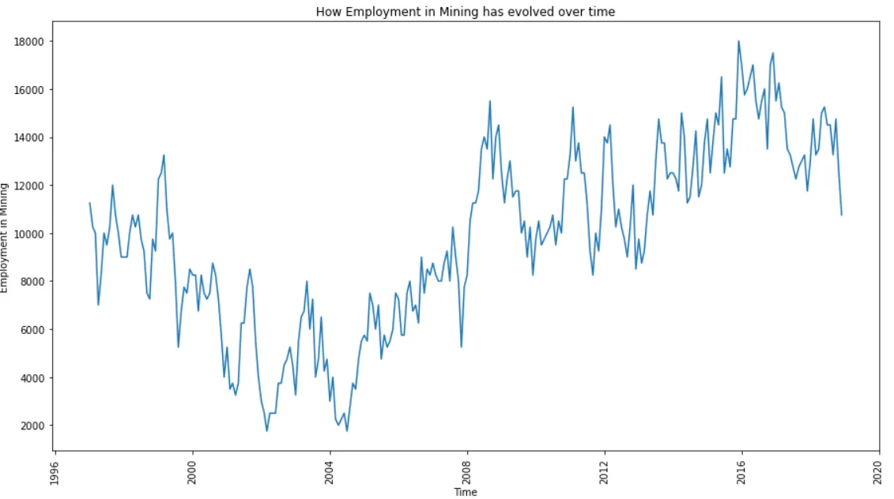

The North American Industry Classification (NAICS) is the standard used by Federal statistical agencies in classifying business establishments for the purpose of collecting, analyzing, and publishing statistical data related to Canada, Mexico and the United States economy.

It gives us definition about the industrial structure of the three countries

The NAICS contains 15 csv files beginning with RTRA. These files contain employment data by industry at levels of aggregation, 2-digit NAICS, 3-digit and 4-digit.

**DATA PRE-PROCESSING AND CLEANING**

The first thing to do in any data analysis project is to process the available data, clean and make sure the data is ready for analysis,

since the NAICS contain 15 csv files, we need to find a way to combine

all these dataset into one, making our analysis very effective.

We first start by combining the 2-digit NAICS datasets together.

In this project, we'll make use of python, so let's start by importing

all the necessary libraries that we'll need.

```python
import pandas as pd
import matplotlib.pyplot as plt
import seaborn as sns
import os
```

The os module help direct us to the directory path of the NAICS data.

NB: The files for this project is downloaded locally, thus there will be a difference in the directory names, the process of cleaning and analysing is still the same.

Let's define our directory where we have the NAICS datasets

```python
DATA_DIR = 'D:\\Data Science\\A_NEWLY_HIRED_DATA_ANALYST (1)\\A_NEWLY_HIRED_DATA_ANALYST\\'
```

The NAICS dataset contains a data output template excel files which contains the industry names and dates, since this will be crucial to our analysis, we'll load the excel file .

```python
#reading the output template file
out_temp_file = 'Data_Output_Template.xlsx'
out_temp = pd.read_excel(os.path.join(DATE_DIR, out_temp_file), parse_dates = {'DATE':['SYEAR', 'SMTH']})
out_temp.head()
```



Next, we'll load LMO_Detailed_Industry excel sheet which contains Industry names and it's naic code.

```python
#reading the LM0_Detailed industy csv file
lmo_file = 'LMO_Detailed_Industries_by_NAICS.xlsx'
lmo = pd.read_excel(os.path.join(DATA_DIR, lmo_file))

# cleaning the lmo dataset lmo['NAICS'] = lmo['NAICS'].astype('str').str.replace('&','')lmo['NAICS'] = lmo['NAICS'].str.strip()lmo.head()
```

Now, we'll continue by creating a function that'll read the csv files of all

the different NAICS datasets, parse the dates and split the industry names from it's naic codes

```python
#reading each csv file, parsing dates and joining the paths def read_csv(file):
''' This function reads the csv files
    parse date into a datetime ,
    and splits the
    naics code from the industry names  '''

    r = pd.read_csv(file, parse_dates={'DATE':['SYEAR','SMTH']})

    r['NAICS'] = r['NAICS'].str.replace(']', '')

    r[['NAICS', 'CODE']] = r['NAICS'].str.split('[', n=1, expand=True)

    return r
```

we'll continue by cleaning the 2-digit dataset which will be the same as the 3-digit, and then merge all with the 4-digit dataset.

```python
# 2 NAICS csv files
file_00_05 = 'RTRA_Employ_2NAICS_00_05.csv'
file_06_10 = 'RTRA_Employ_2NAICS_06_10.csv'
file_11_15 = 'RTRA_Employ_2NAICS_11_15.csv'
file_16_20 = 'RTRA_Employ_2NAICS_16_20.csv'
file_97_99 = 'RTRA_Employ_2NAICS_97_99.csv'

# using the read_csv function, apply it to all the files
file1 = read_csv(os.path.join(DATA_DIR, file_00_05))
file2 = read_csv(os.path.join(DATA_DIR, file_06_10))
file3 = read_csv(os.path.join(DATA_DIR, file_11_15))
file4 = read_csv(os.path.join(DATA_DIR, file_16_20))
file5 = read_csv(os.path.join(DATA_DIR, file_97_99))

#concatenating all the two digit files and selecting the
# date of interest
two_digit = pd.concat([file1, file2, file3, file4, file5])
two_digit = two_digit[two_digit['DATE'] < '2019-01-01']

#further cleaning

#column of interest is NAICS CODE, DATE AND _EMPLOYMENT_, dropping any other columns
two_digit = two_digit.drop('NAICS', axis=1)
#re assigning the NAICS NAME
two_digit = two_digit.rename(columns={'CODE': 'NAICS'})
two_digit.head()
```



Finally we merge the two digit dataset with lmo on the naic column

```python
data_2 = lmo.merge(two_digit, on='NAICS', how='right').reset_index(drop=True)data_2.head()
```



This process is repeated for the 3-digit and 4-digit dataset

After this is done, we get a new dataset, showing the few rows below;



**ANALYSING THE DATA**

A properly processed and cleaned is useless if we cannot get insight from it. That is what we want from a data after several hour of processing and cleaning, insight !

In this second part of the project, we will answer some questions which will give us insight into the data.

But first, let's visualize the employment in each sector, which industry has the higest employment ?

```python
plt.figure(figsize=(15,8))
sns.barplot(x='LMO_Detailed_Industry', y='Employment', data=output_industries)
plt.xlabel('Industries')
plt.ylabel('Employment')
plt.title('Plotting Employment for each sector')
plt.xticks(rotation=90)
plt.show()
```



Construction has the higest employment rate, this insight opens doors to answer more questions about the data,

How has employment in construction evolved over time ?

```python
construction = output_industries[output_industries['LMO_Detailed_Industry'] == 'Construction']

plt.figure(figsize=(15,8))
sns.lineplot(x=construction.index, y='Employment', data=construction)
plt.xlabel('Time')
plt.ylabel('Employment in Construction')
plt.title('How Employment in Construction has evolved over time')
plt.xticks(rotation=90)
plt.show()
```



This tells us that, looking at the big picture, employment increased over the years .

The next question; with this employment, how does it vary with the other employments in the industry

```python
not_construction =
output_industries[output_industries['LMO_Detailed_Industry'] != 'Construction']

plt.figure(figsize=(15,8))
sns.lineplot(x=construction.index, y='Employment', data=construction, label='Construction')
sns.lineplot(x=not_construction.index, y='Employment', data=not_construction, label='other industries')
plt.show()
```



We see that, employment in construction was really high compared to other employment across industries

```python
Hospital = output_industries[output_industries['LMO_Detailed_Industry'] == 'Hospitals']

plt.figure(figsize=(15,8))
sns.lineplot(x=Hospital.index, y=Hospital.Employment, data = Hospital)
plt.xticks(rotation=90)
plt.xlabel('Time')
plt.ylabel('Employment')
plt.show()
```



We can see that there is variation of employment in the hospital sector across the year's, overall the employment rate in the hospital sector rallied up.

Let us look at how the Hospital sector evolved in relation to other sector in the industries

```python
not_Hospital = output_industries[output_industries['LMO_Detailed_Industry'] != 'Hospitals']

plt.figure(figsize=(15,8))
sns.lineplot(x=Hospital.index, y=Hospital.Employment, data=Hospital, label='Hospital')
sns.lineplot(x=construction.index, y='Employment', data=construction, label='Construction')
sns.lineplot(x=not_Hospital.index, y='Employment', data=not_Hospital, label='other industries')
plt.show()
```



From the graph, whiles the Employment rate of the Hospital industry did increase over time gradually

the employment rate in the Hospital industry experienced a subtle increase over the years.

Our last question will be,

How has the Mining industry evolved over time ?

did it increase sharply or it was subtle?

was there a lot of variations or it looked like cycles ?

let us answer this question

```python
Mining = output_industries[output_industries['LMO_Detailed_Industry'] == 'Mining']

plt.figure(figsize=(15,8))
sns.lineplot(x=Mining.index, y='Employment', data=Mining)plt.xlabel('Time')
plt.ylabel('Employment in Mining')
plt.title('How Employment in Mining has evolved over time')
plt.xticks(rotation=90)
plt.show()
```



Overall, the employment rate in the Mining industry did increase, despite the pit fall starting from 2000 through to 2008

**CONCLUSION**

This analysis fairly gives us insight into the NAICS dataset.

Thank you.
