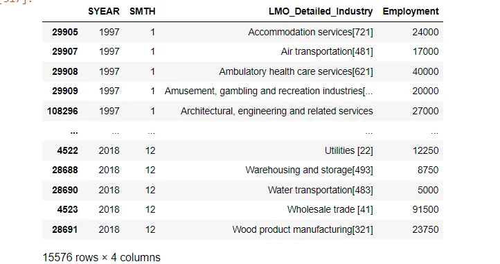
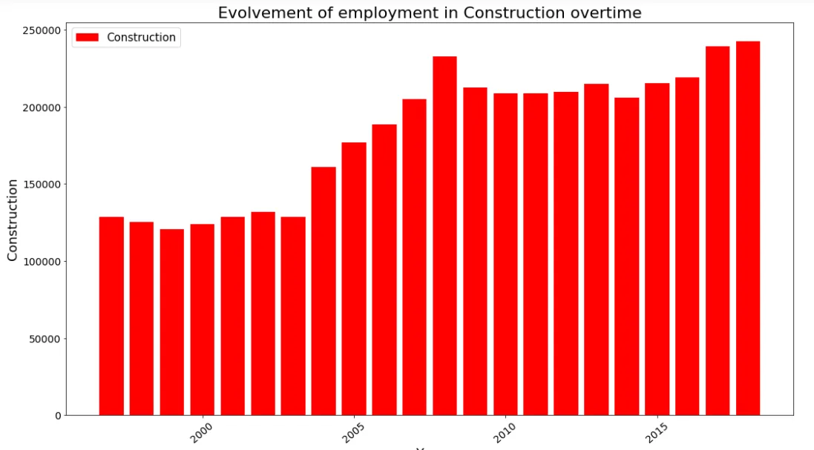
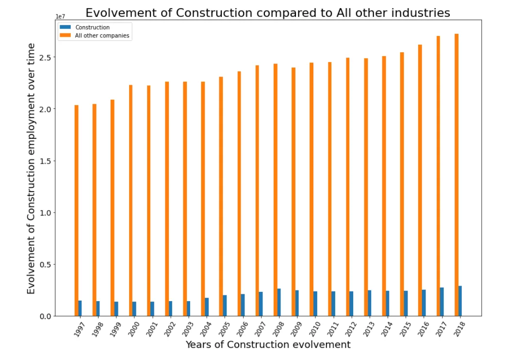
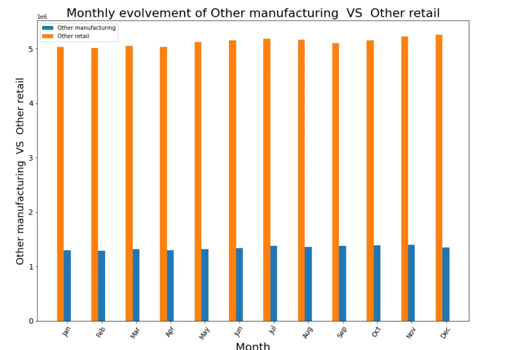
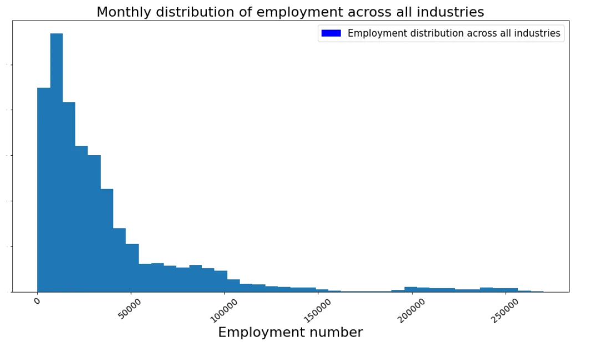
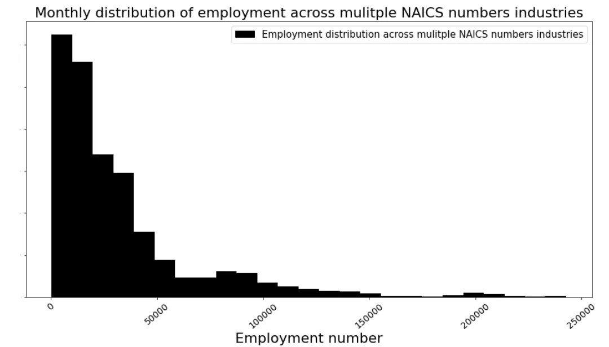
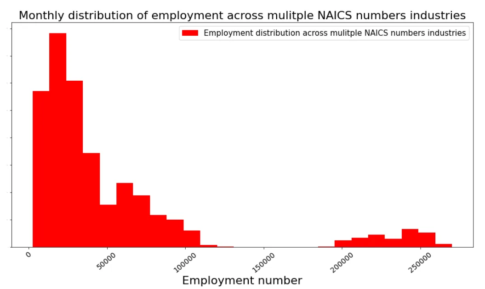

The North American Industry Classification System (NAICS) is an industry classification system developed by the statistical agencies of Canada, Mexico, and the United States. NAICS is designed to provide common definitions of the industrial structure of the three countries and a common statistical framework to facilitate the analysis of the three economies.

**Description of the NAICS.**
 Classification System (NAICS). All you would need to understand for this task is, how the NAICS works as a hierarchical structure for defining industries at different levels of aggregation. For example, a 2-digit NAICS industry is composed of some 3-digit NAICS industries. Similarly, a 3-digit NAICS industry is composed of 4-digit NAICS industries.

**Preparation of Datasets.**

For this analysis, we are given 15 different datasets containing information for industries in the years from 1997 to 2020. All necessary libraries needed for this analysis will have to be imported first (ie. pandas, numpy, matplotlib, glob). Combining all 15 files as one dataframe will make it much more efficient to work with.

```python
file_path = r'C:\Users\vanes\OneDrive\Desktop\RTRA_csv'
all_csv_files = glob.glob(file_path + '/*.csv')

csv_list = []

for csv_file in all_csv_files:
    combined_dataframe = pd.read_csv(csv_file, index_col = None, header = 0)
    csv_list.append(combined_dataframe)

data = pd.concat(csv_list, axis = 0, ignore_index = True)
```

Since the final output requires only 59 industries from the entire datasets, we will extract the data for all the 59 industries (from 1997- 2020) and merge them as one dataframe.

```python
data_output = pd.concat([data_output_mixed, data_output_single])
data_output = data_output.sort_values(['SYEAR', 'SMTH', 'LMO_Detailed_Industry'])
data_output
```



Now that the required data has been extracted into one dataframe, analysis can be made about the data.

**How employment in Construction evolved over time and how this compares to the total employment across all industries?**





From the graph above, it can be seen that the rate of employment in the Construction industry developed much more than all other industries.

**How employment in other manufacturing evolved over time, compared to the employment across other retail trade in terms of month and years?**



Employment in retail industries is higher than that of the manufacturing industries, both industries are seen to be around the same level of employment in each month.

**What is the monthly distribution of employment across all industries?**



**What is the monthly distribution of employment of multiple NAICS numbers industries VS single NAICS number industries?**



Lots of single NAICS number industries have an employment number less than 50,000. The number of industries is seen to decrease while the number of employment increases.



The highest number of employment in multiple NAICS number industries is 20,000.
