## Table of Contents
**Introduction**

**1. Import Libraries**

**2. Define Functions**

**3. Load the Datasets**

**4. Data Preparation**

**5. Exploratory data Analysis (EDA)**

## Introduction
In this post, we demonstrate data preparation techniques and analysis using the Employment data classified by industry using the North American Industry Classification System (NAICS). The following steps have been employed in the analysis:

- Definition of functions for transforming and cleaning of the data. The following are the functions that have been defined:

  - Function for Reading .csv Files. The function takes in a list of .csv file names and the path to the folder containing the files. it then reads all the files and stores them as Pandas Dataframes in a list.
  - Function for Cleaning the Data. The function takes in a dataframe and performs data cleaning and transformation.
  - Function for Filtering All Industry Data. The function takes in a dataframe and returns a dictionary that filters data for each industry. The keys are the industry names and the values are the filtered dataframe for that industry.
- Loading the Datasets.

  - We first start by loading the mapping .csv file for mapping the NAICS numbers to the Industry Details.
  - We then load the employment files into a list of dataframes using the defined function for loading .csv files.
- Data Preparation. The following are the data preparation processes performed:

  - Cleaning each of the dataframe in the list of dataframes. This ensures that the industries in each NAICS column are represented by the Industry Number and not name
  - Merging the Cleaned Data. The dataframes in the list that have been cleaned are merged into one dataframe.
  - Data mapping. The mapping dataframe is transformed into a dictionary which is then used to map the Industry Names to the NAICS numbers in the merged dataframe for employment.
  - Grouping the Merged dataframe. After mapping the dataframe, the dataframe is sorted and grouped by year, month and industry with employment values aggregated by summing
- Exploratory Data Analysis. We analyze the data by considering the following explorations:

  - Descriptive Statistics and Distribution
  - Evolution of Employment in Construction over Time
  - Relationship of Employment in Construction and in Architectural, engineering and related services
  - Share of Employment by Industry for Top 10 Industries
  - Average Employment Levels per Month

## 1. Import Libraries
## 2. Define Functions
### 2.1 Function for Reading csv files
### 2.2 Function for Cleaning the Data
### 2.3 Function for Filtering All Industry Data
## 3. Load the Datasets
### 3.1 Load the RTRA Data Mapping File
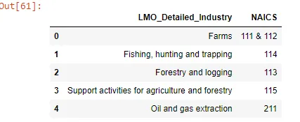

### 3.2 Load the RTRA Employment Data Files
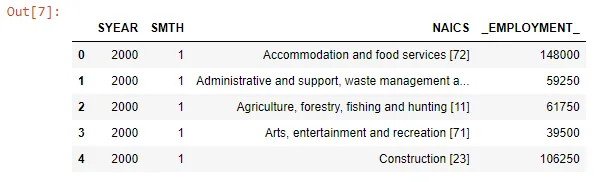

## 4. Data Preparation
### 4.1 Cleaning the data in the Dataframe List
### 4.2 Merging the Cleaned Dataframes
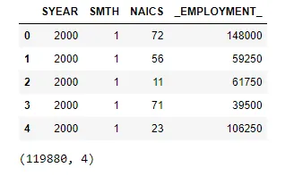

### 4.3 Data Mapping
#### 4.3.1 Create a Mapping Dictionary from the Mapping Dataframe

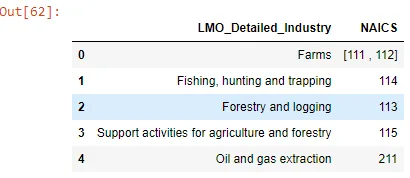

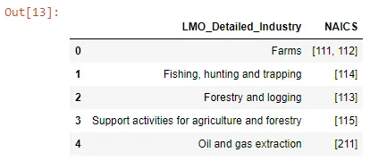

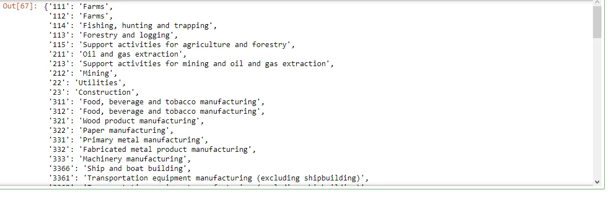

#### 4.3.2 Map the NAICS to Industry Details using the Mapping Dictionary
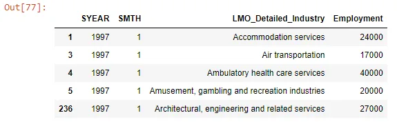

#### 4.3.3 Group the Merged dataframe
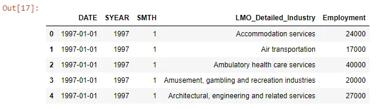

## 5. Exploratory data Analysis (EDA)
We explore the employment data across the different industries and address the following questions:

1. Descriptive Statistics and Distribution
2. Evolution of Employment in Construction over Time
3. Relationship of Employment in Construction and in Architectural, engineering and related services
4. Share of Employment by Industry for Top 10 Industries
5. Average Employment Levels per Month

### 5.1 Descriptive Statistics and Distribution
From the descriptive statistics we note that the employment data has a wide range and variability with a minimum of zero employment recorded in some instances to a maximum of 524500. The histogram plot shows a distribution which is skewed to the right with observable outliers. For the purpose of this analysis, we will not remove the outliers but will take into consideration their presence when making any sort of interpretations.

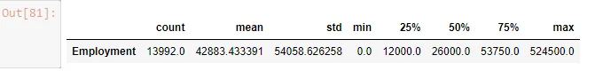

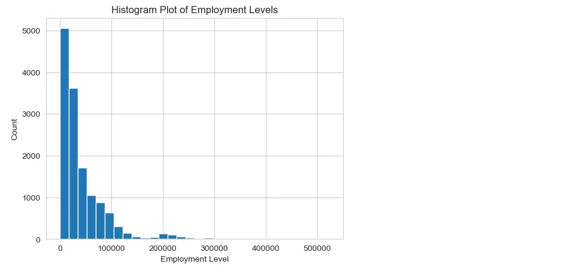

### 5.2 Evolution of Employment in Construction over Time
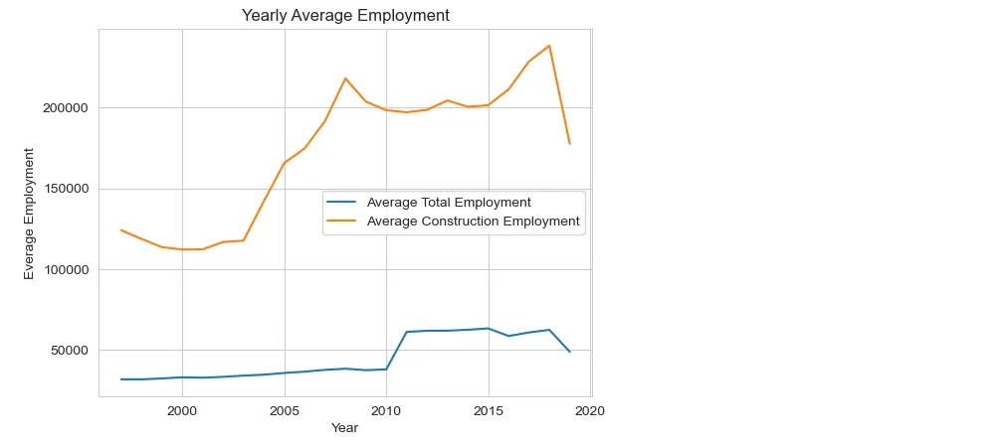

From the analysis of the evolution of the employment in the Construction industry, we note that the employment levels steadily increased from around 2004 after a period of relatively no movement from before 2000. This steady average increase continued to somewhere around 2008 when again a relatively no movement was observed until 2015 when again employment levels increased. This increase went to somewhere 2017 after which a sharp decline was noticed from 2017.

Compared to the overall average, the Construction average is higher. This can be due to the fact that the Construction numbers maybe on a higher outlier end which affects the average. The overall employment showed only slight increase from before 2000 to 2010 when a an increase was noticed up to 2011 before another flat period started lasting till 2018 when the levels dropped.

### 5.3 Relationship of Employment in Construction and in Architectural, engineering and related services

We explore whether the employment levels in the Construction industry as a whole as an effect on employment levels of Architectural, engineering and related services. This will provide us with insights of whether the increased construction employment results in increases Architectural, engineering and related services which will inform us as to whether construction works are utilizing the services of qualifies Architects and Engineers.

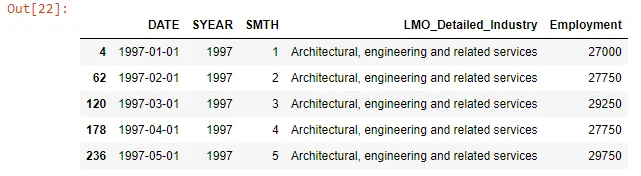

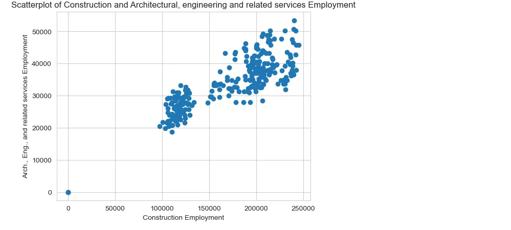

We note that the scatterplot of the Construction Employment and the Architectural, engineering and related services Employment shows a strong positive linear relationship. An increase in Construction Employment overall leads to an increase in the Architectural, engineering and related services Employment. this is confirmed by a positive correlation coefficient of 0.844. This indicates that the increase in construction works do result in an increase in the use of qualifies Architects and Engineers.

### 5.4 Share of Employment by Industry for Top 10 Industries

We explore the share of employment by industry to uncover which industries employs more compared to the other industries. We will consider the top 10 Industries in terms of employment

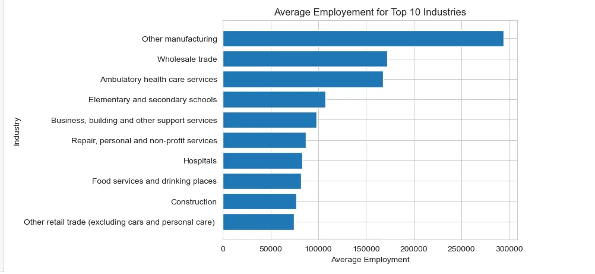

We note that the Other Manufacturing industry has the highest levels of employment. This is followed by the Wholesale trade. Construction is on number 9 on the top ten industries.

**5.5 Average Employment Levels per Month**

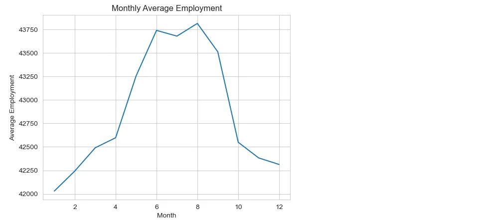

To understand the changes in employment levels over the months of the year we look at the average employment levels for each month. We note that the distribution of the employment levels over the moths has close to a bell shaped distribution with majority of employment being within the mid year and reduced levels during the start and end of year.

## GitHub Link

Notebook for the full code can be found from this [GitHub link](https://github.com/Musonda2day/Data-Scientist-Program---Data-Insight/tree/main/projects/NAICS%20Time%20Series%20Analysis).
