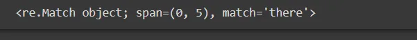
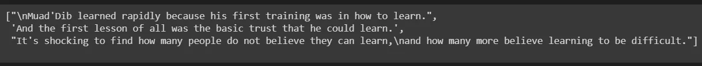
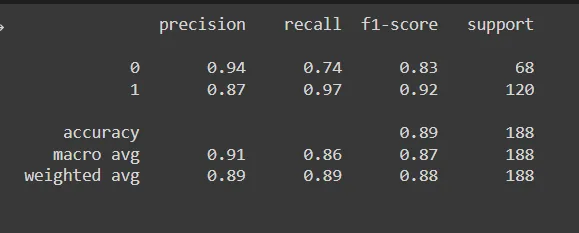
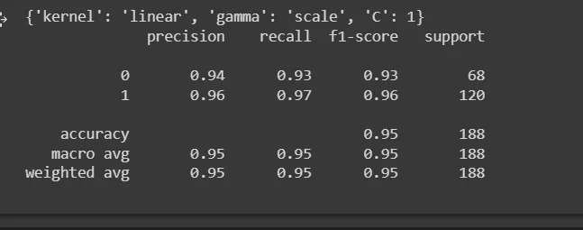

Most part of a data scientist role will not only lie on beautifully structured data for you to just start training and validating your models, however, you will also most likely face unstructured data most of the time.

Unstructured data forms 80-90 % of big data, and it includes data from IoT(internet of things) devices, surveillance data, emails, records, etc.

Text is unstructured data and it will be our goal to know how to preprocess and analyze them, and this process is loosely called *Natural Language processing.*

Natural language processing (NLP) is a field that focuses on making natural human language usable by computer programs.

NLTK, or Natural Language Toolkit, is a Python package that we will use for NLP analysis in this article.

**REGEX**

To start with, let's talk about regex first, which stands for regular expression.

It is a technique we can use to analyze simple text, extract needed information from a text like an email, phone number, etc., and use them for further analysis.

We can use the "re" module in python to perform basic regex operations

```python
import re

text = "there was a heavy rainfall"
x = re.search("[a-z]+", text)
print(x)
```



This simple illustration shows us how we can use the regex module in python to extract the information we desire from the text for further processing.

Ideally, to really understand and work with text data, we need to use a package specifically made for Natural Language Processing, **NLTK.**

Let's understand some concepts that will prove significant in processing text data.

**corpus or corpora**

A usually large collection of documents that can be used to perform statistical analysis and hypothesis testing

**Bag of words**

A commonly used model in text classification

**Latent Semantic Analysis (LSA)**

The process of analyzing relationships between a set of documents and the terms they contain.

**Word Sense Disambiguation**

The ability to identify the meaning of words in context in a computational manner.

**Preprocessing Technique**

This article will cover only the most basic technique for preprocessing text data, as this is just an introduction.

Every Machine learning project comes with preprocessing, with the aim to make the learning process much smoother and faster.

1. *Lowercase the words:* computers see "cat" be different from "Cat", but, that is not the case in our real world. Hence, all the words need to be in lowercase
2. *Remove punctuations and stop words:* punctuations by themselves have no meaning, hence it doesn't hurt to remove them, also words like "he", "himself", "the", "an" etc. are common words that appear frequently, hence removing them reduces the amount of data the algorithm will handle, making the process faster

**TOKENIZATION**

By tokenizing, we can split a text either by word or by sentence, this allows us to work with small pieces of text that are still meaningful even outside of the context of the text under study.

tokenization is our first step in transforming unstructured data into structured data which makes it easier to analyze.

in text analysis, we can either tokenize by word or by sentence.

Let's look at how we can implement tokenization using the nltk library

```python
from nltk.tokenize import sent_tokenize, word_tokenize

example_string = """
  Muad'Dib learned rapidly because his first training was in
  how to learn.
  And the first lesson of all was the basic trust that he
  could learn.
  It's shocking to find how many people do not believe they
  can learn,
  and how many more believe learning to be difficult."""
```

tokenizing by sentence;

```python
sent_tokenize(example_string)
```



tokenizing be word;

```python
word_tokenize(example_string)
#output will contain a long list of words which
#is not preferable to fit on this page
```

try to implement the above code;

**USES**

After preprocessing and training our algorithm on the data, we make predictions with them.

We can use NLP to make sentiment analysis to know whether a user likes or dislike a product based on the comments, and this is widely used in e-commerce.

**. . .**

**MODEL VALIDATION**

At the stage of training a model in a data science project, and after training a model, you will want to know the performance of your model on unseen data.

We can make changes to some parameters the model used in learning, this is called hyper-parameter tuning.

There are two common techniques we can employ to change hyperparameters

**Grid Search CV**

Grid search is the most basic hyperparameter tuning approach. We basically partition the hyperparameter domain into a discrete grid.

Then, using cross-validation, we try every combination of values in this grid and calculate various performance measures.

The ideal combination of values for the hyperparameters is the point on the grid that maximizes the average value in cross-validation.

Let's take a look at how this can be implemented;

```python
from sklearn.datasets import load_breast_cancer
from sklearn.metrics import classification_report, confusion_matrix

from sklearn.svm import SVC
from sklearn.model_selection import train_test_split, GridSearchCV, RandomizedSearchCV

dataset = load_breast_cancer()
X = dataset.data
y = dataset.target

X_train, X_test, y_train, y_test = train_test_split(X, y, test_size=0.33, random_state=51)

model = SVC()
model.fit(X_train, y_train)

predictions = model.predict(X_test)
print(classification_report(y_test, predictions)
```



Randomized Search cv;

```python
# defining parameter range
param_grid = {'C' : [0.1, 1, 10, 100],
              'gamma': [1, 0.1, 0.01, 0.001, 0.0001],
              'gamma': ['scale', 'auto'],
              'kernel': ['linear']}

grid = RandomizedSearchCV(SVC(), param_grid, refit=True, verbose=3, n_jobs=-1)

grid.fit(X_train, y_train)
print(grid.best_params_)

grid_predictions = grid.predictions(X_test)

#classification report
print(classification_report(y_test, grid_predictions))
```



from 89 to 95 accuracy score, this show that model validation can greatly improve your model and be able to predict well on unseen data.

Try, and use the same approach as Randomized search cv to implement grid search cv, they are basically the same.

**CONCLUSION**

and that brings us to the end of this article, we looked at NLP and model validation, stay tuned for upcoming articles.

Thank you for reading!
