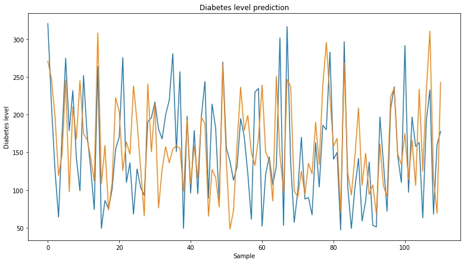
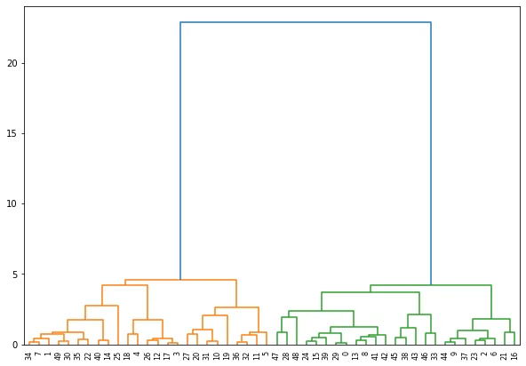
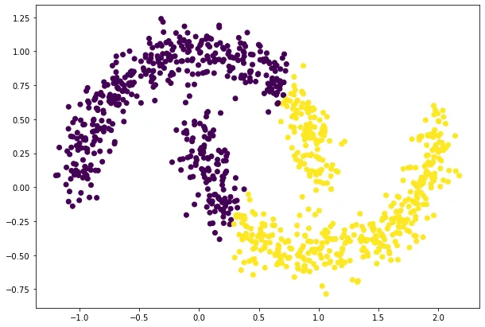

In the recent blogs, we discovered a few things about machine learning algorithms; Regression and Classifications models, be it Linear, Logistic, SVMs, Decision Trees, etc... But that doesn't seem to be enough. So, here we are again. I'll make sure to provide you with more valuable information.

Today we'll cover two main things: Extreme Gradient Boosting and ML Clustering. Yes, that means we'll hop in from the territory of **supervised learning to the unsupervised learning** in the second part of this post.

### I- Extreme Gradient Boosting

In the last post, we talked about random forests which makes use of the bagging technique to produce better models. In case you forgot what that means, check this [post](https://www.datainsightonline.com/post/yet-another-bite-sized-information-machine-learning-blog). The post also has a brief definition of boosting:

> **Boosting** **is an ensemble technique to create a collection of predictors. models are learned** **sequentially** **with early learners fitting simple models to the data and then analyzing data for errors.**

(Definition from Boosting extracted from this [post](https://towardsdatascience.com/decision-tree-ensembles-bagging-and-boosting-266a8ba60fd9))

**Early learners** in the definition above are also known as **weak learners**.

**Weak learner**: Any learners than can perform better than random chance. (Example for binary classification: Accuracy above 50%)

Boosting takes a **set of Weak learners** and converts them to **one strong learning** by **weighing each model's prediction to its performance** and **generating a new output.**

This time we'll focus more on the boosting technique and how the library **XGBoost** makes use of it (and why it's super loved by ML Devs).

**XGBoost** is an **optimized gradient boosting** (I highly recommend taking the time to reading this article about [**Gradient Boosting**](https://towardsdatascience.com/gradient-boosted-trees-for-classification-one-of-the-best-machine-learning-algorithms-35245dab03f2) as it is a whole matter that just can't be ignored.) machine learning library that was built on C++. And, in our case, we'll be making use of its Python API.

It is not an underestimation to state that it's one the most loved algorithms for its performance and speed (thanks to its parallelization) and it's easily outperforming many other ML models.

Here's the final cherry on the cake. It can do both **regression and classification.**

Let's check some code samples with both Regression and Classification:

##### 1- Classification with XGBoost
For this classification demo, we'll be using the "Hello world" dataset "Iris flower dataset". In the second part of the blog for the clustering, we'll be generating artificial data through the Scipy library for new flavors and visualization purposes.

```python
iris = datasets.load_iris()
print(iris.keys())
X = iris.data
y = iris.target

X_train, X_test, y_train, y_test = train_test_split(X, y, stratify = y,test_size = 0.25, random_state = 0) ##Keep class proportions via the stratify term
scaler = StandardScaler().fit(X_train) #Fit a scaler for
X_train_scaled = scaler.transform(X_train) #Transform training data
X_test_scaled = scaler.transform(X_test) #Transform testing data

##CLASSIFICATION
for eta in [0.03,0.3,5,10]:
    xg_cl = xgboost.XGBClassifier(booster= "gbtree",eta = eta,objective='multi:softprob', verbosity=0, n_estimators=50, seed=123,use_label_encoder=False)
    xg_cl.fit(X_train_scaled,y_train)
    preds = xg_cl.predict(X_test_scaled)
    accuracy = accuracy_score(y_test,preds)
    print("eta: {} ,accuracy: {:.2f} %".format(eta, accuracy * 100))

 ###OUTPUT###
eta: 0.03 ,accuracy: 100.00 %
eta: 0.3 ,accuracy: 94.74 %
eta: 5 ,accuracy: 94.74 %
eta: 10 ,accuracy: 76.32 %
```

This code will demonstrate the usual Build model, fit, train pipeline as usual but also demonstrates the new concept of learning rate.

**Learning rate (eta):** Learning rate is a really general concept which is more encountered in Deep learning. It states the extent to which you want to update the weights of the model based on its errors. There is one trade off with this hyperparameter.

**A low learning rate** will take the "slowly but surely" approach (**most of the time!** Sometimes it converges to a local good performing spot and gets stuck in it. For more information learn about **Gradient descent** as it will give you a good intuition how the learning of models work.). A slow learning rate will take more time to converge but it might prove to be worth it.

**A high learning rate** will most likely end up in two outcomes: Keep jumping back in forth infinitely or luckily stumble upon a good update which the algorithm deems the best performance possible.

As you can see in the code sample above, the really low learning rate (10 times lower than the default 0.3) ended up scoring a perfect accuracy while a really high one (~ 33 times higher than default) ended up with a bad accuracy compared to the others.

Of course, XGBoost has quite the number of hyperparameters that you can check out [here](https://xgboost.readthedocs.io/en/stable/parameter.html) and explore.

When it comes to learning rate or any other hyperparameter, **Experimentation is always key. There is no "perfect for all" parameter.**

**2- Regression with XGBoost**

The code sample won't be that far off from the classification part as we always have the same machine learning pipeline of Build, fit, train. This time we'll run our regression code on the diabetes regression dataset.

```python
from sklearn.tree import DecisionTreeRegressor
from sklearn.metrics import mean_squared_error as MSE
from sklearn.datasets import load_diabetes
data = load_diabetes()
X , y = data.data , data.target
print(X.shape)
X_train, X_test, y_train, y_test = train_test_split(X, y,test_size = 0.25, random_state = 0)
xgb_reg = xgboost.XGBRegressor(n_estimators=300, max_depth=5, eta=0.03) #Build the model
xgb_reg.fit(X_train,y_train) # Fit the model
preds = xgb_reg.predict(X_test) #Get predictions
RMSE = MSE(y_test,preds) ** 0.5 # Root mean squared error
print(RMSE)

import matplotlib.pyplot as plt
plt.figure(figsize=(13,7))
plt.plot(range(len(X_test)),y_test)
plt.plot(range(len(X_test)),preds)
plt.xlabel('Sample')
plt.ylabel('Diabetes level')
plt.title('Diabetes level prediction')
plt.show()

### OUTPUT  ###
62.55405297311964
###############
```



Regression problems are fairly harder than classification ones but over all , the model seems to have given a fair performance. Not to mention, compared to the Decision tree regressor in the last blog ([check last notebook](https://github.com/zqngetsu96/DataInsight_Assignments_and_projects/blob/main/Bi-weekly-blog-codes/Linear%20and%20tree%20based%20algorithms.ipynb)), we have a jump in the RMSE from ~74 to the ~62 we achieved with this model. So this one was a step in the right direction.

Of course, a better performance might be achievable if we play around with the hyperparameters, here are a few you can try out:

- **n_estimators**: The number of trees in the ensemble, often increased until no further improvements are seen.
- **max_depth**: The maximum depth of each tree, often values are between 1 and 10.
- **eta**: The learning rate used to weight each model, often set to small values such as 0.3, 0.1, 0.01, or smaller.

Now, let's jump into the new territory shall we? Training models while knowing our data is fairly straightforward. Feed it the data, train it, test it. After all, you know when it performs well and when it doesn't.

In some cases, you are presented with data that you don't know what it means. I.e. there are no target labels or values. Are there algorithms that can make sense of such data? Well, yes. One of the **unsupervised learning** concepts is **clustering.** It groups your data in "clusters" or groups based on their similarity.

### II- Clustering

#### 1- Hierarchical clustering

In this technique, initially each data point is considered as an individual cluster. At each iteration, the similar clusters merge with other clusters until one cluster or N clusters are formed.

A basic hierarchical clustering algorithm will perform the following tasks to achieve the final result:

- Compute the distance (proximity) matrix
- Each point is its own cluster
- Repeat: Merge the two closest clusters and update the distance
- Until only a single cluster remains

The distance calculation can be via the "**Linkage**" method you'll discover in the code sample below.

The algorithm starts by finding the two points that are closest to each other on the basis of Euclidean distance. Therefore a cluster will be formed between the first two closest points. From that cluster, a new point will be added to create a "more general" cluster in a sense. this process will continue until it forms one big general cluster.

This can be visualized via **dendrograms** which display the cluster forming process. The vertical distance in the dendrograms show the distance (Euclidean in this case) between the formed clusters.

Check the code the below to see how the result was achieved, One thing to notice in this code sample is that **the data was artificially generated** as we can control the number of features, centers and number of samples via Scikit-learns datasets module.

```python
from scipy.cluster.hierarchy import dendrogram, linkage,fcluster
import matplotlib.pyplot as plt
from sklearn.datasets import make_blobs
from pandas import DataFrame
# generate 2d classification dataset
X, y = make_blobs(n_samples=50, centers=2, n_features=2)
##GENERATE TWO REGIONS

plt.figure(figsize=(10, 7))
plt.scatter(X[:,0],X[:,1],c=y)
plt.show()
# Calculate the distances between points
distances = linkage(X, method = 'complete')

# Assign cluster labels via fcluster
cluster_labels = fcluster(distances, 2, criterion='maxclust')

plt.figure(figsize=(10, 7))
dendrogram(distances,
            orientation='top',
            distance_sort='descending',
            show_leaf_counts=True) #plot the dendrogram
plt.show()
```

**Output:**



dendrogram, we can see that the distance to associate the last 2 clusters is 4-5 times bigger than the distance to build the 2 clusters. This can show intuitively that the right number of clusters to split the data into. Check [the notebook](https://github.com/zqngetsu96/DataInsight_Assignments_and_projects/blob/main/Bi-weekly-blog-codes/XGBoost%20and%20Clustering.ipynb) for intermediate plots.

#### 2- Kmeans Clustering

KMeans clustering is one of the simplest clustering algorithms there is.

You’ll define a target number k (Hence the K-Means notation) which refers to the number of centroids you need in the dataset. A **centroid** is the location representing the center of the cluster.

**¨Points will be associated with clusters in a way that minimizes the distance from cluster (choose closest cluster) (Let's call this step A).**

This process will happen iteratively in this fashion:

- **Step A** will happen at first when we have random clusters.
- Step B: Updating centroids based on the clusters formed (it's the mean point of each cluster)
- Then we reiterate to step A again.

This cycle will stop once the points and centroids stabilize (no changes in between iterations).

A few things to note about this algorithm:

- Choosing the right number of clusters is up to you. One way to go at it is the apply the **elbow method.** You iterate through different K values and calculate the distortions (the sum of square distances from centroids). and graph it. The elbow point is where the decrease in distortion slow dramatically (view graph below).
- Oddly shaped clusters can be a challenge for this algorithm so don't take its predictions as certain. visualize your data to make sense of what's happening and whether or not the clustering is good or not.


Let's view what a code sample looks like.

```python
from sklearn.datasets import make_moons

X, y = make_moons(n_samples = 1000,noise=0.1)
plt.figure(figsize=(10, 7))
plt.scatter(X[:,0],X[:,1],c=y)
plt.show()
from scipy.cluster.vq import vq,kmeans
np.random.seed(50)
# Generate cluster centers
cluster_centers, distortion = kmeans(X,2)

# Assign cluster labels
cluster_labels , distortion_list = vq(X,cluster_centers)

plt.figure(figsize=(10, 7))
plt.scatter(X[:,0],X[:,1],c=cluster_labels)
plt.show()
```

**Output clustering:**



Now looking at this, we can most certainly without viewing the true labels that the clustering is odd. I chose this dataset specifically to demonstrate one of the limitations of this algorithm.

Always remember, experimentation is key! And in this case, visualization is even more important!

I'll leave it up to you to figure out how this data can be better classified

(**Hint:** Recheck the hierarchical clustering part ;) )

Well for now, that's it for this blog post. Come back in two weeks for more machine learning knowledge.

I hope this post was worth reading for you and make sure to [check the notebook](https://github.com/zqngetsu96/DataInsight_Assignments_and_projects/blob/main/Bi-weekly-blog-codes/XGBoost%20and%20Clustering.ipynb) for view the intermediate plots and code to avoid cluttering the post.
