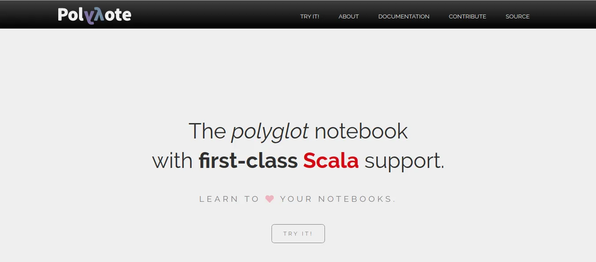
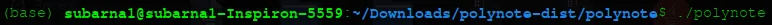
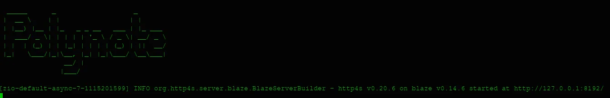
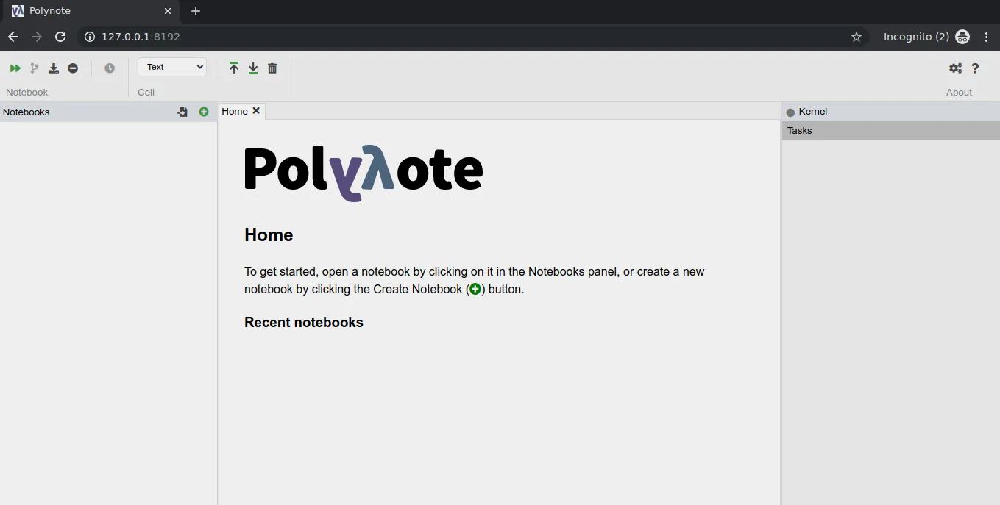

On 23 October 2019, Netflix announced a new piece of open source software called 'Polynote'. As stated by the developers, 'Polynote' is an experimental polyglot notebook environment. Currently, it supports languages like Scala, Python (with or without Spark), SQL and Vega (Data Visualization).

It supports **mixing multiple languages** in a single notebook, and sharing data between them seamlessly. Also, it encourages **reproducible notebooks** with its immutable data model. Hmm. Seems interesting!!!

So let's take a look at some of the **awesome features** of Polynote.

> a) Improvised code editing:

Polynote provides useful autocomplete, parameter hints, and many other features. Most of the notebooks like Jupyter and Zeppelin lack in this feature. The developers are further trying to add features like jump-to-defintiion and many more.

> b) Text editing

One can use the WYSIWYG editor for composing text cells, so we are aware of what we are writing. TeX equations are also supported.

> c) Multiple Language Support--> Polyglot

Polynote allows us to mix multiple languages in one notebook, while sharing definitions seamlessly between them. As of now, we can use Scala, Python, SQL and Vega.

> d) Runtime Insight

Polynote tries to keep you informed of what's going on at runtime. For eg:- The task area shows us what the kernel is doing at any given time. Similarly, the symbol table shows what functions and variables we have defined. Also, compile failures and runtime exceptions are highlighted in the editor (for supported languages) so that we can figure out where we went wrong.

> e) Dependency and Configuration Management

Polynote provides configuration and dependency setup saved within the note itself, thereby helping some of the dependency problems commonly experienced by Apache Developers.

> Vega+Matplotlib= Boom! Awesome Visualisation

Data visualization is one of the prominent technique for analyzing the data and represent it the endpoint. Integration with matplotlib and Vega allows power users to communicate with others through beautiful visualizations.

Know more about Vega on the give link:

https://vega.github.io/vega/

> Something else than traditional REPL

REPL stands for (Read, Evaluate, Print, Loop).Two of Polynote’s guiding principles are **reproducibility** and **visibility**. To further these goals, Polynote developers decided to build polynote's code interpretation from scratch rather than relying on REPL. Once evaluated in a REPL session, expressions and results of evaluation are immutable.Evaluation results are appended to the global state available to the next expression. Let's understand it .

Suppose we declare the variable x=1, and then execute the cell in traditional notebook. Then we delete the cell. Again, if we try to print the value of x, it gives the result 1.

More often than not, notebooks are unable to be reliably rerun from the top, which makes them very difficult to reproduce and share with others. The hidden state also makes it difficult for users to reason about what’s going on in the notebook. However, in **Polynote** once the cell gets deleted, the variable x is deleted. Writing Polynote’s code interpretation from scratch allowed us to do away with this global, mutable state. It helps us to keep track of all the variables as we continue over cells.

All in all, Polynote has just been released few days ago, and it has created a genuine hype in the market. Some of the developers think whether Netflix releasing Polynote as a open-source will, in any way, hamper DataBricks and other renowned companies. That's upto the future to decide.

Let's look further on how we can install Polynote into our system.

The latest package of Polynote (0.2.8) can be downloaded from the given link.

[Download](https://github.com/polynote/polynote/releases/download/0.2.8/polynote-dist.tar.gz)  (For Linux and Mac)

Once, you unzip the tar file you can directly run the Polynote by typing

"./polynote" in the command terminal in the directory.

Now, head over to the <http://127.0.0.1:8192/> (localhost).

And there we have, our new integrated polynote environment.

To run Polynote, we need to install some python, spark dependencies.

Download the following :

a) [Apache Spark](https://spark.apache.org/downloads.html)

b) [Java](https://www.oracle.com/technetwork/java/javase/downloads/jdk8-downloads-2133151.html) (Depending on your OS)

After downloading and unzipping the tar file, we need to set up some environment variables for proper functioning of notebook.

For java,

Using the vi editor, add the below three lines in /etc/profile ,

Add environmental variable JAVA_HOME to a path containing the JDK.

Remind that the package jep can only be installed once the JAVA_HOME is added to the JDK path.

export JAVA_HOME= /Downloads/Java/JDK-11.0.5/

For Spark,

export SPARK_HOME=/Downloads/spark-2.4.4-bin-hadoop2.7

Finally add,

export PATH="$PATH:$SPARK_HOME/bin:$SPARK_HOME/sbin"

Save the /etc/profile file and activate it using the code.

$: source etc/profile

Then, we can use Polynote with full features.

Next, read about the [basic usage](https://polynote.org/docs/02-basic-usage.html)  and keep exploring.... Cheers!!!
