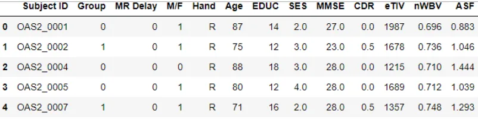
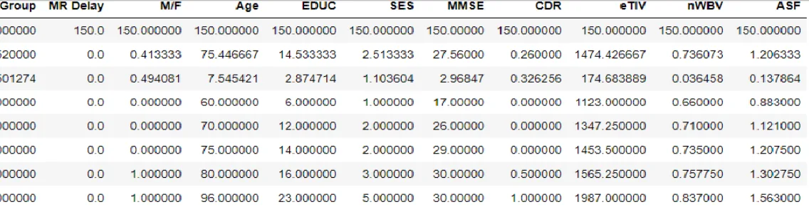
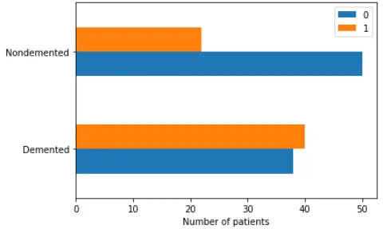
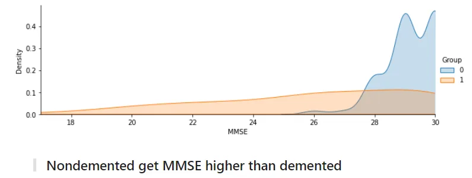
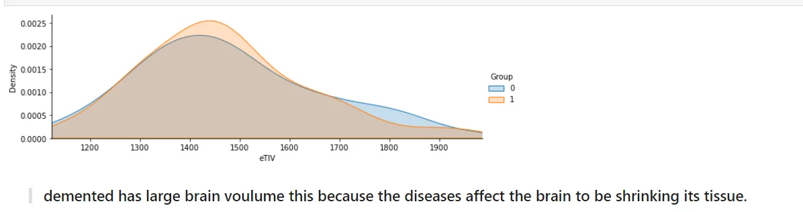

Neurodegenerative diseases are a heterogeneous group of disorders that are characterized by the progressive degeneration of the structure and function of the nervous system. They are incurable and debilitating conditions that cause problems with mental functioning also called dementias. Neurodegenerative diseases affect millions of people worldwide. Alzheimer’s disease and Parkinson’s disease are the most common neurodegenerative diseases. In 2016, an estimated 5.4 million Americans were living with Alzheimer’s disease. An estimated 930,000 people in the United States could be living with Parkinson’s disease by 2020.

#### Alzheimer's disease is a progressive neurologic disorder that causes the brain to shrink (atrophy) and brain cells to die. Alzheimer's disease is the most common cause of dementia — a continuous decline in thinking, behavioral and social skills that affects a person's ability to function independently.

#### Approximately 5.8 million people in the United States age 65 and older live with Alzheimer's disease. Of those, 80% are 75 years old and older. Out of the approximately 50 million people worldwide with dementia, between 60% and 70% are estimated to have Alzheimer's disease.

## DATASET DESCRIPTION

We will be using the longitudinal MRI data. The dataset consists of a longitudinal MRI data of 150 subjects aged 60 to 96. Each subject was scanned at least once. Everyone is right-handed. 72 of the subjects were grouped as 'Nondemented' throughout the study. 64 of the subjects were grouped as 'Demented' at the time of their initial visits and remained so throughout the study. 14 subjects were grouped as 'Nondemented' at the time of their initial visit and were subsequently characterized as 'Demented' at a later visit. These fall under the 'Converted' category.





```python
countGrpoup  = df['Group'].value_counts()
countGrpoup
1    78
0    72
Name: Group, dtype: int64
```

We have *3* Groups *72* Nondemented , *64* Demented and converted . Demented which they are suffering from it from the first visit 14 subjects were grouped as 'Nondemented' at the time of their initial visit and were subsequently characterized as 'Demented' at a later visit. These fall under the 'Converted' category.



```python
def plotDensity(hue,columnName):
    facet= sns.FacetGrid(df,hue = hue, aspect=3)
    facet.map(sns.kdeplot,columnName,shade= True)
    facet.set(xlim=(df[columnName].min(), df[columnName].max()))
    facet.add_legend()
```





Source:

<https://www.kaggle.com/code/hyunseokc/detecting-early-alzheimer-s/notebook>
