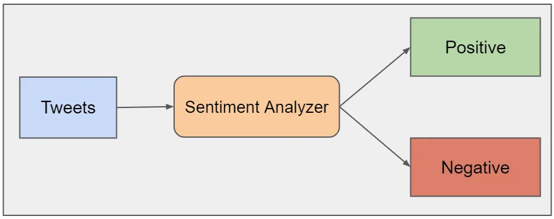
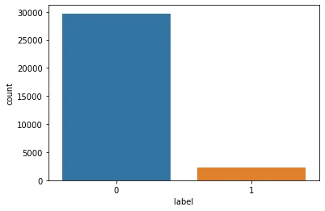
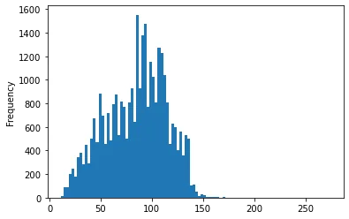
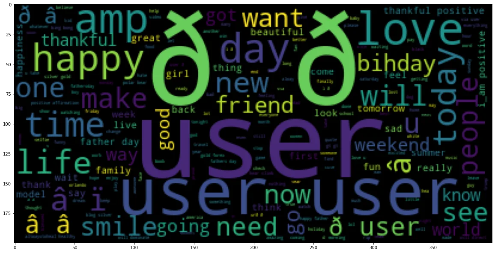
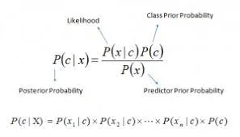
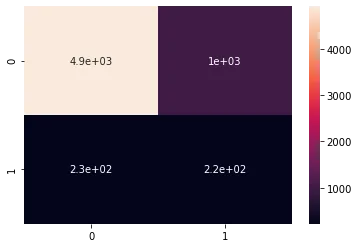
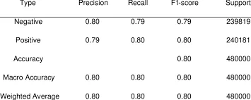

We are living in a "data age" today. As the number of users on social media sites like Twitter grows rapidly, numerous opportunities and new scope have been opened up to businesses trying to keep track of consumer feedback and product opinions. Tweets are a useful source of opinion or sentiment for businesses, governmental bodies, or individuals in the sense of Twitter's social network (products, people, trends, events, etc.). Nonetheless, Twitter generates a very large number of tweets every day (21 million tweets every hour, as reported in 2015). Therefore the method of sentiment analysis needs to be automated to promote the tasks of evaluating the views of the public without the need for millions of tweets to be read manually(Jain & Dandannavar, 2016)[4] .

Social networking channels like Twitter, Facebook, Instagram, and WhatsApp have stormy contact environments, it is imperative to relay sensitive knowledge about people's opinions, moods and feelings on any product, concept or policy through these social network channels(Yi & Liu, 2020)[1]. To both customers and suppliers, this data is valuable. During any online shopping, consumers usually check other people's opinions about the product. Based on the customer’s sentiment, the manufacturer can learn about its product benefits and drawbacks. Although both business organizations and individuals can get profit from these opinions, the sheer number of these opinions on text data is daunting for the users. For researchers, it is a very interesting area to examine and sum up the opinions conveyed in this broad opinion text content. This modern area of study is also known as Sentiment Analysis or Opinion Mining(Vohra & Teraiya, 2013)[2]. In the period of machine learning, machines are left to think and solve the problems by finding the patterns in every data set on their own. Examination of secret trends and patterns helps predict and avoid potential problems. A machine-learning algorithm uses a specific type of data to reply to more questions using the patterns hidden in that data. The importance of machine learning has now been recognized by many companies dealing with large quantities of data. Besides, cost-effective computational processing and data-storage options have allowed the creation of models that analyze large volumes of complex data quickly and precisely. To obtain the highest value from big data, businesses need to know precisely how to fit the correct algorithm with a particular learning process or resources.Sentiment analysis is an automated method of determining whether a usage-produced text conveys a positive, negative or common view of an object (i.e. the item, the individual, the subject, the case, etc.). Sentiment classification can be achieved at the four levels such as Document level, Sentence level, and Aspect or Feature level. Machine learning techniques in the classification of sentiment depends on the use of well-known machine learning technology on text data. The classification of the sentiment based on machine learning can be categorized primarily into supervised and unsupervised methods of learning.

This is a Natural Language Processing Project to analyze the sentiment of Twitter users.The objective of this project is to detect hate speech in tweets.

[#Project](https://www.datainsightonline.com/blog/hashtags/Project) Objectives: Apply python libraries to import and visualize datasets Perform exploratory data analysis and plot word-cloud Perform text data cleaning such as removing punctuation and stop words Understand the concept of count vectorization (tokenization) Perform tokenization to tweet text using Scikit Learn Understand the theory and intuition behind Naïve Bayes classifiers Understand the difference between prior probability, posterior probability and likelihood Train Naïve Bayes classifier models using Scikit-Learn to preform classification Evaluate the performance of trained Naïve Bayes Classifier model using confusion matrices.

## List of contents:

- Task 1: Import libraries and datasets
- Task 2: Perform Exploratory Data Analysis
- Task 3: Plot the word cloud
- Task 4: Create a pipeline to remove stop-words, punctuation, and perform tokenization
- Task 5: Understand the theory and intuition behind Naive Bayes classifiers
- Task 6: Train a Naive Bayes Classifier
- References

#### Task1: Importing libraries and Data Set

```python
#This Task is all about Data Collection and the needed libraries for analysis. Our data set is a real tweets scraped from Twitter. Applying python liberaries to import and visualize dataset in these blocks of code below.
import numpy as np
import pandas as pd
import matplotlib.pyplot as plt
import seaborn as sns
import string
import nltk
nltk.download('stopwords')
from nltk.corpus import stopwords
from sklearn.feature_extraction.text import CountVectorizer
from sklearn.model_selection import train_test_split
from sklearn.naive_bayes import MultinomialNB
from sklearn.metrics import classification_report, confusion_matrix
```

```python
#importing the dataset from its directory
tweet_df=pd.read_csv('/datasets/twitter-data/train.csv')
```

#### Task2:Perform Exploratory Data Analysis

In statistics, exploratory data analysis is an approach of analyzing data sets to summarize their main characteristics, often using statistical graphics and other data visualization methods. A statistical model can be used or not, but primarily EDA is for seeing what the data can tell us beyond the formal modeling and thereby contrasts traditional hypothesis testing. Exploratory data analysis has been promoted by John Tukey since 1970 to encourage statisticians to explore the data, and possibly formulate hypotheses that could lead to new data collection and experiments. EDA is different from initial data analysis (IDA),[1][2] which focuses more narrowly on checking assumptions required for model fitting and hypothesis testing, and handling missing values and making transformations of variables as needed. EDA encompasses IDA.

```python
#Perform exploratory data analysis and Descriptive Statistics.
tweet_df.info()
```

Using Seaborn Library of python to visualize the data to see if there a missing value in our data. This is the heatmap function of Seaborn Library.

```python
#Seaborn heatmap to show if there is a missing values in tweets & labels columns
sns.heatmap(tweet_df.isnull(), yticklabels= False, cbar= False, cmap='Blues')
```


Here the heatmap is showing that there is no missing data.

```python
#Showing the distribution of the label column  using the Countplot function of Seaborn
sns.countplot(tweet_df['label'], label= 'count')
```



Here the countplot shows that the data is imbalanced data.

```python
# adding a length of tweets
tweet_df['length'] = tweet_df['tweet'].apply(len)
tweet_df
```

```python
#showing the distribution of length
tweet_df['length'].plot(bins=100, kind ='hist')
```



#### Task 3: Plot the word cloud

Word clouds (also known as text clouds or tag clouds) work in a simple way: the more a specific word appears in a source of textual data (such as a speech, blog post, or database), the bigger and bolder it appears in the word cloud. A word cloud is a collection, or cluster, of words depicted in different sizes. The bigger and bolder the word appears, the more often it’s mentioned within a given text and the more important it is. Also known as tag clouds or text clouds, these are ideal ways to pull out the most pertinent parts of textual data, from blog posts to databases. They can also help business users compare and contrast two different pieces of text to find the wording similarities between the two. Perhaps you’re already leveraging advanced data visualization techniques to turn your important analytics into charts, graphs, and infographics. This is an excellent first step, as our brains prefer visual information over any other format.

```python
#converting the tweet column into a list
sentences = tweet_df['tweet'].tolist()
#converting sentences list into one string
sentences_as_one_string = " ".join(sentences)
#install wordcloud module
#ploting a wordcloud for all tweets
!pip install Wordcloud

from wordcloud import WordCloud
plt.figure(figsize=(20, 20))
plt.imshow(WordCloud().generate(sentences_as_one_string))
plt.show()
```



#### Task 4: Create a pipeline to remove stop-words, punctuation, and perform tokenization

The first thing you need to do in any NLP project is text preprocessing. Preprocessing input text simply means putting the data into a predictable and analyzable form. It’s a crucial step for building an amazing NLP application. There are different ways to preprocess text: stop word removal, tokenization, stemming. Among these, the most important step is tokenization. It’s the process of breaking a stream of textual data into words, terms, sentences, symbols, or some other meaningful elements called tokens. A lot of open-source tools are available to perform the tokenization process. Why do we need tokenization? Tokenization is the first step in any NLP pipeline. It has an important effect on the rest of your pipeline. A tokenizer breaks unstructured data and natural language text into chunks of information that can be considered as discrete elements. The token occurrences in a document can be used directly as a vector representing that document. This immediately turns an unstructured string (text document) into a numerical data structure suitable for machine learning. They can also be used directly by a computer to trigger useful actions and responses. Or they might be used in a machine learning pipeline as features that trigger more complex decisions or behavior. What is a Bag of Words in NLP? Bag of words is a Natural Language Processing technique of text modelling. In technical terms, we can say that it is a method of feature extraction with text data. This approach is a simple and flexible way of extracting features from documents. A bag of words is a representation of text that describes the occurrence of words within a document. We just keep track of word counts and disregard the grammatical details and the word order. It is called a “bag” of words because any information about the order or structure of words in the document is discarded. The model is only concerned with whether known words occur in the document, not where in the document. Why is the Bag-of-Words algorithm used? One of the biggest problems with text is that it is messy and unstructured, and machine learning algorithms prefer structured, well defined fixed-length inputs and by using the Bag-of-Words technique we can convert variable-length texts into a fixed-length vector. Also, at a much granular level, the machine learning models work with numerical data rather than textual data. So to be more specific, by using the bag-of-words (BoW) technique, we convert a text into its equivalent vector of numbers.

```python
#: Create a pipeline to remove stop-words, punctuation, and perform tokenization and vectorization
def tweets_cleaning(tweet):
    tweets_without_punctuation = [char for char in tweet if char not in string.punctuation]
    tweet_join = ''.join(tweets_without_punctuation)
    tweets_without_stopwords = [word for word in tweet_join if word.lower() not in stopwords.words('english')]
    return tweets_without_stopwords
#converting the clean tweets into a Bag of Words
tweets_vectorizer = CountVectorizer(analyzer = tweets_cleaning, dtype = 'uint8').fit_transform(tweet_df['tweet']).toarray()

tweets_vectorizer.shape
(31962, 125)
```

This is a function , by using Python Language, that takes a text of tweet then process it through removing stopwords, punctuation, and perform tokenization and vectorization. After cleaning the tweets our dataset shape is becoming 31962 rows and 125 columns.

#### Task 5: Understand the theory and intuition behind Naive Bayes classifiers

In statistics, naive Bayes classifiers are a family of simple "probabilistic classifiers" based on applying Bayes' theorem with strong (naive) independence assumptions between the features (see Bayes classifier). They are among the simplest Bayesian network models,[1] but coupled with kernel density estimation, they can achieve high accuracy levels.[2][3] Naive Bayes classifiers are highly scalable, requiring a number of parameters linear in the number of variables (features/predictors) in a learning problem. Maximum-likelihood training can be done by evaluating a closed-form expression,[4]: 718  which takes linear time, rather than by expensive iterative approximation as used for many other types of classifiers. In the statistics literature, naive Bayes models are known under a variety of names, including simple Bayes and independence Bayes.[5] All these names reference the use of Bayes' theorem in the classifier's decision rule, but naive Bayes is not (necessarily) a Bayesian method. Naive Bayes model is easy to build and particularly useful for very large data sets. Along with simplicity, Naive Bayes is known to outperform even highly sophisticated classification methods.Bayes theorem provides a way of calculating posterior probability P(c|x) from P(c), P(x) and P(x|c). Look at the equation below:

CodeText.



#### Task 6: Train a Naive Bayes Classifier

```python
#it is the time of train a machine learning model
X = tweets_vectorizer

y = tweet_df['label']
#Task #: Understand the theory and intuition behind Naive Bayes classifiers
X_train, X_test, y_train, y_test = train_test_split(X, y, test_size= 0.2, stratify = y)

#instaniate the classifier
NB_classifier = MultinomialNB()
NB_classifier.fit(X_train, y_train) #fitting the model

#predicting the labels of the test set
y_predict = NB_classifier.predict(X_test)

#Assess trained model performance through confusion_matrix
confusion = confusion_matrix(y_test, y_predict)

#ploting the confusion matrix
sns.heatmap(confusion, annot = True)
```



#### Finally, getting the classification report.

Classification Report It is one of the performance evaluation metrics of a classification-based machine learning model. It displays your model’s precision, recall, F1 score and support. It provides a better understanding of the overall performance of our trained model. To understand the classification report of a machine learning model, you need to know all of the metrics displayed in the report. For a clear understanding, I have explained all of the metrics below so that you can easily understand the classification report of your machine learning model

CodeText.

```python
#getting the classification report
print(classification_report(y_test, y_predict))
```



#### References:

Lebart L., (1993), "Sur les analyses statistiques de textes", Journal de la société statistique de Paris, vol. 134, n° 4, pp. 17-36.

Lebart L., Salem A., (1994), Statistique textuelle, Dunod, Paris.

Lebart L., (1995), "Analyse statistique des données Textuelles : quelques problèmes actuels et futurs", in S. Bolasco, L. Lebart, A. Salem (eds), JADT 1995, vol. 1, CISU, Rome, pp. XVII-XXIV.

International Journal of Applied Engineering and Management Letters (IJAEML), ISSN: 2581-7000, Vol. 4, No. 2, August 2020.

C.D. Manning & H. Schuetze, Foundations of Statistical Natural Language Processing, MIT Press, 1999. (M&S)

Here is the full descrption of the project.

You can check the full analysis here , [Link](https://github.com/fatmtly892/Twitter-Sentiment-Analysis-).

.
