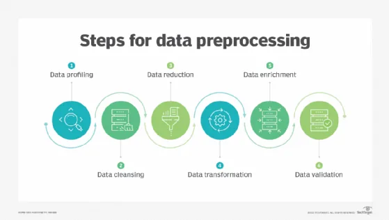

#### Introduction



When it comes to creating a Machine Learning pipeline, data preprocessing is the first step marking the initiation of the process. Typically, real-world data is incomplete, inconsistent, inaccurate (contains errors or outliers), and often lacks specific attribute values/trends. This is where data preprocessing enters the scenario – it helps to clean, format, and organize the raw data, thereby making it ready-to-go for Machine Learning models. Let’s explore various steps of data preprocessing in machine learning, but firstly we need to understand the concept of Noisy data.

Github repo: [Link](https://github.com/omarmohamed2011/Data-Preprocessing-Techniques)

#### Noisy data

Suppose that we have a dataset in which we have some measured attributes. Now, these attributes might carry some random error or variance. Such errors in attribute values are called as noise in the data. If such errors persist in our data, it will return inaccurate results, so we need to understand those types of cleansing methods in order to choose the convenient tool for a given problem.

Data cleaning methods are generally three; Binning / Regression / Clustering, and now we will discuss each of them.

#### Data Cleaning

Real-world data tend to be noisy. Noisy data is data with a large amount of additional meaningless information in it called noise. Data cleaning (or data cleansing) routines attempt to smooth out noise while identifying outliers in the data.

There are three data smoothing techniques as follows:
1. Binning : Binning methods smooth a sorted data value by consulting its “neighborhood”, that is, the values around it.
2. Regression : It conforms data values to a function. Linear regression involves finding the “best” line to fit two attributes (or variables) so that one attribute can be used to predict the other.
3. Outlier analysis : Outliers may be detected by clustering, for example, where similar values are organized into groups, or “clusters”. Intuitively, values that fall outside of the set of clusters may be considered as outliers.

Binning

Types of smoothing using binning:
1. Smoothing by bin means : In smoothing by bin means, each value in a bin is replaced by the mean value of the bin.
2. Smoothing by bin median : In this method each bin value is replaced by its bin median value.
3. Smoothing by bin boundary : In smoothing by bin boundaries, the minimum and maximum values in a given bin are identified as the bin boundaries. Each bin value is then replaced by the closest boundary value.

Suppose we have a bin: Bin = [ 2, 6, 7, 9, 13, 20, 21, 25, 30 ]
Let's take an example for each type of binning:

Partition using equal frequency approach:
Bin 1 : 2, 6, 7
Bin 2 : 9, 13, 20
Bin 3 : 21, 24, 30

Smoothing by bin mean :
Bin 1 : 5, 5, 5
Bin 2 : 14, 14, 14
Bin 3 : 25, 25, 25

Smoothing by bin median :
Bin 1 : 6,6,6
Bin 2 : 13,13,13
Bin 3 : 24,24,24
Smoothing by bin boundaries :

Boundary_bins = [0,7,14,21,30]
Bin = [ 2, 6, 7, 9, 13, 20, 21, 25, 30 ]

New_bin = [ (0,7] , (0,7] , (0,7] , (7,14], (7,14], (14,21], (14,21], (25,30] , (25,30] ]

Let's explore some of these techniques using Python pandas library:

```python
import pandas as pd
import matplotlib.pyplot as plt

ages = [20, 22, 25, 27, 21, 23, 37, 31, 61, 45, 41, 32]

bound_bins = [18, 25, 35, 60, 100]
categories = ['18_25','25_35' , '35_60' , '60_100' ]

cats = pd.cut(ages, bound_bins)
```

Let's print the cats variable that contains data in its binned form:

```python
print(cats)

>>> [(18, 25], (18, 25], (18, 25], (25, 35], (18, 25], ..., (25, 35], (60, 100], (35, 60], (35, 60], (25, 35]]
Length: 12
Categories (4, interval[int64]): [(18, 25] < (25, 35] < (35, 60] < (60, 100]]
```

Let's print the fourth element only:

```python
cats[3]

>>> Interval(25, 35, closed='right')
```

```python
y = pd.value_counts(cats)
y

>>>
(18, 25]     5
(35, 60]     3
(25, 35]     3
(60, 100]    1
dtype: int64
```

And you can also explore some other details in the notebook.

Regression

Used to predict for individuals on the basis of information gained from a previous sample of similar individuals, it helps the data have some attribute with a clear function defining it though eliminates noise, or let's say minimize it.

Clustering

Clustering is the task of dividing the data points into a number of groups (you choose it) such that data points in the same groups are more similar to other data points in the same group and dissimilar to the data points in other groups, thus this method can create an attribute from another in order to have another extracted attribute more useful for modeling phase.

Let's see now the sampling step, sampling is a method that allows us to get information about the population based on the statistics from a subset of the population (sample), without having to investigate every individual, though it is very useful in cases of big data.

#### Sampling

First, what is Sampling ? Sampling is a method that allows us to get information about the population based on the statistics from a subset of the population (sample), without having to investigate every individual.

Let’s understand this at a more intuitive level through an example.

We want to find the average height of all adult males in Alexandria. The population of Alexandria is nearly 5.2 millions according to October 2018 population.That is almost impossible to find the average male height of all males in Alexandria. So we choose a **sample** "A group of people as well representatives for the population to find their average".

Why only having a sample from the data? Why not having all the data?

Seeking all data is:

1) Time and money consuming.

2) Sometimes processing data which we already have is very resources consuming.
3) Not practical.
4) The memory of our Devices and Clouds are limited, i.e Google Colab provides 12 GB memory for example.

Do we need rules for sampling ? Or we just take a **sample**?

Let's take our example of finding the average male height; and let’s say we go to a basketball court and take the average height of all the professional basketball players as our sample. This will not be considered a good sample because generally, a basketball player is taller than an average male and it will give us a bad estimate of the average male’s height, so of course we have rules and steps for that we will discuss now.

Steps for Sampling

Step 1 : The first stage in the sampling process is to clearly define the target population.

For our example : Only males who live in Alexandria, above 18 years old.

 Step 2 : Sampling Frame – It is a list of items or people forming a population from which the sample is taken.

For our example : A list contain all the names of the above 18 years old males in Alexandria.
Step 3 : Choose sampling methods.

We will discuss this later in this session
Step 4 : Define sample size.

Sample Size – It is the number of individuals or items to be taken in a sample that would be enough to make inferences/deductions about the population with the desired level of accuracy and precision.

Larger the sample size, more accurate our inference about the population would be.

For our example : Let's say 30,000 adult males from Alexandria.
Step 5 : Collect the data.

Different Types of Sampling Techniques

 **Probability Sampling**: In probability sampling, every element of the population has an equal chance of being selected. Probability sampling gives us the best chance to create a sample that is truly representative of the population.

 **Non-Probability Sampling**: In non-probability sampling, all elements do not have an equal chance of being selected. Consequently, there is a significant risk of ending up with a non-representative sample which does not produce generalized results.

We are going to discuss only probabilistic sampling, let's start shall we?

Types of Probability Sampling

Simple Random Sampling
In a simple random sample, every member of the population has an equal chance of being selected. Your sampling frame should include the whole population.To conduct this type of sampling, you can use tools like random number generators or other techniques that are based entirely on chance.

>> Our example:

You want to select a simple random sample of 30,000 adult males of Alexandria. You assign a number to every adult male in the database from 1 to 3 millions, and use a random number generator to select 30,000 numbers.

Systematic sampling
Systematic sampling is similar to simple random sampling, but it is usually slightly easier to conduct. Every member of the population is listed with a number, but instead of randomly generating numbers, individuals are chosen at regular intervals.

ex : sample : (6,26,36, ... , 166, ....).

Stratified sampling
Stratified sampling involves dividing the population into sub-populations that may differ in important ways. It allows you draw more precise conclusions by ensuring that every subgroup is properly represented in the sample.

To use this sampling method, you divide the population into subgroups (called strata) based on the relevant characteristic (e.g. gender, age range, income bracket, job role).

ex : samples are according to Age : ( [18,25] , [26,30] , [31,35] , .... ).

Cluster sampling
Cluster sampling also involves dividing the population into subgroups, but each subgroup should have similar characteristics to the whole sample. Instead of sampling individuals from each subgroup, you randomly select entire subgroups.

1) Create subgroups that are similar to one another.

2) Choose a random subgroup.

Let's see some of that in a pythonic way, starting with random sampling:

```python
# Simple random sampling:
import numpy as np

datastored  = np.array([12,20,34,32,13,31,12,76,42,78,10,54,12,13])
index_sample= np.random.choice(range(14), 5, replace=False)
index_sample

>>> array([ 5,  4,  8, 10,  1])
```

We can produce this random sample for any random dataset:

```python
rand_sampled_data = []
for index in index_sample:
  rand_sampled_data.append(datastored[index])
print(rand_sampled_data)
>>>
[31, 13, 42, 10, 20]
```

Also system sampling is easy to implement:

```python
# Systematic sampling:

index_sample = range(3,14,2)  ### 3,5,7,9,11,13
sys_sampled_data = []

for index in index_sample:
  sys_sampled_data.append(datastored[index])
print(sys_sampled_data)
>>> [32, 31, 76, 78, 54, 13]
```

#### Final thoughts

In this article we discussed some types of noise and ways to minimize it, also different sampling techniques using Python, we have also some practical implementations for those parts, you can also oversampling and some other techniques in my notebook, hope you enjoyed the article and hope it was useful to you. Until next time!

#### References

article : https://www.analyticsvidhya.com/blog/2019/09/data-scientists-guide-8-types-of-sampling-techniques/

 article : https://www.scribbr.com/methodology/sampling-methods/

 wiki article: https://en.wikipedia.org/wiki/Data_binning

 article: https://www.geeksforgeeks.org/ml-binning-or-discretization/
