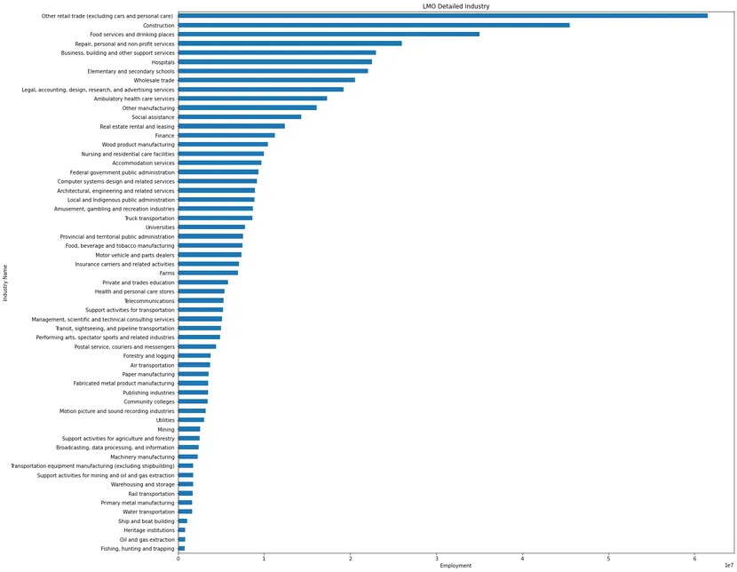
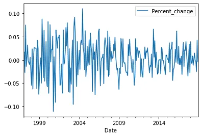
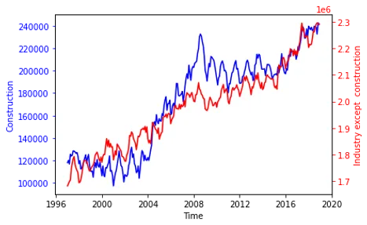
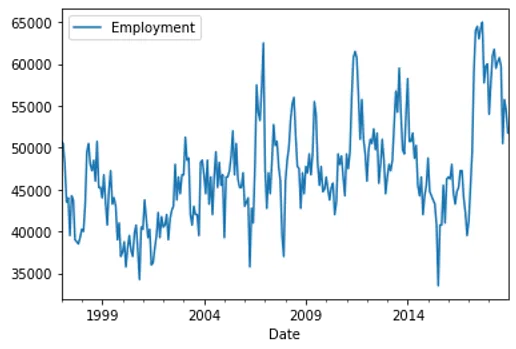
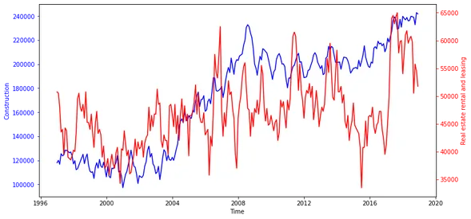
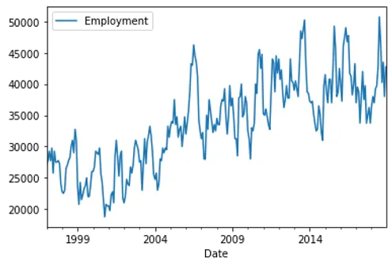
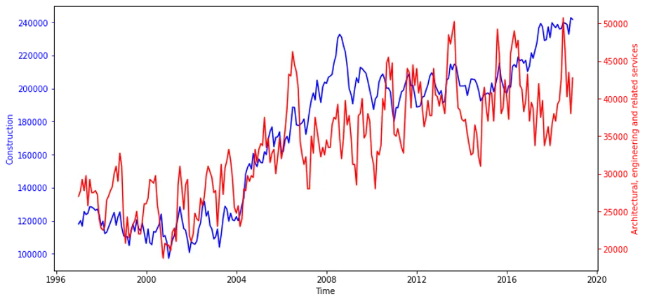
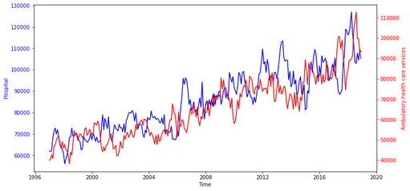
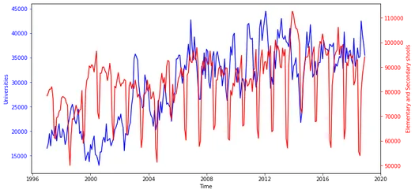

The **North American Industry Classification System** or **NAICS** is a [classification of business](https://en.wikipedia.org/wiki/Industry_classification) [establishments](https://en.wikipedia.org/wiki/Industry_classification) by type of economic activity (process of production). It is used by the government and businesses in [Canada](https://en.wikipedia.org/wiki/Canada), [Mexico](https://en.wikipedia.org/wiki/Mexico), and the [United States of America](https://en.wikipedia.org/wiki/United_States). It has largely replaced the older [Standard Industrial Classification](https://en.wikipedia.org/wiki/Standard_Industrial_Classification) (SIC) system, except in some government agencies, such as the [U.S. Securities and Exchange Commission](https://en.wikipedia.org/wiki/U.S._Securities_and_Exchange_Commission) (SEC).

An establishment is typically a single physical location, though administratively distinct operations at a single location may be treated as distinct establishments. Each establishment is classified as an industry according to the primary business activity taking place there. NAICS does not offer guidance on the classification of enterprises (companies) that are composed of multiple establishments.

**Codes**

The NAICS numbering system employs a five or six-digit code at the most detailed industry level. The first five digits are generally (although not always strictly) the same in all three countries. The first two digits designate the largest business sector, the third digit designates the subsector, the fourth digit designates the industry group, the fifth digit designates the NAICS [industries](https://en.wikipedia.org/wiki/Industry_(economics)), and the sixth digit designates the national [industries](https://en.wikipedia.org/wiki/Industry_(economics)).

Data wrangling

Before starting my analysis, I conducted a data wrangling process to ensure the tidiness and cleansing of the data as the following :

1. Merging both datasets to obtain *a final analysis report*.

· Data_output_template.xlsx

· LMO_Detailed_Industries_by_NAICS.xlsx

```python
# merge the output template &RITA to get the final report(data_output)for further analysis data_output_combined = pd.merge(lmo_detailed_industry, data_output, on='LMO_Detailed_Industry', how='left') data_output_combined.NAICS= data_output_combined.NAICS.astype('str') data_output_combined.head()
```

2. Merging all **RITRA_Emplot** (2_digits, 3_digits, 4_digits) files to be used as *a mapper* for the *final analysis report*.

```python
#merging all datasets(2/3/4 digits) to create an NCIA_code mapper for the output report for further analysis. df_rtra_employ_total = pd.concat([df2_naics, df3_naics, df4_naics], ignore_index=True) df_rtra_employ_total
```

3. Creating the filter

```python
# iterating over the mapper to get the Employment value for each industry at each datefor index, row in data_output_combined.iterrows():     naics = row['NAICS']     naics_codes =list(map(str.strip, re.split(r'\D', naics)))     year = row['SYEAR']     month = row['SMTH']     n_digits =len(naics_codes[0])# filter the data acording to  year and months we are  interested in     df_rtra = df_rtra_employ_total.loc[(df_rtra_employ_total['SYEAR']== year)&(df_rtra_employ_total['SMTH']== month)]# RTRA file with four digit has different value structure for the NAICS column, it is just the valueif n_digits !=4:         df_rtra['naics_code']= df_rtra.NAICS.str.split(r'\[|\]', expand=True)[1].astype("string")else:         df_rtra['naics_code']= df_rtra['NAICS'].astype("string")      total_employment =0for code in naics_codes:# get the value fromRTRA file using year, month and naics_codeif df_rtra[(df_rtra['naics_code']== code)].shape[0]>0:             industry_employment_by_year_month = df_rtra[(df_rtra['naics_code']== code)].iloc[0]['_EMPLOYMENT_']             total_employment += industry_employment_by_year_month                  # set the total employment count value back in the output template     data_output_combined.loc[(data_output_combined['SYEAR']== year)&(data_output_combined['SMTH']== month)&(data_output_combined['LMO_Detailed_Industry']== row['LMO_Detailed_Industry']),'Employment']= total_employment
```

**EDA**



#### Questions to be answered
**Q1.How has employment in Construction evolved over time compared to employment in other industries?**

```python
# define the construcion employment construction= data_output_for_analysis['LMO_Detailed_Industry']=='Construction' data_output_construction = data_output_for_analysis[construction] data_output_construction.head()
```

```python
data_output_construction.plot( x='Date', y='Employment')
```



```python
fig, ax = plt.subplots() ax.plot(data_output_construction.Date, data_output_construction.Employment,  color='blue') ax.set_xlabel('Time') ax.set_ylabel('Construction', color='blue') ax.tick_params('y', colors='blue') ax2 = ax.twinx() ax2.plot(data_output_except_construction.index, data_output_except_construction.values, color='red') ax2.set_ylabel('Industry except  construction',color='red') ax2.tick_params('y', colors='red')
```



Obviously, there is a significant high trend from 1997 till 2018 in the industries(except the construction) with a logical drop in 2008 ( due to the 2008 mortgage crisis ) and later on, it returns the growth back.

on the other hand, the construction industry, in general, had low values and high variability of employment from 1997 to 2004 then from 2004 to 2018 had high values with low variability.

**Q2. How has employment in Real estate, rental****,** **and leasing evolved over time?**

```python
# define the real state employment data_output_real_state = data_output_for_analysis[data_output_for_analysis['LMO_Detailed_Industry']=='Real estate rental and leasing'] data_output_real_state.head()
```

```python
data_output_real_state.plot(x='Date', y='Employment')
```



```python
fig, ax = plt.subplots(figsize=(12,6)) ax.plot(data_output_construction.Date, data_output_construction.Employment,  color='blue') ax.set_xlabel('Time') ax.set_ylabel('Construction', color='blue') ax.tick_params('y', colors='blue') ax2 = ax.twinx() ax2.plot(data_output_real_state.Date, data_output_real_state.Employment, color='red') ax2.set_ylabel('Real estate rental and leasing',color='red') ax2.tick_params('y', colors='red')
```



Employment in the real estate sector had a low trend with very high variability.

**Q3.How has employment in engineering evolved over time?**

```python
# define the real state employment data_output_engineering = data_output_for_analysis[data_output_for_analysis['LMO_Detailed_Industry']=='Architectural, engineering and related services'] data_output_engineering.head()
```

```python
data_output_engineering.plot(x='Date', y='Employment')
```



```python
fig, ax = plt.subplots(figsize=(12,6)) ax.plot(data_output_construction.Date, data_output_construction.Employment,  color='blue') ax.set_xlabel('Time') ax.set_ylabel('Construction', color='blue') ax.tick_params('y', colors='blue') ax2 = ax.twinx() ax2.plot(data_output_engineering.Date, data_output_engineering.Employment, color='red') ax2.set_ylabel('Architectural, engineering and related services',color='red') ax2.tick_params('y', colors='red')
```



Employment in the engineering sector followed the construction sector employment trend which makes sense but with higher variability.

**Q4.How has employment in both hospital & ambulatory and healthcare services evolved over time?**

```python
hospital = data_output_for_analysis['LMO_Detailed_Industry']=='Hospitals' data_output_hospital = data_output_for_analysis[hospital] data_output_hospital.head()
```

```python
fig, ax = plt.subplots(figsize=(12,6)) ax.plot(data_output_hospital.Date, data_output_hospital.Employment,  color='blue') ax.set_xlabel('Time') ax.set_ylabel('Hospital', color='blue') ax.tick_params('y', colors='blue') ax2 = ax.twinx() ax2.plot(data_output_healthcare.Date, data_output_healthcare.Employment, color='red') ax2.set_ylabel('Ambulatory health care services',color='red') ax2.tick_params('y', colors='red')
```



Employment in both hospitals& Ambulatory health care services is almost identical in values and variability, which makes sense.

**Q5.How has employment in both universities & elementary and secondary schools evolved over time?**

```python
univerisity= data_output_for_analysis['LMO_Detailed_Industry']=='Universities' data_output_univerisity = data_output_for_analysis[univerisity] data_output_univerisity.head()
```

```python
schools= data_output_for_analysis['LMO_Detailed_Industry']=='Elementary and secondary schools' data_output_schools = data_output_for_analysis[schools] data_output_schools.head()
```

```python
fig, ax = plt.subplots(figsize=(12,6)) ax.plot(data_output_univerisity.Date, data_output_univerisity.Employment,  color='blue') ax.set_xlabel('Time') ax.set_ylabel('Universities', color='blue') ax.tick_params('y', colors='blue') ax2 = ax.twinx() ax2.plot(data_output_schools.Date, data_output_schools.Employment, color='red') ax2.set_ylabel('Elementary and Secondary shools',color='red') ax2.tick_params('y', colors='red')
```



Employment in both the universities sector & elementary and secondary schools sector is completely unmatched in values and variability due to the nature of the education system in NCIS as all secondary school graduates would not join the high education/universities.
