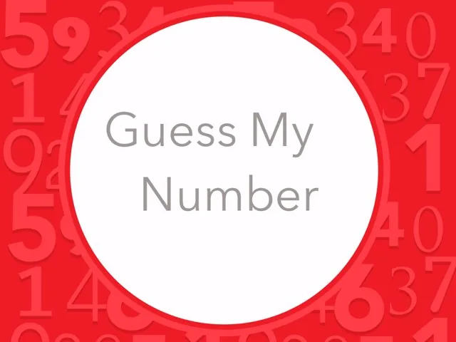

Simple, number guessing game is an approach to deal with simple programming skills to the beginners python programmer. In this blog, we simply discuss about the random number generation and conditional statement that we use as a python programming skills. This blog mainly targets those programmers who likes to pave their way in python program. Now, further discuss about random number and conditional if-else statement using python code.

This code simply prints the message on the screen before commencing the game.

```python
print("Welcome to number guessing game")
print("        ***********            ")
```

The input allows the user to guess a number and it is stored in the variable guess. The users are asked to guess a number from 1 to 10.

```python
guess = input("Please guess a number between 1 to 10.")
```

The python program has a built-in module: random to generate the pseudo-random variables. Random module should be imported, so that we can use its inbuilt functions. Randint is an inbuilt function of the random module in Python3 that takes start and end as an inclusive argument and generate interger value. Here one random integer value from 1 to 10 is generated and stored in random_number variable.

```python
import random
random_number = random.randint(1,10)
```

The following code represents the actual rule of the game. we have defined a function named guess_name, which takes two parameters g and r. Inside the function, we make a comparison between those two values. Those two parameters get value when the function is called and arguments are passed in the function call. The guessed number and randomly generated number are passes as arguments in the function call.

If guessed number is equal to randomly generated number, a congratulation message is printed and if not sorry message is printed.

```python
def guess_game(g, r):
    if g == r:
         print("Congratulation!!! You have guessed correct number" + str(g))
    else:
        print("Sorry! Incorrect guess => " + str(g) + "." + " Correct number is " + str(random_number) + ".")
```

Here we make a function call with two parameters guess and random_number.

```python
guess_game(guess, random_number)
```

In this simple number guessing game, mainly we focused on random number generation and if-else conditional statement.
