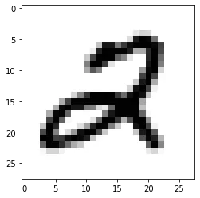
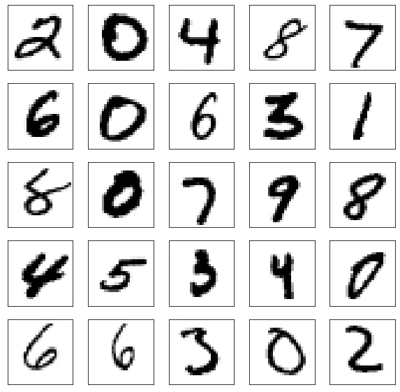
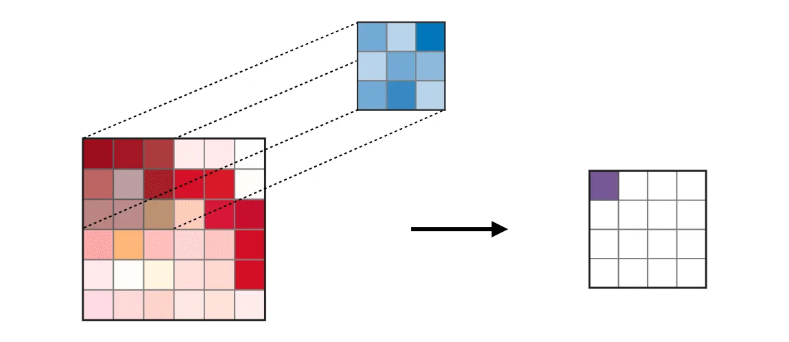
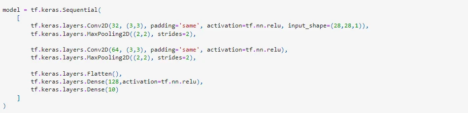
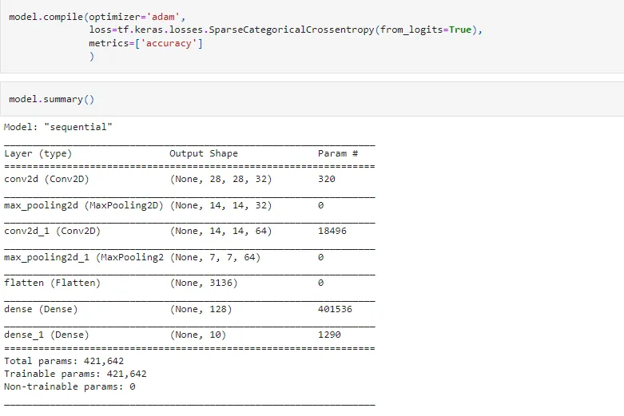
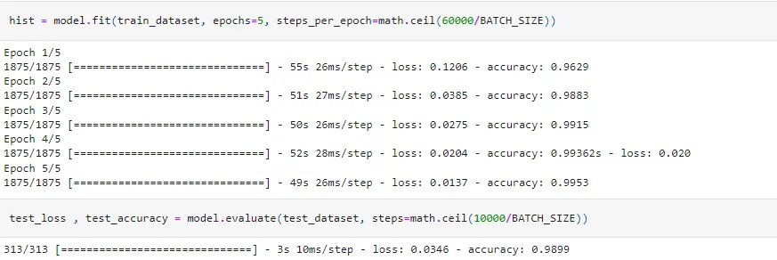
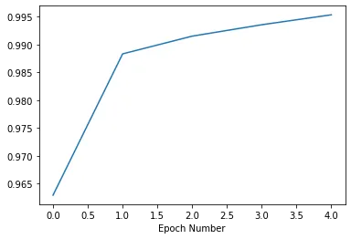
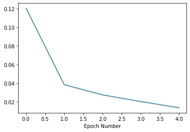
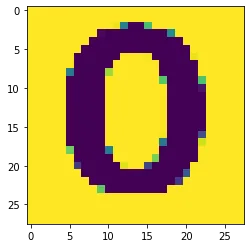

Deep Learning is becoming a very popular subset of machine learning due to its high level of performance across many types of data.

A great way to use deep learning to classify images is to build a convolutional neural network (CNN).

The Keras library in Python makes it pretty simple to build a CNN.

In this project:

our target to predict the number of images we use The mnist dataset is conveniently provided to us as part of the Keras library.

then we load the model in Keras format

we use an image to predict and get the result.

Let's see...

**Importing Modules**

```python
import tensorflow_datasets as tfds
import tensorflow as tf
import mathimport numpy as npimport matplotlib.pyplot as plt
```

**Loading the MNIST data from keras.datasets**

```python
dataset,metadata = tfds.load('mnist', as_supervised=True, with_info=True)
train_dataset, test_dataset = dataset['train'], dataset['test']
```

**Pre-processing**

**change the grey value from int to float**

```python
def normalize(images,labels):
    images = tf.cast(images ,tf.float32)
    images /= 255
    return     images, labelstrain_dataset =

train_dataset.map(normalize)test_dataset = test_dataset.map(normalize)
```

**Re-shape & show the images**

```python
for image, label in test_dataset.take(1):
    break
image = image.numpy().reshape((28,28))

plt.figure()
plt.imshow(image,cmap=plt.cm.binary)
plt.show()
```



**Take Sample With 25 Images**

```python
plt.figure(figsize=(10,10))i = 0

for(image,label) in test_dataset.take(25):
    image = image.numpy().reshape((28,28))
    plt.subplot(5,5,i+1)
    plt.xticks([])
    plt.yticks([])
    plt.imshow(image,cmap=plt.cm.binary)
    i+=1

plt.show()
```



## Define Batch Size: that defines the number of samples to work through before updating the internal model parameters. and shuffle them
```python
BATCH_SIZE = 32
train_dataset = train_dataset.cache().repeat().shuffle(60000).batch(BATCH_SIZE)
test_dataset  = test_dataset.cache().batch(BATCH_SIZE)

print(train_dataset)

<BatchDataset shapes: ((None, 28, 28, 1), (None,)), types: (tf.float32, tf.int64)>
```



## The architecture of a traditional CNNConvolutional neural networks

also known as CNNs, are a specific type of neural network that are generally composed of the following layers:

- The convolution layer
- pooling layer
- flatten layer

The model type that we will be using is Sequential
. Sequential is the easiest way to build a model in Keras. It allows you to build a model layer by layer.
we can see that the output of every Conv2D and MaxPooling2D layer is a 3D tensor of shape (height, width, channels).
The width and height dimensions tend to shrink as you go deeper in the network. The number of output channels for each Conv2D layer is controlled by the first argument (e.g., 32 or 64)

64 in the first layer and 32 in the second layer are the number of nodes in each layer.
This number can be adjusted to be higher or lower, depending on the size of the dataset. In our case, 64 and 32 work well
Kernel size is the size of the filter matrix for our convolution. So a kernel size of 3 means we will have a 3x3 filter matrix

### Add Dense layers on top

To complete the model, you will feed the last output tensor from the convolutional base into one or more Dense layers to perform classification. Dense layers take vectors as input (which are 1D)
, while the current output is a 3D tensor. First, you will flatten the 3D output to 1D, then add one or more Dense layers on top,
so you use a final Dense layer with 10 outputs.

### Activation is the activation function for the layer:

The activation function we will be using for our first 2 layers is the ReLU

or Rectified Linear Activation. This activation function has been proven to work well in neural networks.

there is a ‘Flatten’ layer. Flatten serves as a connection between the convolution and dense layers.



## Compiling the model
we need to compile our model. Compiling the model takes three parameters: optimizer, loss, and metrics.
The optimizer controls the learning rate. We will be using ‘adam’ as our optimizer Adam is generally a good optimizer to use for many cases. The adam optimizer adjusts the learning rate throughout training.
The learning rate determines how fast the optimal weights for the model are calculated.

A smaller learning rate may lead to more accurate weights (up to a certain point),
but the time it takes to compute the weights will be longer.
We will use ‘categorical_crossentropy’ for our loss function. This is the most common choice for classification.
A lower score indicates that the model is performing better.
To make things even easier to interpret,
we will use the ‘accuracy’ metric to see the accuracy score on the validation set when we train the model.



## Now we will train our model.

To train, we will use the ‘fit()’
The number of epochs is the number of times the model will cycle through the data. The more epochs we run, the more the model will improve,
up to a certain point. After that point, the model will stop improving during each epoch. For our model, we will set the number of epochs to 5.

### steps_per_epoch
Assume you have a dataset with 60000 samples (rows of data) and you choose a batch_size = 25 and epochs = 5
This means that the dataset will be divided into (60000/25) = 2400 batches,
having 32 samples/rows in each batch. The model weights will be updated after each batch.
one epoch will train 2400 batches or 2400 updations to the model.
here steps_per_epoch = no.of batches
With 5 epochs, the model will pass through the whole dataset 5 times.



**Visualize results**

```python
import matplotlib.pyplot as plt

plt.xlabel('Epoch Number')
#plt.plot(hist.history['loss'])
plt.plot(hist.history['accuracy']);
```



```python
plt.xlabel('Epoch Number')
plt.plot(hist.history['loss']);
```



**Saving Model**

```python
model.save('model.h5')
```

**Load Model With Keras format**

```python
model = tf.keras.models.load_model('model.h5')
```

**display the architecture of our model so far:**

```python
model.summary()
```

```python
Model: "sequential"
_________________________________________________________________
Layer (type)                 Output Shape              Param #
=================================================================
conv2d (Conv2D)              (None, 28, 28, 32)        320
_________________________________________________________________
max_pooling2d (MaxPooling2D) (None, 14, 14, 32)        0
_________________________________________________________________
conv2d_1 (Conv2D)            (None, 14, 14, 64)        18496
_________________________________________________________________
max_pooling2d_1 (MaxPooling2 (None, 7, 7, 64)          0
_________________________________________________________________
flatten (Flatten)            (None, 3136)              0
_________________________________________________________________
dense (Dense)                (None, 128)               401536
_________________________________________________________________
dense_1 (Dense)              (None, 10)                1290
=================================================================
Total params: 421,642
Trainable params: 421,642
Non-trainable params: 0
_________________________________________________________________
```

```python
import cv2
import matplotlib.pyplot as plt
import numpy as np

img = cv2.imread('test.png', 0)
img = cv2.resize(img, (28, 28))
print (img.shape)plt.imshow(img)
```

```python
(28, 28)
<matplotlib.image.AxesImage at 0x1d1cadb7580>
```



```python
img = img.reshape((-1, 28,28,1))
print (img.shape)
```

```python
(1, 28, 28, 1)
```

## Predict AN Image

The prediction is in the form of a matrix with the numbers of the outputs closest to the prediction,
then we choose the highest probability and display this result

```python
out = model.predict(img)
```

```python
max(out[0])
```

```python
3381.5654
```

```python
#highest number with highest prediction
np.argmax(out)
```

```python
3
```

```python
out
```

```python
array([[ 2858.4568 , -1795.1691 , -2233.7585 ,  3381.5654 , -4514.6743 ,         -1035.5887 ,   732.25287, -4198.6577 ,  1799.7356 , -1932.0681 ]],       dtype=float32)
```

That's it, I hope this article was worth reading and helped you acquire new knowledge no matter how small.

Feel free to check up on the [notebook](https://github.com/MariamAlsaedy/Number_Prediction). You can find the results of code samples in this post.
